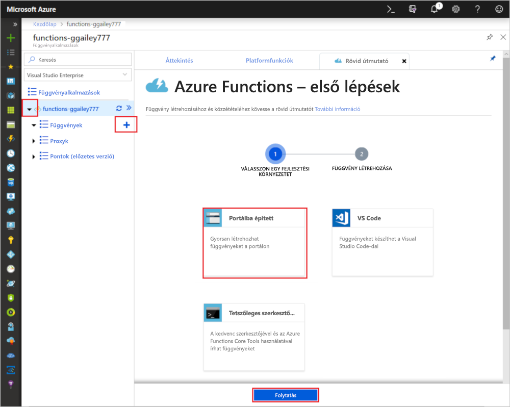
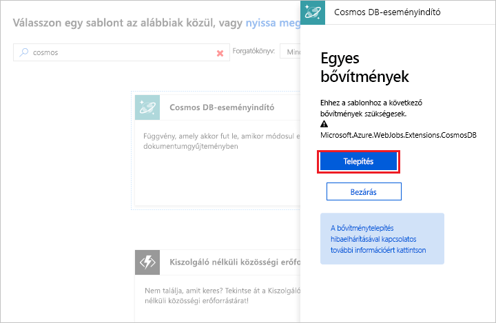

# Azure Cosmos DB által aktivált függvény létrehozása

Megismerheti, hogyan hozhat létre egy olyan függvényt, amelyet az aktivál, ha adatokat ad hozzá az Azure Cosmos DB-hez, illetve abban található adatokat módosít. További információ az Azure Cosmos DB-ről: [Azure Cosmos DB: Kiszolgáló nélküli adatbázis-használat az Azure Functions szolgáltatással](..\cosmos-db\serverless-computing-database.md).

## Előfeltételek

Az oktatóanyag elvégzéséhez:

+ Ha nem rendelkezik Azure-előfizetéssel, mindössze néhány perc alatt létrehozhat egy [ingyenes fiókot](https://azure.microsoft.com/free/?WT.mc_id=A261C142F) a virtuális gép létrehozásának megkezdése előtt.

> [!NOTE]
> [!INCLUDE [SQL API support only](../../includes/functions-cosmosdb-sqlapi-note.md)]

## Azure Cosmos DB-fiók létrehozása

A trigger létrehozásához rendelkeznie kell egy SQL API-t használó Azure Cosmos DB-fiókkal.

[!INCLUDE [cosmos-db-create-dbaccount](../../includes/cosmos-db-create-dbaccount.md)]

## Azure-függvényalkalmazás létrehozása

[!INCLUDE [Create function app Azure portal](../../includes/functions-create-function-app-portal.md)]

Ezután létrehozhat egy függvényt az új függvényalkalmazásban.

## Azure Cosmos DB-eseményindító létrehozása

1. Bontsa ki a függvényalkalmazást, és kattintson a **Függvények** elem melletti **+** gombra. Ha ez az első függvény a függvényalkalmazásban, válassza a **Portálba épített**, majd a **Folytatás** lehetőséget. Ha nem ez az első, folytassa a harmadik lépéssel.

   

1. Válassza ki a **További sablonok**, majd a **Befejezés és sablonok megtekintése** lehetőséget.

    

1. A keresőmezőbe írja be a `cosmos` kifejezést, majd válassza ki az **Azure Cosmos DB trigger** sablont.

1. Ha a rendszer kéri, válassza a **Telepítés** lehetőséget az Azure Storage-bővítmény és a függvényalkalmazáson belüli függőségek telepítéséhez. A telepítést követően válassza a **Folytatás** gombot.

    

1. Az új eseményindító létrehozásához használja az ábra alatti táblázatban megadott beállításokat.

    

    | Beállítás      | Ajánlott érték  | Leírás                                |
    | ------------ | ---------------- | ------------------------------------------ |
    | **Name (Név)** | Alapértelmezett | Használja a sablonban javasolt alapértelmezett függvénynevet.|
    | **Azure Cosmos DB-fiók kapcsolata** | Új beállítás | Válassza ki az **Új** gombot, majd válassza ki az **előfizetését**, a korábban létrehozott **adatbázisfiókot**, és a **Kiválasztás** lehetőséget. Ezzel létrehoz egy alkalmazásbeállítást a fiókkapcsolathoz. Ezt a beállítást használja a kötés, hogy kapcsolódjon az adatbázishoz. |
    | **Gyűjtemény neve** | Elemek | A monitorozni kívánt gyűjtemény neve. |
    | **A bérletek gyűjteményének létrehozása, ha az nem létezik** | Bejelölve | A gyűjtemény még nem létezik, hozza létre. |
    | **Adatbázis neve** | Feladatok | A monitorozni kívánt gyűjteményt tartalmazó adatbázis neve. |

1. Kattintson a **Létrehozás** elemre az Azure Cosmos DB által aktivált függvény létrehozásához. Miután a függvény létrejött, megjelenik a sablonalapú függvénykód.  

    

    Ez a függvénysablon a naplókba írja a dokumentumok számát és az első dokumentumazonosítót.

Ezután csatlakozzon Azure Cosmos DB-fiókjához, és hozza létre az `Items` gyűjteményt a `Tasks` adatbázisban.

## Az Elemek gyűjtemény létrehozása

1. Nyissa meg az [Azure Portal](https://portal.azure.com) egy újabb példányát egy új böngészőlapon.

1. A portál bal oldali menüjében bontsa ki az ikonsort, gépelje be a `cosmos` szöveget a keresőmezőbe, és válassza az **Azure Cosmos DB** lehetőséget.

    

1. Válassza ki Azure Cosmos DB-fiókját, majd válassza az**Adatkezelő** lehetőséget. 

1. A **Gyűjtemények** területen válassza a **taskDatabase**, majd az **Új gyűjtemény** elemet.

    

1. A **Gyűjtemény hozzáadása** területen használja az ábra alatti táblázatban látható beállításokat. 

    

    | Beállítás|Ajánlott érték|Leírás |
    | ---|---|--- |
    | **Adatbázis-azonosító** | Feladatok |Az új adatbázis neve. A névnek meg kell egyeznie a függvénykötésben meghatározott névvel. |
    | **Gyűjtemény azonosítója** | Elemek | Az új gyűjtemény neve. A névnek meg kell egyeznie a függvénykötésben meghatározott névvel.  |
    | **Tárkapacitás** | Rögzített méretű (10 GB)|Használja az alapértelmezett értéket. Ez az érték az adatbázis tárkapacitása. |
    | **Átviteli sebesség** |400 kérelemegység| Használja az alapértelmezett értéket. Később lehetősége lesz növelni az átviteli sebességet a késés csökkentése érdekében. |
    | **[Partíciókulcs](../cosmos-db/partition-data.md)** | /kategória|Az egyes partíciók között az adatokat egyenletesen elosztó partíciókulcs. A megfelelő partíciókulcs kiválasztása fontos a nagy teljesítményű gyűjtemények létrehozásához. | 

1. Az Elemek gyűjtemény létrehozásához kattintson az **OK** gombra. A gyűjtemény létrehozása egy kis időt vehet igénybe.

A függvénykötésben megadott gyűjtemény létrejötte után tesztelheti a függvényt úgy, hogy dokumentumokat ad az új gyűjteményhez.

## A függvény tesztelése

1. Bontsa ki az új **taskCollection** gyűjteményt az Adatkezelőben, és válassza a **Dokumentumok**, majd az **Új dokumentum** elemet.

    

1. Cserélje le az új dokumentum tartalmát a következő tartalomra, majd válassza a **Mentés** elemet.

        {
            "id": "task1",
            "category": "general",
            "description": "some task"
        }

1. Váltson a böngészőben az első lapra, amely tartalmazza a függvényt a portálon. Bontsa ki a függvénynaplókat, és ellenőrizze, hogy az új dokumentum aktiválta-e a függvényt. Meggyőződhet arról, hogy a `task1` dokumentumazonosító értéke a naplókba lett írva. 

    

1. (Nem kötelező) Térjen vissza a dokumentumhoz, hajtson végre egy módosítást, majd kattintson a **Frissítés** elemre. Térjen vissza a függvénynaplókhoz és ellenőrizze, hogy a frissítés is aktiválta-e a függvényt.

## Az erőforrások eltávolítása

[!INCLUDE [Next steps note](../../includes/functions-quickstart-cleanup.md)]

## További lépések

Létrehozott egy függvényt, amely akkor fut, amikor dokumentum hozzáadása vagy módosítása történik az Azure Cosmos DB-ben.

[!INCLUDE [Next steps note](../../includes/functions-quickstart-next-steps.md)]

További információ az Azure Cosmos DB-eseményindítókról: [Azure Cosmos DB – Azure Functions kötések](functions-bindings-cosmosdb.md).
