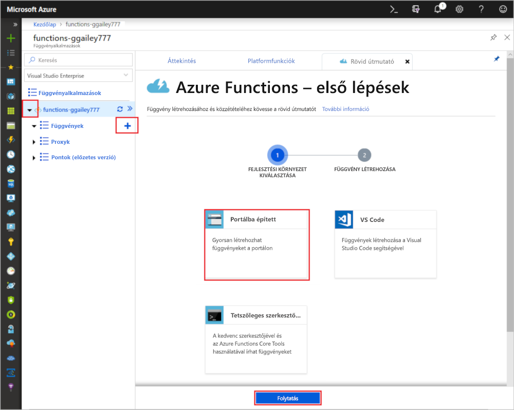

# Az első függvény létrehozása az Azure portálon

Az Azure Functions lehetővé teszi a kód futtatását kiszolgáló nélküli környezetben anélkül, hogy először virtuális gépet (VM) vagy közzé egy webalkalmazást. Ebben a cikkben megtudhatja, hogyan használhatja az Azure Functions egy "hello world" HTTP-aktivált függvény az Azure Portalon.

[!INCLUDE [quickstarts-free-trial-note](../../includes/quickstarts-free-trial-note.md)]

Ha C# fejlesztő, fontolja meg [az első függvény létrehozását a Visual Studio 2019-ben](functions-create-your-first-function-visual-studio.md) a portál helyett. 

## Bejelentkezés az Azure-ba

Jelentkezzen be az [Azure Portalra](https://portal.azure.com) az Azure-fiókjával.

## Függvényalkalmazás létrehozása

Rendelkeznie kell egy függvényalkalmazással a függvények végrehajtásának biztosításához. A függvényalkalmazás lehetővé teszi a függvények logikai egységként történő csoportosítását az erőforrások egyszerűbb kezelése, üzembe helyezése, méretezése és megosztása érdekében.

[!INCLUDE [Create function app Azure portal](../../includes/functions-create-function-app-portal.md)]

Ezután hozzon létre egy függvényt az új függvényalkalmazásban.

## HTTP által aktivált függvény létrehozása

1. Bontsa ki az **+** új függvényalkalmazást, kattintson a **Funkciók**gomb melletti gombra, válassza **a Portálon**lehetőséget, majd kattintson a **Folytatás gombra.**

    

1. Válassza **a WebHook + API**lehetőséget, majd a Create **(Létrehozás) lehetőséget.**

    

   A rendszer létrehoz egy függvényt egy HTTP által indított függvény nyelvspecifikus sablonjának használatával.

Mostantól egy HTTP-kérelem küldésével futtathatja az új függvényt.

## A függvény tesztelése

1. Az új függvényben válassza **a</> A függvény URL-címének bekerülése** lehetőséget a jobb felső sarokban. 

1. A **Függvény URL-címének bemásolása** párbeszédpanelen válassza az **alapértelmezett (Funkcióbillentyű)** elemet a legördülő listából, majd válassza a **Másolás**lehetőséget. 

    

1. Illessze be a függvény URL-címét a böngésző címsorába. Adja hozzá a `&name=<your_name>` lekérdezési karakterlánc értékét az URL-cím végéhez, és nyomja le az Enter billentyűt a kérelem futtatásához. 

    Az alábbi példa a böngészőben visszaadott választ mutatja:

    

    A kérelem URL-címe alapértelmezés szerint tartalmazza a függvény HTTP protokollon keresztüli eléréséhez szükséges kulcsot.

1. A függvény futásakor a rendszer nyomkövetési adatok ír a naplókba. Az előző végrehajtás nyomkövetési kimenetének megtekintéséhez térjen vissza a függvényhez a portálon, és válassza ki a képernyő alján lévő nyilat a **Naplók kibontásához.**

   

## Az erőforrások eltávolítása

[!INCLUDE [Clean-up resources](../../includes/functions-quickstart-cleanup.md)]

## További lépések

[!INCLUDE [Next steps note](../../includes/functions-quickstart-next-steps.md)]

