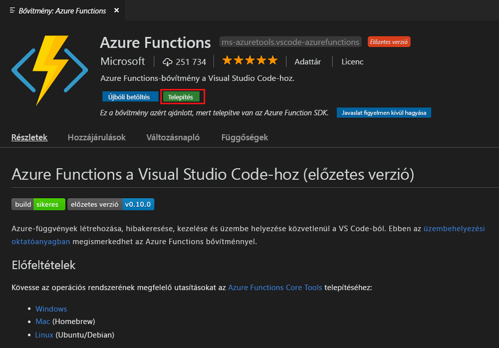
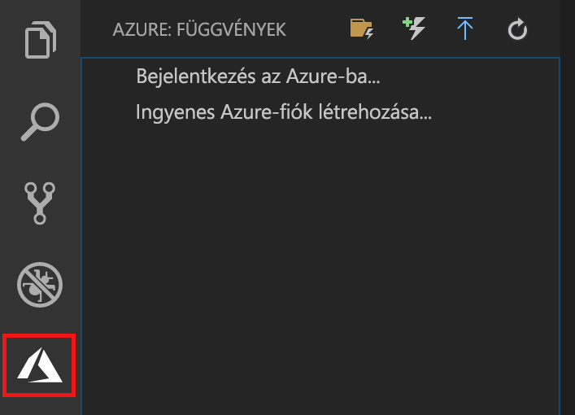
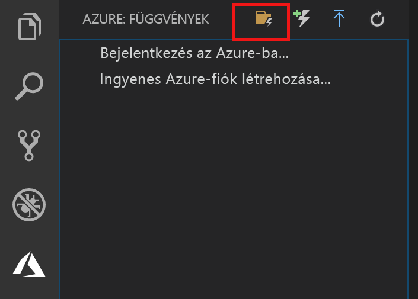
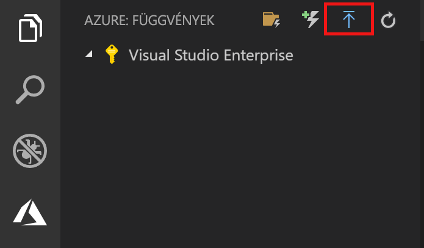
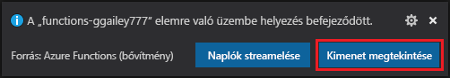
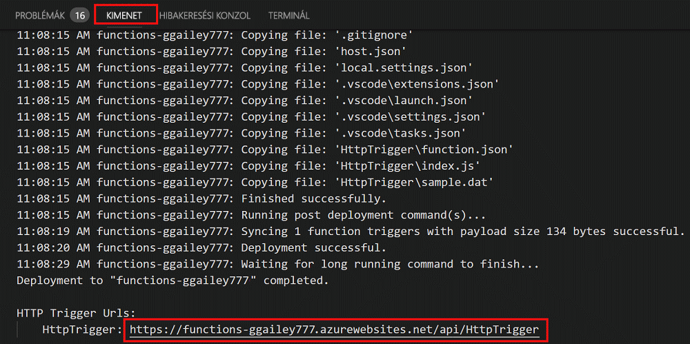

# Az első függvény létrehozása a Visual Studio Code használatával

Az Azure Functions lehetővé teszi a kód [kiszolgáló nélküli](https://azure.microsoft.com/solutions/serverless/) környezetben történő végrehajtását anélkül, hogy először létre kellene hoznia egy virtuális gépet, vagy közzé kellene tennie egy webalkalmazást.

Ebben a cikkben megtudhatja, hogy a [Azure Functions-bővítmény a Visual Studio Code-hoz] használatával miként hozhat létre és tesztelhet a helyi számítógépén egy „Helló világ!”-függvényt a Microsoft Visual Studio Code használatával. Ezután közzéteheti a függvénykódot az Azure-ban a Visual Studio Code-ból.

A bővítmény a jelenleg a C#-, a JavaScript- és a Java-függvényeket támogatja. Az ebben a cikkben leírt lépések eltérhetnek az Azure Functions-projekthez választott nyelvtől függően. A bővítmény jelenleg előzetes verzióként érhető el. További tudnivalókért tekintse meg az [Azure Functions-bővítmény a Visual Studio Code-hoz] bővítmény oldalát.

## Előfeltételek

A gyorsútmutató elvégzéséhez:

* Telepítse a [Visual Studio Code-ot](https://code.visualstudio.com/) a [támogatott platformok](https://code.visualstudio.com/docs/supporting/requirements#_platforms) egyikén. Ez a cikk macOS (High Sierra) operációs rendszerű eszközön lett fejlesztve és tesztelve.

* Telepítse az [Azure Functions Core Tools](functions-run-local.md#v2) jelenleg előzetes verzióban lévő 2.x. verzióját.

* Telepítse az Ön által választott nyelvhez tartozó követelményeket:

    | Nyelv | Mellék |
    | -------- | --------- |
    | **C#** | [C# a Visual Studio Code-hoz](https://marketplace.visualstudio.com/items?itemName=ms-vscode.csharp) [.NET Core CLI-eszközök](https://docs.microsoft.com/dotnet/core/tools/?tabs=netcore2x)*   |
    | **Java** | [A Javához készült hibakereső](https://marketplace.visualstudio.com/items?itemName=vscjava.vscode-java-debug) [JDK 1.8](http://www.oracle.com/technetwork/java/javase/downloads/index.html) [Maven 3+](https://maven.apache.org/) |
    | **JavaScript** | [Node 8.0+](https://nodejs.org/)  |

    \* A Core Tools is igényli.

[!INCLUDE [quickstarts-free-trial-note](../../includes/quickstarts-free-trial-note.md)]

## Az Azure Functions-bővítmény telepítése

Az Azure Functions-bővítmény használatával függvények hozhatók létre, tesztelhetők és helyezhetők üzembe az Azure-ban.

1. A Visual Studio Code-ban nyissa meg az **Extensions** (Bővítmények) menüt, és keresse meg a(z) `azure functions` elemet, vagy [nyissa meg ezt a hivatkozást a Visual Studio Code-ban](vscode:extension/ms-azuretools.vscode-azurefunctions).

1. Válassza az **Install** (Telepítés) lehetőséget a bővítmény telepítéséhez a Visual Studio Code-ban. 

    

1. Indítsa újra a Visual Studio Code-ot, és válassza az Azure ikont a tevékenységsávon. Ekkor megjelenik egy Azure Functions terület az oldalsávon.

    

## Azure Functions-projekt létrehozása

A Visual Studio Code Azure Functions projektsablonja egy olyan projektet hoz létre, amely közzétehető egy Azure-függvényalkalmazásban. A függvényalkalmazás lehetővé teszi, hogy logikai egységbe csoportosítsa a függvényeket az erőforrások felügyelete, üzembe helyezése és megosztása érdekében.

1. A Visual Studio Code-ban, válassza az Azure logót az **Azure: Functions** terület megjelenítéséhez, majd válassza a Create New Project (Új projekt létrehozása) ikont.

    

1. Adjon meg egy helyet a projekt munkaterületének, és válassza a **Select** (Kiválasztás) lehetőséget.

    > [!NOTE]
    > Ez a cikk munkaterületen kívüli teljesítésre lett tervezve. Ebben az esetben ne válasszon olyan projektmappát, amely valamely munkaterület része.

1. Válassza ki a függvényalkalmazási projektjének nyelvét. Ez a cikk a JavaScriptet használja.
    

1. Amikor a program kéri, válassza az **Add to workspace** (Hozzáadás munkaterülethez) lehetőséget.

A Visual Studio Code létrehozza a függvényalkalmazást egy új munkaterületen. Ez a projekt a [host.json](functions-host-json.md) és a [local.settings.json](functions-run-local.md#local-settings-file) konfigurációs fájlokat tartalmazza, valamint az esetleges nyelvspecifikus projektfájlokat is. Emellett a projekt mappájában rendelkezésére áll majd egy új Git-adattár is.

## HTTP által aktivált függvény létrehozása

1. Az **Azure: Functions** menüben válassza a függvény létrehozására szolgáló ikont.

    

1. Válassza ki a függvényalkalmazás-projektet tartalmazó mappát, majd válassza a **HTTP-trigger** (HTTP-eseményindító) függvénysablont.

    

1. A függvénynek adja a `HTTPTrigger` nevet, nyomja le az Enter billentyűt, majd válassza az **Anonymous** (Névtelen) hitelesítést.

    

    A rendszer létrehoz egy függvényt a választott nyelven a HTTP által indított függvények sablonjának használatával.

    

A függvényhez további bemeneti és kimeneti kötések adhatók hozzá a function.json fájl módosításával. További információkat az [Azure Functions triggers and bindings concepts](functions-triggers-bindings.md) (Az Azure Functions eseményindítói és kötési alapelvei) témakörben talál.

Most, hogy már létrehozott egy függvényprojektet és egy HTTP-eseményindítóval aktivált függvényt, tesztelheti a helyi számítógépen.

## A függvény helyi tesztelése

Az Azure Functions Core Tools lehetővé teszi Azure Functions-projektek helyi fejlesztői számítógépen való futtatását. Amikor a Visual Studio Code-ból először indít el egy függvényt, a rendszer arra kéri, hogy telepítse ezeket az eszközöket.  

1. A függvény teszteléséhez állítson be egy töréspontot a függvény kódjában, majd nyomja le az F5 billentyűt a függvényalkalmazás-projekt elindításához. A Core Tools kimenete a **Terminal** (Terminál) panelen jelenik meg.

1. A **Terminal** (Terminál) panelen másolja a vágólapra a HTTP által indított függvény URL-végpontját.

    

1. Illessze be a HTTP-kérelem URL-címét a böngésző címsorába. Az URL-címhez fűzze hozzá a `?name=<yourname>` lekérdezési sztringet, és hajtsa végre a kérelmet. A végrehajtás a töréspont elérésekor szünetelni fog.

    

1. A végrehajtás folytatásakor a böngészőben a következőképp jelenik meg a válasz a GET-kérésre:

    

1. A hibakeresés leállításához nyomja le a Shift + F1 billentyűkombinációt.

Miután ellenőrizte, hogy a függvény megfelelően fut a helyi számítógépen, tegye közzé a projektet az Azure-ban.

## Bejelentkezés az Azure-ba

Az alkalmazás közzététele előtt be kell jelentkeznie az Azure-ba.

1. Az **Azure: Functions** területen válassza a **Sign in to Azure...** (Bejelentkezés az Azure-ba) lehetőséget. Ha még nincs Azure-fiókja, **hozzon létre egy ingyenes fiókot**.

    

1. Amikor a rendszer kéri, válassza a **Copy & Open** (Másolás és megnyitás) lehetőséget, vagy másolja a megjelenített kódot a vágólapra, és nyissa meg a böngészőjében a következőt: <https://aka.ms/devicelogin>.

1. Másolja be a vágólapra másolt kódot a **Device Login** (Bejelentkezés az eszközön) oldalra, hagyja jóvá a bejelentkezést a Visual Studio Code-ra vonatkozóan, majd válassza a **Continue** (Folytatás) lehetőséget.  

1. Fejezze be a bejelentkezést az Azure-fiókja hitelesítő adataival. A sikeres bejelentkezés után bezárhatja a böngészőt.

## A projekt közzététele az Azure-ban

A Visual Studio Code lehetővé teszi a függvényprojekt közzétételét közvetlenül az Azure-ba. A folyamat során létrehoz egy függvényalkalmazást és az azokhoz tartozó erőforrásokat az Azure-előfizetésében. A függvényalkalmazás végrehajtási környezetet biztosít a függvények számára. A projektet a rendszer becsomagolja, és az Azure-előfizetésben lévő új függvényalkalmazásban helyezi üzembe. 

A cikk azt feltételezi, hogy Ön új függvényalkalmazást hoz létre. Meglévő függvényalkalmazásba való közzététel felülírja az adott alkalmazás tartalmát az Azure-ban.

1. Az **Azure: Functions** területen válassza a Deploy to Function App (Üzembe helyezés függvényalkalmazásban) ikont.

    

1. Válassza ki a projekt mappáját, amely a jelenlegi munkaterület.

1. Ha egynél több előfizetéssel rendelkezik, akkor válassza ki azt, amelyben üzemeltetni kívánja a függvényalkalmazását. Ezután válassza a **+ Create New Function App** (Új függvényalkalmazás létrehozása) lehetőséget.

1. Írjon be egy globálisan egyedi nevet a függvényalkalmazás azonosításához, majd nyomja le az Enter billentyűt. A függvényalkalmazás nevéhez használható érvényes karakterek a következők: `a-z`, `0-9` és `-`.

1. Válassza a **+ Create New Resource Group** (Új erőforráscsoport létrehozása) lehetőséget, adjon meg egy erőforráscsoport-nevet (pl. `myResourceGroup`), majd nyomja le az Enter billentyűt. Használhat meglévő erőforráscsoportot is.

1. Válassza **+Create New Storage Account** (Új tárfiók létrehozása) lehetőséget, adjon meg egy globálisan egyedi nevet a függvényalkalmazás által használt új tárfióknak, majd nyomja le az Enter billentyűt. A tárfiókok neve 3–24 karakter hosszúságú lehet, és csak számokból és kisbetűkből állhat. Meglévő fiókot is használhat.

1. Válasszon ki egy helyet egy, a közelben, vagy a függvények által elért más szolgáltatások közelében található [régióban](https://azure.microsoft.com/regions/).

    A hely kiválasztása után megkezdődik a függvényalkalmazás létrehozása. A függvényalkalmazás létrehozása és a telepítőcsomag alkalmazása után megjelenik egy értesítés.

1. Az értesítések között válassza a **View Output** (Kimenet megtekintése) lehetőséget a létrehozási és üzembehelyezési műveletek eredményeinek megtekintéséhez – ezek közé tartoznak az Ön által létrehozott Azure-erőforrások is.

    

1. Jegyezze fel az új függvényalkalmazás URL-címét az Azure-ban. Ezzel tesztelheti a függvényt, miután a projekt közzététele megtörtént az Azure-ban.

    

1. Az **Azure: Functions** területre visszatérve láthatja az új függvényalkalmazást, amely az előfizetése alatt jelenik meg. Amikor kibontja ezt a csomópontot, láthatja a függvényeket a függvényalkalmazásban, valamint az alkalmazásbeállításokat és a függvényproxykat is.

    

    A függvényalkalmazás csomópontján állva a Ctrl billentyűt lenyomva és a jobb egérgombbal kattintva választhat különböző felügyeleti és konfigurációs műveletek közül, amelyeket elvégezhet a függvényalkalmazáson az Azure-ban. A függvényalkalmazás az Azure Portalon való megtekintését is választhatja.

## A függvény tesztelése az Azure-ban

1. Másolja a vágólapra a HTTP-eseményindító URL-címét az **Output** (Kimenet) panelről. Ahogyan korábban, most is az URL-cím végéhez adja hozzá a `?name=<yourname>` lekérdezési sztringet, és hajtsa végre a kérelmet.

    A HTTP-eseményindítót használó függvényt meghívó URL-címnek az alábbi formátumban kell lennie:

        http://<functionappname>.azurewebsites.net/api/<functionname>?name=<yourname> 

1. Illessze be a HTTP-kérelem új URL-címét a böngésző címsorába. Az alábbiakban látható a böngészőben a távoli GET kérelemre a függvény által visszaadott válasz: 

    

## További lépések

A Visual Studio Code segítéségével létrehozott egy egyszerű, HTTP-eseményindítóval aktivált függvényt tartalmazó függvényalkalmazást. További információt a függvények különféle nyelveken való fejlesztéséről az egyes nyelvek referencia-útmutatóiban talál: [JavaScript](functions-reference-node.md), [.NET](functions-dotnet-class-library.md), [Java](functions-reference-java.md).

A továbbiakban megismerheti a terminálról vagy a parancssorból végzett helyi tesztelés és hibakeresés módjait az Azure Functions Core Tools használatával.

> [!div class="nextstepaction"]
> [Helyi kódolás és tesztelés](functions-run-local.md)

[Azure Functions Core Tools]: functions-run-local.md
[Azure Functions-bővítmény a Visual Studio Code-hoz]: https://marketplace.visualstudio.com/items?itemName=ms-azuretools.vscode-azurefunctions
