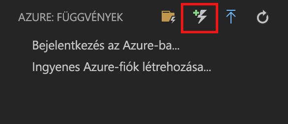

# Az első függvény létrehozása a Visual Studio Code használatával

Az Azure Functions lehetővé teszi a kód [kiszolgáló nélküli](https://azure.microsoft.com/solutions/serverless/) környezetben történő végrehajtását anélkül, hogy először létre kellene hoznia egy virtuális gépet, vagy közzé kellene tennie egy webalkalmazást.

Ebben a cikkben megtudhatja, hogy a [Azure Functions-bővítmény a Visual Studio Code-hoz] használatával miként hozhat létre és tesztelhet a helyi számítógépén egy „Helló világ!”-függvényt a Microsoft Visual Studio Code használatával. Ezután közzéteheti a függvénykódot az Azure-ban a Visual Studio Code-ból.

A bővítmény jelenleg teljes mértékben támogatja a C#, JavaScript és Java-függvények, Python támogatással jelenleg előzetes verzióban érhető el. Az ebben a cikkben leírt lépések eltérhetnek az Azure Functions-projekthez választott nyelvtől függően. A bővítmény jelenleg előzetes verzióként érhető el. További tudnivalókért tekintse meg az [Azure Functions-bővítmény a Visual Studio Code-hoz] bővítmény oldalát.

## Előfeltételek

A gyorsútmutató elvégzéséhez:

* Telepítse a [Visual Studio Code-ot](https://code.visualstudio.com/) a [támogatott platformok](https://code.visualstudio.com/docs/supporting/requirements#_platforms) egyikén. Ez a cikk macOS (High Sierra) operációs rendszerű eszközön lett fejlesztve és tesztelve.

* Telepítse az [Azure Functions Core Tools](functions-run-local.md#v2) jelenleg előzetes verzióban lévő 2.x. verzióját.

* Telepítse az Ön által választott nyelvhez tartozó követelményeket:

    | Nyelv | Mellék |
    | -------- | --------- |
    | **C#** | [C# a Visual Studio Code-hoz](https://marketplace.visualstudio.com/items?itemName=ms-vscode.csharp) [.NET Core CLI-eszközök](https://docs.microsoft.com/dotnet/core/tools/?tabs=netcore2x)*   |
    | **Java** | [A Javához készült hibakereső](https://marketplace.visualstudio.com/items?itemName=vscjava.vscode-java-debug) [Java 8](https://aka.ms/azure-jdks) [Maven 3+](https://maven.apache.org/) |
    | **JavaScript** | [Node 8.0+](https://nodejs.org/)  |

    \* A Core Tools is igényli.

[!INCLUDE [quickstarts-free-trial-note](../../includes/quickstarts-free-trial-note.md)]

[!INCLUDE [functions-install-vs-code-extension](../../includes/functions-install-vs-code-extension.md)]

[!INCLUDE [functions-create-function-app-vs-code](../../includes/functions-create-function-app-vs-code.md)]

## HTTP által aktivált függvény létrehozása

1. A **Azure: Függvények**, kattintson a Create Function ikonra.

    

1. Válassza ki a függvényalkalmazás-projektet tartalmazó mappát, majd válassza a **HTTP-trigger** (HTTP-eseményindító) függvénysablont.

    

1. A függvénynek adja a `HTTPTrigger` nevet, nyomja le az Enter billentyűt, majd válassza az **Anonymous** (Névtelen) hitelesítést.

    

    A rendszer létrehoz egy függvényt a választott nyelven a HTTP által indított függvények sablonjának használatával.

    

A függvényhez további bemeneti és kimeneti kötések adhatók hozzá a function.json fájl módosításával. További információkat az [Azure Functions triggers and bindings concepts](functions-triggers-bindings.md) (Az Azure Functions eseményindítói és kötési alapelvei) témakörben talál.

Most, hogy már létrehozott egy függvényprojektet és egy HTTP-eseményindítóval aktivált függvényt, tesztelheti a helyi számítógépen.

## A függvény helyi tesztelése

Az Azure Functions Core Tools lehetővé teszi Azure Functions-projektek helyi fejlesztői számítógépen való futtatását. Amikor a Visual Studio Code-ból először indít el egy függvényt, a rendszer arra kéri, hogy telepítse ezeket az eszközöket.  

1. A függvény teszteléséhez állítson be egy töréspontot a függvény kódjában, majd nyomja le az F5 billentyűt a függvényalkalmazás-projekt elindításához. A Core Tools kimenete a **Terminal** (Terminál) panelen jelenik meg.

1. A **Terminal** (Terminál) panelen másolja a vágólapra a HTTP által indított függvény URL-végpontját.

    

1. Illessze be a HTTP-kérelem URL-címét a böngésző címsorába. Az URL-címhez fűzze hozzá a `?name=<yourname>` lekérdezési sztringet, és hajtsa végre a kérelmet. A végrehajtás a töréspont elérésekor szünetelni fog.

    

1. A végrehajtás folytatásakor a böngészőben a következőképp jelenik meg a válasz a GET-kérésre:

    

1. A hibakeresés leállításához nyomja le a Shift + F5 billentyűkombinációt.

Miután ellenőrizte, hogy a függvény megfelelően fut a helyi számítógépen, tegye közzé a projektet az Azure-ban.

[!INCLUDE [functions-sign-in-vs-code](../../includes/functions-sign-in-vs-code.md)]

[!INCLUDE [functions-publish-project-vscode](../../includes/functions-publish-project-vscode.md)]

## A függvény tesztelése az Azure-ban

1. Másolja a vágólapra a HTTP-eseményindító URL-címét az **Output** (Kimenet) panelről. Ahogyan korábban, most is az URL-cím végéhez adja hozzá a `?name=<yourname>` lekérdezési sztringet, és hajtsa végre a kérelmet.

    A HTTP-eseményindítót használó függvényt meghívó URL-címnek az alábbi formátumban kell lennie:

        http://<functionappname>.azurewebsites.net/api/<functionname>?name=<yourname> 

1. Illessze be a HTTP-kérelem új URL-címét a böngésző címsorába. Az alábbiakban látható a böngészőben a távoli GET kérelemre a függvény által visszaadott válasz: 

    

## További lépések

A Visual Studio Code segítéségével létrehozott egy egyszerű, HTTP-eseményindítóval aktivált függvényt tartalmazó függvényalkalmazást. További információt a függvények különféle nyelveken való fejlesztéséről az egyes nyelvek referencia-útmutatóiban talál: [JavaScript](functions-reference-node.md), [.NET](functions-dotnet-class-library.md), [Java](functions-reference-java.md).

A továbbiakban megismerheti a terminálról vagy a parancssorból végzett helyi tesztelés és hibakeresés módjait az Azure Functions Core Tools használatával.

> [!div class="nextstepaction"]
> [Helyi kódolás és tesztelés](functions-run-local.md)

[Azure Functions Core Tools]: functions-run-local.md
[Azure Functions-bővítmény a Visual Studio Code-hoz]: https://marketplace.visualstudio.com/items?itemName=ms-azuretools.vscode-azurefunctions
