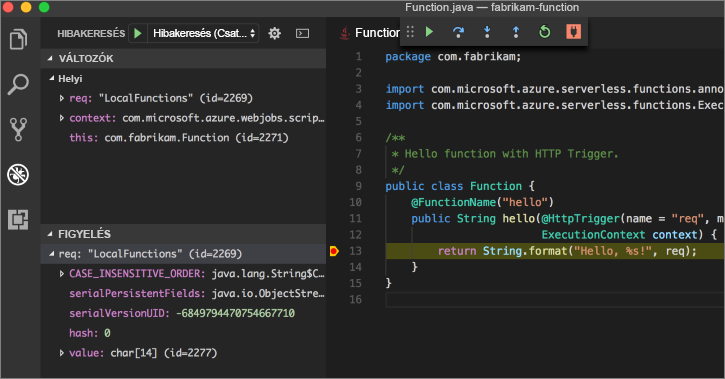

# <a name="create-your-first-function-with-java-and-maven-preview"></a>Hozzon létre az első függvényét Java és Maven (előzetes verzió)

> [!NOTE] 
> Az Azure Functions Java jelenleg előzetes verzió.

A gyors üzembe helyezés végigvezeti a felhasználót létrehozni egy [kiszolgáló nélküli](https://azure.microsoft.com/overview/serverless-computing/) Maven, helyi tesztelés, és telepítené őket az Azure Functions függvény projekthez. Amikor elkészült, akkor egy Azure-ban futó HTTP-eseményindítóval aktivált függvény alkalmazást.


[!INCLUDE [quickstarts-free-trial-note](../../includes/quickstarts-free-trial-note.md)]

## <a name="prerequisites"></a>Előfeltételek
Java-funkciók alkalmazást fejleszt, rendelkeznie kell a következőkkel:

-  [A .NET core](https://www.microsoft.com/net/core), legújabb verzió.
-  [Java fejlesztői készlet](https://www.azul.com/downloads/zulu/), 8-as verzió.
-  [Azure CLI](https://docs.microsoft.com/cli/azure)
-  [Apache Maven](https://maven.apache.org), 3.0-s verzió vagy újabb.
-  [NODE.js](https://nodejs.org/download/), 8.6 vagy újabb verziója.

> [!IMPORTANT] 
> A JAVA_HOME környezeti változó a gyors üzembe helyezés befejeződik a telepítés helyét a JDK kell beállítani.

## <a name="install-the-azure-functions-core-tools"></a>Az Azure Functions Core eszközök telepítése

A [Azure Functions Core eszközök 2.0](https://www.npmjs.com/package/azure-functions-core-tools) adja meg a helyi környezet írása, fut, és az Azure Functions hibakeresést. Az eszközök telepítése [npm](https://www.npmjs.com/)részét képező [Node.js](https://nodejs.org/).

```
npm install -g azure-functions-core-tools@core
```

> [!NOTE]
> Ha gondja támad az Azure Functions Core eszközök 2.0-s verziójának telepítése, lásd: [verzió 2.x futásidejű](/azure/azure-functions/functions-run-local#version-2x-runtime).

## <a name="generate-a-new-functions-project"></a>Új funkciók-projekt

Üres mappába, a következő parancsot a funkciók-projekt létrehozásához egy [Maven archetype](https://maven.apache.org/guides/introduction/introduction-to-archetypes.html).

### <a name="linuxmacos"></a>Linux/MacOS

```bash
mvn archetype:generate \
    -DarchetypeGroupId=com.microsoft.azure \
    -DarchetypeArtifactId=azure-functions-archetype 
```

### <a name="windows-cmd"></a>Windows (CMD)
```cmd
mvn archetype:generate ^
    -DarchetypeGroupId=com.microsoft.azure ^
    -DarchetypeArtifactId=azure-functions-archetype
```

Maven kéri a projekt létrehozásának befejezéséhez szükséges értékeket. A _groupId_, _artifactid szakaszát_, és _verzió_ értékek, tekintse meg a [Maven elnevezési konvenciókat](https://maven.apache.org/guides/mini/guide-naming-conventions.html) hivatkozás. A _appName_ értéknek egész Azure, egyedinek kell lennie, Maven állít elő, az alkalmazás nevét, a korábban megadott alapján _artifactid szakaszát_ alapértelmezés szerint. A _csomagnév_ érték határozza meg a létrehozott funkciókódot Java csomagja.

```Output
Define value for property 'groupId': com.fabrikam.functions
Define value for property 'artifactId' : fabrikam-functions
Define value for property 'version' 1.0-SNAPSHOT : 
Define value for property 'package': com.fabrikam.functions
Define value for property 'appName' fabrikam-functions-20170927220323382:
Confirm properties configuration: Y
```

Maven hoz létre a projektfájlok nevű új mappa _artifactid szakaszát_. A generált kódot a projektben egy egyszerű [indított HTTP](/azure/azure-functions/functions-bindings-http-webhook) függvény, amely a kérelem törzse echók:

```java
public class Function {
    @FunctionName("hello")
    public String hello(@HttpTrigger(name = "req", methods = {"get", "post"}, authLevel = AuthorizationLevel.ANONYMOUS) String req,
                        ExecutionContext context) {
        return String.format("Hello, %s!", req);
    }
}
```

## <a name="run-the-function-locally"></a>Futtassa helyben a függvényt

Módosítsa a könyvtárat az újonnan létrehozott projekt mappába és összeállítása, és futtassa a funkciót a Maven:

```
cd fabrikam-function
mvn clean package 
mvn azure-functions:run
```

A kimenet jelenik meg a függvény futása közben:

```Output
Listening on http://localhost:7071
Hit CTRL-C to exit...

Http Functions:

   hello: http://localhost:7071/api/hello
```

Indítás, a függvény egy új terminál curl használatával a parancssorból:

```
curl -w '\n' -d LocalFunction http://localhost:7071/api/hello
```

```Output
Hello LocalFunction!
```

Használjon `Ctrl-C` a terminálban a funkciókódot leállítására.

## <a name="deploy-the-function-to-azure"></a>A funkció telepítése az Azure-bA

A telepítés folyamata az Azure Functions az Azure parancssori felület fiók hitelesítő adatokat használja. [Jelentkezzen be az Azure parancssori felület](/cli/azure/authenticate-azure-cli?view=azure-cli-latest) , majd telepítse a kód egy új funkció alkalmazás használatával történő a `azure-functions:deploy` Maven cél.

```
az login
mvn azure-functions:deploy
```

Ha a telepítés befejeződött, tekintse meg az URL-címet, használhatja az Azure-függvény alkalmazás eléréséhez:

```output
[INFO] Successfully deployed Function App with package.
[INFO] Deleting deployment package from Azure Storage...
[INFO] Successfully deleted deployment package fabrikam-function-20170920120101928.20170920143621915.zip
[INFO] Successfully deployed Function App at https://fabrikam-function-20170920120101928.azurewebsites.net
[INFO] ------------------------------------------------------------------------
```

A curl használatával Azure-on futó függvény alkalmazás tesztelése:

```
curl -w '\n' https://fabrikam-function-20170920120101928.azurewebsites.net/api/hello -d AzureFunctions
```

```Output
Hello AzureFunctions!
```

## <a name="next-steps"></a>Következő lépések

Az egyszerű HTTP-eseményindító egy Java-függvény alkalmazást létrehozta és telepítve lett az Azure Functions a.

- Tekintse át a [funkciók Java fejlesztői útmutató](functions-reference-java.md) további információk Java funkciók fejlesztése.
- A projektet a másik eseményindítókkal további funkciók hozzáadása a `azure-functions:add` Maven cél.
- A hibakeresési helyileg a Visual Studio Code funkciók. Az a [Java bővítmény pack](https://marketplace.visualstudio.com/items?itemName=vscjava.vscode-java-pack) telepítve, és a funkciók projektet nyissa meg a Visual Studio Code [a Hibakereső csatlakoztatása](https://code.visualstudio.com/Docs/editor/debugging#_launch-configurations) 5005 porthoz. Állítson be egy töréspontot a szerkesztőben, majd a függvény aktiválására helyi futtatása: 


