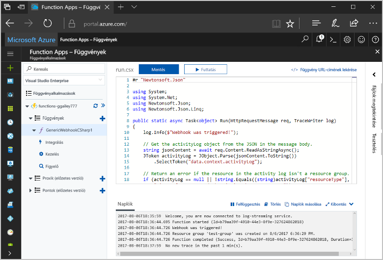
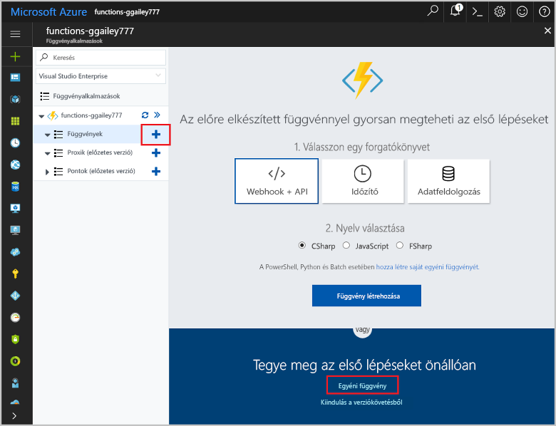
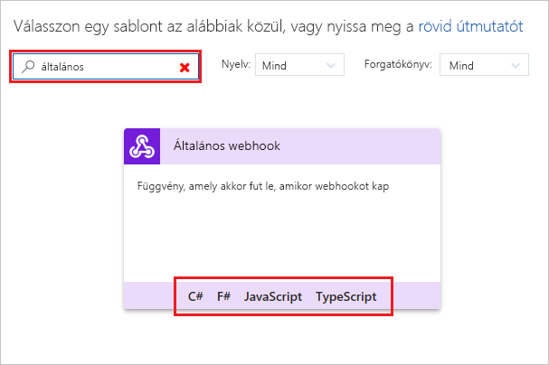
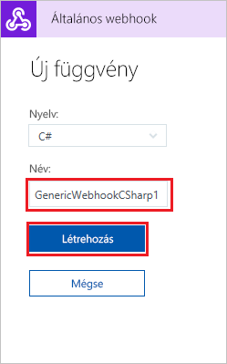
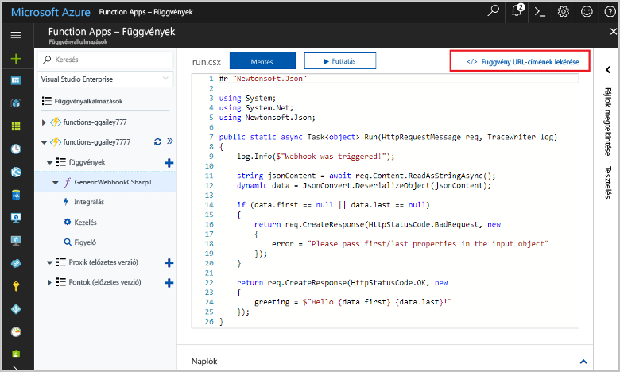
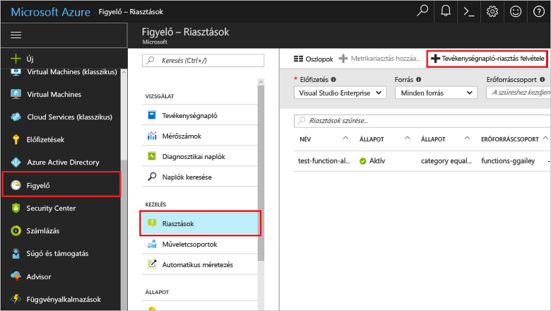
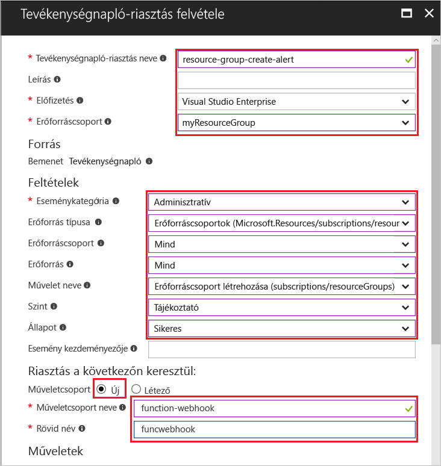
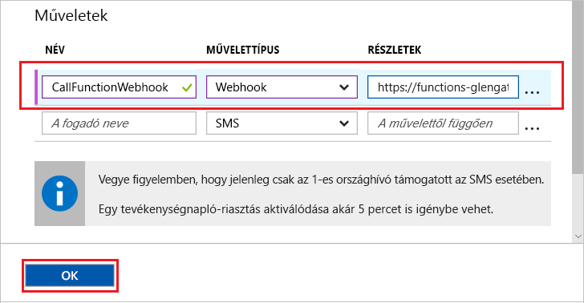
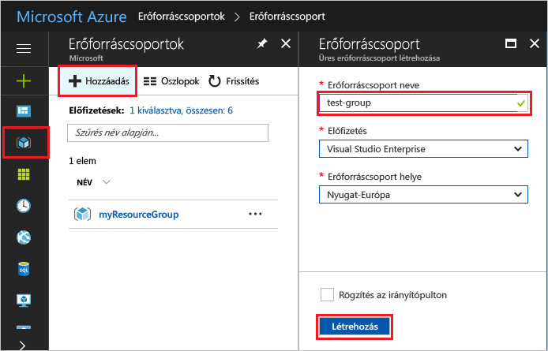
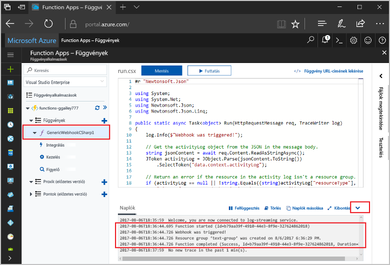

# <a name="create-a-function-triggered-by-a-generic-webhook"></a>Általános webhook által aktivált függvény létrehozása

Az Azure Functions lehetővé teszi a kód végrehajtását kiszolgáló nélküli környezetben anélkül, hogy először létre kellene hoznia egy virtuális gépet vagy közzé kellene tennie egy webalkalmazást. Például konfigurálhat úgy egy függvényt, hogy az Azure Monitor riasztására aktiválódjon. Ez a témakör C#-kódok végrehajtásának módját mutatja be erőforráscsoport az előfizetéshez történő hozzáadásakor.   



## <a name="prerequisites"></a>Előfeltételek 

Az oktatóanyag elvégzéséhez:

+ Ha nem rendelkezik Azure-előfizetéssel, mindössze néhány perc alatt létrehozhat egy [ingyenes fiókot](https://azure.microsoft.com/free/?WT.mc_id=A261C142F) a virtuális gép létrehozásának megkezdése előtt.

## <a name="create-an-azure-function-app"></a>Azure-függvényalkalmazás létrehozása

[!INCLUDE [Create function app Azure portal](../../includes/functions-create-function-app-portal.md)]

Ezután létrehozhat egy függvényt az új függvényalkalmazásban.

## <a name="create-function"></a>Általános webhook által aktivált függvény létrehozása

1. Bontsa ki a függvényalkalmazást, és kattintson a **Függvények** elem melletti **+** gombra. Ha ez az első függvény a függvényalkalmazásban, jelölje ki az **Egyéni függvény** lehetőséget. Ez megjeleníti a függvénysablonok teljes készletét.

    

2. A keresés mezőbe írja be a `generic` kifejezést, majd válassza ki a kívánt nyelvet az általános webhook-eseményindító sablonjához. Ez a témakör C#-függvényt használ.

     

2. Adja meg a függvény **nevét**, majd válassza a **Létrehozás** elemet. 

      

2. Az új függvényben kattintson a **</> Függvény URL-címének lekérése** elemre, majd másolja és mentse az értéket. Erre az értékre a webhook konfigurálásához lesz szükség. 

    
         
Ezután hozzon létre egy webhook-végpontot egy Azure Monitor tevékenységnapló-riasztásban. 

## <a name="create-an-activity-log-alert"></a>Tevékenységnapló-riasztás létrehozása

1. Az Azure Portalon lépjen a **Figyelés** szolgáltatáshoz, válassza a **Riasztások** lehetőséget, majd kattintson a **Tevékenységnapló-riasztás hozzáadása** elemre.   

    

2. Használja a táblázatban megadott beállításokat:

    

    | Beállítás      |  Ajánlott érték   | Leírás                              |
    | ------------ |  ------- | -------------------------------------------------- |
    | **Tevékenységnapló-riasztás neve** | resource-group-create-alert | A tevékenységnapló-riasztás neve. |
    | **Előfizetés** | Az Ön előfizetése | Az ehhez az oktatóanyaghoz használt előfizetés. | 
    |  **Erőforráscsoport** | myResourceGroup | Az erőforráscsoport, ahova a riasztás erőforrásai települnek. A függvényalkalmazás által használt erőforráscsoport használata megkönnyíti a fölöslegessé vált elemek eltávolítását az oktatóanyag befejezése után. |
    | **Eseménykategória** | Adminisztratív | Ez a kategória az Azure-erőforrásokon eszközölt módosításokat tartalmazza.  |
    | **Erőforrás típusa** | Erőforráscsoportok | A riasztásokat az erőforráscsoport-tevékenységekre szűri. |
    | **Erőforráscsoport**<br/>és **Erőforrás** | Összes | Minden erőforrás monitorozása. |
    | **Művelet neve** | Create resource group (Erőforráscsoport létrehozása) | A riasztásokat létrehozási műveletekre szűri. |
    | **Szint** | Tájékoztató | Tartalmazza a tájékoztató szintű riasztásokat. | 
    | **Állapot** | Sikeres | A riasztásokat a sikeresen befejezett műveletekre szűri. |
    | **Műveletcsoport** | Új | Hozzon létre egy új műveletcsoportot, amely meghatározza a riasztáskor végrehajtandó műveletet. |
    | **Műveletcsoport neve** | function-webhook | A műveletcsoport azonosítására szolgáló név.  | 
    | **Rövid név** | funcwebhook | A műveletcsoport rövid neve. |  

3. A **Műveletek** területen adjon hozzá egy műveletet a táblázatban megadott beállításokkal: 

    

    | Beállítás      |  Ajánlott érték   | Leírás                              |
    | ------------ |  ------- | -------------------------------------------------- |
    | **Name (Név)** | CallFunctionWebhook | A művelet neve. |
    | **Művelettípus** | Webhook | A riasztásra adott válasz egy webhook URL-címének meghívása. |
    | **Részletek** | Függvény URL-címe | Illessze be a függvényhez tartozó webhook korábban vágólapra másolt URL-címét. |v

4. A riasztás és a műveletcsoport létrehozásához kattintson az **OK** gombra.  

A rendszer mostantól meghívja a webhookot, ha erőforráscsoport jön létre előfizetésében. Ezután frissítse a függvény kódját a kérelem törzsében található JSON-naplóadatok kezeléséhez.   

## <a name="update-the-function-code"></a>A függvénykód módosítása

1. Lépjen vissza a függvényalkalmazáshoz a portálon, és bontsa ki a függvényt. 

2. Cserélje a függvényben lévő C#-szkriptkódot az alábbira a portálon:

    ```csharp
    #r "Newtonsoft.Json"
    
    using System;
    using System.Net;
    using Newtonsoft.Json;
    using Newtonsoft.Json.Linq;
    
    public static async Task<object> Run(HttpRequestMessage req, TraceWriter log)
    {
        log.Info($"Webhook was triggered!");
    
        // Get the activityLog object from the JSON in the message body.
        string jsonContent = await req.Content.ReadAsStringAsync();
        JToken activityLog = JObject.Parse(jsonContent.ToString())
            .SelectToken("data.context.activityLog");
    
        // Return an error if the resource in the activity log isn't a resource group. 
        if (activityLog == null || !string.Equals((string)activityLog["resourceType"], 
            "Microsoft.Resources/subscriptions/resourcegroups"))
        {
            log.Error("An error occurred");
            return req.CreateResponse(HttpStatusCode.BadRequest, new
            {
                error = "Unexpected message payload or wrong alert received."
            });
        }
    
        // Write information about the created resource group to the streaming log.
        log.Info(string.Format("Resource group '{0}' was {1} on {2}.",
            (string)activityLog["resourceGroupName"],
            ((string)activityLog["subStatus"]).ToLower(), 
            (DateTime)activityLog["submissionTimestamp"]));
    
        return req.CreateResponse(HttpStatusCode.OK);    
    }
    ```

Most tesztelheti a függvényt, ha új erőforráscsoport hoz létre az előfizetésében.

## <a name="test-the-function"></a>A függvény tesztelése

1. Kattintson az erőforráscsoport-ikonra az Azure Portal bal oldalán, válassza a **+ Hozzáadás** lehetőséget, gépeljen be egy **Erőforráscsoport nevet**, majd válassza a **Létrehozás** elemet egy üres erőforráscsoport létrehozásához.
    
    

2. Lépjen vissza a függvényhez, és bontsa ki a **Naplók** ablakot. Miután az erőforráscsoport elkészült, a tevékenységnapló-riasztás aktiválja a webhookot, és a rendszer végrehajtja a függvényt. Az új erőforráscsoport neve megjelenik a naplókban.  

    

3. (Nem kötelező) Lépjen vissza és törölje a saját maga által létrehozott erőforráscsoport. Megjegyezés: ez a művelet nem aktiválja a függvényt. Ennek az az oka, hogy a riasztás kiszűri a törlési műveleteket. 

## <a name="clean-up-resources"></a>Az erőforrások eltávolítása

[!INCLUDE [Next steps note](../../includes/functions-quickstart-cleanup.md)]

## <a name="next-steps"></a>További lépések

Létrehozott egy függvényt, amely akkor fut, amikor kérelem érkezik egy általános webhookból. 

[!INCLUDE [Next steps note](../../includes/functions-quickstart-next-steps.md)]

További információt a webhook-eseményindítókról az [Azure Functions – HTTP- és webhookkötések](functions-bindings-http-webhook.md) című témakörben talál. További információt a függvények C# környezetben való fejlesztéséről az [Azure Functions C#-szkript fejlesztői segédanyagok](functions-reference-csharp.md) című témakörben talál.

