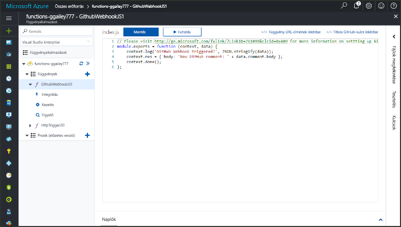
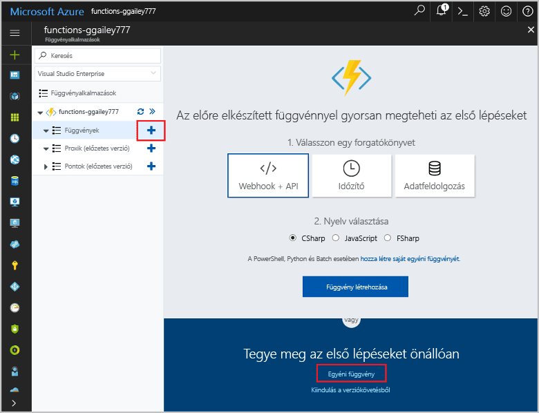
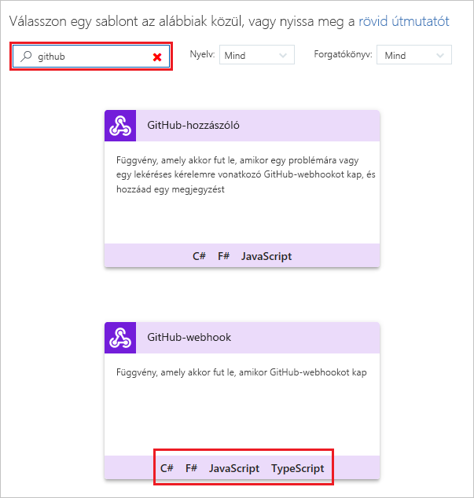
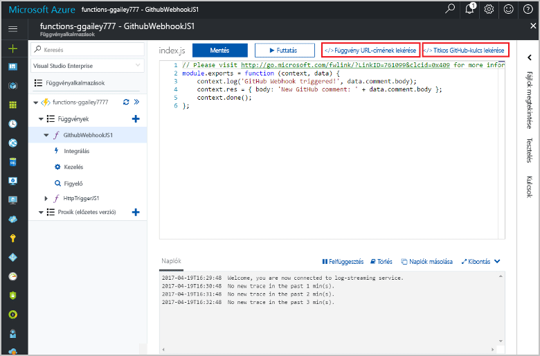
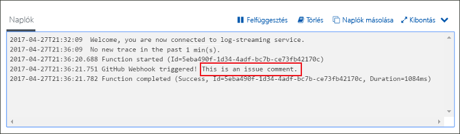

# GitHub-webhookok által meghívott függvények létrehozása

Ismerje meg, hogyan hozhat létre HTTP-webhookkérelem által meghívott függvényeket a GitHub hasznos adataival.

## Előfeltételek

+ Legalább egy projekttel rendelkező GitHub-fiók.
+ Azure-előfizetés. Ha még nincs előfizetése, hozzon létre egy [ingyenes fiókot](https://azure.microsoft.com/free/?WT.mc_id=A261C142F), mielőtt hozzákezd.

[!INCLUDE [functions-portal-favorite-function-apps](../../includes/functions-portal-favorite-function-apps.md)]

## Azure-függvényalkalmazás létrehozása

[!INCLUDE [Create function app Azure portal](../../includes/functions-create-function-app-portal.md)]

Ezután létrehozhat egy függvényt az új függvényalkalmazásban.

## GitHub-webhook által aktivált függvény létrehozása

1. Bontsa ki a függvényalkalmazást, és kattintson a **Függvények** elem melletti **+** gombra. Ha ez az első függvény a függvényalkalmazásban, jelölje ki az **Egyéni függvény** lehetőséget. Ez megjeleníti a függvénysablonok teljes készletét.

    

2. Kattintson a kívánt nyelvhez tartozó **GitHub WebHook**-sablonra. **Nevezze el a függvényt**, majd kattintson a **Létrehozás** elemre.

      

3. Az új függvényben kattintson a **</> Függvény URL-címének lekérése** elemre, majd másolja és mentse az értékeket. Járjon el ugyanígy a **</> GitHub-titok lekérése** esetében. Ezekre az értékekre a GitHub-webhook konfigurálásához lesz szükség.

    

A következő lépésben egy webhookot hoz létre a GitHub-tárban.

## A webhook konfigurálása

1. A GitHubban lépjen a tulajdonában álló adattárra. Használhat bármely elágaztatott adattárat is. Ha elágazásra van szüksége egy tárház esetében, tekintse át a következőt: <https://github.com/Azure-Samples/functions-quickstart>.

1. Kattintson a **Settings** (Beállítások), majd a **Webhooks** (Webhookok) és végül az **Add webhook** (Webhook hozzáadása) elemre.

    

1. Használja a táblázatban megadott beállításokat, majd kattintson az **Add webhook** (Webhook hozzáadása) elemre.

    

| Beállítás | Ajánlott érték | Leírás |
|---|---|---|
| **Hasznos adat URL-címe** | Másolt érték | Használja a **</> Függvény URL-címének lekérése** által visszaadott értéket. |
| **Titkos kód**   | Másolt érték | Használja a **</> GitHub-titok lekérése** által visszaadott értéket. |
| **Tartalom típusa** | application/json | A függvény JSON hasznos adatot vár. |
| Eseményindítók | Én szeretném kiválasztani az egyes eseményeket | Csak a problémákra vonatkozó megjegyzésekhez szeretnénk eseményindítókat használni.  |
| | Probléma megjegyzése |  |

Most a webhook arra van beállítva, hogy elindítsa a függvényt egy új, problémához fűzött megjegyzés hozzáadásakor.

## A függvény tesztelése

1. A GitHub-tárban nyissa meg az **Issues** (Problémák) lapot egy új böngészőablakban.

1. Az új ablakban kattintson a **New Issue** (Új probléma) elemre, adjon meg egy címet, és kattintson a **Submit new issue** (Új probléma küldése) gombra.

1. A problémában írjon be egy megjegyzést, majd kattintson a **Comment** (Megjegyzés) elemre.

    

1. Lépjen vissza a portálra, és tekintse át a naplókat. A nyomkövetési bejegyzésnek kell megjelennie az új megjegyzés szövegével.

     

## Az erőforrások eltávolítása

[!INCLUDE [Next steps note](../../includes/functions-quickstart-cleanup.md)]

## Következő lépések

Létrehozott egy függvényt, amely akkor fut, amikor kérelem érkezik egy GitHub-webhookból.

[!INCLUDE [Next steps note](../../includes/functions-quickstart-next-steps.md)]

További információt a webhook-eseményindítókról az [Azure Functions – HTTP- és webhookkötések](functions-bindings-http-webhook.md) című témakörben talál.
