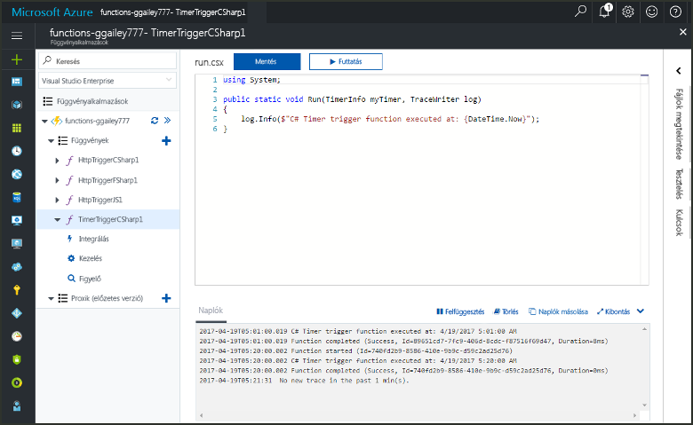
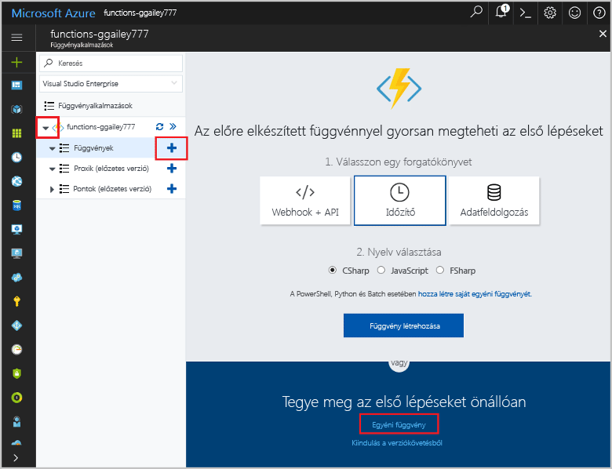
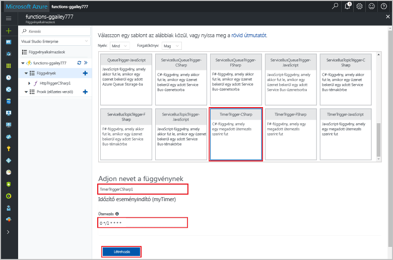
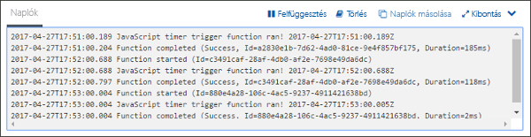
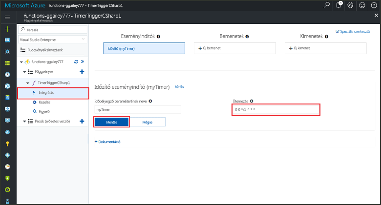

# Időzítő által aktivált függvény létrehozása az Azure-ban

Tekintse át, hogyan használhatja az Azure Functions szolgáltatást olyan függvény létrehozására, amely az Ön által meghatározott ütemezés alapján fut.

## Előfeltételek

Az oktatóanyag elvégzéséhez:

+ Ha nem rendelkezik Azure-előfizetéssel, mindössze néhány perc alatt létrehozhat egy [ingyenes fiókot](https://azure.microsoft.com/free/?WT.mc_id=A261C142F) a virtuális gép létrehozásának megkezdése előtt.

[!INCLUDE [functions-portal-favorite-function-apps](../../includes/functions-portal-favorite-function-apps.md)]

## Azure-függvényalkalmazás létrehozása

[!INCLUDE [Create function app Azure portal](../../includes/functions-create-function-app-portal.md)]

Ezután létrehozhat egy függvényt az új függvényalkalmazásban.

## Időzítő által aktivált függvény létrehozása

1. Bontsa ki a függvényalkalmazást, és kattintson a **Függvények** elem melletti **+** gombra. Ha ez az első függvény a függvényalkalmazásban, jelölje ki az **Egyéni függvény** lehetőséget. Ez megjeleníti a függvénysablonok teljes készletét.

    

2. Kattintson a kívánt nyelvhez tartozó **TimerTrigger** sablonra. Ezt követően használja a táblázatban megadott beállításokat:

    

    | Beállítás | Ajánlott érték | Leírás |
    |---|---|---|
    | **A függvény neve** | TimerTriggerCSharp1 | Az időzítő által aktivált függvény nevét adja meg. |
    | **[Ütemezés](http://en.wikipedia.org/wiki/Cron#CRON_expression)** | 0 \*/1 \* \* \* \* | Hat mezőből álló [CRON-kifejezés](http://en.wikipedia.org/wiki/Cron#CRON_expression), amely úgy ütemezi a függvényt, hogy minden percben fusson. |

2. Kattintson a **Létrehozás** gombra. Létrejön egy függvény a választott nyelven, amely minden percben futni fog.

3. Ellenőrizze a végrehajtást a naplókban gyűjtött nyomkövetési adatok áttekintésével.

    

Most módosíthatja a függvény ütemezését, hogy ritkábban, például óránként egyszer fusson. 

## Az időzítő ütemezésének módosítása

1. Bontsa ki a függvényt, és kattintson az **Integráció** elemre. Itt határozhatja meg a függvény bemeneti és kimeneti kötéseit, és itt állíthatja be az ütemezést is. 

2. Adja meg az új `0 0 */1 * * *` értéket az **Ütemezés** beállításnál, és kattintson a **Mentés** gombra.  

A függvény ezután óránként egyszer fog futni. 

## Az erőforrások eltávolítása

[!INCLUDE [Next steps note](../../includes/functions-quickstart-cleanup.md)]

## Következő lépések

Létrehozott egy ütemezés alapján futó függvényt.

[!INCLUDE [Next steps note](../../includes/functions-quickstart-next-steps.md)]

További információ az időzítési eseményindítóktól: [A kódvégrehajtás ütemezése az Azure Functions szolgáltatásban](functions-bindings-timer.md).