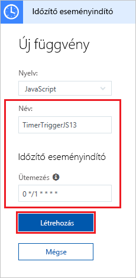

# Időzítő által aktivált függvény létrehozása az Azure-ban

Learn how to use Azure Functions to create a [serverless](https://azure.microsoft.com/solutions/serverless/) function that runs based on a schedule that you define.

## Előfeltételek

Az oktatóanyag elvégzéséhez:

+ Ha nem rendelkezik Azure-előfizetéssel, mindössze néhány perc alatt létrehozhat egy [ingyenes fiókot](https://azure.microsoft.com/free/?WT.mc_id=A261C142F) a virtuális gép létrehozásának megkezdése előtt.

## Azure-függvényalkalmazás létrehozása

[!INCLUDE [Create function app Azure portal](../../includes/functions-create-function-app-portal.md)]

Ezután létrehozhat egy függvényt az új függvényalkalmazásban.

## Időzítő által aktivált függvény létrehozása

1. Bontsa ki a függvényalkalmazást, és kattintson a **Függvények** elem melletti **+** gombra. Ha ez az első függvény a függvényalkalmazásban, válassza a **Portálba épített**, majd a **Folytatás** lehetőséget. Otherwise, go to step 3.

   

2. Válassza ki a **További sablonok**, majd a **Befejezés és sablonok megtekintése** lehetőséget.

    

3. In the search field, type `timer` and configure the new trigger with the settings as specified in the table below the image.

    

    | Beállítás | Ajánlott érték | Leírás |
    |---|---|---|
    | **Name (Név)** | Alapértelmezett | Az időzítő által aktivált függvény nevét adja meg. |
    | **Ütemezés** | 0 \*/1 \* \* \* \* | Hat mezőből álló [CRON-kifejezés](functions-bindings-timer.md#ncrontab-expressions), amely úgy ütemezi a függvényt, hogy minden percben fusson. |

4. Kattintson a  **Create** (Létrehozás) gombra. Létrejön egy függvény a választott nyelven, amely minden percben futni fog.

5. Ellenőrizze a végrehajtást a naplókban gyűjtött nyomkövetési adatok áttekintésével.

    

Most módosíthatja a függvény ütemezését, hogy ne percenként, hanem óránként egyszer fusson.

## Az időzítő ütemezésének módosítása

1. Bontsa ki a függvényt, és kattintson az **Integráció** elemre. Itt határozhatja meg a függvény bemeneti és kimeneti kötéseit, és itt állíthatja be az ütemezést is. 

2. Adja meg az új `0 0 */1 * * *` értéket az óránkénti **Ütemezés** beállításnál, és kattintson a **Mentés** elemre.  

A függvény ezután óránként egyszer fog futni. 

## Az erőforrások eltávolítása

[!INCLUDE [Next steps note](../../includes/functions-quickstart-cleanup.md)]

## Következő lépések

Létrehozott egy ütemezés alapján futó függvényt. For more information about timer triggers, see [Schedule code execution with Azure Functions](functions-bindings-timer.md).

[!INCLUDE [Next steps note](../../includes/functions-quickstart-next-steps.md)]
