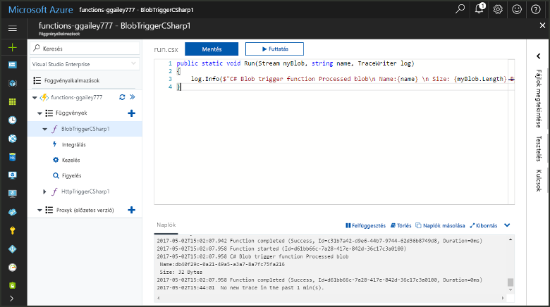
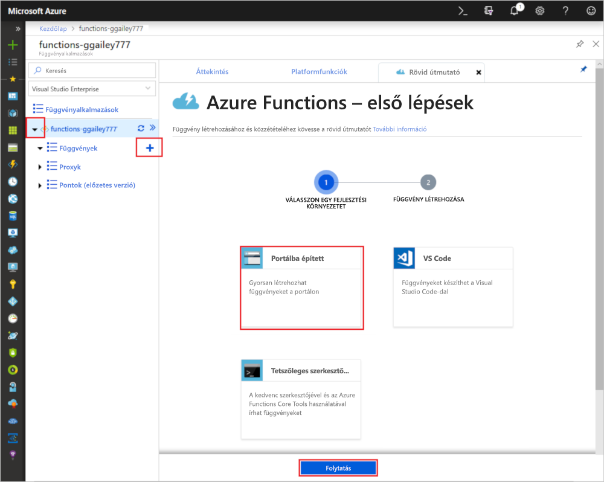
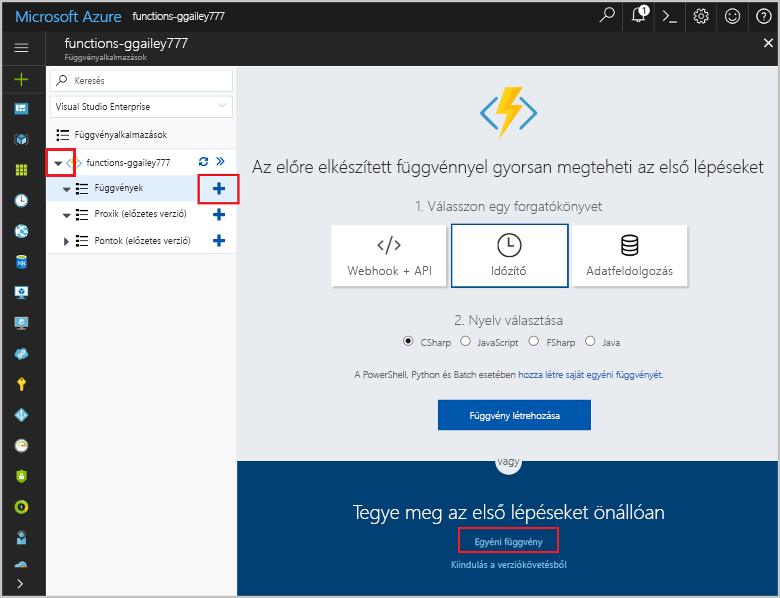
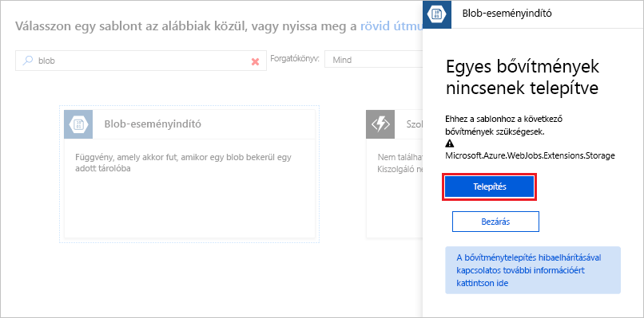
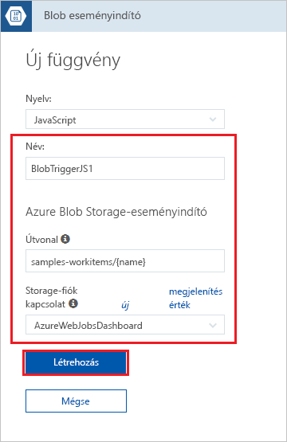
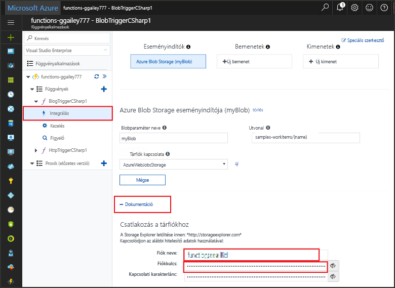
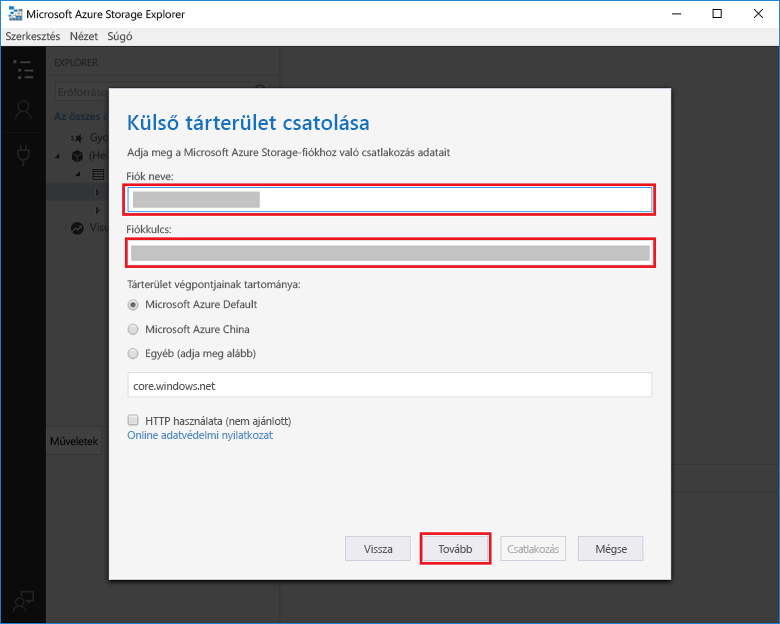
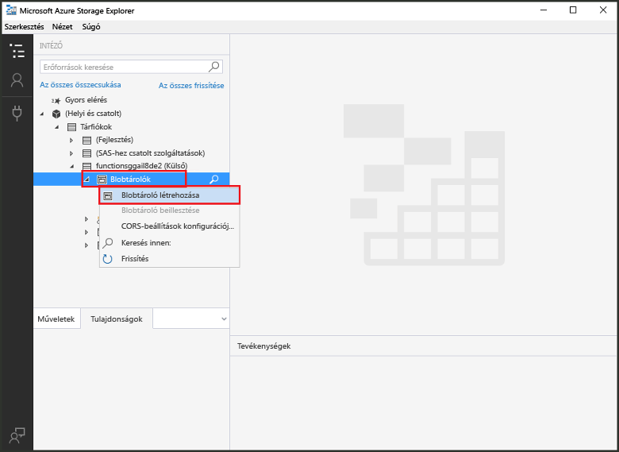
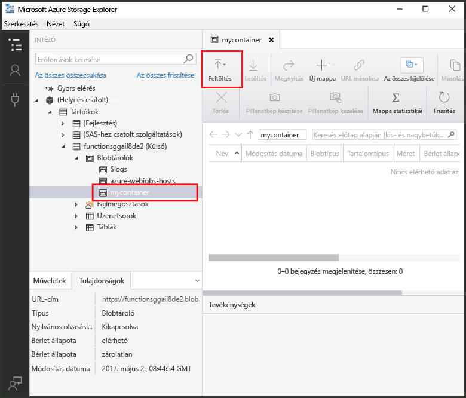
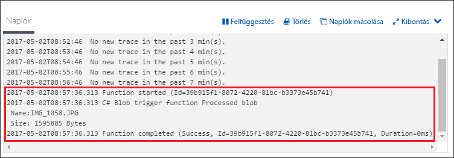

# Azure Blob-tároló által aktivált függvény létrehozása

Ismerje meg, hogyan hozhat létre olyan függvényt, amelyet az Azure Blob-tárolóba történő fájlfeltöltés vagy az ott található fájlok frissítése aktivál.

## Előfeltételek

+ A [Microsoft Azure Storage Explorer](http://storageexplorer.com/) letöltése és telepítése.
+ Azure-előfizetés. Ha még nincs előfizetése, hozzon létre egy [ingyenes fiókot](https://azure.microsoft.com/free/?WT.mc_id=A261C142F), mielőtt hozzákezd.

## Azure-függvényalkalmazás létrehozása

[!INCLUDE [Create function app Azure portal](../../includes/functions-create-function-app-portal.md)]

Ezután létrehozhat egy függvényt az új függvényalkalmazásban.

## A blobtároló által aktivált függvény létrehozása

1. Bontsa ki a függvényalkalmazást, és kattintson a **Függvények** elem melletti **+** gombra. Ha ez az első függvény a függvényalkalmazásban, válassza a **Portálba épített**, majd a **Folytatás** lehetőséget. Ha nem ez az első, folytassa a harmadik lépéssel.

   

1. Válassza ki a **További sablonok**, majd a **Befejezés és sablonok megtekintése** lehetőséget.

    

1. A keresőmezőbe írja be a `blob` kifejezést, majd válassza ki a **Blobalapú eseményindító** sablont.

1. Ha a rendszer kéri, válassza a **Telepítés** lehetőséget az Azure Storage-bővítmény és a függvényalkalmazáson belüli függőségek telepítéséhez. A telepítést követően válassza a **Folytatás** gombot.

    

1. Használja az ábra alatti táblázatban megadott beállításokat.

    

    | Beállítás | Ajánlott érték | Leírás |
    |---|---|---|
    | **Name (Név)** | Egyedi a függvényalkalmazásban | A blob által aktivált függvény neve. |
    | **Elérési út**   | samples-workitems/{name}    | A figyelt blobtárolóban található hely. A blob fájlneve a kötésben adható át a _name_ paraméterrel.  |
    | **Tárfiók kapcsolata** | AzureWebJobsStorage | Választhatja a függvényalkalmazás által már használt tárfiókkapcsolatot, vagy létrehozhat egy újat.  |

1. Kattintson a **Létrehozás** elemre a függvény létrehozásához.

Ezután csatlakozzon az Azure Storage-fiókjához, és hozza létre a **samples-workitems** tárolót.

## A tároló létrehozása

1. A függvényben kattintson az **Integráció** elemre, bontsa ki a **Dokumentáció** elemet, és másolja a **Fiók neve** és a **Fiók kulcsa** értéket. Ezekkel a hitelesítő adatokkal csatlakozhat a tárfiókhoz. Ha már csatlakozott a tárfiókjához, folytassa a 4. lépéssel.

    

1. Futtassa a [Microsoft Azure Storage Explorer](http://storageexplorer.com/) eszközt, kattintson a bal oldalon található csatlakozási ikonra, válassza a **Tárfiók nevének és kulcsának használata** lehetőséget, és kattintson a **Tovább** gombra.

    

1. Adja meg az 1. lépésben megállapított **Fiók neve** és **Fiók kulcsa** értéket, és kattintson a **Tovább**, majd a **Csatlakozás** gombra. 

    

1. Bontsa ki a csatolt tárfiókot, kattintson a jobb gombbal a **Blobtárolók** elemre, kattintson a **Blobtároló létrehozása** elemre, írja be a `samples-workitems` értéket, és nyomja meg az Enter billentyűt.

    

A blobtároló létrehozása után tesztelheti a függvényt úgy, hogy feltölt egy fájlt a tárolóba.

## A függvény tesztelése

1. Térjen vissza az Azure Portalra, keresse meg a függvényt, bontsa ki a **Naplók** elemet a lap alján, és győződjön meg arról, hogy a naplózási adatfolyam nincs leállítva.

1. A Storage Explorerben bontsa ki a tárfiókját, a **Blobtárolók** elemet és a **samples-workitems** tárolót. Kattintson a **Feltöltés**, majd a **Fájlok feltöltése...** elemre.

    

1. A **Fájlok feltöltése** párbeszédpanelen kattintson a **Fájlok** mezőre. Válasszon egy fájlt a helyi számítógépen, például egy képfájlt, jelölje ki, és kattintson a **Megnyitás**, majd a **Feltöltés** elemre.

1. Lépjen vissza a függvény naplóihoz, és győződjön meg arról, hogy megtörtént a blob olvasása.

   

    >[!NOTE]
    > Amikor a függvényalkalmazás az alapértelmezett használatalapú csomagban fut, előfordulhat, hogy akár több is perc is eltelik a blob hozzáadása vagy frissítése és a függvény aktiválása között. Ha kis késleltetésre van szüksége a blob által aktivált függvényekhez, célszerű App Service-csomagban futtatnia a függvényalkalmazást.

## Az erőforrások eltávolítása

[!INCLUDE [Next steps note](../../includes/functions-quickstart-cleanup.md)]

## További lépések

Létrehozott egy függvényt, amely akkor fut, amikor blob felvétele vagy frissítése történik a blobtárolóban. 

[!INCLUDE [Next steps note](../../includes/functions-quickstart-next-steps.md)]

További információ a blobtároló eseményindítóiról: [Azure Functions – a blobtároló kötései](functions-bindings-storage-blob.md).
