# Azure Storage-üzenetsor által aktivált függvény létrehozása

Megtudhatja, hogyan hozhat létre olyan függvényt, amely akkor aktiválódik, amikor üzeneteket küldenek egy Azure Storage-üzenetsorba.

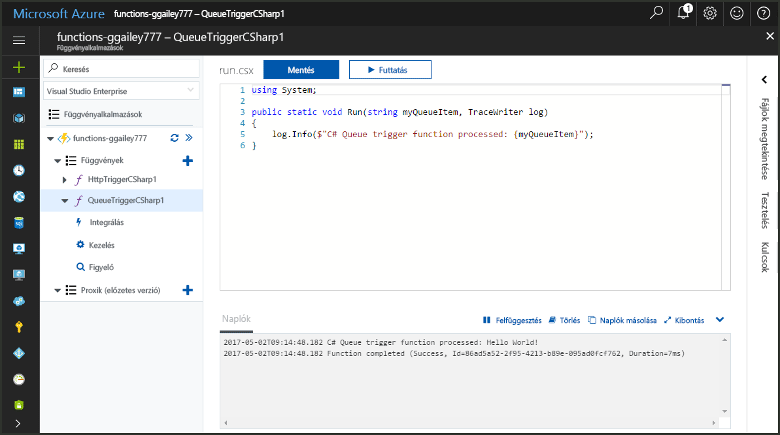

## Előfeltételek

- A [Microsoft Azure Storage Explorer](http://storageexplorer.com/) letöltése és telepítése.

- Azure-előfizetés. Ha még nincs előfizetése, hozzon létre egy [ingyenes fiókot](https://azure.microsoft.com/free/?WT.mc_id=A261C142F), mielőtt hozzákezd.

## Azure-függvényalkalmazás létrehozása

[!INCLUDE [Create function app Azure portal](../../includes/functions-create-function-app-portal.md)]

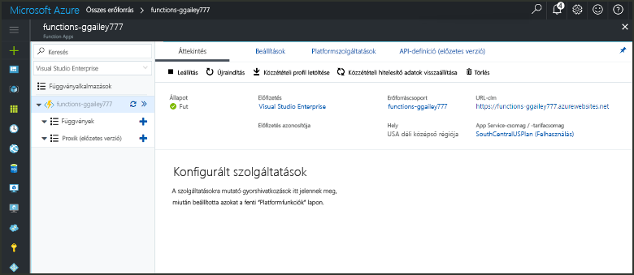

Ezután létrehozhat egy függvényt az új függvényalkalmazásban.

## Üzenetsor által aktivált függvény létrehozása

1. Bontsa ki a függvényalkalmazást, és kattintson a **Függvények** elem melletti **+** gombra. Ha ez az első függvény a függvényalkalmazásban, válassza a **Portálba épített**, majd a **Folytatás** lehetőséget. Ha nem ez az első, folytassa a harmadik lépéssel.

   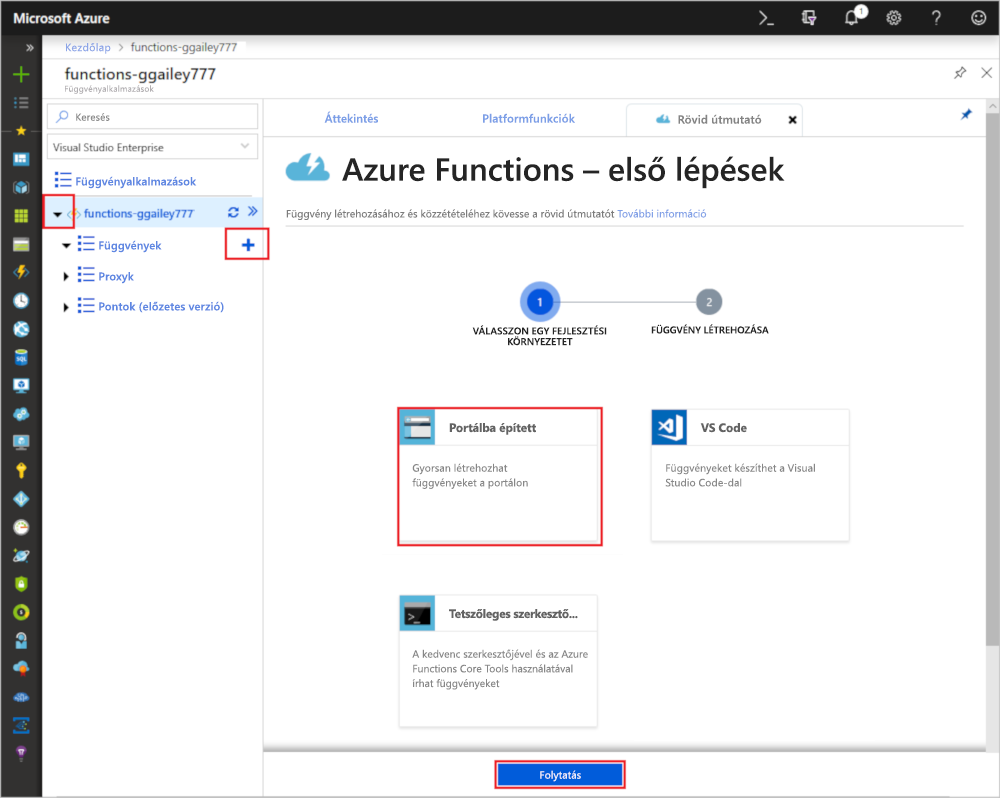

1. Válassza ki a **További sablonok**, majd a **Befejezés és sablonok megtekintése** lehetőséget.

    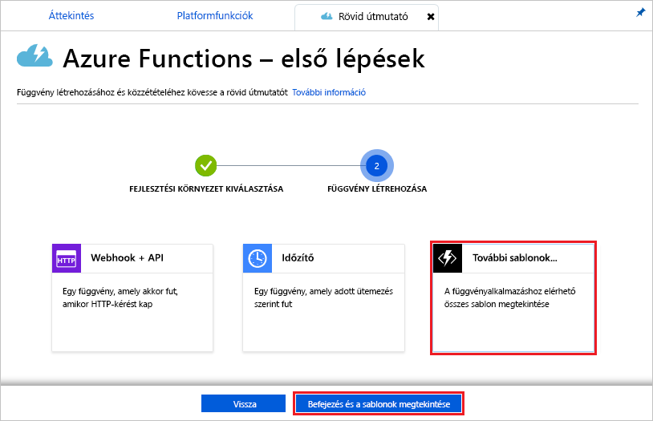

1. A keresőmezőbe írja be a `queue` kifejezést, majd válassza ki a **Várólista-eseményindító** sablont.

1. Ha a rendszer kéri, válassza a **Telepítés** lehetőséget az Azure Storage-bővítmény és a függvényalkalmazáson belüli függőségek telepítéséhez. A telepítést követően válassza a **Folytatás** gombot.

    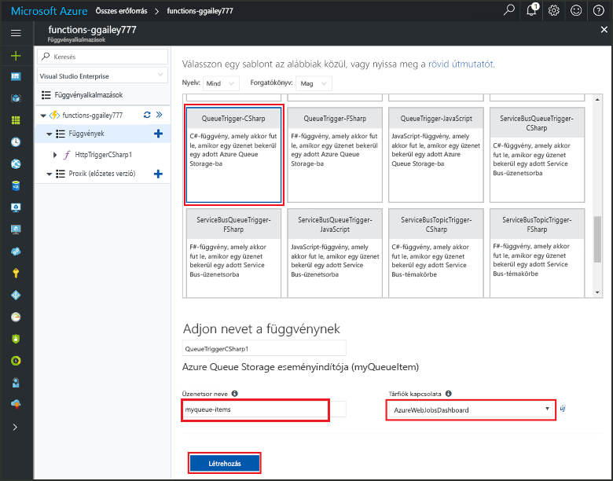

1. Használja az ábra alatti táblázatban megadott beállításokat.

    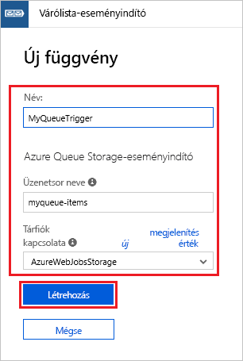

    | Beállítás | Ajánlott érték | Leírás |
    |---|---|---|
    | **Name (Név)** | Egyedi a függvényalkalmazásban | Az üzenetsor által aktivált függvény neve. |
    | **Üzenetsor neve**   | myqueue-items    | A tárfiókhoz csatlakoztatni kívánt üzenetsor neve. |
    | **Tárfiók kapcsolata** | AzureWebJobStorage | Választhatja a függvényalkalmazás által már használt tárfiókkapcsolatot, vagy létrehozhat egy újat.  |    

1. Kattintson a **Létrehozás** elemre a függvény létrehozásához.

Ezután csatlakozzon az Azure Storage-fiókjához, és hozza létre a **myqueue-items** tárolót.

## Az üzenetsor létrehozása

1. A függvényben kattintson az **Integráció** elemre, bontsa ki a **Dokumentáció** elemet, és másolja a **Fiók neve** és a **Fiók kulcsa** értéket. Ezekkel a hitelesítő adatokkal csatlakozhat a tárfiókhoz az Azure Storage Explorerben. Ha már csatlakozott a tárfiókjához, folytassa a 4. lépéssel.

    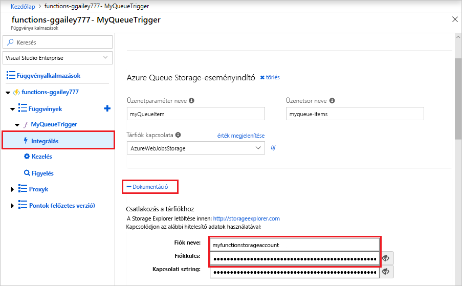

1. Futtassa a [Microsoft Azure Storage Explorer](http://storageexplorer.com/) eszközt, kattintson a bal oldalon található csatlakozási ikonra, válassza a **Tárfiók nevének és kulcsának használata** lehetőséget, és kattintson a **Tovább** gombra.

    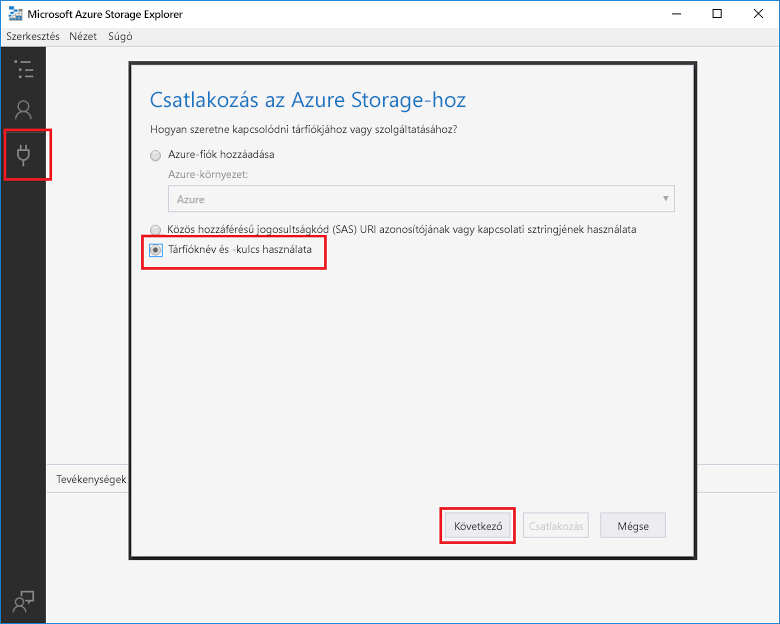

1. Adja meg az 1. lépésben megállapított **Fiók neve** és **Fiók kulcsa** értéket, és kattintson a **Tovább**, majd a **Csatlakozás** gombra.

    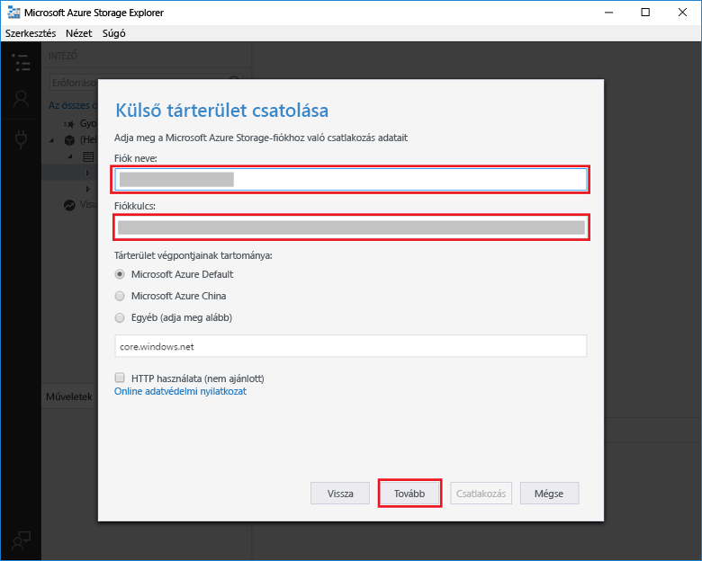

1. Bontsa ki a csatolt tárfiókot, kattintson a jobb gombbal az **Üzenetsorok** elemre, kattintson az **Üzenetsor létrehozása** elemre, írja be a `myqueue-items` értéket, és nyomja meg az Enter billentyűt.

    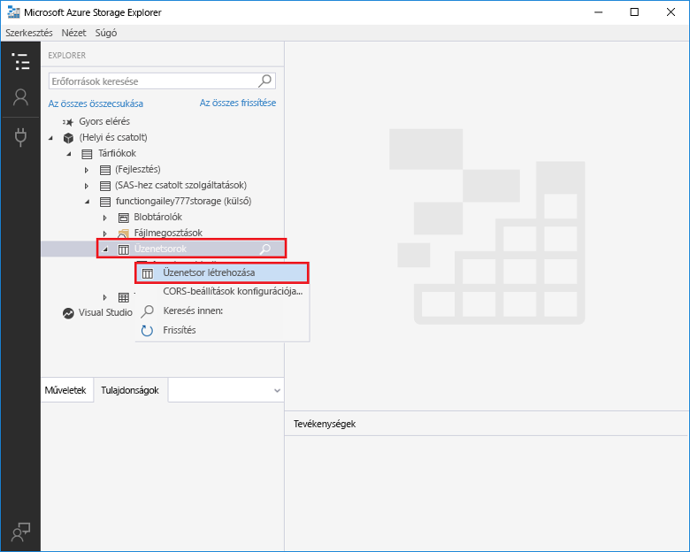

Az üzenetsor létrehozása után tesztelheti a függvényt úgy, hogy felvesz egy üzenetet az üzenetsorba.

## A függvény tesztelése

1. Térjen vissza az Azure Portalra, keresse meg a függvényt, bontsa ki a **Naplók** elemet a lap alján, és győződjön meg arról, hogy a naplózási adatfolyam nincs leállítva.

1. A Storage Explorerben bontsa ki a tárfiókot, az **Üzenetsorok**, majd az **üzenetsorelemek** elemet, és kattintson az **Üzenet hozzáadása** elemre.

    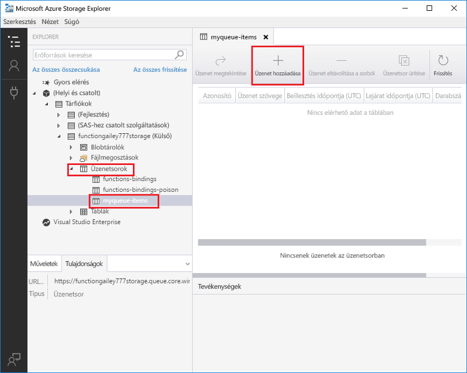

1. Írja be a „Hello World!” üzenetet az **Üzenet szövege** mezőbe, és kattintson az **OK** gombra.

1. Várjon néhány másodpercet, majd térjen vissza a függvény naplóihoz, és győződjön meg arról, hogy megtörtént az új üzenet olvasása az üzenetsorból.

    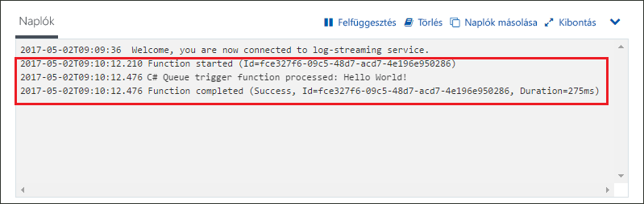

1. Térjen vissza a Storage Explorerbe, kattintson a **Frissítés** elemre, és ellenőrizze, hogy megtörtént-e az üzenet feldolgozása, és hogy el lett-e távolítva az üzenetsorból.

## Az erőforrások eltávolítása

[!INCLUDE [Next steps note](../../includes/functions-quickstart-cleanup.md)]

## További lépések

Létrehozott egy függvényt, amely akkor fut, amikor üzenet felvétele történik a tárolási üzenetsorba.

[!INCLUDE [Next steps note](../../includes/functions-quickstart-next-steps.md)]

További információ a tárolási üzenetsor eseményindítóiról: [Azure Functions – a tárolási üzenetsor kötései](functions-bindings-storage-queue.md).
