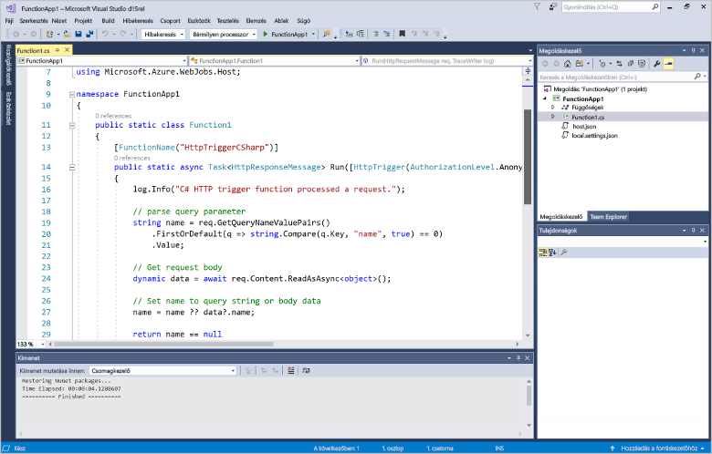
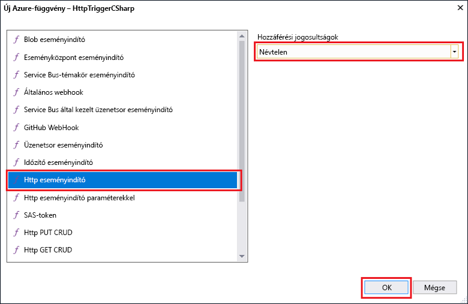
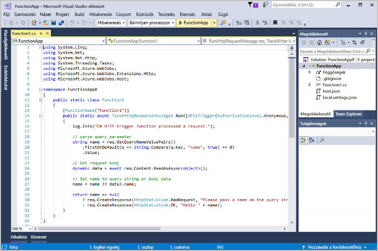
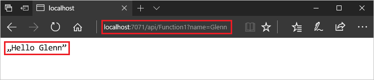

# Az első függvény létrehozása a Visual Studio használatával

Az Azure Functions lehetővé teszi a kód [kiszolgáló nélküli](https://azure.microsoft.com/overview/serverless-computing/) környezetben történő végrehajtását anélkül, hogy először létre kellene hoznia egy virtuális gépet, vagy közzé kellene tennie egy webalkalmazást.

Ebből a témakörből megtudhatja, hogy az Azure Functions Visual Studio 2017-es eszközei használatával miként hozhat létre és tesztelhet helyileg egy „Helló világ!”-függvényt. Ezután közzéteheti a függvénykódot az Azure-ban. Ezek az eszközök a Visual Studio 2017 15.3-as és újabb verziójában található Azure-fejlesztési számítási feladat részeként érhetők el.

Igény szerint [megtekintheti a videót](#watch-the-video) is.

## Előfeltételek

Az oktatóanyag elvégzéséhez a következőkre lesz szüksége:

* A [Visual Studio 2017 15.4-es](https://www.visualstudio.com/vs/) vagy azt követő verziója, amely tartalmazza az **Azure-fejlesztési** számítási feladatot is.

    
    
[!INCLUDE [quickstarts-free-trial-note](../../includes/quickstarts-free-trial-note.md)] 

## Hozzon létre egy Azure Functions-projektet a Visual Studióban

[!INCLUDE [Create a project using the Azure Functions template](../../includes/functions-vstools-create.md)]

Most, hogy már létrehozta a projektet, hozza létre első függvényét.

## A függvény létrehozása

1. A **Solution Explorer** (Megoldáskezelő) felületén kattintson a jobb gombbal a projektcsomópontra, majd válassza az **Add** (Hozzáadás)  > **New Item** (Új elem) lehetőséget. Válassza ki az **Azure Function** (Azure-függvény) elemet, adja meg a `HttpTriggerCSharp.cs` nevet a **Name** (Név) mezőben, majd kattintson az **Add** (Hozzáadás) elemre.

2. Válassza ki a **HttpTrigger** elemet, az **Access Rights** (Hozzáférési jog) lehetőségnél válassza az **Anonymous** (Névtelen) elemet, majd kattintson az **OK** gombra. A létrehozott függvény HTTP-kéréssel bármely ügyfél részéről hozzáférhető. 

    

    A rendszer egy kódfájlt ad a projekthez, amely a függvény kódját implementáló osztályt tartalmazza. A kód egy sablonon alapul, amely egy névértéket kap, majd azt továbbítja. A **FunctionName** attribútum a függvény nevét adja meg. A **HttpTrigger** attribútum a függvényt aktiváló üzenetet jelöli. 

    

Most, hogy már létrehozta a HTTP-triggerrel aktivált függvényt, tesztelheti a helyi számítógépen.

## A függvény helyi tesztelése

Az Azure Functions Core Tools lehetővé teszi Azure Functions-projektek helyi fejlesztői számítógépen való futtatását. Amikor a Visual Studióból először indít el egy függvényt, a rendszer arra kéri, hogy telepítse ezeket az eszközöket.  

1. A függvény teszteléséhez nyomja le az F5 billentyűt. Ha a rendszer kéri, fogadja el a Visual Studio kérését az Azure Functions Core (CLI) eszközök telepítéséhez.  Lehet, hogy egy tűzfalkivételt is engedélyeznie kell, hogy az eszközök kezelhessék a HTTP-kéréseket.

2. Másolja a függvény URL-címét az Azure-függvény futtatókörnyezetéből.  

    

3. Illessze be a HTTP-kérelem URL-címét a böngésző címsorába. Az URL-címhez fűzze hozzá a `?name=<yourname>` lekérdezési karakterláncot, és hajtsa végre a kérelmet. Az alábbiakban látható a böngészőben a helyi GET kérelemre a függvény által visszaadott válasz: 

    

4. A hibakeresés leállításához kattintson a **Stop** (Leállítás) gombra a Visual Studio eszköztárában.

Miután ellenőrizte, hogy a függvény megfelelően fut a helyi számítógépen, tegye közzé a projektet az Azure-ban.

## A projekt közzététele az Azure-ban

A projekt közzétételéhez rendelkeznie kell egy függvényalkalmazással.az Azure-előfizetéséhez. Közvetlenül a Visual Studióból is létrehozhat függvényalkalmazást.

[!INCLUDE [Publish the project to Azure](../../includes/functions-vstools-publish.md)]

## A függvény tesztelése az Azure-ban

1. Másolja a függvényalkalmazás alap URL-címét a Publish (Közzététel) profiloldalról. Cserélje ki a függvény helyi tesztelésekor használt `localhost:port` URL-címrészt az új alap URL-címmel. Ahogyan korábban, most is az URL-címhez fűzze hozzá a `?name=<yourname>` lekérdezési sztringet, és hajtsa végre a kérelmet.

    A HTTP-triggert használó függvényt meghívó URL-cím így néz ki:

        http://<functionappname>.azurewebsites.net/api/<functionname>?name=<yourname> 

2. Illessze be a HTTP-kérelem új URL-címét a böngésző címsorába. Az alábbiakban látható a böngészőben a távoli GET kérelemre a függvény által visszaadott válasz: 

    

## Videó megtekintése

> [!VIDEO https://www.youtube-nocookie.com/embed/DrhG-Rdm80k]

## Következő lépések

A Visual Studio segítéségével létrehozott egy egyszerű, HTTP-triggerrel aktivált függvényt tartalmazó C#-függvényalkalmazást. 

+ A projekt más típusú eseményindítók és kötések támogatására történő konfigurálásával az [Azure Functions Tools for Visual Studio](functions-develop-vs.md) [projekt helyi fejlesztésekhez való konfigurálásával](functions-develop-vs.md#configure-the-project-for-local-development) kapcsolatos szakaszában ismerkedhet meg.
+ További információ az Azure Functions Core Tools használatával végzett helyi tesztelésről és hibakeresésről: [Code and test Azure Functions locally](functions-run-local.md) (Az Azure-függvények kódolása és helyi tesztelése). 
+ A függvények .NET-osztálytárakként való fejlesztéséről további információért lásd [a .NET-osztálytárak és az Azure Functions használatát](functions-dotnet-class-library.md) ismertető cikket. 

