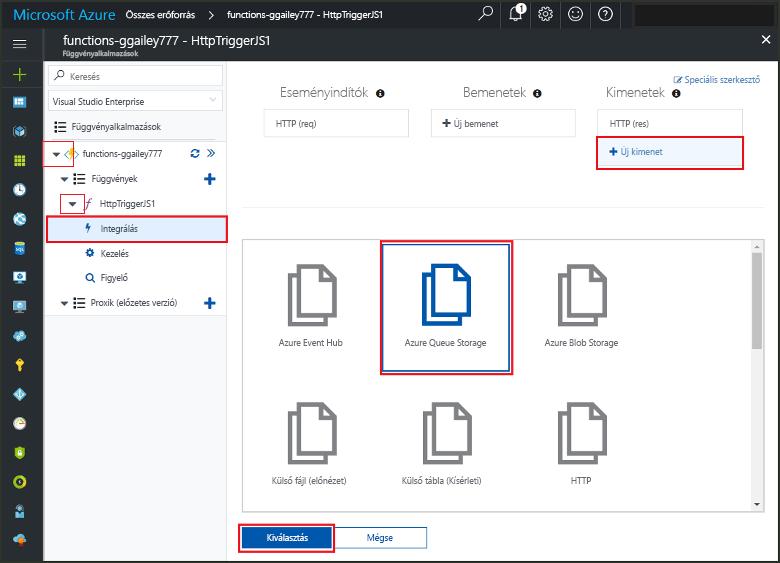
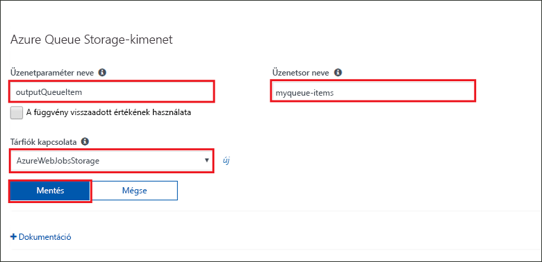
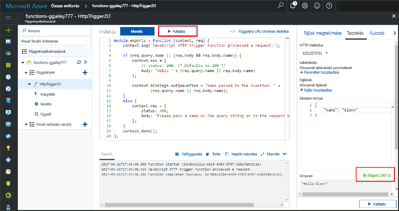
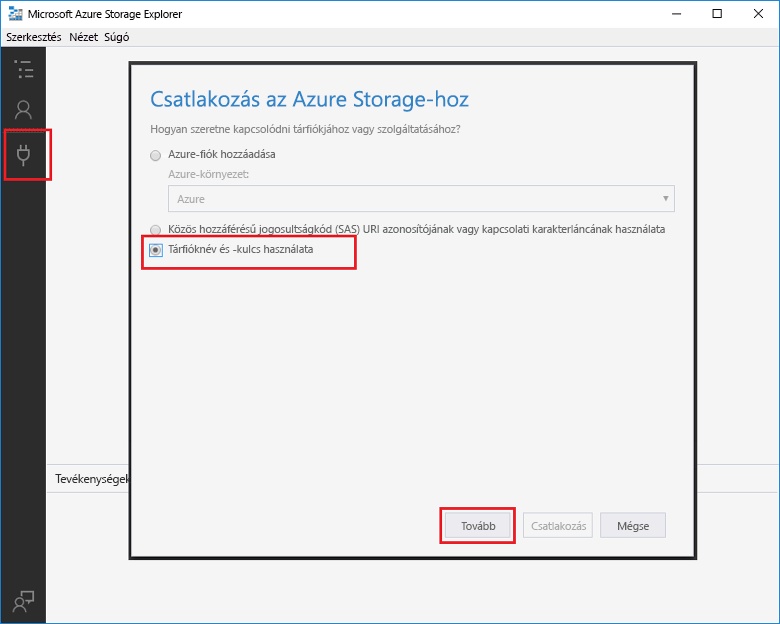
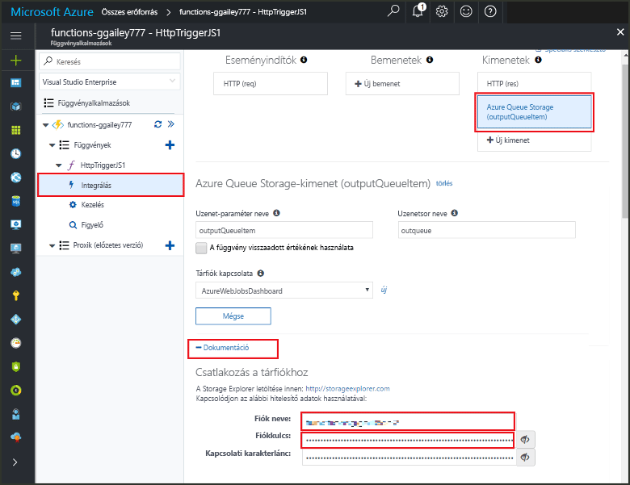
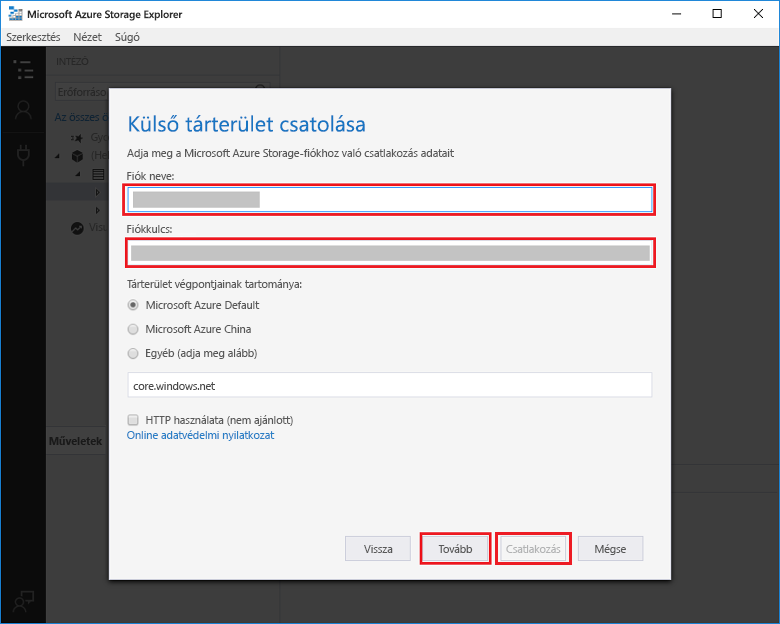

# <a name="add-messages-to-an-azure-storage-queue-using-functions"></a>Üzenetek hozzáadása az Azure Storage üzenetsorába a Functions szolgáltatás használatával

Az Azure Functions bemeneti és kimeneti kötései deklaratív módszert biztosítanak ahhoz, hogy a külső szolgáltatások adatai hozzáférhetők legyenek a kód számára. Ebben a rövid útmutatóban kimeneti kötés használatával hoz létre üzenetsori üzenetet, ha a függvény meghívása HTTP-kérelemmel történik. A függvény által létrehozott üzenetsori üzenetek megtekintéséhez az Azure Storage Explorert fogja használni:


## <a name="prerequisites"></a>Előfeltételek 

A gyorsútmutató elvégzéséhez:

* Kövesse [Az első függvény Azure Portalon való létrehozását](functions-create-first-azure-function.md) ismertető cikk utasításait, és ne végezze el **Az erőforrások eltávolítása** lépést. Ez a rövid útmutató az itt használt függvényalkalmazást és függvényt hozza létre.

* Telepítse a [Microsoft Azure Storage Explorert](http://storageexplorer.com/). Ezt az eszközt fogja használni a kimeneti kötés által létrehozott üzenetsori üzenetek vizsgálatához.

## <a name="add-binding"></a>Kimeneti kötés hozzáadása

Ebben a szakaszban a portál felhasználói felületén fogja hozzáadni egy üzenetsor-tároló kimeneti kötését a korábban létrehozott függvényhez. Ez a kötés lehetővé teszi, hogy minimális méretű kód írásával hozhasson létre üzenetsori üzeneteket. Nem kell kódot írnia olyan feladatok elvégzéséhez, mint például egy tárolási kapcsolat megnyitása, egy üzenetsor létrehozása vagy egy üzenetsor-hivatkozás beszerzése. Ezeket a feladatokat az Azure Functions futtatókörnyezete és üzenetsorának kimeneti kötése végzi el Ön helyett.

1. Az Azure Portalon nyissa meg [Az első függvény létrehozása az Azure Portalon](functions-create-first-azure-function.md) útmutatóban létrehozott függvényalkalmazás oldalát. Ehhez válassza a **Minden szolgáltatás > Függvényalkalmazások** lehetőséget, majd válassza ki a függvényalkalmazást.

2. Válassza ki a korábbi rövid útmutatóban létrehozott függvényt.

1. Válassza az **Integrálás > Új kimenet > Azure Queue Storage** lehetőséget.

1. Kattintson a **Kiválasztás** gombra.
    
    

3. Az **Azure Queue Storage-kimenet** területen használja a következő képernyőkép alatti táblázatban megadott beállításokat: 

    

    | Beállítás      |  Ajánlott érték   | Leírás                              |
    | ------------ |  ------- | -------------------------------------------------- |
    | **Üzenet-paraméter neve** | outputQueueItem | A kimeneti kötés paraméterének neve. | 
    | **Tárfiók kapcsolata** | AzureWebJobsStorage | Választhatja a függvényalkalmazás által már használt tárfiókkapcsolatot, vagy létrehozhat egy újat.  |
    | **Üzenetsor neve**   | outqueue    | A tárfiókhoz csatlakoztatni kívánt üzenetsor neve. |

4. Kattintson a **Mentés** gombra a kötés felvételéhez.
 
Miután meghatározta a kimeneti kötést, módosítania kell a kódot, hogy az a kötés használatával üzeneteket adjon hozzá az üzenetsorhoz.  

## <a name="add-code-that-uses-the-output-binding"></a>Kimeneti kötést használó kód hozzáadása

Ebben a szakaszban egy olyan kódot fog hozzáadni, amely a kimeneti üzenetsorba ír üzeneteket. Ez az üzenet tartalmazza az értéket, amelyet a HTTP-eseményindító a lekérdezési karakterláncban kap meg. Ha például a lekérdezési karakterlánc a `name=Azure` értéket tartalmazza, az üzenetsorban található üzenet a következő lesz: *A függvénynek átadott név: Azure*.

1. A függvényre kattintva jelenítse meg a szerkesztőben a függvénykódot. 

2. C#-függvények esetében ennek használatához adjon hozzá egy metódus-paramétert a kötéshez, és írja meg a kódot:

   Adjon hozzá egy **outputQueueItem** paramétert a metódus aláírásához, ahogy az alábbi példában is látható. A paraméter neve ugyanaz lesz, mint amit a kötés létrehozásakor az **Üzenet-paraméter neve** mezőben megadott.

   ```cs   
   public static async Task<HttpResponseMessage> Run(HttpRequestMessage req, 
       ICollector<string> outputQueueItem, TraceWriter log)
   {
       ...
   }
   ```

   A C#-függvény törzsében, a `return` utasítás előtt adja hozzá az üzenetsori üzenet létrehozására szolgáló paramétert használó kódot.

   ```cs
   outputQueueItem.Add("Name passed to the function: " + name);     
   ```

3. JavaScript-függvények esetében olyan kódot adjon hozzá, amely a `context.bindings` objektumon alkalmazza a kimeneti kötést az üzenetsori üzenetek létrehozásához. Ezt a kódot a `context.done` utasítás elé írja be.

   ```javascript
   context.bindings.outputQueueItem = "Name passed to the function: " + 
               (req.query.name || req.body.name);
   ```

4. A módosítások mentéséhez kattintson a **Mentés** elemre.
 
## <a name="test-the-function"></a>A függvény tesztelése 

1. A kód módosításainak mentése után kattintson a **Futtatás** elemre. 

    

   Figyelje meg, hogy a **Kérelem törzse** tartalmazza az *Azure* `name` értéket. Ez az érték jelenik meg a létrehozott üzenetsori üzenetben a függvény meghívásakor.

   A **Futtatás** lehetőség kiválasztása helyett egy URL-cím böngészőbe történő beírásával is meghívhatja a függvényt, ahol a lekérdezési karakterláncban adhatja meg a `name` értékét. A böngésző használatával végrehajtott módszert az [előző rövid útmutatóban](functions-create-first-azure-function.md#test-the-function) ismertettük.

2. A naplók ellenőrzésével győződjön meg arról, hogy sikeres volt a függvény futtatása. 

A Functions futtatókörnyezete egy **outqueue** nevű új üzenetsort hoz létre a tárfiókjában a kimeneti kötés első használatakor. Az üzenetsor és a benne lévő üzenet létrehozásának ellenőrzéséhez a Storage Explorert használhatja.

### <a name="connect-storage-explorer-to-your-account"></a>A Storage Explorer csatlakoztatása a fiókjához

Hagyja ki ezt a szakaszt, ha már telepítette és csatlakoztatta a Storage Explorert a jelen rövid útmutató során használt tárfiókhoz.

2. Futtassa a [Microsoft Azure Storage Explorer](http://storageexplorer.com/) eszközt, kattintson a bal oldalon található csatlakozási ikonra, válassza ki a **Tárfiók nevének és kulcsának használata** lehetőséget, és kattintson a **Tovább** elemre.

    

1. Az Azure Portalon a függvényalkalmazás oldalán válassza ki a függvényt, majd válassza az **Integrálás** lehetőséget.

1. Válassza ki a korábbi lépésben hozzáadott **Azure Queue Storage** kimeneti kötést.

1. Bontsa ki az oldal alján található **Dokumentáció** szakaszt. 

   A portálon láthatók a hitelesítő adatok, amelyekkel csatlakozhat a tárfiókhoz a Storage Explorerben.

   

1. Másolja ki a **Fiók neve** értéket a portálról, és illessze be a Storage Explorer **Fiók neve** mezőjébe.
 
1. Az érték megjelenítéséhez kattintson a **Fiókkulcs** melletti megjelenítés/elrejtés ikonra, majd másolja ki a **Fiókkulcs** értékét, és illessze be a Storage Explorer **Fiókkulcs** mezőjébe.
  
3. Válassza a **Tovább > Kapcsolódás** lehetőséget.

   

### <a name="examine-the-output-queue"></a>A kimeneti üzenetsor vizsgálata

4. A Storage Explorerben válassza ki a jelen rövid útmutatóban használni kívánt tárfiókot.

1. Bontsa ki az **Üzenetsorok** csomópontot, majd válassza ki az **outqueue** nevű üzenetsort. 

   Az üzenetsor tartalmazza az üzenetet, amelyet az üzenetsor kimeneti kötése létrehozott a HTTP által aktivált függvény futtatásakor. Ha az alapértelmezett *Azure* `name` értékkel hívta meg a függvényt, az üzenetsorban található üzenet a következő lesz: *A függvénynek átadott név: Azure*.

    

2. Ha újból futtatja a függvényt, egy új üzenet jelenik meg az üzenetsorban.  

## <a name="clean-up-resources"></a>Az erőforrások eltávolítása

[!INCLUDE [Clean up resources](../../includes/functions-quickstart-cleanup.md)]

## <a name="next-steps"></a>További lépések

Ebben a rövid útmutatóban hozzáadott egy kimeneti kötést egy meglévő függvényhez. További információ a tárolási üzenetsor kötéséről: [Azure Functions – a tárolási üzenetsor kötései](functions-bindings-storage-queue.md). 

[!INCLUDE [Next steps note](../../includes/functions-quickstart-next-steps.md)]
