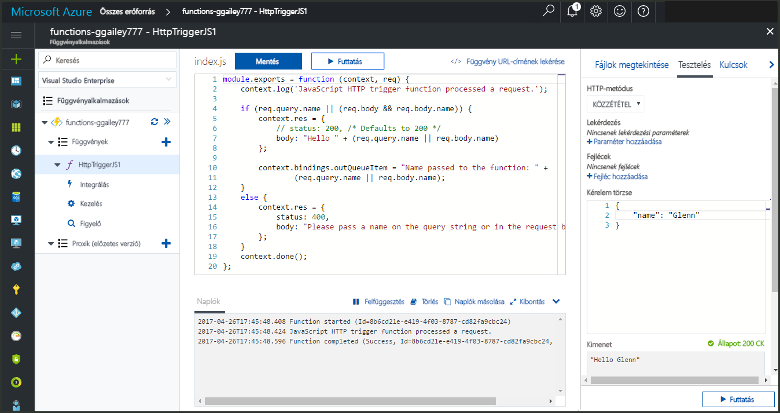

# <a name="add-messages-to-an-azure-storage-queue-using-functions"></a>Üzenetek hozzáadása az Azure Storage üzenetsorába a Functions szolgáltatás használatával

Az Azure Functions bemeneti és kimeneti kötései deklaratív módszert biztosítanak a külső szolgáltatások adataihoz a függvényből történő csatlakozásra. Ebben a témakörben megtudhatja, hogyan módosíthat egy meglévő függvényt egy kimeneti kötés hozzáadásával, amely üzeneteket küld az Azure üzenetsor-tárolójába.  



## <a name="prerequisites"></a>Előfeltételek 

[!INCLUDE [Previous topics](../../includes/functions-quickstart-previous-topics.md)]

* Telepítse a [Microsoft Azure Storage Explorert](http://storageexplorer.com/).

[!INCLUDE [functions-portal-favorite-function-apps](../../includes/functions-portal-favorite-function-apps.md)] 

## <a name="add-binding"></a>Kimeneti kötés hozzáadása
 
1. Bontsa ki a függvényalkalmazást és a függvényt.

2. Kattintson az **Integráció** és az **+ Új kimenet**, majd pedig az **Azure Queue Storage** és a **Kiválasztás** elemre.
    
    

3. Használja a táblázatban megadott beállításokat, majd kattintson a **Mentés** elemre: 

    

    | Beállítás      |  Ajánlott érték   | Leírás                              |
    | ------------ |  ------- | -------------------------------------------------- |
    | **Üzenetsor neve**   | myqueue-items    | A tárfiókhoz csatlakoztatni kívánt üzenetsor neve. |
    | **Tárfiók kapcsolata** | AzureWebJobStorage | Választhatja a függvényalkalmazás által már használt tárfiókkapcsolatot, vagy létrehozhat egy újat.  |
    | **Üzenet-paraméter neve** | outQueueItem | A kimeneti kötés paraméterének neve. | 

Miután meghatározta a kimeneti kötést, módosítania kell a kódot, hogy az a kötés használatával üzeneteket adjon hozzá az üzenetsorhoz.  

## <a name="update-the-function-code"></a>A függvénykód módosítása

1. A függvényre kattintva jelenítse meg a szerkesztőben a függvénykódot. 

2. C#-függvény esetében módosítsa a következők szerint a függvény definícióját, hogy felvegye az **outQueueItem** kötési paramétert. JavaScript-függvény esetében hagyja ki ezt a lépést.

    ```cs   
    public static async Task<HttpResponseMessage> Run(HttpRequestMessage req, 
        ICollector<string> outQueueItem, TraceWriter log)
    {
        ....
    }
    ```

3. Adja hozzá a következő kódot a függvényhez a metódus visszatérése előtt. A függvény nyelvének megfelelő kódrészletet használjon.

    ```javascript
    context.bindings.outQueueItem = "Name passed to the function: " + 
                (req.query.name || req.body.name);
    ```

    ```cs
    outQueueItem.Add("Name passed to the function: " + name);     
    ```

4. A módosítások mentéséhez kattintson a **Mentés** elemre.

A HTTP-eseményindítónak üzenetben átadott érték bekerül az üzenetsorba.
 
## <a name="test-the-function"></a>A függvény tesztelése 

1. A kód módosításainak mentése után kattintson a **Futtatás** elemre. 

    

2. A naplók ellenőrzésével győződjön meg arról, hogy sikeres volt a függvény futtatása. A Functions futtatókörnyezete egy **outqueue** nevű új üzenetsort hoz létre a tárfiókjában a kimeneti kötés első használatakor.

Ezután csatlakozhat a tárfiókhoz, hogy ellenőrizze az új üzenetsort és az abba felvett üzenetet. 

## <a name="connect-to-the-queue"></a>Csatlakozás az üzenetsorhoz

Hagyja ki az első három lépést, ha már telepítette a Storage Explorert, és már csatlakoztatta azt a tárfiókjához.    

1. A függvényben jelölje ki az **Integráció** elemet és az új **Azure Queue Storage** kimeneti kötést, majd bontsa ki a **Dokumentáció** elemet. Másolja a **Fiók neve** és a **Fiók kulcsa** értéket. Ezekkel a hitelesítő adatokkal csatlakozhat a tárfiókhoz.
 
    

2. Futtassa a [Microsoft Azure Storage Explorer](http://storageexplorer.com/) eszközt, kattintson a bal oldalon található csatlakozási ikonra, válassza ki a **Tárfiók nevének és kulcsának használata** lehetőséget, és kattintson a **Tovább** elemre.

    
    
3. Illessze be az első lépésből a **Fiók neve** és a **Fiók kulcsa** értéket a megfelelő mezőkbe, majd kattintson a **Tovább**, és a **Csatlakozás** elemre. 
  
    

4. Bontsa ki a csatolt tárfiókot, kattintson a jobb gombbal az **Üzenetsorok** elemre, és ellenőrizze, hogy létezik-e **myqueue-items** nevű üzenetsor. Ezenkívül egy üzenetnek is kell szerepelnie már az üzenetsorban.  
 
    
 

## <a name="clean-up-resources"></a>Az erőforrások eltávolítása

[!INCLUDE [Next steps note](../../includes/functions-quickstart-cleanup.md)]

## <a name="next-steps"></a>Következő lépések

Felvett egy kimeneti kötést egy meglévő függvénybe. 

[!INCLUDE [Next steps note](../../includes/functions-quickstart-next-steps.md)]

További információ a tárolási üzenetsor kötéséről: [Azure Functions – a tárolási üzenetsor kötései](functions-bindings-storage-queue.md). 


