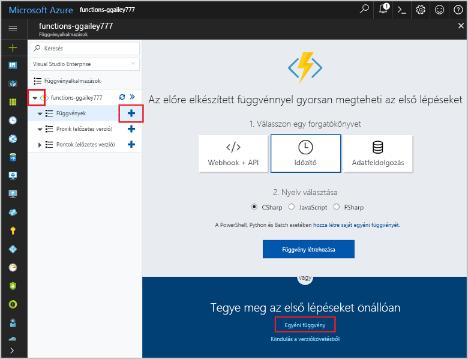

# <a name="create-a-function-that-integrates-with-azure-logic-apps"></a>Hozzon létre egy függvényt, amely az Azure Logic Apps

Az Azure Functions integrálja az Azure Logic Apps a Logic Apps-tervezőben. Ez az integráció lehetővé teszi a álló üzenettípusok összehangolását funkciók a számítási teljesítményt az egyéb Azure és a harmadik féltől származó szolgáltatással. 

Az oktatóanyag bemutatja, hogyan használható funkciók Logic Apps és a Microsoft Azure kognitív szolgáltatások elemzéséhez Twitter-bejegyzéseket a céggel kapcsolatos véleményeket. Az indított HTTP függvény kategorizálja Twitter-üzeneteket, mint a zöld, sárga vagy piros a céggel kapcsolatos véleményeket pontszám alapján. Az e-mail elküldésekor történik a gyenge véleményeket észlelése esetén. 


Eben az oktatóanyagban az alábbiakkal fog megismerkedni:

> [!div class="checklist"]
> * Hozzon létre egy kognitív szolgáltatások API erőforrást.
> * Hozzon létre egy függvényt, Kategorizáló tweetet céggel kapcsolatos véleményeket.
> * Twitter csatlakozó logikai alkalmazás létrehozása.
> * Véleményeket észlelési hozzáadása a logikai alkalmazást. 
> * Csatlakoztassa a logikai alkalmazást a függvény.
> * Küldjön egy e-mailt a választ, a függvény alapján.

## <a name="prerequisites"></a>Előfeltételek

+ Az aktív [Twitter](https://twitter.com/) fiók. 
+ Egy [Outlook.com-os](https://outlook.com/) fiókot (a értesítések küldése).
+ A témakör kiindulópontjául [Az első függvény létrehozása az Azure Portalon](functions-create-first-azure-function.md) című cikkben létrehozott erőforrások szolgálnak.  
Ha még nem tette meg, végezze el most ezeket a lépéseket a függvény-alkalmazás létrehozása.

## <a name="create-a-cognitive-services-resource"></a>Hozzon létre egy kognitív szolgáltatások erőforrást

A szolgáltatások kognitív API-k érhetők el az Azure-ban egyéni erőforrásként. A szöveg Analytics API használatával észleli a céggel kapcsolatos véleményeket, a Twitter-üzeneteket figyeli.

1. Jelentkezzen be az [Azure Portalra](https://portal.azure.com/).

2. Kattintson az Azure Portal bal felső sarkában található **Új** gombra.

3. Kattintson a **AI + analitika** > **Szövegelemzések API**. Ezután használja a beállítások a táblázatban megadott, fogadja el a feltételeket, és ellenőrizze **rögzítés az irányítópulton**.

    

    | Beállítás      |  Ajánlott érték   | Leírás                                        |
    | --- | --- | --- |
    | **Name (Név)** | MyCognitiveServicesAccnt | Válasszon egy egyedi fióknevet. |
    | **Hely** | USA nyugati régiója | Legközelebbi helyet használja. |
    | **Tarifacsomag** | F0 | Első lépésként legalacsonyabb. Ha elfogy a hívásokat, méretezhető, magasabb szintű használható.|
    | **Erőforráscsoport** | myResourceGroup | Ebben az oktatóanyagban minden szolgáltatáshoz használja ugyanazt az erőforráscsoportot.|

4. Kattintson a **létrehozása** az erőforrás létrehozásához. Miután létrejön, válassza ki az új kognitív szolgáltatások erőforrás rögzítve az irányítópulton. 

5. A bal oldali oszlopban kattintson **kulcsok**, majd másolja az értékének **kulcs 1** és mentse azt. Ez a kulcs segítségével csatlakozzon a logikai alkalmazást a kognitív Services API. 
 
    

[!INCLUDE [functions-portal-favorite-function-apps](../../includes/functions-portal-favorite-function-apps.md)]

## <a name="create-the-function-app"></a>A függvény-alkalmazás létrehozása

A Functions kiváló módja annak, kiszervezheti a logic apps munkafolyamat feldolgozási feladatokat. Ez az oktatóanyag feldolgozása tweetet véleményeket pontszámok kognitív szolgáltatásokból és kategória érték visszaadása egy indított HTTP függvény segítségével.  

[!INCLUDE [Create function app Azure portal](../../includes/functions-create-function-app-portal.md)]

## <a name="create-an-http-triggered-function"></a>Az indított HTTP-függvény létrehozása  

1. Bontsa ki a függvényalkalmazást, és kattintson a **Függvények** elem melletti **+** gombra. Ha ez az első függvény a függvényalkalmazásban, jelölje ki az **Egyéni függvény** lehetőséget. Ez megjeleníti a függvénysablonok teljes készletét.

    

2. Írja be a keresőmezőbe, `http` majd **C#** a HTTP-eseményindító sablon. 

    

3. Adjon meg egy **neve** a függvény kiválasztása `Function` a  **[hitelesítési szint](functions-bindings-http-webhook.md#http-auth)**, majd válassza ki **létrehozása**. 

    

    Ez a C# parancsfájl függvényt a HTTP-eseményindítóval sablonnal hoz létre. A kód jelenik meg, mint egy új ablakban `run.csx`.

4. Cserélje le a tartalmát a `run.csx` fájlt az alábbi kódot, majd kattintson az **mentése**:

    ```csharp
    using System.Net;
    
    public static async Task<HttpResponseMessage> Run(HttpRequestMessage req, TraceWriter log)
    {
        // The sentiment category defaults to 'GREEN'. 
        string category = "GREEN";
    
        // Get the sentiment score from the request body.
        double score = await req.Content.ReadAsAsync<double>();
        log.Info(string.Format("The sentiment score received is '{0}'.",
                    score.ToString()));
    
        // Set the category based on the sentiment score.
        if (score < .3)
        {
            category = "RED";
        }
        else if (score < .6)
        {
            category = "YELLOW";
        }
        return req.CreateResponse(HttpStatusCode.OK, category);
    }
    ```
    Ez a függvény kód alapján a kérésben a céggel kapcsolatos véleményeket pontszám szín kategória adja vissza. 

4. A függvény teszteléséhez kattintson **tesztelése** bontsa ki a teszt lap jobb szélén. Írjon be egy értéket a `0.2` a a **Request body**, és kattintson a **futtatása**. Érték **piros** a válasz törzsében ad vissza. 

    

Most is a céggel kapcsolatos véleményeket pontszámok Kategorizáló működnek. Ezután hozzon létre egy logikai alkalmazás, amely a függvény integrálható a Twitter és kognitív Services API. 

## <a name="create-a-logic-app"></a>Logikai alkalmazás létrehozása   

1. Az Azure portálon kattintson a **új** gomb az Azure portál bal felső sarkában található.

2. Kattintson a **vállalati integrációs** > **logikai alkalmazás**. Ezután használja a beállítások a tábla, ellenőrizze a **rögzítés az irányítópulton**, és kattintson a **létrehozása**.
 
4. Írja be a **neve** például `TweetSentiment`, a táblázatban megadott beállítások használatát, fogadja el a feltételeket, és ellenőrizze **rögzítés az irányítópulton**.

    

    | Beállítás      |  Ajánlott érték   | Leírás                                        |
    | ----------------- | ------------ | ------------- |
    | **Name (Név)** | TweetSentiment | Válasszon egy megfelelő az alkalmazás nevét. |
    | **Erőforráscsoport** | myResourceGroup | Válassza a meglévő erőforráscsoportot, előtt. |
    | **Hely** | USA keleti régiója | Válasszon az Önhöz legközelebb eső helyet. |    

4. Válasszon **rögzítés az irányítópulton**, és kattintson a **létrehozása** a logikai alkalmazás létrehozása. 

5. Az alkalmazás létrehozása után kattintson az új logikai alkalmazás rögzítve az irányítópulton. Ezután a Logic Apps tervezőben, görgessen lefelé, és kattintson a **üres logikai alkalmazás** sablont. 

    

A Logic Apps Designer segítségével mostantól szolgáltatások és eseményindítók hozzáadása az alkalmazáshoz.

## <a name="connect-to-twitter"></a>Kapcsolódás a Twitteren

Először hozzon létre kapcsolatot a Twitter-fiók. A logikai alkalmazás lekérdezi az Twitter-üzeneteket, amelyek indul el, az alkalmazás futtatásához.

1. A tervezőben, kattintson a **Twitter** szolgáltatásra, és kattintson a **amikor egy új tweetet visszaküldi** eseményindító. Jelentkezzen be a Twitter-fiók, és engedélyezik a Logic Apps segítségével használhatja a fiókot.

2. A táblázatban megadott Twitter eseményindító beállítást használja. 

    

    | Beállítás      |  Ajánlott érték   | Leírás                                        |
    | ----------------- | ------------ | ------------- |
    | **Keresett szöveg** | #Azure | Használja a hashtaggel történő, amely elegendő népszerű létrehozni új Twitter-üzeneteket a választott időszakban. Ingyenes szint és a hashtaggel történő használata esetén túl népszerű gyorsan használhatja fel a tranzakció kvóta a kognitív Services API. |
    | **Gyakoriság** | perc | A használt Twitter a lekérdezés gyakoriságát egység.  |
    | **Időköz** | 15 | Twitter-kérelmek gyakorisága egységekben között eltelt idő. |

3.  Kattintson a **mentése** csatlakozni a Twitter-fiók. 

Az alkalmazás most Twitter kapcsolódik. Ezután a céggel kapcsolatos véleményeket az összegyűjtött Twitter-üzenetek észlelése szövegelemzések csatlakozni.

## <a name="add-sentiment-detection"></a>Adja hozzá a céggel kapcsolatos véleményeket észlelése

1. Kattintson a **új lépés**, majd **művelet hozzáadása**.

    

2. A **művelet kiválasztását**, kattintson a **Szövegelemzések**, majd kattintson a **észleli a céggel kapcsolatos véleményeket** művelet.

    

3. Írja be a kapcsolat neve, mint `MyCognitiveServicesConnection`, illessze be a kulcs az kognitív szolgáltatások API-, mentett, majd kattintson az **létrehozása**.  

4. Kattintson a **szöveg elemzésére** > **Tweetet szöveg**, és kattintson a **mentése**.  

    

Most, hogy a céggel kapcsolatos véleményeket észlelési van konfigurálva, a függvény, amely a céggel kapcsolatos véleményeket pontszám kimeneti akkor is hozzáadhat egy kapcsolatot.

## <a name="connect-sentiment-output-to-your-function"></a>A függvény véleményeket kimeneti kapcsolódni

1. A Logic Apps tervezőben kattintson **új lépés** > **művelet hozzáadása**, és kattintson a **Azure Functions**. 

2. Kattintson a **jelöljön ki egy Azure függvényt**, jelölje be a **CategorizeSentiment** korábban létrehozott függvény.  

    

3. A **kérelem törzse**, kattintson a **pontszám** , majd **mentése**.

    

Most a függvény lesz kiváltva, ha a céggel kapcsolatos véleményeket pontszám küldi a logikai alkalmazást. Itt a színkódolás kategóriát a függvény által visszaadott a logikai alkalmazás. Ezután adja hozzá az e-mailben értesítést küldi, ha a céggel kapcsolatos véleményeket érték **piros** küld vissza a függvény. 

## <a name="add-email-notifications"></a>E-mail értesítések hozzáadása

A munkafolyamat utolsó része indul el egy e-mailt, ha a céggel kapcsolatos véleményeket program pontozza a mennyiségeket _piros_. Ez a témakör egy Outlook.com-összekötőt használja. A Gmailes vagy Office 365 Outlook-összekötő használatához hasonló lépésekkel végezheti el.   

1. A Logic Apps tervezőben kattintson **új lépés** > **feltétel hozzáadása**. 

2. Kattintson a **adjon meg értéket**, majd kattintson a **törzs**. Válassza ki **egyenlő**, kattintson a **adjon meg értéket** és írja be `RED`, és kattintson a **mentése**. 

    

3. A **ha igaz**, kattintson a **művelet hozzáadása**, keresse meg `outlook.com`, kattintson a **egy e-mailek küldése**, és jelentkezzen be az Outlook.com-fiók.
    
    

    > [!NOTE]
    > Ha egy Outlook.com-fiók nem rendelkezik, választhat egy másik összekötő, például a Gmailes vagy Office 365 Outlook

4. Az a **egy e-mailek küldése** művelet, a megadott, az e-mail beállításokat használja. 

    

    | Beállítás      |  Ajánlott érték   | Leírás  |
    | ----------------- | ------------ | ------------- |
    | **Címzett** | Az e-mail címet | Az e-mail címet, amely a értesítést kap. |
    | **Tárgy** | Negatív tweetet céggel kapcsolatos véleményeket észlelt  | Az e-mail értesítés tárgyát.  |
    | **Törzs** | Tweetet szöveg, amelyet helyre | Kattintson a **Tweetet szöveg** és **hely** paraméterek. |

5.  Kattintson a **Save** (Mentés) gombra.

Most, hogy a munkafolyamat befejeződött, a logikai alkalmazás engedélyezése, és tekintse meg a munkahelyi függvény.

## <a name="test-the-workflow"></a>A munkafolyamat tesztelése

1. A Logic App tervezőben kattintson **futtatása** az alkalmazás indításához.

2. A bal oldali oszlopban kattintson **áttekintése** a logikai alkalmazás állapotának megtekintéséhez. 
 
    

3. (Választható) Kattintson a fut, a végrehajtás részletek megtekintéséhez.

4. Nyissa meg a függvény, a naplók megtekintéséhez, és győződjön meg arról, hogy a céggel kapcsolatos véleményeket értéket is fogad és dolgoz.
 
    

5. A potenciálisan negatív véleményeket észlelésekor e-mailt kapni. Ha még nem kapott e-mailt, módosíthatja a funkciókódot piros vissza minden alkalommal, amikor:

        return req.CreateResponse(HttpStatusCode.OK, "RED");

    Miután ellenőrizte, hogy e-mail értesítést, állítsa vissza az eredeti kódot:

        return req.CreateResponse(HttpStatusCode.OK, category);

    > [!IMPORTANT]
    > Ez az oktatóanyag befejezése után tiltsa le a logikai alkalmazást. Ha letiltja az alkalmazást, elkerülheti a megterhelni a végrehajtások és mentése a tranzakciók a kognitív szolgáltatások API használatával.

Most láthatta, milyen egyszerűen funkciók integrálja a Logic Apps munkafolyamat.

## <a name="disable-the-logic-app"></a>A logikai alkalmazás letiltása

A logikai alkalmazás letiltásához kattintson **áttekintése** majd **letiltása** a képernyő tetején. Ezzel leállítja a logikai alkalmazás fut, és ezzel járó költségek nélkül az alkalmazás törlése. 


## <a name="next-steps"></a>Következő lépések

Ez az oktatóanyag bemutatta, hogyan végezheti el az alábbi műveleteket:

> [!div class="checklist"]
> * Hozzon létre egy kognitív szolgáltatások API erőforrást.
> * Hozzon létre egy függvényt, Kategorizáló tweetet céggel kapcsolatos véleményeket.
> * Twitter csatlakozó logikai alkalmazás létrehozása.
> * Véleményeket észlelési hozzáadása a logikai alkalmazást. 
> * Csatlakoztassa a logikai alkalmazást a függvény.
> * Küldjön egy e-mailt a választ, a függvény alapján.

Előzetes hogyan hozzon létre egy kiszolgáló nélküli API-t a függvény a következő oktatóanyagot.

> [!div class="nextstepaction"] 
> [Kiszolgáló nélküli API létrehozása az Azure Functions használatával](functions-create-serverless-api.md)

A Logic Apps kapcsolatos további információkért lásd: [Azure Logic Apps](../logic-apps/logic-apps-what-are-logic-apps.md).

