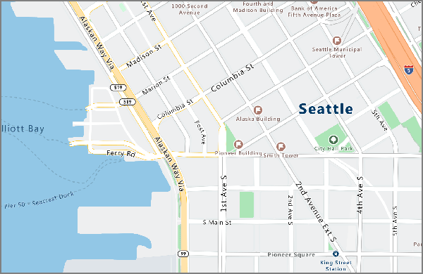
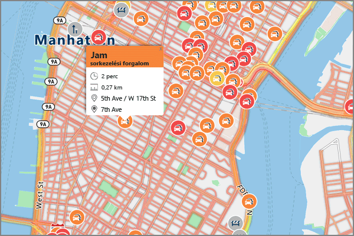

# <a name="what-is-azure-maps"></a>Mi az Azure Maps?
Az Azure Maps a webes és mobilalkalmazások földrajzi kontextusának biztosítása érdekében friss térképadatokat használó térinformatikai szolgáltatások gyűjteménye. A benne foglalt REST API-kkal térképek jeleníthetők meg, valamint hasznos helyek, az ezekhez vezető útvonalak, forgalmi viszonyok, időzónák és IP-alapú helymeghatározási szolgáltatások kereshetők. Az API-kat az ismerős eszközökkel együtt használva gyorsan fejleszthet és skálázhat olyan megoldásokat, amelyek helyadatokat biztosítanak az Azure-megoldásokban. A REST API-kkal együtt a szolgáltatás egy olyan webalapú JavaScript-vezérlőt biztosít, amelynek segítségével a fejlesztés egyszerűen, rugalmasan és különböző felületeken kivitelezhető. 

A következő videó részletesen bemutatja az Azure Mapset:

<iframe src="https://channel9.msdn.com/Shows/Azure-Friday/Azure-Location-Based-Services/player" width="960" height="540" allowFullScreen frameBorder="0"></iframe>

## <a name="services-in-azure-maps"></a>Az Azure Maps szolgáltatásai

Az Azure Maps az alábbi hat szolgáltatást tartalmazza, amelyekkel földrajzi kontextust biztosíthat Azure-alkalmazásai számára. 

### <a name="render-service"></a>Megjelenítő szolgáltatás

A Render Service segítségével a fejlesztők térképészeti jellegű webes és mobilalkalmazásokat fejleszthetnek. A szolgáltatás használhat nagy felbontású rasztergrafikákat, amelyek 19 nagyítási szinten érhetők el, vagy teljes körűen testreszabható, vektorformátumú térképeket.



A megjelenítő szolgáltatás mostantól előzetes verziójú API-kat biztosít, amelyeken keresztül a fejlesztők műholdképekkel dolgozhatnak. További részletekért olvassa el az [Azure Maps megjelenítő API-jait](https://docs.microsoft.com/rest/api/maps/render) bemutató cikket.


### <a name="route-service"></a>Útvonal szolgáltatás 

Az útvonal szolgáltatás robusztus geometriai számításokat biztosít valós infrastruktúrákat és több közlekedési módot alkalmazó útvonalak számításához. A szolgáltatás lehetővé teszi a fejlesztők számára, hogy többféle közlekedési formára (autó, teherautó, kerékpár, gyalog) vonatkozóan számítsák ki az útvonalakat. Olyan tényezők figyelembe vételére is képes, mint a forgalmi viszonyok, a súlykorlátozások vagy a veszélyes anyagok szállítása.


Az útvonal szolgáltatás most előzetes verzióban speciális funkciókat kínál: több útvonal kötegelt feldolgozása, különböző indulási és célállomások közötti utazási idők és távolságok mátrixa, vagy a rendelkezésre álló idő vagy üzemanyag alapján megtehető útvonalak vagy távolságok keresése. Az útvonaltervezési képességekkel kapcsolatos további részletekért olvassa el az [Azure Maps útvonal API-jait](https://docs.microsoft.com/rest/api/maps/route) bemutató cikket.


### <a name="search-service"></a>Keresési szolgáltatás

A keresési szolgáltatás lehetővé teszi a fejlesztők számára, hogy címeket, helyeket és bejegyzett vállalkozásokat keressenek név, kategória vagy egyéb földrajzi adatok alapján. A keresési szolgáltatás képes [fordított geokódolással](https://en.wikipedia.org/wiki/Reverse_geocoding) meghatározni a címeket és útkereszteződéseket a hosszúsági és szélességi koordináták alapján. 


A keresési szolgáltatás emellett speciális funkciókat is biztosít: útvonal mentén való keresés, nagyobb területen való keresés, keresési kérések csoportjának kötegelt végrehajtása, valamint nagyobb terület keresése egyetlen helypont helyett. A kötegelt és a területi keresés API-jai jelenleg előzetes verzióban érhetők el. A keresési képességekkel kapcsolatos további részletekért olvassa el az [Azure Maps keresési API-jait](https://docs.microsoft.com/rest/api/maps/search) bemutató cikket.


### <a name="time-zone-service"></a>Időzóna szolgáltatás

Az időzóna szolgáltatás lehetővé teszi a jelenlegi, korábbi és jövőbeli időzónaadatok lekérdezését hosszúsági/szélességi koordináták vagy egy [IANA-azonosító](http://www.iana.org/) alapján. Emellett a Time Zone Service használatával a Microsoft Windows időzóna-azonosítói IANA-időzónákká alakíthatók egy adott időzóna UTC-hez képest számolt eltérésének és az aktuális helyi idejének lekérésével. A Time Zone Service lekérdezéseire adott tipikus JSON-válasz a következő mintához hasonló:

```JSON
{
    "Version": "2017c",
    "ReferenceUtcTimestamp": "2017-11-20T23:09:48.686173Z",
    "TimeZones": [{
        "Id": "America/Los_Angeles",
        "ReferenceTime": {
            "Tag": "PST",
            "StandardOffset": "-08:00:00",
            "DaylightSavings": "00:00:00",
            "WallTime": "2017-11-20T15:09:48.686173-08:00",
            "PosixTzValidYear": 2017,
            "PosixTz": "PST+8PDT,M3.2.0,M11.1.0"
        }
    }]
}
```

A szolgáltatással kapcsolatos részletekért lépjen az [Azure Maps időzóna API-jainak](https://docs.microsoft.com/rest/api/maps/timezone) oldalára.

### <a name="traffic-service"></a>Forgalom szolgáltatás

A forgalmi szolgáltatás egy fejlesztők számára készült webszolgáltatás-csomag, amellyel forgalmi adatokat igénylő webes és mobilalkalmazások fejleszthetők. A szolgáltatás két adattípust biztosít:
    * Forgalom áramlása – valós időben megfigyelt menetsebességek és menetidők a hálózaton belüli összes fontos útra vonatkozóan; 
    * Forgalmi zavarok – pontos kép az úthálózaton fennálló forgalmi dugókról és zavarokról.



További részletekért lépjen az [Azure Maps forgalmi API-jainak](https://docs.microsoft.com/rest/api/maps/traffic) oldalára.

### <a name="ip-to-location"></a>IP-alapú helymeghatározás

Az IP-alapú helymeghatározás egy előzetes verzióban elérhető szolgáltatás, amely adott IP-cím alapján megadja a kétbetűs országkódot. A szolgáltatás segítségével az alkalmazások testreszabhatók a különféle geopolitikai megkötéseknek megfelelően, valamint javítható a felhasználói élmény a tartalmak a földrajzi helyhez való igazításával. 


## <a name="programming-model"></a>A programozási modell

Az Azure Maps a mobilitás jegyében készült, és különböző platformokon futó alkalmazásokat is képes kiszolgálni. Egy nyelvfüggetlen és a JSON-kimeneteket a [REST API-k](https://docs.microsoft.com/rest/api/maps/) használatával támogató programozási modellt használ. 

Az Azure Maps továbbá tartalmaz egy kényelmes [JavaScript-térképvezérlőt](https://docs.microsoft.com/javascript/api/azure-maps-javascript/?view=azure-iot-typescript-latest), amelynek egyszerű programozási modellje lehetővé teszi a webes és mobilalkalmazások gyors és egyszerű fejlesztését. 


## <a name="usage"></a>Használat

A Maps szolgáltatásainak eléréséhez csupán létre kell hozni egy Azure Maps-fiókot az [Azure Portalon](http://portal.azure.com). 

Az Azure Maps kulcsalapú hitelesítési sémát használ. A fiókhoz két előre létrehozott kulcs is jár. Használja ezen kulcsok egyikét az Azure Maps szolgáltatás felé küldött kérésekben a helyalapú szolgáltatások közvetlenül az alkalmazásokba való integrálásának megkezdéséhez.

## <a name="supported-regions"></a>Támogatott régiók
Az Azure Maps API jelenleg az alábbiak kivételével minden országban elérhető: 

* Argentína
* Kína
* India
* Marokkó
* Pakisztán
* Dél-Korea

Ellenőrizze a jelenlegi IP-címét, és győződjön meg arról, hogy az IP-címének a helye nem a fenti nem támogatott országok valamelyikében található.

## <a name="next-steps"></a>További lépések

- További információk az Azure Maps új szolgáltatásairól: 
    - [útvonalmátrix, izokrón térképek, IP-keresés és további szolgáltatások](https://azure.microsoft.com/blog/route-matrix-isochrones-ip-lookup-and-more-added-to-azure-maps/). 
- Lépjen tovább, és próbálja ki a szolgáltatást bemutató mintaalkalmazást.
    - [Bemutató interaktív kereséses térkép indítása](quick-demo-map-app.md)
