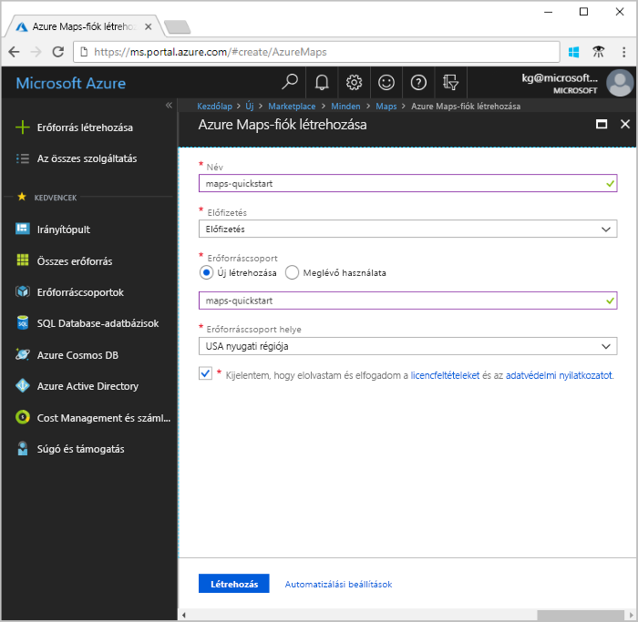
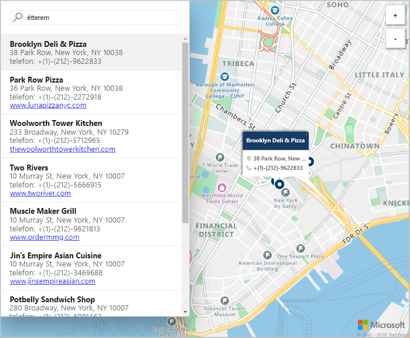

# Az Azure Maps segítségével egy interaktív keresés térkép létrehozása

Ez a cikk bemutatja az Azure Maps képességeit, amelyekkel interaktív keresési felhasználói élményt nyújtó térkép készíthető. Végigvezeti alapvető lépéseket:
* A saját Azure Maps-fiók létrehozása.
* A bemutató webalkalmazás használatához a fiókkulcs lekérése.

Ha nem rendelkezik Azure-előfizetéssel, mindössze néhány perc alatt létrehozhat egy [ingyenes fiókot](https://azure.microsoft.com/free/?WT.mc_id=A261C142F) a virtuális gép létrehozásának megkezdése előtt.

## Jelentkezzen be az Azure Portalra

Jelentkezzen be az [Azure Portalra](https://portal.azure.com/).

## Fiók létrehozása és kulcs beszerzése

1. A bal felső sarkában a [az Azure portal](https://portal.azure.com)válassza **erőforrás létrehozása**.
2. Az a **keresés a piactéren** mezőbe írja be **Maps**.
3. Az **Eredmények** részben válassza a **Maps** lehetőséget. Válassza ki a **létrehozás** a térkép alatt megjelenő gomb.
4. Az a **létrehozása az Azure Maps-fiók** lap, adja meg a következő értékeket:
    - Az új fiók **neve**.
    - A fiókhoz használni kívánt **előfizetés**.
    - A fiókhoz tartozó **erőforráscsoport**. Választhatja azt is **új létrehozása** vagy **meglévő** erőforráscsoportot.
    - Válassza ki a **Tarifacsomag** tetszőleges.
    - Olvassa el a **licenc** és **adatvédelmi nyilatkozat**. Jelölje be a jelölőnégyzetet, fogadja el a feltételeket.
    - Végül válassza ki a **létrehozás** gombra.

    

5. A fiók sikeres létrehozása után nyissa meg, és a fiók menü beállítások szakaszában található. Válassza ki **kulcsok** megtekintése az Azure Maps-fiók az elsődleges és másodlagos kulcsot. Másolja az **Elsődleges kulcs** értékét a vágólapra, mert a következő szakaszban használnia kell majd.

## Az alkalmazás letöltése

1. Töltse le vagy másolja ki az [interactiveSearch.html](https://github.com/Azure-Samples/AzureMapsCodeSamples/blob/master/AzureMapsCodeSamples/Tutorials/interactiveSearch.html) fájl tartalmát.
2. Mentse a fájlt helyileg a tartalmát **AzureMapDemo.html**. Nyissa meg egy szövegszerkesztőben.
3. Keresse meg benne `<insert-key>`. Cserélje le a **elsődleges kulcs** az előző szakaszból származó értékre.

## Az alkalmazás megnyitása

1. Nyissa meg az **AzureMapDemo.html** fájlt egy tetszőleges böngészőben.
2. Figyelje meg a térképen Los Angelesben város látható. Nagyítson és kicsinyítsen, ekkor a térkép automatikusan több vagy kevesebb információt jelenít meg a nagyítás mértékétől függően. 
3. Módosítsa a térkép alapértelmezett középpontját. Az **AzureMapDemo.html** fájlban keresse meg a **center** nevű változót. A változó szélesség–hosszúság értékpárt cserélje le a következő új értékre: **[-74.0060, 40.7128]**. Mentse a fájlt, és frissítse a böngészőt.
4. Próbálja ki az interaktív keresést. A keresőmezőbe írja meg a bal felső sarokban a bemutató webalkalmazás keresése **éttermek**.
5. Vigye az egérmutatót a címeket és a helyek, a keresőmező alatt megjelenő listáját. Figyelje meg, hogy a megfelelő PIN-kódot a térképen POP tájékoztatást talál az adott helyen. A magánvállalkozások adatainak védelme érdekében az itt látható nevek és címek nem valósak.

    

## Az erőforrások eltávolítása

Az oktatóanyagok bemutatják, hogyan használhatja és konfigurálhatja az Azure Maps-fiókjával. Ne távolítsa el az erőforrásokat, ha ez a rövid útmutatóban létrehozott azt tervezi, a következő oktatóanyagokra. Ha nem szeretné folytatni, hajtsa végre ezeket a lépéseket erőforrásokat:

1. Zárja be a böngészőt, amely futtatja a **AzureMapDemo.html** webes alkalmazás.
2. Az Azure Portal bal oldali menüből válassza ki a **összes erőforrás**. Ezután válassza ki az Azure Maps-fiók. Felső részén a **összes erőforrás** panelen válassza ki **törlése**.

## További lépések

Ebben a rövid útmutatóban az Azure Maps-fiók létrehozása, és létrehozott egy bemutató alkalmazást. Ha a saját alkalmazás létrehozása az Azure Maps API-k használatával, lépjen tovább a következő oktatóanyaggal:

> [!div class="nextstepaction"]
> [Az Azure Maps használatával közeli hasznos helyek keresése](./tutorial-search-location.md)

További hitelesítésikód-példák és interaktív kódolási felületet: ezek az útmutatók:

> [!div class="nextstepaction"]
> [Keresse meg egy címet az Azure Maps search szolgáltatással](./how-to-search-for-address.md)

> [!div class="nextstepaction"]
> [Az Azure Maps térkép vezérlőelem használata](./how-to-use-map-control.md)
