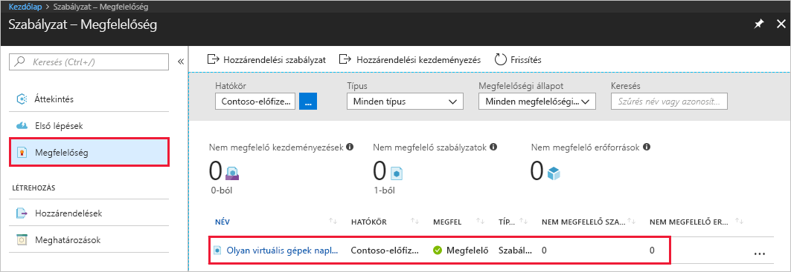

# <a name="create-a-policy-assignment-to-identify-non-compliant-resources-in-your-azure-environment-using-powershell"></a>Nem kompatibilis erőforrások az PowerShell használata Azure környezetben azonosításához házirend-hozzárendelés létrehozása

Az első lépés az Azure-ban ismertetése megfelelőségi fogják ahol állni az aktuális erőforrásokhoz. A gyors üzembe helyezési lépéseket a folyamatot, amely házirend létrehozása – házirend-definíció nem kompatibilis erőforrások azonosíthatók hozzárendelés *szükséges SQL Server verziója 12.0*. Ez a folyamat végén sikeresen azonosította kiszolgálók Mik a verziója, vagy nem megfelelő.

A PowerShell használatával Azure-erőforrások hozhatók létre és kezelhetők a parancssorból vagy szkriptekben. Ez az útmutató részletek azonosításához az Azure környezetben nem kompatibilis erőforrások házirend-hozzárendelés létrehozása a PowerShell használatával.

Ez az útmutató az Azure PowerShell 4.0-s vagy újabb verziója szükséges. Futtatás ```Get-Module -ListAvailable AzureRM``` verzió található. Ha telepíteni vagy frissíteni szeretne, olvassa el [az Azure PowerShell-modul telepítését](/powershell/azure/install-azurerm-ps) ismertető cikket.

A kezdés előtt ellenőrizze, hogy a PowerShell legújabb verziója van-e telepítve, Részletes információk: [Az Azure PowerShell telepítése és konfigurálása](/powershell/azureps-cmdlets-docs).

Ha nem rendelkezik Azure-előfizetéssel, első lépésként mindössze néhány perc alatt létrehozhat egy [ingyenes](https://azure.microsoft.com/free/) fiókot.

## <a name="opt-in-to-azure-policy"></a>Az Azure házirend engedélyezve

Azure házirend jelenleg korlátozott előzetes érhető el, a hozzáférés kéréséhez regisztrálnia kell.

1. Keresse fel Azure házirend https://aka.ms/getpolicy, és válassza ki a **regisztráció** a bal oldali ablaktáblán.

   

2. Az előfizetések kiválasztásával Azure házirend engedélyezve a **előfizetés** lista szeretne együttműködni. Válassza ki **regisztrálása**.

   

   Néhány napot ki, hogy fogadja el a regisztrációs kérelmet, igény szerint is tarthat. Ha a kérés elfogadva lekérdezi, értesítést fog kapni e-mailben, hogy a szolgáltatás segítségével megkezdheti.

## <a name="create-a-policy-assignment"></a>Házirend-hozzárendelés létrehozása

A gyors üzembe helyezés, az azt házirend-hozzárendelés létrehozása, és rendelje hozzá a *szükséges SQL Server verziója 12.0* definíciója. Ez a házirend-definíció erőforrásokat, amelyek nem felelnek meg a feltételeket a házirend-definíció azonosítja.

Kövesse az alábbi lépéseket egy új házirend-hozzárendelést létrehozni.

A következő paranccsal megtekintheti az összes házirend-beállítást, és keresse a hozzárendelni kívánt:

```powershell
$definition = Get-AzureRmPolicyDefinition
```

Az Azure házirend tartalmaz már beépített házirend-definíciók is használhatja. Beépített házirend-definíciók például jelenik meg:

- Címke és annak értéke
- Alkalmazza a címke és annak értéke
- Szükséges SQL Server verzió 12.0

Ezután rendelje hozzá a házirend-definíció kívánt hatóköre használatával a `New-AzureRmPolicyAssignment` parancsmag.

Ebben az oktatóanyagban azt hogy a parancs a következő információkat:
- Megjelenítési **neve** a házirend-hozzárendelés. Ebben az esetben szükséges SQL Server 12.0 verziója most használható hozzárendelés.
- **Házirend** – Ez a házirend-definíció, alapú ki, amelyek a hozzárendelés létrehozásához segítségével az. Ebben az esetben a házirend-definíció – *szükséges SQL Server verziója 12.0*
- A **hatókör** - hatókör határozza meg, milyen erőforrásokat, vagy az erőforrások csoportosítása a házirend-hozzárendelés lekérdezi kényszeríti. Ez terjedhet előfizetés erőforráscsoportokhoz. Ebben a példában a házirend-definíció, azt hozzárendeli a **FabrikamOMS** erőforráscsoportot.
- **$definition** – meg kell adnia az erőforrás-azonosítója a házirend-definíció – ebben az esetben használjuk az azonosítója a házirend-definíció - *szükséges SQL Server 12.0*.

```powershell
$rg = Get-AzureRmResourceGroup -Name "FabrikamOMS"
$definition = Get-AzureRmPolicyDefinition -Id /providers/Microsoft.Authorization/policyDefinitions/e5662a6-4747-49cd-b67b-bf8b01975c4c
New-AzureRMPolicyAssignment -Name Require SQL Server version 12.0 Assignment -Scope $rg.ResourceId -PolicyDefinition $definition
```

Most már készen áll a megfelelőségi állapotát a környezetében megértéséhez nem kompatibilis erőforrások azonosítására.

## <a name="identify-non-compliant-resources"></a>Nem kompatibilis erőforrások azonosítása

1. Lépjen vissza az Azure házirend kezdőlapja.
2. Válassza ki **megfelelőségi** a bal oldali ablaktáblán, és keresse meg a **házirend-hozzárendelés** létrehozott.

   

   Ha a meglévő erőforrásokat, amelyek nem ehhez a hozzárendeléshez megfelelnek, akkor jelennek meg a **nem megfelelő erőforrások** lapon, a fentiek szerint.

## <a name="clean-up-resources"></a>Az erőforrások eltávolítása

A gyűjtemény útmutatók a gyors üzembe helyezés épül. Ha azt tervezi, folytassa a következő útmutatókból dolgozni, üríti a gyors üzembe helyezés létrehozott erőforrásokat. Ha nem tervezi a folytatáshoz a hozzárendelést hozott létre a parancs futtatásával:

```powershell
Remove-AzureRmPolicyAssignment -Name “Require SQL Server version 12.0 Assignment” -Scope /subscriptions/ bc75htn-a0fhsi-349b-56gh-4fghti-f84852/resourceGroups/FabrikamOMS
```

## <a name="next-steps"></a>Következő lépések

A gyors üzembe helyezési társítva a házirend-definíció nem kompatibilis erőforrások az Azure környezetben azonosításához.

További információt a házirendek, annak érdekében, hogy **jövőbeli** erőforrásokat, amelyek létrehozása megfelelőek, továbbra is az oktatóanyag:

> [!div class="nextstepaction"]
> [Létrehozás és házirendek kezelése](./create-manage-policy.md)