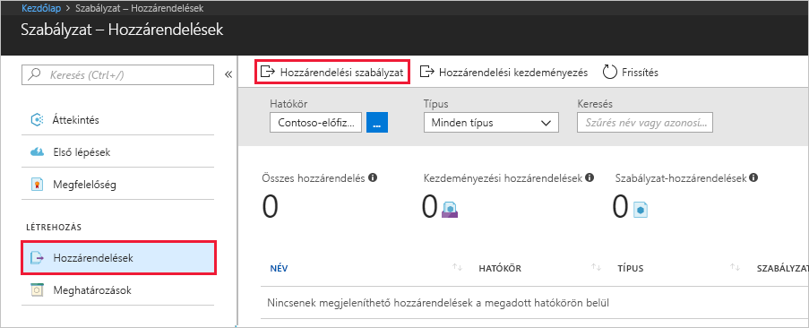
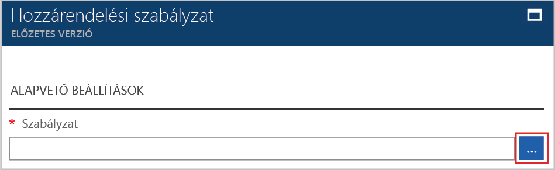
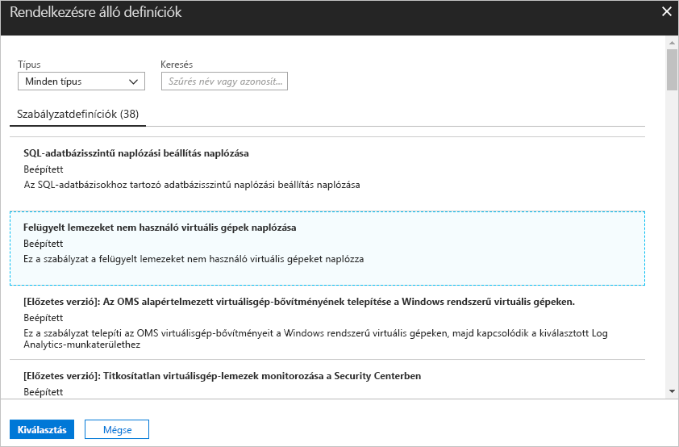
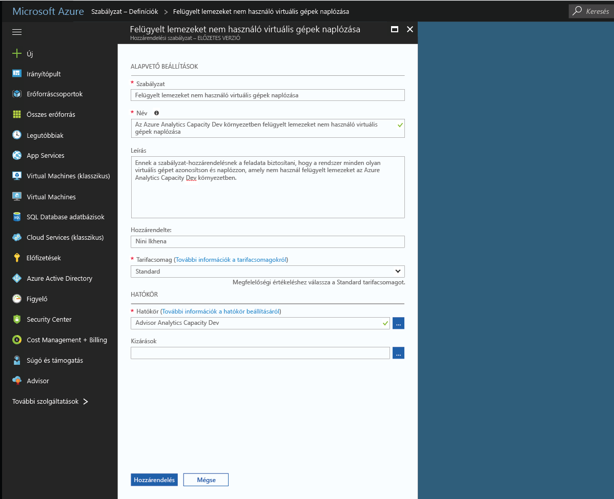
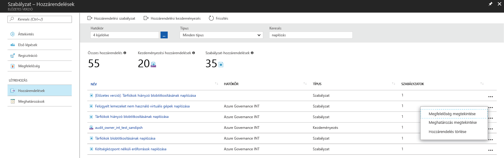

# Az Azure környezetben nem kompatibilis erőforrások azonosítására házirend-hozzárendelés létrehozása
Az első lépés az Azure-ban ismertetése megfelelőségi ismerete amennyiben állniuk saját aktuális erőforrásokkal. A gyors üzembe helyezés végigvezeti a házirend-hozzárendelés nem felügyelt lemezeket használó virtuális gépek azonosításához létrehozásának folyamatán.

Ez a folyamat végén fog sikeresen azonosította virtuális gépekhez, amelyek nem használják a kezelt lemezeken, és ezért *nem megfelelő*.

Ha nem rendelkezik Azure-előfizetéssel, mindössze néhány perc alatt létrehozhat egy [ingyenes fiókot](https://azure.microsoft.com/free/?WT.mc_id=A261C142F) a virtuális gép létrehozásának megkezdése előtt.

## Az Azure házirend engedélyezve

Az Azure házirend mostantól nyilvános előzetes verziójában, és a hozzáférés kéréséhez regisztrálnia kell.

1. Keresse fel Azure házirend https://aka.ms/getpolicy, és válassza ki a **regisztráció** a bal oldali ablaktáblán.

   

2. Az előfizetések kiválasztásával Azure házirend szeretné a **előfizetés** lista szeretne dolgozni. Válassza ki **regisztrálása**.

   

   A kérelem automatikus jóváhagyása Preview. Várja meg a regisztrációt feldolgozni a rendszer akár 30 percet.

## Házirend-hozzárendelés létrehozása

A gyors üzembe helyezés, az azt házirend-hozzárendelés létrehozása, és rendelje hozzá a *naplózási virtuális gépek nélkül kezelt lemezek* házirend-definíció.

1. Válassza ki **hozzárendelések** a bal oldali ablaktáblában az Azure-szabályzatának oldaláról.
2. Válassza ki **házirend hozzárendelése** tetején a **hozzárendelések** ablaktáblán.

   

3. A a **házirend hozzárendelése** kattintson  melletti **házirend** mezőt nyissa meg a rendelkezésre álló-definíciók listáján.

   

   Az Azure házirend mellékelt már beépített házirend-definíciókban használható. Például tekintse meg a beépített házirend-definíciók száma:

   - Címke és annak értéke
   - Alkalmazza a címke és annak értéke
   - Szükséges SQL Server verzió 12.0

4. Keresés a házirend-definíciók kereséséhez keresztül a *naplózási virtuális gépek, amelyek nem használnak kezelt lemezek* definíciója. Kattintson a házirendhez, és kattintson a **hozzárendelése**.

   

5. Adjon meg egy megjelenítési **neve** a házirend-hozzárendelés. Ebben az esetben most használja *naplózási virtuális gépek, amelyek nem használnak felügyelt lemezek*. Azt is megteheti egy nem kötelező **leírás**. A leírás ismerteti, hogyan a házirend-hozzárendelés azonosítja, amelyek nem használnak felügyelt lemezek ebben a környezetben létrehozott virtuális gépeket.
6. A tarifacsomagjának módosítása a következőre módosítani **szabványos** annak érdekében, hogy a házirend alkalmazva lesz a meglévő erőforrásokat.

   Nincsenek Azure házirend – két tarifacsomagok *szabad* és *szabványos*. Az ingyenes szint csak házirendjeinek betartatásával jövőbeli erőforrásokon, a Standard, is kényszerítheti azokat a meglévő erőforrásokat jobb megértése érdekében a megfelelőségi állapot. Mivel jelenleg korlátozott előzetes, nem még kiadtuk árképzési modellt, így Ön nem kap egy számlázási kiválasztásának *szabványos*. További vonatkozó, tekintse meg: [Azure házirend árképzési](https://acom-milestone-ignite.azurewebsites.net/pricing/details/azure-policy/).

7. Válassza ki a **hatókör** szeretné alkalmazni kívánt házirendet.  A hatókör határozza meg, milyen erőforrásokat, vagy az erőforrások csoportosítása a házirend-hozzárendelés lekérdezi kényszeríti az. Ez terjedhet előfizetés erőforráscsoportokhoz.
8. Válassza ki az előfizetés (vagy az erőforráscsoport) korábban regisztrált amikor Azure házirendbe választotta. A jelen példában használjuk az előfizetés - **Azure Analytics kapacitás fejlesztői**, de a beállítások eltérőek.

   

9. Válassza ki **hozzárendelése**.

Most már készen áll a megfelelőségi állapotát a környezetében megértéséhez nem kompatibilis erőforrások azonosítására.

## Nem kompatibilis erőforrások azonosítása

Válassza ki **megfelelőségi** a bal oldali ablaktáblán, és keresse meg a létrehozott házirend-hozzárendelés.

Ha a meglévő erőforrásokat, amelyek nem ehhez a hozzárendeléshez megfelelnek, akkor jelennek meg a **nem megfelelő erőforrások** fülre.

Ha egy feltétel kiértékelése történik a meglévő erőforrások között, és egyes őket ismét meg igaz, ezeket az erőforrásokat jelölésű nem felel meg a házirend. Ez a tábla, hogyan tudunk jelenleg elérhető különböző műveleteket a feltétel kiértékelésének eredménye és az erőforrások megfelelőségi állapotát.

|Erőforrás  |Ha a feltétel a házirendben  |A művelet a házirendben   |Megfelelőségi állapot  |
|-----------|---------|---------|---------|
|Létezik     |True (Igaz)     |Megtagadás     |Nem megfelelő |
|Létezik     |False (Hamis)    |Megtagadás     |Megfelelőség     |
|Létezik     |True (Igaz)     |Hozzáfűzés   |Nem megfelelő |
|Létezik     |False (Hamis)    |Hozzáfűzés   |Megfelelőség     |
|Létezik     |True (Igaz)     |Naplózás    |Nem megfelelő |
|Létezik     |False (Hamis)    |Naplózás    |Nem megfelelő |

## Az erőforrások eltávolítása

A gyűjtemény útmutatók a gyors üzembe helyezés épül. Ha azt tervezi, folytassa a következő útmutatókból dolgozni, üríti a gyors üzembe helyezés létrehozott erőforrásokat. Ha nem folytatja a munkát, akkor a következő lépésekkel törölheti az Azure Portalon a rövid útmutatóhoz létrehozott összes erőforrást.
1. Válassza ki **hozzárendelések** a bal oldali ablaktáblán.
2. Keressen rá az imént létrehozott hozzárendelés.

   

3.  Válassza ki **-hozzárendelés törlése**.

## Következő lépések

A gyors üzembe helyezés, a házirend-definíció annak érdekében, hogy az erőforrások abban a hatókörben megfelelőek, és azonosítása, melyeket nem hatókörbe rendelve.

További információt a házirendek annak érdekében, hogy **jövőbeli** erőforrásokat, amelyek létrehozása megfelelőek, továbbra is az oktatóanyag:

> [!div class="nextstepaction"]
> [Létrehozás és házirendek kezelése](./create-manage-policy.md)
