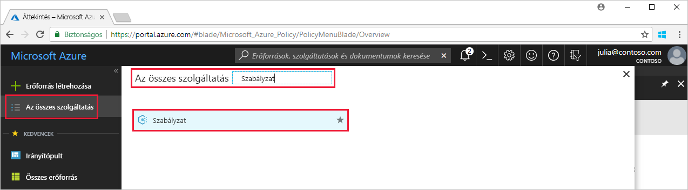

# Szabályzat-hozzárendelés létrehozása Azure környezetben a nem megfelelő erőforrások azonosításához

Az Azure-ral való megfelelőség megértéséhez szükséges első lépés a saját erőforrásai állapotának megállapítása. Ez a rövid útmutató végigvezeti Önt a folyamaton, amellyel létrehozhat egy felügyelt lemezeket nem használó virtuális gépek azonosítására szolgáló szabályzat-hozzárendelést.

A folyamat végén sikeresen fogja azonosítani a felügyelt lemezeket nem használó virtuális gépeket. Ezek a szabályzat-hozzárendelés szempontjából *nem megfelelőnek* minősülnek.

Ha nem rendelkezik Azure-előfizetéssel, első lépésként mindössze néhány perc alatt létrehozhat egy [ingyenes](https://azure.microsoft.com/free/) fiókot.

## Szabályzat-hozzárendelés létrehozása

Ebben a rövid útmutatóban egy szabályzat-hozzárendelést hoz létre, és hozzárendeli a *Felügyelt lemezek nélküli virtuális gépek naplózása* szabályzatdefiníciót.

1. Indítsa el az Azure Policy szolgáltatást az Azure Portalon. Ehhez kattintson a **Minden szolgáltatás** elemre, majd keresse meg és válassza ki a **Szabályzat** elemet.

   

2. Válassza ki a **Hozzárendelések** elemet az Azure Policy oldal bal oldalán. A hozzárendelés egy olyan szabályzat, amely egy adott hatókörön belül érvényes.
3. Válassza a **Szabályzat hozzárendelése** lehetőséget a **Szabályzat – Hozzárendelések** oldal tetején.

   

4. A **Szabályzat hozzárendelése** oldalon a **Hatókör** kiválasztásához kattintson a három pontra, majd válasszon ki egy előfizetést (kötelező) és egy erőforráscsoportot (nem kötelező). A hatókör határozza meg, hogy a szabályzat-hozzárendelés milyen erőforrások vagy erőforráscsoportok esetében lesz kényszerítve.  Ezután kattintson a **Kiválasztás** gombra a **Hatókör** oldal alján.

   Ebben a példában a **Contoso előfizetést** használjuk. Saját előfizetése ettől eltérhet.

5. Ha a hatókörből ki szeretne zárni egy vagy több erőforráscsoportot (ha csak előfizetést jelölt meg hatókörként), vagy bizonyos erőforrásokat egy erőforráscsoporton belül (bármely hatókör esetében), **Kizárásokat** is konfigurálhat a szabályzat-hozzárendelésben. Egyelőre ezt hagyja üresen.

6. Kattintson a **Szabályzatdefiníció** melletti három pontra az elérhető definíciók listájának megjelenítéséhez. Az Azure Policy beépített szabályzatdefiníciókat tartalmaz, amelyeket felhasználhat. Számos szabályzatdefiníció elérhető, többek között az alábbiak:

   - Címke és a hozzá tartozó érték kényszerítése
   - Címke és a hozzá tartozó érték alkalmazása
   - Az SQL Server 12.0-ás verziójának megkövetelése

    Az elérhető beépített szabályzatok teljes listájáért tekintse át a [Policy-mintákat](json-samples.md) ismertető témakört.

7. Keresse meg a *Felügyelt lemezeket nem használó virtuális gépek naplózása* definíciót a szabályzatdefiníciók listájában. Kattintson a szabályzatra, majd kattintson a **Kiválasztás** elemre.

   

8. A **Hozzárendelés neve** mező automatikusan kitöltődik a kiválasztott szabályzat nevével, de megadhat más nevet is. A példánkban meghagyjuk a *Felügyelt lemezeket nem használó virtuális gépek naplózása* értéket. Ha szeretné hozzáadhat egy **Leírást**. A leírás a szabályzat-hozzárendeléssel kapcsolatos információkat adja meg.

9. Kattintson a **Hozzárendelés** gombra.

Most már készen áll a nem megfelelő erőforrások azonosítására a környezet megfelelési állapotának megismerése céljából.

## Nem megfelelő erőforrások azonosítása

Válassza a **Megfelelőség** elemet az oldal bal oldalán, és keresse meg a létrehozott **Felügyelt lemezeket nem használó virtuális gépek naplózása** szabályzat-hozzárendelést.

Ha vannak olyan meglévő erőforrások, amelyek nem felelnek meg az új hozzárendelésnek, azok a **Nem megfelelő erőforrások** lapon jelennek meg.

Ha a meglévő erőforrások kiértékelésekor egy feltétel igaznak bizonyul, ezek az erőforrások a szabályzatnak nem megfelelőként lesznek megjelölve. A következő táblázat azt mutatja be, hogyan működnek együtt a szabályzatok különböző hatásai a feltételek kiértékelésével a megfelelőségi állapot eléréséhez. A kiértékelési logika nem jelenik meg az Azure Portalon, a megfelelőségi állapotok eredményei azonban igen. A megfelelőségi állapotok eredménye lehet megfelelő vagy nem megfelelő.

| **Erőforrás-állapot** | **Hatás** | **Szabályzat-kiértékelés** | **Megfelelőségi állapot** |
| --- | --- | --- | --- |
| Létezik | Deny, Audit, Append\*, DeployIfNotExist\*, AuditIfNotExist\* | True (Igaz) | Nem megfelelő |
| Létezik | Deny, Audit, Append\*, DeployIfNotExist\*, AuditIfNotExist\* | False (Hamis) | Megfelelő |
| Új | Naplózás, AuditIfNotExist\* | True (Igaz) | Nem megfelelő |
| Új | Naplózás, AuditIfNotExist\* | False (Hamis) | Megfelelő |

\* Az Append, a DeployIfNotExist és az AuditIfNotExist hatás esetében az IF utasításnak TRUE értéket kell visszaadnia. Emellett a létezési feltételnek FALSE értéket kell visszaadnia ahhoz, hogy a szabályzat nem megfelelőnek minősüljön. TRUE érték esetén az IF feltétel kiváltja a vonatkozó erőforrások létezési feltételének kiértékelését.

## Az erőforrások eltávolítása

Az ebben a gyűjteményben lévő többi útmutató erre a rövid útmutatóra épül. Ha azt tervezi, hogy az ezt követő oktatóanyagokkal dolgozik tovább, akkor ne törölje az ebben a rövid útmutatóban létrehozott erőforrásokat. Ha nem folytatja a munkát, akkor a következő lépésekkel törölheti az Azure Portalon a rövid útmutatóhoz létrehozott összes erőforrást.

1. Válassza a **Megfelelőség** (vagy **Hozzárendelések**) elemet az Azure Policy oldal bal oldalán, és keresse meg a létrehozott **Felügyelt lemezeket nem használó virtuális gépek naplózása** szabályzat-hozzárendelést.

2. Kattintson a jobb gombbal a **Felügyelt lemezeket nem használó virtuális gépek naplózása** szabályzat-hozzárendelésre, és válassza a **Hozzárendelés törlése** lehetőséget.

   

## További lépések

Ebben a rövid útmutatóban egy hatókörhöz rendelt hozzá egy szabályzatdefiníciót, és kiértékelte annak megfelelőségi jelentését. A szabályzatdefiníció biztosítja a hatókörbe tartozó erőforrások megfelelőségét, illetve azonosítja a nem megfelelő erőforrásokat.

A szabályzatok a **jövőben** létrehozott erőforrások megfelelőségének biztosítása érdekében történő hozzárendeléséről a következő oktatóanyagban találhat több információt:

> [!div class="nextstepaction"]
> [Szabályzatok létrehozása és kezelése](create-manage-policy.md)