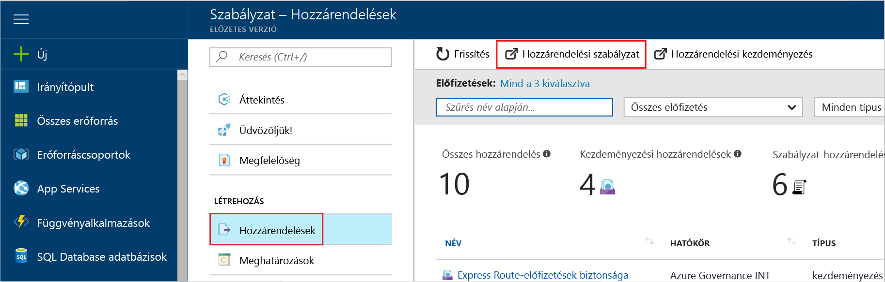

# <a name="create-and-manage-policies-to-enforce-compliance"></a>Kényszeríteni a megfelelőségi szabályzatok létrehozása és kezelése

Az Azure-ban a szabályzatok létrehozása és kezelése megértése fontos megfelel a vállalati szabványoknak és a szolgáltatásszint-szerződések marad. Ebben az oktatóanyagban lesz bemutatják, hogyan használhatja az Azure-házirend létrehozása, hozzárendelése és házirendek, mint a szervezeten belüli kezeléséhez kapcsolódó gyakori feladatok elvégzéséhez:

> [!div class="checklist"]
> * Egy házirendet hoz létre a jövőben erőforrások feltételt érvényesítését
> * Létrehozni és hozzárendelni egy kezdeményezésére definíciója erőforrások több megfelelőségi követéséről
> * Nem megfelelő, vagy az elutasított resource megoldásához
> * Egy új házirend megvalósítása a szervezeten belül

Ha nem rendelkezik Azure-előfizetéssel, mindössze néhány perc alatt létrehozhat egy [ingyenes fiókot](https://azure.microsoft.com/free/?WT.mc_id=A261C142F) a virtuális gép létrehozásának megkezdése előtt.

## <a name="assign-a-policy"></a>A házirend kijelölése

Az első lépés betartása Azure házirend, hogy rendelje hozzá a házirend-definíció. Házirend-definíció határozza meg, milyen feltétel, a házirend kényszerítve van, és a végrehajtandó műveletet. Ebben a példában azt hozzárendelése nevű beépített házirend-definíció *szükséges SQL Server verziója 12.0*, kényszeríteni a feltétel, hogy az összes SQL Server-adatbázis megfelelőségének v12.0 kell lennie.

1. Indítsa el az Azure szolgáltatás az Azure portálon keres, majd válassza **házirend** a bal oldali ablaktáblán.

   

2. Válassza ki a **Hozzárendelések** elemet az Azure Policy webhely bal oldali panelén. Olyan házirendet, amely belül egy adott hatókörhöz van hozzárendelve.
3. Válassza a **Szabályzat hozzárendelése** lehetőséget a **Hozzárendelések** panel tetején.

   

4. A **Szabályzat hozzárendelése** oldalon kattintson a  a **Szabályzat** mező mellett az elérhető definíciók listájának megnyitásához.

   

5. Válassza ki **szükséges SQL Server verzió 12.0**.

   

6. Írjon be egy a szabályzat-hozzárendeléshez tartozó megjelenítendő **Nevet**. Ebben az esetben most használja *szükséges SQL Server verziója 12.0*. Ha szeretné hozzáadhat egy **Leírást**. A leírás előírja, hogyan biztosítja a házirend-hozzárendelést, ebben a környezetben létrehozott összes SQL-kiszolgálók adatait 12.0 verziója.
7. Módosítsa a tarifacsomagot a **Standard** szintre, hogy a szabályzat kiterjedjen a meglévő erőforrásokra.

   Az Azure Policy-ban két tarifacsomag létezik – *Ingyenes* és *Standard*. Az Ingyenes szinten csak a jövőbeli erőforrások esetében kényszeríthet szabályzatokat, míg a Standard szinten már meglévő erőforrások esetében is, hogy jobban átlássa a megfelelőségi állapotot. Mivel ez egy Korlátozott Előzetes Verzió, még nem bocsátottunk ki díjszabási modellt, így nem fog számlát kapni a *Standard* szint kiválasztásakor. A díjszabással kapcsolatos további információkért tekintse meg a következőt: [Azure Policy díjszabás](https://azure.microsoft.com/pricing/details/azure-policy).

8. Válassza ki a **hatókör** -előfizetés (vagy erőforráscsoport) korábban regisztrált. A hatókör határozza meg, hogy a szabályzat-hozzárendelés milyen erőforrások vagy erőforráscsoportok esetében lesz kényszerítve. Ez egyetlen előfizetéstől teljes erőforráscsoportokig terjedhet.

   Az ebben a példában ez az előfizetés - használjuk **Azure Analytics kapacitás fejlesztői**. Az előfizetés eltérnek.

10. Válassza a **Hozzárendelés** elemet.

## <a name="implement-a-new-custom-policy"></a>Egy új egyéni házirend megvalósítása

Most, hogy a házirend-definíció hozzárendelt igazolnia, az oktatóanyagban módosítjuk hozzon létre egy új házirendet költségek biztosításával, amely e a környezetben létrehozott virtuális gépek a G sorozat nem lehet menteni. Így minden alkalommal, amikor a szervezeti felhasználó próbál hozzon létre virtuális Gépet a G sorozat megtagadja a kérelmet fogja lekérni.

1. Válassza ki **Definition** alatt **szerzői műveletek** a bal oldali ablaktáblán.

   

2. Válassza ki **+ házirend-definíció**.
3. Írja be a következőket:

   - A házirend - definíció neve *szükséges VM kisebb, mint a G adatsorozat termékváltozatok*
   - Leírja, hogy milyen a házirend-definíció az célja, hogy nincs – a házirend-definíció kényszeríti annak engedélyezése, ebben a hatókörben létrehozott összes virtuális gép rendelkezik-e termékváltozatok kisebb, mint a költségek csökkentése a G adatsorozat.
   - Az előfizetés, a házirend-definíció rendszer élő – ebben az esetben a házirend-definíció lesz élő **Advisor Analytics kapacitás fejlesztői**. Az előfizetési lista eltérnek.
   - Másolja az alábbi json-kódot, és módosítsa az igényeinek:
      - A házirend-paraméterek.
      - A szabályok/Házirendfeltételek, ebben az esetben – G adatsorozat egyenlő méretű Termékváltozat-méretét
      - A házirend hatása ebben az esetben – **Megtagadás**.

    Ez mit a json hasonlóan kell kinéznie. A módosított kód beillesztése az Azure-portálon.

    ```json
{
    "policyRule": {
      "if": {
        "allOf": [
          {
            "field": "type",
            "equals": "Microsoft.Compute/virtualMachines"
          },
          {
            "field": "Microsoft.Compute/virtualMachines/sku.name",
            "like": "Standard_G*"
          }
        ]
      },
      "then": {
        "effect": "deny"
      }
    }
}
    ```

    A json-kód minták megtekintéséhez olvassa el a [sablonok Azure házirend](json-samples.md) cikk.

4. Kattintson a **Mentés** gombra.

## <a name="create-a-policy-definition-with-rest-api"></a>Házirend-definíció létrehozása REST API-hoz

Létrehozhat egy házirendet a REST API-t házirend-definíciók. A REST API lehetővé teszi létrehozása és törlése a házirend-definíciók és meglévő definíciók adatainak beolvasása.
Házirend-definíció létrehozásához használja a következő példát:

```
PUT https://management.azure.com/subscriptions/{subscription-id}/providers/Microsoft.authorization/policydefinitions/{policyDefinitionName}?api-version={api-version}

```
Az alábbi példához hasonló egy kérelemtörzset a következők:

```
{
  "properties": {
    "parameters": {
      "allowedLocations": {
        "type": "array",
        "metadata": {
          "description": "The list of locations that can be specified when deploying resources",
          "strongType": "location",
          "displayName": "Allowed locations"
        }
      }
    },
    "displayName": "Allowed locations",
    "description": "This policy enables you to restrict the locations your organization can specify when deploying resources.",
    "policyRule": {
      "if": {
        "not": {
          "field": "location",
          "in": "[parameters('allowedLocations')]"
        }
      },
      "then": {
        "effect": "deny"
      }
    }
  }
}
```

## <a name="create-a-policy-definition-with-powershell"></a>Házirend-definíció létrehozása a PowerShell használatával

A PowerShell-példa folytatása előtt győződjön meg arról, hogy a legújabb Azure PowerShell telepítése. Házirend-paraméterek 3.6.0 verzióban lettek hozzáadva. Ha egy korábbi, a példák, hibaüzenetet jelzi, hogy a paraméter nem található.

A szabályzat definíciója használatával hozhat létre a `New-AzureRmPolicyDefinition` parancsmag.

Házirend-definíció létrehozása fájlból, adja át az elérési út a fájlhoz. Külső fájlra használja az alábbi példa:

```
$definition = New-AzureRmPolicyDefinition `
    -Name denyCoolTiering `
    -DisplayName "Deny cool access tiering for storage" `
    -Policy 'https://raw.githubusercontent.com/Azure/azure-policy-samples/master/samples/Storage/storage-account-access-tier/azurepolicy.rules.json'
```

Egy helyi fájl használható használja a következő példát:

```
$definition = New-AzureRmPolicyDefinition `
    -Name denyCoolTiering `
    -Description "Deny cool access tiering for storage" `
    -Policy "c:\policies\coolAccessTier.json"
```

Egy beágyazott szabály létrehozásához a házirend-definíció, használja a következő példát:

```
$definition = New-AzureRmPolicyDefinition -Name denyCoolTiering -Description "Deny cool access tiering for storage" -Policy '{
  "if": {
    "allOf": [
      {
        "field": "type",
        "equals": "Microsoft.Storage/storageAccounts"
      },
      {
        "field": "kind",
        "equals": "BlobStorage"
      },
      {
        "not": {
          "field": "Microsoft.Storage/storageAccounts/accessTier",
          "equals": "cool"
        }
      }
    ]
  },
  "then": {
    "effect": "deny"
  }
}'
```

A kimeneti tárolja egy `$definition` objektum, amely házirend-hozzárendelés során használatos.
Az alábbi példakód létrehozza a házirend-definíció paramétereket tartalmaz:

```
$policy = '{
    "if": {
        "allOf": [
            {
                "field": "type",
                "equals": "Microsoft.Storage/storageAccounts"
            },
            {
                "not": {
                    "field": "location",
                    "in": "[parameters(''allowedLocations'')]"
                }
            }
        ]
    },
    "then": {
        "effect": "Deny"
    }
}'

$parameters = '{
    "allowedLocations": {
        "type": "array",
        "metadata": {
          "description": "The list of locations that can be specified when deploying storage accounts.",
          "strongType": "location",
          "displayName": "Allowed locations"
        }
    }
}'

$definition = New-AzureRmPolicyDefinition -Name storageLocations -Description "Policy to specify locations for storage accounts." -Policy $policy -Parameter $parameters
```

## <a name="view-policy-definitions"></a>Házirend-definíciók megtekintése

Az előfizetés az összes házirend-definíciók, használja a következő parancsot:

```
Get-AzureRmPolicyDefinition
```

Összes elérhető, házirend-beállítást, többek között beépített házirendek adja vissza. Minden egyes házirend eredmény abban az esetben a következő formátumban:

```
Name               : e56962a6-4747-49cd-b67b-bf8b01975c4c
ResourceId         : /providers/Microsoft.Authorization/policyDefinitions/e56962a6-4747-49cd-b67b-bf8b01975c4c
ResourceName       : e56962a6-4747-49cd-b67b-bf8b01975c4c
ResourceType       : Microsoft.Authorization/policyDefinitions
Properties         : @{displayName=Allowed locations; policyType=BuiltIn; description=This policy enables you to
                     restrict the locations your organization can specify when deploying resources. Use to enforce
                     your geo-compliance requirements.; parameters=; policyRule=}
PolicyDefinitionId : /providers/Microsoft.Authorization/policyDefinitions/e56962a6-4747-49cd-b67b-bf8b01975c4c
```

## <a name="create-a-policy-definition-with-azure-cli"></a>Házirend-definíció létrehozása az Azure parancssori felülettel

A házirend-definíció a házirend-definíció parancs az Azure parancssori felület használatával hozhat létre.
Egy beágyazott szabály létrehozásához a házirend-definíció, használja a következő példát:

```
az policy definition create --name denyCoolTiering --description "Deny cool access tiering for storage" --rules '{
  "if": {
    "allOf": [
      {
        "field": "type",
        "equals": "Microsoft.Storage/storageAccounts"
      },
      {
        "field": "kind",
        "equals": "BlobStorage"
      },
      {
        "not": {
          "field": "Microsoft.Storage/storageAccounts/accessTier",
          "equals": "cool"
        }
      }
    ]
  },
  "then": {
    "effect": "deny"
  }
}'
```

## <a name="view-policy-definitions"></a>Házirend-definíciók megtekintése

Az előfizetés az összes házirend-definíciók, használja a következő parancsot:

```
az policy definition list
```

Összes elérhető, házirend-beállítást, többek között beépített házirendek adja vissza. Minden egyes házirend eredmény abban az esetben a következő formátumban:

```
{                                                            
  "description": "This policy enables you to restrict the locations your organization can specify when deploying resources. Use to enforce your geo-compliance requirements.",                      
  "displayName": "Allowed locations",
  "id": "/providers/Microsoft.Authorization/policyDefinitions/e56962a6-4747-49cd-b67b-bf8b01975c4c",
  "name": "e56962a6-4747-49cd-b67b-bf8b01975c4c",
  "policyRule": {
    "if": {
      "not": {
        "field": "location",
        "in": "[parameters('listOfAllowedLocations')]"
      }
    },
    "then": {
      "effect": "Deny"
    }
  },
  "policyType": "BuiltIn"
}
```

## <a name="create-and-assign-an-initiative-definition"></a>Létrehozni és hozzárendelni egy kezdeményezésére definíciója

Kezdeményezésére definition egy átfogó cél eléréséhez több házirend-definíciók csoportosíthatja. Győződjön meg arról, hogy az erőforrás-definícióban hatókörén belül maradnak megfelel a házirend-definíciók a kezdeményezésére definícióját alkotó egy kezdeményezésére definition hoz létre.  Tekintse meg a [Azure házirendek – áttekintés](./azure-policy-introduction.md) kezdeményezésére definíciók további információt.

### <a name="create-an-initiative-definition"></a>Hozzon létre egy kezdeményezésére definíciója

1. Válassza ki **definíciók** alatt **szerzői műveletek** a bal oldali ablaktáblán.

   

2. Válassza ki **kezdeményezésére Definition** az oldal tetején, ez a beállítás szükséges, hogy a **kezdeményezésére Definition** űrlap.
3. Adja meg a név és leírás kezdeményezésére.

   Ebben a példában azt szeretnénk, hogy megfelel a házirend-definíciók információkat biztonságos erőforrások vannak, a kezdeményező neve lenne **biztonságos beolvasása**, és a leírás lenne: **e kezdeményezés lett létrejön tartozó erőforrások biztonságossá tétele az összes házirend-definíciók kezeléséhez**.

   

4. Tallózzon a listája **definíciók** válassza ki a házirend definíciójában található szeretné, hogy kezdeményezésére hozzá. Az a **beolvasása biztonságos** kezdeményezés, adja hozzá a következő házirend-definíciók beépített:
   - SQL Server verziója 12.0 megkövetelése
   - A biztonsági központban nem védett webalkalmazások figyeléséhez.
   - A figyelő megengedő hálózaton keresztül a Security Center.
   - A figyelő lehetséges alkalmazás engedélyezése a biztonsági központban.
   - A figyelő a virtuális gépek lemezei a biztonsági központban titkosítás nélkül.

   

   A listáról a házirend-definíciók kiválasztása után megjelenik a **házirendek és a paraméterek**, ahogy fent látható.

5. Kattintson a **Létrehozás** gombra.

### <a name="assign-an-initiative-definition"></a>Rendelje hozzá egy kezdeményezésére definíciója

1. Lépjen a **definíciók** lap **szerzői műveletek**.
2. Keresse meg a **beolvasása biztonságos** létrehozott kezdeményezésére definíciója.
3. A kezdeményezésére definíciót, majd válassza ki és **hozzárendelése**.

   

4. Töltse ki a **hozzárendelés** képernyőn írja be:
   - Name: biztonságos-hozzárendelést kapnak
   - Leírás: a kezdeményezésére hozzárendelés megfelelő csoportját, a házirend-definíciók kényszerítése felé a **Azure Advisor kapacitás fejlesztői** előfizetés
   - IP-címek: Standard
   - azt szeretné, hogy alkalmazza a hozzárendelt hatókör: **Azure Advisor kapacitás fejlesztői**

5. Válassza a **Hozzárendelés** elemet.

## <a name="resolve-a-non-compliant-or-denied-resource"></a>Nem megfelelő, vagy az elutasított resource megoldásához

Követően a fenti példában a házirend-definíció szükséges az SQL server verziója 12.0 hozzárendelése után egy SQL server különböző verziójával szeretné beolvasni megtagadva. Ez a szakasz azt még útmutató alapján hozzon létre egy másik verziót az SQL server kivételként kérésével visszautasított kísérlete feloldása.

1. Válassza ki a **Hozzárendelések** elemet a bal oldali panelen.
2. Tallózzon az összes házirend-hozzárendelést, és indítsa el a *szükséges SQL Server verziója 12.0* hozzárendelés.
3. Az erőforráscsoportok, amelyben próbált létrehozni az SQL server kivételként kérelmet. Ebben az esetben, kivéve azt Microsoft.Sql/servers/databases: *baconandbeer/Cheetos* és *baconandbeer/Chorizo*.

   

   Elutasított erőforrás tudta feloldani más módokon tartalmazza: a házirendhez társított, ha egy erős indoklását kellene létrehozni az SQL-kiszolgáló, és közvetlenül a házirend szerkesztése, ha rendelkezik hozzáféréssel rendelkezik az ügyfél a elérése.

4. Kattintson a **Mentés** gombra.

Ebben a szakaszban irányuló kísérlet egy kivételt a erőforrások kérésével hozzon létre egy SQL server verziójával 12.0, szolgáltatásmegtagadásos feloldva.

## <a name="clean-up-resources"></a>Az erőforrások eltávolítása

Ha azt tervezi, folytassa a következő útmutatókból dolgozni, nem megszüntetése a jelen útmutató létrejött erőforrásokat. Ha nem szeretné folytatni, használja az alábbi lépéseket a hozzárendelések vagy a fenti létrehozott definíciók törléséhez:

1. Válassza ki **definíciók** (vagy **hozzárendelések** Ha hozzárendelés törölni kívánt) a bal oldali ablaktáblán.
2. Keresse meg a új kezdeményezés, vagy a házirend definition (vagy a hozzárendelés) most létrehozott.
3. Válassza ki a definíciót vagy a hozzárendelés végén a három pontot, majd **definíció törlése** (vagy **hozzárendelés törlése**).

## <a name="next-steps"></a>További lépések

Ebben az oktatóanyagban hogy sikeresen valósítható meg a következő:

> [!div class="checklist"]
> * Egy házirend érvényesítését hoz létre a jövőben erőforrásokra vonatkozó feltétel
> * Létrehozott, és rendelje hozzá egy kezdeményezésére definíciója erőforrások több megfelelőségi nyomon követésére
> * Nem megfelelő, vagy az elutasított erőforrás feloldva
> * Egy új házirendet megvalósítása a szervezeten belül

További információt a házirend-definíciók struktúrák, tekintse meg a cikk:

> [!div class="nextstepaction"]
> [Az Azure házirend szerkezete](policy-definition.md)
