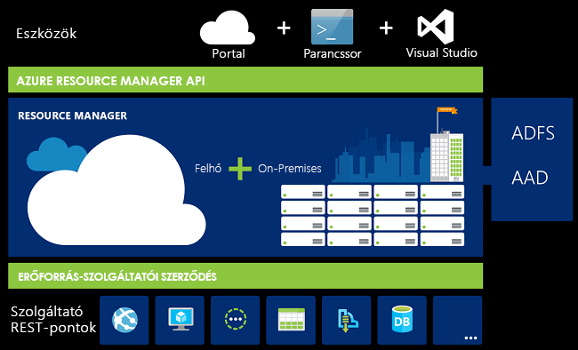
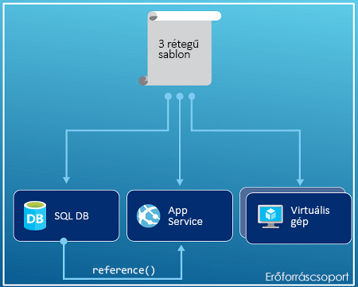
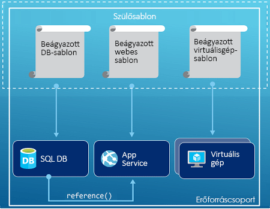
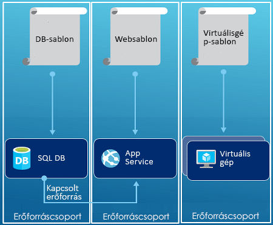

# <a name="azure-resource-manager-overview"></a>Az Azure Resource Manager áttekintése
Az alkalmazás infrastruktúrája általában számos összetevőből áll – például egy virtuális gépből, tárfiókból és virtuális hálózatból, vagy egy webalkalmazásból, adatbázisból, adatbázis-kiszolgálóból és harmadik féltől származó szolgáltatásokból. Ezeket az összetevőket nem külön entitásokként látja, hanem egyetlen entitás kapcsolódó és egymással összefüggő részeiként. Csoportként érdemes telepíteni, kezelni és megfigyelni őket. Az Azure Resource Manager lehetővé teszi, hogy a megoldásában az erőforrásokkal egy csoportként dolgozzon. A megoldás összes erőforrását egyetlen, koordinált műveletben telepítheti, frissítheti vagy törölheti. A telepítéshez egy sablon használatos, amely különböző, például tesztelési, átmeneti és üzemi környezetben is képes működni. A Resource Manager biztonsági, naplózási és címkézési szolgáltatásokat biztosít, hogy segítsen az erőforrások kezelésében a telepítést követően. 

## <a name="terminology"></a>Terminológia
Ha új felhasználója az Azure Resource Managernek, találkozhat néhány olyan kifejezéssel, amelyet még nem ismer.

* **erőforrás** – Egy olyan kezelhető elem, amely az Azure-on keresztül érhető el. Általános erőforrás például a következő: virtuális gép, tárfiók, webalkalmazás, adatbázis, virtuális hálózat, de számos további fajtája is létezik.
* **erőforráscsoport** – Egy olyan tároló, amely egy Azure-megoldáshoz kapcsolódó erőforrásokat tárol. Az erőforráscsoport tartalmazhatja a megoldás összes erőforrását, vagy csak azokat az erőforrásokat, amelyeket Ön egy csoportként szeretne kezelni. A szervezet számára legideálisabb elosztás alapján eldöntheti, hogyan szeretné elosztani az erőforrásokat az erőforráscsoportok között. Lásd: [erőforráscsoportok](#resource-groups).
* Az **erőforrás-szolgáltató** egy olyan szolgáltatás, amely a Resource Manager eszközön keresztül telepíthető és felügyelhető erőforrásokat biztosítja. Mindegyik erőforrás-szolgáltató műveleteket biztosít a telepített erőforrásokkal folytatott munkához. Gyakori erőforrás-szolgáltató például a virtuális gép típusú erőforrást biztosító Microsoft.Compute, a tárfiók típusú erőforrást biztosító Microsoft.Storage és a webalkalmazásokhoz kapcsolódó erőforrásokat biztosító Microsoft.Web. Lásd: [erőforrás-szolgáltatók](#resource-providers).
* **Resource Manager-sablon** – Egy JavaScript Object Notation- (JSON-) fájl, amely egy vagy több, az erőforráscsoportra telepítendő erőforrást határoz meg. A telepített erőforrások közti függőségeket is meghatározza. A sablon erőforrások konzisztens és ismétlődő telepítésére használandó. Lásd: [sablonalapú telepítés](#template-deployment).
* **deklaratív szintaxis** – Egy olyan szintaxis, amellyel anélkül határozhatja meg, mit szeretne létrehozni, hogy ehhez programozási parancsok sorozatát kellene megírnia. A Resource Manager-sablon a deklaratív szintaxis egy példája. A fájlban meghatározhatja az Azure-ra telepíteni kívánt infrastruktúra tulajdonságait. 

## <a name="the-benefits-of-using-resource-manager"></a>A Resource Manager használatának előnyei
A Resource Manager számos előnyt kínál:

* A megoldás összes erőforrását egy csoportként telepítheti, felügyelheti és figyelheti meg az erőforrások különálló kezelése helyett.
* A megoldást ismételten telepítheti a fejlesztési életciklus során, és biztos lehet abban, hogy az erőforrások telepítése konzisztens lesz.
* Az infrastruktúrát szkriptek helyett deklaratív sablonok segítségével is kezelheti.
* Meghatározhatja az erőforrások közti függőségeket, hogy azok a megfelelő sorrendben legyenek telepítve.
* Hozzáférés-vezérlést alkalmazhat az összes szolgáltatásra az erőforráscsoportban, mivel a szerepköralapú hozzáférés-vezérlés (RBAC) natív módon integrálva van a felügyeleti platformba.
* Címkékkel láthatja el az erőforrásokat, így logikusan rendszerezhető az előfizetés összes erőforrása.
* Az azonos címkén osztozó erőforrások csoportjának költségeit megtekintve jól átláthatók a szervezet számlái.  

A Resource Manager egy új módot kínál a megoldások telepítésére és kezelésére. Ha a korábbi telepítési modellt használta, és további információkat kíván megtudni a változásokról, tekintse meg [A Resource Manager telepítés és a hagyományos telepítés ismertetése](resource-manager-deployment-model.md) című cikket.

## <a name="consistent-management-layer"></a>Konzisztens felügyeleti réteg
A Resource Manager konzisztens felügyeleti réteget biztosít az Azure PowerShell, az Azure CLI, az Azure Portal, a REST API és a fejlesztői eszközök segítségével végrehajtott feladatok számára. Minden eszköz egy közös műveletcsoportot használ. Az Ön számára legmegfelelőbb eszközöket használhatja, és ezeket zavartalanul váltogathatja. 

Az alábbi kép azt mutatja be, hogyan kommunikál az összes eszköz ugyanazzal az Azure Resource Manager API-val. Az API továbbítja a kérelmeket a Resource Manager szolgáltatásnak, amely hitelesíti és engedélyezi azokat. Ezután a Resource Manager a megfelelő erőforrás-szolgáltatóhoz irányítja a kérelmeket.



## <a name="guidance"></a>Útmutatás
Az alábbi javaslatokat követve teljes mértékben kihasználhatja a Resource Manager előnyeit a megoldásaival végzett munka során.

1. Az infrastruktúrát a Resource Manager-sablonok deklaratív szintaxisán keresztül határozhatja meg és telepítheti imperatív parancsok helyett.
2. Meghatározhatja az összes telepítési és konfigurációs lépést a sablonban. Nem szükséges manuális lépéseket megadnia a megoldás beállításához.
3. Imperatív parancsok futtatásával kezelheti az erőforrásokat, például elindíthat vagy leállíthat egy alkalmazást vagy gépet.
4. Az azonos életciklussal rendelkező erőforrásokat egy erőforráscsoportba rendezheti. Címkék segítségével tetszés szerint rendezheti az erőforrásokat.

A sablonokra vonatkozó javaslatokat talál a [Best practices for creating Azure Resource Manager templates](resource-manager-template-best-practices.md) (Az Azure Resource Manager-sablonok létrehozásának ajánlott eljárásai) című cikkben.

Nagyvállalatoknak az [Azure enterprise scaffold - prescriptive subscription governance](resource-manager-subscription-governance.md) (Azure nagyvállalati struktúra - előíró előfizetés-irányítás) című cikk nyújt útmutatást az előfizetéseknek a Resource Managerrel való hatékony kezeléséről.

## <a name="resource-groups"></a>Erőforráscsoportok
Néhány fontos tényezőt érdemes figyelembe venni az erőforráscsoport meghatározásakor:

1. A csoportban lévő összes erőforrásnak azonos életciklussal kell rendelkeznie. Egyszerre fogja őket telepíteni, frissíteni és törölni. Ha egy erőforrásnak, például egy adatbázis-kiszolgálónak különböző fejlesztési ciklusban kell léteznie, azt másik erőforráscsoportba kell elhelyezni.
2. Az egyes erőforrások csak egy erőforráscsoportban létezhetnek.
3. Az erőforráscsoporthoz bármikor hozzáadhat, vagy onnan eltávolíthat egy erőforrást.
4. Az erőforrásokat áthelyezheti az egyik erőforráscsoportból a másikba. További információ: [Erőforrások áthelyezése új erőforráscsoportba vagy előfizetésbe](resource-group-move-resources.md).
5. Az erőforráscsoportok tartalmazhatnak olyan erőforrásokat, amelyek különböző régiókban találhatók.
6. Az erőforráscsoport segítségével meghatározhatja a hozzáférés-vezérlési hatókört felügyeleti műveletekhez.
7. Egy erőforrás más erőforráscsoportok erőforrásaival is interakcióba tud lépni. Ez az interakció gyakori, amikor a két erőforrás kapcsolódik, de nem ugyanaz az életciklusuk (például amikor egy webalkalmazás csatlakozik egy adatbázishoz).

Egy erőforráscsoport létrehozásakor meg kell adnia az erőforráscsoport helyét. Most felmerülhet Önben a kérdés, hogy „Miért van szüksége egy erőforráscsoportnak helyre? Ha pedig az erőforrások rendelkezhetnek az erőforrástól eltérő hellyel, akkor miért számít egyáltalán az erőforráscsoport helye?” Az erőforráscsoport erőforrásokra vonatkozó metaadatokat tárol. Ezért ha az erőforráscsoport számára megad egy helyet, akkor a metaadatok tárolási helyét adja meg. Megfelelőségi okokból szükség lehet arra, hogy az adatokat egy adott régióban tárolja.

## <a name="resource-providers"></a>Erőforrás-szolgáltatók
Mindegyik erőforrás-szolgáltató erőforrás-készleteket és műveleteket biztosít az Azure-szolgáltatásokkal való együttműködéshez. Ha például kulcsokat és titkos kulcsokat szeretne tárolni, a **Microsoft.KeyVault** erőforrás-szolgáltatót fogja használni. Ez az erőforrás-szolgáltató egy **vaults** nevű erőforrástípust biztosít a kulcstároló létrehozásához. 

Az erőforrástípus nevének formátuma: **{erőforrás-szolgáltató}/{erőforrástípus}**. Például a kulcstároló típus elnevezése: **Microsoft.KeyVault/vaults**.

Mielőtt elkezdi erőforrásai üzembe helyezését, ismerje meg az elérhető erőforrás-szolgáltatókat. Az erőforrások és az erőforrás-szolgáltatók nevének ismerete segíthet az Azure-ban üzembe helyezni kívánt erőforrások meghatározásában. Emellett ismernie kell az egyes erőforrástípusok érvényes helyeit és API-verzióit. További információkért lásd az [erőforrás-szolgáltatókat és a típusaikat](resource-manager-supported-services.md) ismertető cikket.

## <a name="template-deployment"></a>Sablonalapú telepítés
A Resource Managerrel egy olyan sablont hozhat létre (JSON formátumban), amely meghatározza az Azure-megoldás infrastruktúráját és konfigurációját. A sablonok segítségével a megoldás a teljes életciklusa során ismételten üzembe helyezhető, és az erőforrások üzembe helyezése biztosan konzisztens lesz. Amikor létrehoz egy megoldást a portálról, az automatikusan tartalmaz egy telepítési sablont. Nem szükséges teljesen új sablont létrehoznia, mivel kezdetben használhatja a sablont a megoldásához, majd testreszabhatja az adott igényeknek megfelelően. Egy meglévő erőforráscsoport sablonjának lekéréséhez exportálhatja az erőforráscsoport aktuális állapotát, vagy megtekintheti az adott telepítéshez felhasznált sablont. Az [exportált sablon](resource-manager-export-template.md) megtekintése hasznos információkat nyújt a sablon szintaxisáról.

A sablon formázásával és létrehozásával kapcsolatos információkért lásd: [Az első Azure Resource Manager-sablon létrehozása](resource-manager-create-first-template.md). Az erőforrástípusok JSON-szintaxisának megtekintéséért lásd [az Azure Resource Manager-sablonokban az erőforrások meghatározásával kapcsolatos](/azure/templates/) témakört.

A Resource Manager épp úgy feldolgozza a sablont, mint bármilyen más kérelmet (lásd a [Konzisztens felügyeleti réteg](#consistent-management-layer) képét). Elemzi a sablont, és a szintaxisát átalakítja a megfelelő erőforrás-szolgáltatók számára szükséges REST API-műveletekké. Például amikor a Resource Manager megkap egy sablont, amely a következő erőforrás-definíciót tartalmazza:

```json
"resources": [
  {
    "apiVersion": "2016-01-01",
    "type": "Microsoft.Storage/storageAccounts",
    "name": "mystorageaccount",
    "location": "westus",
    "sku": {
      "name": "Standard_LRS"
    },
    "kind": "Storage",
    "properties": {
    }
  }
]
```

Átalakítja a definíciót a következő REST API-műveletté, amelyet a rendszer elküld a Microsoft.Storage erőforrás-szolgáltatónak:

```HTTP
PUT
https://management.azure.com/subscriptions/{subscriptionId}/resourceGroups/{resourceGroupName}/providers/Microsoft.Storage/storageAccounts/mystorageaccount?api-version=2016-01-01
REQUEST BODY
{
  "location": "westus",
  "properties": {
  }
  "sku": {
    "name": "Standard_LRS"
  },   
  "kind": "Storage"
}
```

A sablonok és erőforráscsoportok meghatározási módja teljes mértékben Öntől függ, illetve attól, hogyan szeretné kezelni a megoldást. Például egyetlen sablon segítségével üzembe helyezheti a háromszintű alkalmazását egyetlen erőforráscsoportra.



Azonban nem kell meghatároznia a teljes infrastruktúrát egyetlen sablonban. Gyakran érdemes felosztani a telepítési követelményeket konkrét, célspecifikus sablonokra. Ezeket a sablonokat egyszerűen újból felhasználhatja különböző megoldásokhoz. Egy adott megoldás telepítéséhez hozzon létre egy fősablont, amely összekapcsolja az összes szükséges sablont. Az alábbi kép bemutatja, hogyan telepíthető egy háromszintű megoldás egy olyan fölérendelt sablon segítségével, amely három beágyazott sablont tartalmaz.



Ha elképzeli, hogy a rétegek külön életciklusokkal rendelkeznek, akkor a három szintet különálló erőforráscsoportokra telepítheti. Ügyeljen rá, hogy az erőforrások továbbra is kapcsolódhatnak egyéb erőforráscsoportok erőforrásaihoz.



A sablonok tervezésével kapcsolatos további javaslatokért lásd: [Minták Azure Resource Manager-sablonok tervezéséhez](best-practices-resource-manager-design-templates.md). A beágyazott sablonokkal kapcsolatos további információkért lásd: [Kapcsolt sablonok használata az Azure Resource Manager eszközben](resource-group-linked-templates.md).

Az Azure Resource Manager a függőségek elemzésével biztosítja, hogy az erőforrások a megfelelő sorrendben jöjjenek létre. Ha egy erőforrás egy másik erőforráshoz tartozó értéket használ fel (például egy virtuális gép, amely egy tárfiókot igényel a lemezekhez), akkor beállíthat egy függőséget. További információ: [Függőségek meghatározása az Azure Resource Manager sablonokban](resource-group-define-dependencies.md).

A sablonokat az infrastruktúra frissítésére is használhatja. Hozzáadhat például egy erőforrást a megoldáshoz, valamint hozzáadhat konfigurációs szabályokat a már telepített erőforrásokhoz. Ha a sablon egy erőforrás létrehozását határozza meg, de az adott erőforrás már létezik, az Azure Resource Manager az új eszköz létrehozása helyett frissítést végez. Az Azure Resource Manager frissíti a meglévő eszközt, hogy az állapota olyan legyen, mintha új lenne.  

A Resource Manager bővítményeket biztosít olyan forgatókönyvek esetére, amikor további műveletek szükségesek, például egy adott szoftver telepítése, amelyet nem tartalmaz a beállítás. Ha már használ valamilyen konfigurációfelügyeleti szolgáltatást, mint a DSC, Chef vagy Puppet, bővítmények segítségével folytathatja a munkát az adott szolgáltatással. További információ a virtuális gépi bővítményekről: [A virtuális gépi bővítmények és funkcióik áttekintése](../virtual-machines/windows/extensions-features.md?toc=%2fazure%2fvirtual-machines%2fwindows%2ftoc.json). 

Végül a sablon az alkalmazás forráskódjának részévé válik. Elhelyezheti a forráskódraktárban, és frissítheti az alkalmazás továbbfejlesztésekor. A sablont a Visual Studio eszközben szerkesztheti.

A sablon meghatározása után készen áll, hogy üzembe helyezze az erőforrásokat az Azure-ban. Az erőforrások üzembe helyezéséhez használható parancsokról lásd:

* [Erőforrások üzembe helyezése Resource Manager-sablonokkal és az Azure PowerShell-lel](resource-group-template-deploy.md)
* [Erőforrások üzembe helyezése Resource Manager-sablonokkal és az Azure parancssori felületével](resource-group-template-deploy-cli.md)
* [Erőforrások üzembe helyezése Resource Manager-sablonokkal és az Azure Portallal](resource-group-template-deploy-portal.md)
* [Erőforrások üzembe helyezése Resource Manager-sablonokkal és az Azure Manager REST API-val](resource-group-template-deploy-rest.md)

## <a name="tags"></a>Címkék
A Resource Manager biztosít egy címkézési funkciót, amellyel a felügyeleti vagy számlázási követelményeinek megfelelően kategorizálhatja az erőforrásokat. Használjon címkéket, ha összetett erőforráscsoport- és erőforrás-gyűjteménnyel rendelkezik, és egyedi módon szeretné vizuálisan megjeleníteni az eszközöket. Például elláthat címkével olyan erőforrásokat, amelyek hasonló szerepet töltenek be a szervezetben, vagy ugyanahhoz a részleghez tartoznak. Címkék nélkül a szervezet felhasználói létrehozhatnak több olyan erőforrást is, amelyeket később nehéz lehet azonosítani és felügyelni. Előfordulhat például, hogy törölni szeretné egy adott projekt összes erőforrását. Ha ezek az erőforrások nincsenek a projektnek megfelelően megcímkézve, akkor manuálisan kell őket megkeresnie. A címkézés hasznos módja a felesleges költségek csökkentéséhez az előfizetésében. 

Az erőforrásoknak nem kell megegyező erőforráscsoportban lenniük, hogy azonos címkével lássa el őket. Létrehozhat saját címkerendszert, hogy a szervezetben lévő összes felhasználó ugyanolyan címkéket használjon, hogy a felhasználók ne használjanak véletlenül némileg eltérő címkéket (például „részleg” helyett „részl”).

A következő példa egy virtuális gép címkével való ellátását mutatja be.

```json
"resources": [    
  {
    "type": "Microsoft.Compute/virtualMachines",
    "apiVersion": "2015-06-15",
    "name": "SimpleWindowsVM",
    "location": "[resourceGroup().location]",
    "tags": {
        "costCenter": "Finance"
    },
    ...
  }
]
```

A következő PowerShell-parancsmaggal lekérdezheti az összes olyan erőforrást, amely címkeértékkel rendelkezik:

```powershell
Find-AzureRmResource -TagName costCenter -TagValue Finance
```

A következő Azure CLI 2.0-parancsot is használhatja:

```azurecli
az resource list --tag costCenter=Finance
```

A címkézett erőforrásokat az Azure Portalon is megtekintheti.

Az előfizetéshez tartozó [használati jelentés](../billing/billing-understand-your-bill.md) tartalmazza a címkék nevét és értékeit, így a címkék alapján részletezheti a költségeket. A címkékkel kapcsolatos további információért tekintse meg [Az Azure-erőforrások rendszerezése címkék használatával](resource-group-using-tags.md) című cikket.

## <a name="access-control"></a>Hozzáférés-vezérlés
A Resource Manager segítségével szabályozhatja, hogy ki rendelkezzen hozzáféréssel egy adott művelethez a szervezetben. Natív módon integrálja a szerepköralapú hozzáférés-vezérlést (RBAC) a felügyeleti platformba, valamint az összes szolgáltatásra alkalmazza az erőforráscsoportban a hozzáférés-vezérlést. 

A szerepköralapú hozzáférés-vezérlés használata során az alábbi két fő fogalmat kell megérteni:

* Szerepkör-definíciók – egy engedélycsoportot írnak le, és számos hozzárendelésnél használhatók.
* Szerepkör-hozzárendelések – egy definíciót társítanak egy identitáshoz (felhasználóhoz vagy csoporthoz) egy adott hatókörre vonatkozóan (előfizetés, erőforráscsoport vagy erőforrás). Az alacsonyabb hatókörök öröklik a hozzárendelést.

Felhasználókat adhat hozzá előre meghatározott platformbeli és erőforrás-specifikus szerepkörökhöz. Az Olvasó nevű előre meghatározott szerepkörrel például engedélyezheti a felhasználóknak az erőforrások megtekintését, de megtilthatja a módosításukat. Adja hozzá azokat a felhasználókat a szervezetben az Olvasó szerepkörhöz, akiknek ilyen típusú hozzáférésre van szükségük, és alkalmazza a szerepkört az előfizetésre, az erőforráscsoportra vagy erőforrásra.

Az Azure a következő négy platformszerepkört biztosítja:

1. Tulajdonos, aki mindent kezelhet, beleértve a hozzáférést is
2. Közreműködő, aki a hozzáférés kivételével mindent kezelhet
3. Olvasó, aki mindent megtekinthet, de módosításokat nem hajthat végre
4. A felhasználói hozzáférés rendszergazdája, aki kezelheti az Azure-erőforrások felhasználói hozzáférését

Az Azure számos erőforrás-specifikus szerepkört is biztosít. Ilyenek például a következők:

1. Virtuális gépek közreműködője – felügyelheti a virtuális gépeket, de nem adhat hozzájuk hozzáférést, és nem felügyelheti a hozzájuk kapcsolódó virtuális hálózatot vagy tárfiókot
2. Hálózati közreműködő – felügyelheti az összes hálózati erőforrást, de nem biztosíthat hozzáférést
3. Tárfiók-közreműködő – felügyelheti a tárfiókokat, de nem biztosíthat hozzáférést
4. SQL Server közreműködője – felügyelheti az SQL-kiszolgálókat és -adatbázisokat, de nem kezelheti a biztonsággal kapcsolatos házirendjeiket
5. Webhelyek közreműködője – felügyelheti a webhelyeket, de nem kezelheti a hozzájuk kapcsolódó webes tarifacsomagokat

A szerepkörök és a hozzájuk kapcsolódó engedélyezett műveletek teljes listáját lásd: [RBAC: Beépített szerepkörök](../active-directory/role-based-access-built-in-roles.md). A szerepköralapú hozzáférés-vezérléssel kapcsolatos további információk: [Azure szerepköralapú hozzáférés-vezérlés](../active-directory/role-based-access-control-configure.md). 

Egyes esetekben előfordulhat, hogy olyan kódot vagy szkriptet kíván futtatni, amely hozzáféréssel rendelkezik bizonyos erőforrásokhoz, de nem felhasználói hitelesítő adatokkal kívánja végrehajtani a futtatást. Ehelyett egy szolgáltatásnév nevű identitást hozhat létre az alkalmazásnak, és hozzárendelheti a megfelelő szerepkört a szolgáltatásnévhez. A Resource Manager használatával hitelesítő adatokat hozhat létre az alkalmazáshoz, és programozott módon hitelesítheti az alkalmazást. A szolgáltatásnevek létrehozásáról a következő témakörökben talál további információt:

* [Szolgáltatásnév létrehozása erőforrások eléréséhez az Azure PowerShell használatával](resource-group-authenticate-service-principal.md)
* [Szolgáltatásnév létrehozása erőforrások eléréséhez az Azure CLI használatával](resource-group-authenticate-service-principal-cli.md)
* [Azure Active Directory-alkalmazás és -szolgáltatásnév létrehozása a portálon erőforrások eléréséhez](resource-group-create-service-principal-portal.md)

Kifejezetten zárolhatja a kritikus erőforrásokat is, megakadályozva, hogy a felhasználók törölhessék vagy módosíthassák azokat. További információ: [Erőforrások zárolása az Azure Resource Manager eszközzel](resource-group-lock-resources.md).

## <a name="activity-logs"></a>Tevékenységnaplók
A Resource Manager naplózza az erőforrásokat létrehozó, módosító és törlő műveleteket. A tevékenységnaplókból hibaelhárításkor megkeresheti a hibákat, vagy nyomon követheti, hogy a szervezete felhasználói hogyan módosították az erőforrásokat. A naplók megtekintéséhez válassza a **Tevékenységnaplók** elemet az erőforráscsoport **Beállítások** paneljén. A naplókat számos érték alapján szűrheti, például aszerint, hogy melyik felhasználó kezdeményezte a műveletet. További információ a vizsgálati naplók használatáról: [Vizsgálati naplók megtekintése az Azure erőforrások kezeléséhez](resource-group-audit.md).

## <a name="customized-policies"></a>Testreszabott házirendek
A Resource Manager lehetővé teszi, hogy létrehozzon testreszabott házirendeket az erőforrások kezeléséhez. Az Ön által létrehozott házirendek különböző forgatókönyveket tartalmazhatnak. Kényszerítheti egy adott elnevezési konvenció használatát az erőforrásokon, korlátozhatja a telepíthető példányok és erőforrások típusát, illetve korlátozhatja azokat az adott típusú erőforrás tárolásához használható régiókat. A számlázás részlegek szerinti rendszerzéséhez megkövetelheti egy adott címkeérték meglétét az erőforrásokon. A házirendek segítségével csökkentheti a költségeket és biztosíthatja az egységességet az előfizetésében. 

A házirendeket a JSON használatával határozhatja meg, majd alkalmazhatja őket az előfizetésében vagy az erőforráscsoportban. A házirendek abban különböznek a szerepköralapú hozzáférés-vezérléstől, hogy az erőforrástípusokra érvényesek.

A következő példa egy olyan házirendet mutat be, amely annak meghatározásával biztosítja a címkék egységességét, hogy minden erőforrásnak tartalmaznia kell egy costCenter címkét.

```json
{
  "if": {
    "not" : {
      "field" : "tags",
      "containsKey" : "costCenter"
    }
  },
  "then" : {
    "effect" : "deny"
  }
}
```

Rengeteg típusú házirendet hozhat létre. További információ: [Mi az az Azure Policy?](../azure-policy/azure-policy-introduction.md)

## <a name="sdks"></a>SDK-k
Az Azure SDK-k több nyelven és többféle platformon elérhetőek. A nyelvi implementációk mindegyike elérhető az ökoszisztéma-csomagkezelőn és a GitHubon keresztül.

Itt találhatóak az Open Source SDK-adattáraink. Szívesen vesszük a visszajelzéseket, a hibabejelentéseket és a lekérési kérelmeket.

* [Azure SDK for .NET](https://github.com/Azure/azure-sdk-for-net)
* [Javához készült Azure felügyeleti könyvtárak](https://github.com/Azure/azure-sdk-for-java)
* [Node.js-hez készült Azure SDK](https://github.com/Azure/azure-sdk-for-node)
* [PHP-hoz készült Azure SDK](https://github.com/Azure/azure-sdk-for-php)
* [Pythonhoz készült Azure SDK](https://github.com/Azure/azure-sdk-for-python)
* [Rubyhoz készült Azure SDK](https://github.com/Azure/azure-sdk-for-ruby)

További információ arról, hogyan használhatók ezek a nyelvek a saját erőforrásaival:

* [Azure .NET-fejlesztőknek](/dotnet/azure/?view=azure-dotnet)
* [Azure Java-fejlesztőknek](/java/azure/)
* [Azure Node.js-fejlesztőknek](/nodejs/azure/)
* [Azure Python-fejlesztőknek](/python/azure/)

> [!NOTE]
> Ha az SDK nem biztosítja a szükséges funkciót, hívhatja közvetlenül az [Azure REST API](https://docs.microsoft.com/rest/api/resources/)-t is.
> 
> 

## <a name="next-steps"></a>Következő lépések
* A sablonok használatának egyszerű bemutatása: [Azure Resource Manager-sablonok exportálása létező erőforrásokból](resource-manager-export-template.md).
* A sablonok létrehozásának részletes ismertetése: [Az első Azure Resource Manager-sablon létrehozása](resource-manager-create-first-template.md).
* A sablonokban használható függvények ismertetése: [Sablonfüggvények](resource-group-template-functions.md)
* A Visual Studio és a Resource Manager együttes használatával kapcsolatos információ: [Azure erőforráscsoport-sablonok létrehozása és telepítése a Visual Studio alkalmazással](vs-azure-tools-resource-groups-deployment-projects-create-deploy.md).

Ismertető videó az áttekintésről:

>[!VIDEO https://channel9.msdn.com/Blogs/Azure-Documentation-Shorts/Azure-Resource-Manager-Overview/player]


[powershellref]: https://docs.microsoft.com/powershell/resourcemanager/azurerm.resources/v3.2.0/azurerm.resources
