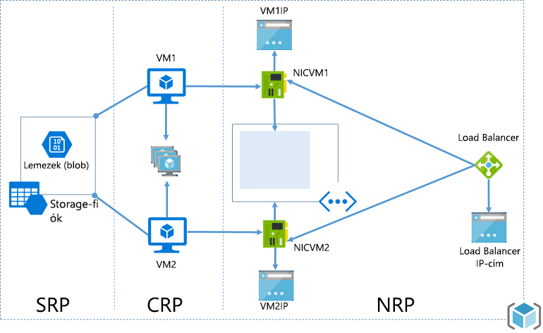
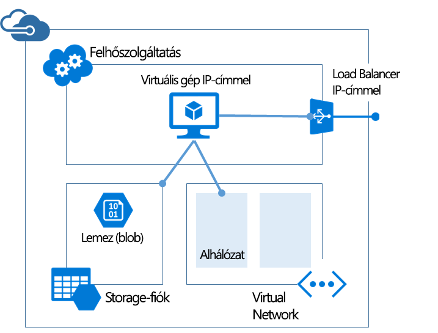

# <a name="azure-resource-manager-vs-classic-deployment-understand-deployment-models-and-the-state-of-your-resources"></a>Az Azure Resource Manager-alapú és a klasszikus üzemelő példányok: Az üzemi modellek és az erőforrások állapotának ismertetése
Ebben a cikkben az Azure Resource Manager-alapú és a klasszikus üzemi modellel ismerkedhet meg. A Resource Manager-alapú és a klasszikus üzemi modell két eltérő módost kínál az Azure-megoldások üzembe helyezésére és felügyeletére. Két eltérő API-készleten keresztül használhatja őket, és az üzembe helyezett erőforrásokban is lehetnek lényeges különbségek. A két modell nem kompatibilis egymással. Ez a cikk röviden ismerteti ezeket az eltéréseket.

Az erőforrások egyszerűbb üzembe helyezése és felügyelete érdekében a Microsoft a Resource Manager használatát javasolja az összes új erőforráshoz. Amennyiben lehetséges, a Microsoft javasolja, hogy a meglévő erőforrásokat is helyezze újra üzembe a Resource Manager használatával.

Ha még csak most ismerkedik a Resource Managerrel, először érdemes lehet áttekintenie a fogalmakat az [Azure Resource Managert bemutató](resource-group-overview.md) cikkben.

## <a name="history-of-the-deployment-models"></a>Az üzemi modellek története
Az Azure-ban eredetileg csak a klasszikus üzemi modell volt elérhető. Ebben a modellben az erőforrások egymástól függetlenül léteztek, a kapcsolódó erőforrásokat nem lehetett csoportosítani. Manuálisan kellett nyomon követni, hogy az egyes megoldások és alkalmazások melyik erőforrásokból épültek fel, és gondot kellett fordítani azok összehangolt kezelésére. A megoldások üzembe helyezéséhez vagy létre kellett hozni egyenként az egyes erőforrásokat a portálon, vagy írni kellett egy olyan szkriptet, amely a megfelelő sorrendben helyezte üzembe az erőforrásokat. A megoldások törléséhez külön-külön kellett törölni az egyes erőforrásokat. A kapcsolódó erőforrások hozzáférés-vezérlési szabályzatait nem volt egyszerű alkalmazni és frissíteni. Végül pedig címkéket sem lehetett az erőforrásokra alkalmazni, hogy segítsenek azok monitorozásában és a számlázás kezelésében.

Az Azure 2014-ben mutatta be a Resource Managert, amely bevezette az erőforráscsoportok fogalmát. Az erőforráscsoport közös életciklussal rendelkező erőforrások tárolója. A Resource Manager-alapú üzemi modell számos előnyt kínál:

* A megoldás összes szolgáltatását egy csoportként helyezheti üzembe, felügyelheti és figyelheti meg, és nem különálló erőforrásokként kell kezelnie azokat.
* A megoldás a teljes életciklusa során ismételten üzembe helyezhető, és az erőforrások üzembe helyezése biztosan konzisztens lesz.
* Hozzáférés-vezérlést alkalmazhat az összes erőforrásra az erőforráscsoportban, és a rendszer automatikusan alkalmazza ezeket a szabályzatokat, amikor új erőforrásokat ad a csoporthoz.
* Címkékkel láthatja el az erőforrásokat, így logikusan rendszerezhető az előfizetés összes erőforrása.
* A megoldás infrastruktúráját JavaScript Object Notation (JSON) formátumban definiálhatja. Ez a JSON-fájl az úgynevezett Resource Manager-sablon.
* Meghatározhatja az erőforrások közti függőségeket, hogy azok a megfelelő sorrendben legyenek telepítve.

A Resource Manager bevezetésekor az összes erőforrás visszamenőleg hozzá lett rendelve alapértelmezett erőforráscsoportokhoz. Ha most klasszikus üzembe helyezéssel létrehoz egy erőforrást, az automatikusan az adott szolgáltatás egy alapértelmezett erőforráscsoportjában jön létre, még ha az üzemebe helyezéskor nem is határozza meg a csoportot. Azonban csupán azáltal, hogy egy erőforráscsoportba tartozik, az erőforrás még nincs konvertálva a Resource Manager-alapú modellre.

## <a name="understand-support-for-the-models"></a>A modellek támogatásának bemutatása
Három forgatókönyvről érdemes szót ejteni:

1. A Cloud Services nem támogatja a Resource Manager-alapú üzemi modellt.
2. A virtuális gépek, a tárfiókok és a virtuális hálózatok a Resource Manager-alapú és a klasszikus üzemi modellt egyaránt támogatják.
3. Az összes többi Azure-szolgáltatás a Resource Manager használatát támogatja.

A virtuális gépek, a tárfiókok és a virtuális hálózatok esetében, ha az erőforrás a klasszikus modellben lett üzembe helyezve, továbbra is klasszikus műveletekkel kell üzemeltetni. Ha a virtuális gép, a tárfiók vagy a virtuális hálózat Resource Manager-alapú modellben lett üzembe helyezve, továbbra is Resource Manager-műveleteket kell alkalmaznia. Ez elég kusza helyzeteket eredményezhet, ha az előfizetés Resource Manager-alapú és klasszikus üzemi modellben létrehozott erőforrásokat vegyesen tartalmaz. Az erőforrások ilyetén kombinációja váratlan eredményeket hozhat, mivel az erőforrások nem ugyanazokat a műveleteket támogatják.

Bizonyos esetekben egyes Resource Manager-alapú parancsokkal lekérhetők a klasszikus üzemi modellben létrehozott erőforrásokra vonatkozó adatok, vagy végrehajthatók adminisztratív feladatok, például egy klasszikus erőforrás áthelyezése egy másik erőforráscsoportba. Azonban ezekből az esetekből nem szabad azt a következtetést levonni, hogy a típus támogatja a Resource Manager-alapú műveleteket. Tegyük fel például, hogy egy erőforráscsoportban egy olyan virtuális géppel rendelkezünk, amely a klasszikus üzemi modellben lett létrehozva. Ha futtatjuk az alábbi Resource Manager PowerShell-parancsot:

```powershell
Get-AzureRmResource -ResourceGroupName ExampleGroup -ResourceType Microsoft.ClassicCompute/virtualMachines
```

A következő virtuális gépet adja vissza:

```powershell
Name              : ExampleClassicVM
ResourceId        : /subscriptions/{guid}/resourceGroups/ExampleGroup/providers/Microsoft.ClassicCompute/virtualMachines/ExampleClassicVM
ResourceName      : ExampleClassicVM
ResourceType      : Microsoft.ClassicCompute/virtualMachines
ResourceGroupName : ExampleGroup
Location          : westus
SubscriptionId    : {guid}
```

Azonban a **Get-AzureRmVM** Resource Manager-parancsmag kizárólag a Resource Manager használatával üzembe helyezett virtuális gépeket adja vissza. A következő parancs nem adja vissza a klasszikus modellben üzembe helyezett virtuális gépet.

```powershell
Get-AzureRmVM -ResourceGroupName ExampleGroup
```

Csak a Resource Manager-alapú modellben létrehozott erőforrások támogatják a címkéket. A klasszikus erőforrásokra nem lehet címkéket alkalmazni.

## <a name="changes-for-compute-network-and-storage"></a>A számítási, hálózati és tárolási erőforrások változásai
Az alábbi diagramon Resource Manager-alapú modellben üzembe helyezett számítási, hálózati és tárolási erőforrások láthatók.



Vegye figyelembe az erőforrások közötti következő összefüggéseket:

* Mindegyik erőforrás egy erőforráscsoportban található.
* A virtuális gép egy, a Storage erőforrás-szolgáltatóban definiált adott tárfióktól függ, hogy a lemezeit blobtárolóban tárolhassa (kötelező).
* A virtuális gép egy, a Network erőforrás-szolgáltatóban definiált adott hálózati adapterre hivatkozik (kötelező), valamint egy, a Compute erőforrás-szolgáltatóban definiált rendelkezésre állási készletre (nem kötelező).
* A hálózati adapter a virtuális gép hozzárendelt IP-címére (kötelező), a virtuális gép virtuális hálózatának alhálózatára (kötelező), valamint egy hálózati biztonsági csoportra (nem kötelező) hivatkozik.
* A virtuális hálózaton belüli alhálózat egy hálózati biztonsági csoportra hivatkozik (nem kötelező).
* A terheléselosztó példány az IP-címek háttérkészletére hivatkozik, amelyek között egy virtuális gép hálózati adaptere is található (nem kötelező), továbbá hivatkozik egy terheléselosztó nyilvános vagy privát IP-címére is (nem kötelező).

Íme az összetevők és a kapcsolataik a klasszikus üzemi modellben:



A klasszikus megoldás a virtuális gépek futtatására a következő:

* Egy szükséges felhőszolgáltatás, amely tárolóként szolgál a virtuális gépek futtatásához (Compute). A virtuális gépek automatikusan rendelkeznek egy hálózati kártyával és egy, az Azure által kiosztott IP-címmel. Ezenkívül a felhőalapú szolgáltatás tartalmaz egy külső terheléselosztó példányt, egy nyilvános IP-címet és alapértelmezett végpontokat a távoli asztali és távoli PowerShell-forgalom lehetővé tételére a Windows-alapú virtuális gépek, valamint Secure Shell- (SSH-) forgalom lehetővé tételére a Linux-alapú virtuális gépek esetében.
* Egy szükséges tárfiók, amely a virtuális gépek virtuális merevlemezeit tárolja, beleértve a rendszer-, az ideiglenes és a további adatlemezeket (Storage).
* Egy további tárolóként működő nem kötelező virtuális hálózat, amelyben létrehozhat egy alhálózati struktúrát, és kijelölheti az alhálózatot, amelyen a virtuális gép fut (Network).

A következő táblázat a Compute, a Network és a Storage erőforrás-szolgáltatók együttműködésének változásait ismerteti:

| Elem | Klasszikus | Resource Manager |
| --- | --- | --- |
| Felhőszolgáltatás a virtuális gépekhez |A Cloud Service egy tároló volt a virtuális gépekhez, amely platform és a terheléselosztás Rendelkezésre állását is igényelte. |Az új modell használatával a Cloud Service már nem szükséges objektum egy virtuális gép létrehozásához. |
| Virtuális hálózatok |A virtuális géphez nem szükséges virtuális hálózat. Ha az architektúra mégis tartalmazza, a virtuális hálózat nem helyezhető üzembe a Resource Managerrel. |A virtuális géphez egy, a Resource Managerrel üzembe helyezett virtuális hálózat szükséges. |
| Tárfiókok |A virtuális géphez egy tárfiók szükséges, amely az operációs rendszer, az ideiglenes és az adatlemezek virtuális merevlemezeit tárolja. |A virtuális gép számára szükséges egy tárfiók, hogy a lemezeit blobtárolóban tárolhassa. |
| Rendelkezésre állási csoportok |A platform felé való rendelkezésre állást azonos „AvailabilitySetName” konfigurálásával lehetett jelezni a virtuális gépeken. A tartalék tartományok maximális száma 2 volt. |A Rendelkezésre állási csoport egy Microsoft.Compute szolgáltató által közzétett erőforrás. A nagy rendelkezésre állást igénylő virtuális gépeket szerepeltetni kell a Rendelkezésre állási csoportban. A tartalék tartományok maximális száma mostantól 3. |
| Affinitáscsoportok |Virtuális hálózatok létrehozásához szükség volt Affinitáscsoportokra. A regionális virtuális hálózatok bevezetésével erre már nem volt szükség. |Egyszerűbben fogalmazva az Azure Resource Manageren keresztül közzétett API-kban nem létezik az Affinitáscsoportok koncepciója. |
| Terheléselosztás |Egy felhőszolgáltatás létrehozása egy implicit terheléselosztót biztosít a telepített virtuális gépekhez. |A Load Balancer egy Microsoft.Network szolgáltató által közzétett erőforrás. A terheléselosztást igénylő virtuális gépek elsődleges hálózati adapterének hivatkoznia kell a terheléselosztóra. Egy terheléselosztó lehet külső vagy belső. Egy terheléselosztó példány az IP-címek háttérkészletére hivatkozik, amelyek között egy virtuális gép hálózati adaptere is található (nem kötelező), továbbá hivatkozik egy terheléselosztó nyilvános vagy privát IP-címére is (nem kötelező). |
| Virtuális IP-cím |A Cloud Services egy alapértelmezett VIP-t (virtuális IP-cím) kap, amikor egy virtuális gépet hozzáadnak egy felhőszolgáltatáshoz. A Virtuális IP-cím az implicit terheléselosztóhoz társított cím. |A nyilvános IP-cím egy Microsoft.Network szolgáltató által közzétett erőforrás. Egy nyilvános IP-cím lehet statikus (fenntartott) vagy dinamikus. A dinamikus nyilvános IP-címek hozzárendelhetők egy terheléselosztóhoz. A nyilvános IP-címek védelme biztonsági csoportok segítségével biztosítható. |
| Fenntartott IP-címek |Az Azure-ban fenntarthat egy IP-címet, és társíthatja egy felhőszolgáltatáshoz, hogy biztosítsa az IP-cím állandóságát. |A nyilvános IP-címek létrehozhatók statikus módban, amely ugyanazokat a képességeket biztosítja, mint a fenntartott IP-címek. |
| Virtuális gépenként megadott nyilvános IP-cím (PIP) |A nyilvános IP-címek közvetlenül is hozzárendelhetők egy virtuális géphez. |A nyilvános IP-cím egy Microsoft.Network szolgáltató által közzétett erőforrás. Egy nyilvános IP-cím lehet statikus (fenntartott) vagy dinamikus. |
| Végpontok |A virtuális gépen konfigurálni kell a bemeneti végpontokat, hogy bizonyos portok csatlakoztathatóvá váljanak. A virtuális gépekhez való csatlakozás egyik legelterjedtebb módja a bemeneti végpontok beállítása. |A bejövő NAT-szabályok konfigurálhatók a terheléselosztókon, így azonos képességek érhetők el a végpontok engedélyezésére adott portokon a virtuális gépekhez való csatlakozás céljából. |
| DNS-név |Egy felhőszolgáltatás egy implicit globálisan egyedi DNS-nevet kap. Például: `mycoffeeshop.cloudapp.net`. |A DNS-nevek opcionális paraméterek, amelyek egy nyilvános IP-cím erőforráson adhatók meg. Az FQDN formátuma a következő lesz: `<domainlabel>.<region>.cloudapp.azure.com`. |
| Hálózati illesztők |Az elsődleges és másodlagos hálózati adapter és tulajdonságai egy virtuális gép hálózati konfigurációjaként voltak megadva. |A hálózati adapter egy Microsoft.Network szolgáltató által közzétett erőforrás. A hálózati adapter életciklusa nincs a virtuális géphez kötve. A virtuális gép hozzárendelt IP-címére (kötelező), a virtuális gép virtuális hálózatának alhálózatára (kötelező), valamint egy hálózati biztonsági csoportra (nem kötelező) hivatkozik. |

A különböző üzemi modellekből származó virtuális hálózatok összekapcsolásával kapcsolatban lásd a [különböző üzemi modellekből származó virtuális hálózatok a portálon történő összekapcsolását](../vpn-gateway/vpn-gateway-connect-different-deployment-models-portal.md) ismertető szakaszt.

## <a name="migrate-from-classic-to-resource-manager"></a>Migrálás klasszikusról Resource Manager-alapú környezetbe
Ha készen áll az erőforrásainak a klasszikusból a Resource Manager-alapú üzemi modellbe történő migrálására, lásd:

1. [Részletes műszaki útmutató a klasszikusból az Azure Resource Manager-alapú üzemi modellbe történő, platform által támogatott migrálásról](../virtual-machines/windows/migration-classic-resource-manager-deep-dive.md)
2. [Az IaaS-erőforrások klasszikusból Azure Resource Manager-alapú környezetbe való, platform által támogatott migrálása](../virtual-machines/windows/migration-classic-resource-manager-overview.md)
3. [IaaS-erőforrások migrálása a klasszikusból Resource Manager-alapú környezetbe az Azure PowerShell használatával](../virtual-machines/windows/migration-classic-resource-manager-ps.md)
4. [IaaS-erőforrások migrálása a klasszikusból Resource Manager-alapú környezetbe az Azure CLI használatával](../virtual-machines/virtual-machines-linux-cli-migration-classic-resource-manager.md)

## <a name="frequently-asked-questions"></a>Gyakori kérdések
**Létrehozhatok virtuális gépet a Resource Managerrel úgy, hogy azután egy klasszikus üzembe helyezéssel létrehozott virtuális hálózatban legyen elérhető?**

Ez a konfiguráció nem támogatott. A Resource Manager nem használható virtuális gépek klasszikus üzembe helyezéssel létrehozott virtuális hálózatban történő üzembe helyezéséhez.

**Létrehozhatok virtuális gépeket a Resource Managerrel a klasszikus üzemi modellben létrehozott felhasználói rendszerképből?**

Ez a konfiguráció nem támogatott. A klasszikus üzemi modell használatával létrehozott tárfiókból azonban kimásolhatja a VHD-fájlokat, és hozzáadhatja azokat egy, a Resource Managerrel létrehozott, új fiókhoz.

**Milyen változások vonatkoznak az előfizetésemhez tartozó kvótára?**

Az Azure Resource Managerrel létrehozott virtuális gépek, virtuális hálózatok és a tárfiókok kvótái nem azonosak a többi kvótával. Minden előfizetés saját kvótákat kap az erőforrások az új API-kkal való létrehozására. A további kvótákról [itt](../azure-subscription-service-limits.md) talál részletes információkat.

**Használhatom továbbra is az automatizált szkriptjeimet virtuális gépek, virtuális hálózatok és tárfiókok a Resource Manager API-kban történő kiépítésére?**

Az összes már létrehozott automatizálás és szkript továbbra is működik az Azure szolgáltatásfelügyeleti módban létrehozott, már meglévő virtuális gépeivel és virtuális hálózataival. Ha viszont az új sémával szeretné használni a szkripteket ugyanazon erőforrásoknak a Resource Manager módban való létrehozásához, frissítenie kell őket.

**Hol találhatok példákat az Azure Resource Manager-sablonokra?**

Az [Azure Resource Manager-gyorsindítási sablonok](https://azure.microsoft.com/documentation/templates/) között találhat egy átfogó sablonkészletet a kezdéshez.

## <a name="next-steps"></a>További lépések
* A virtuális gépet, a tárfiókot és a virtuális hálózatot definiáló sablon létrehozásának részletes lépéseiért lásd [a Resource Manager-sablonok útmutatóját](resource-manager-template-walkthrough.md).
* A sablonok üzembe helyezésével kapcsolatos parancsokért lásd [az alkalmazások Azure Resource Manager-sablonnal történő üzembe helyezését](resource-group-template-deploy.md) ismertető szakaszt.

