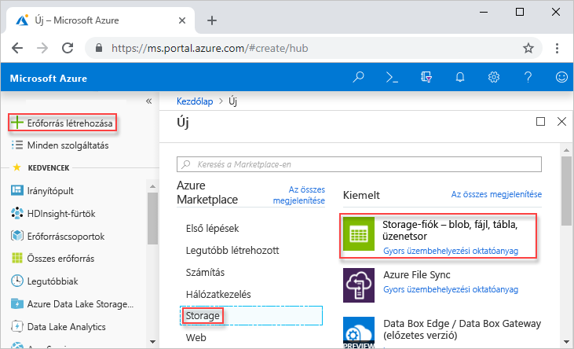
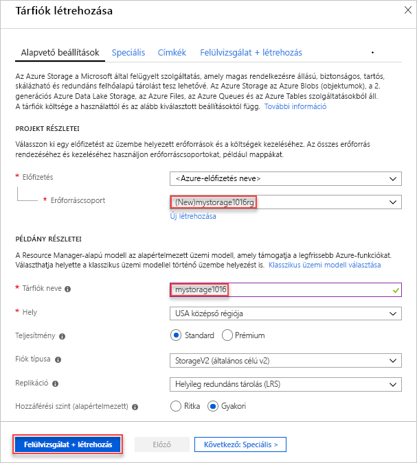
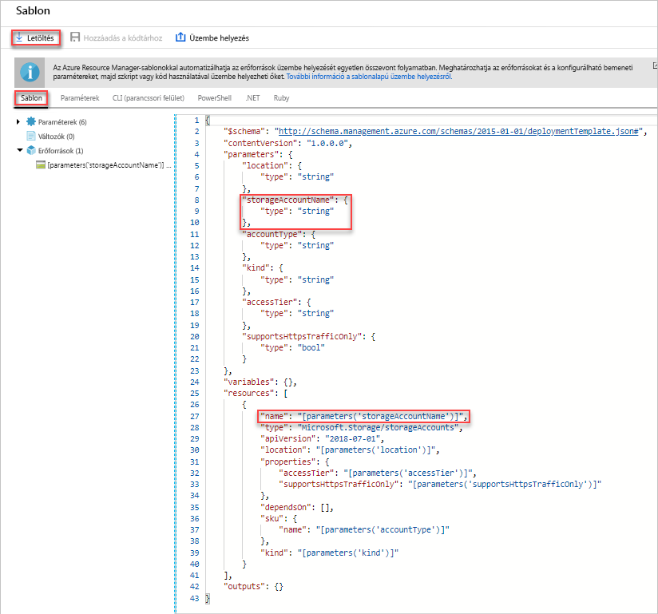
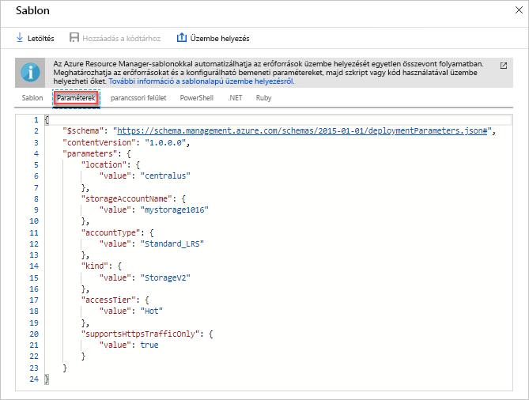
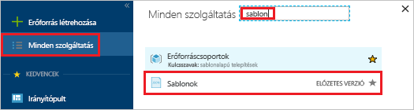
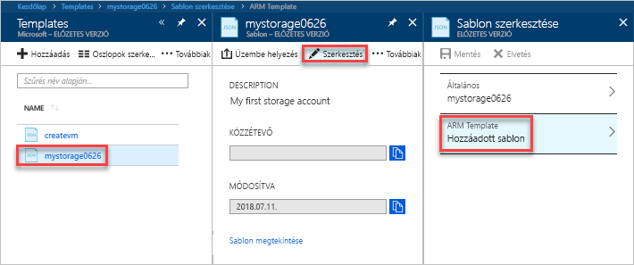
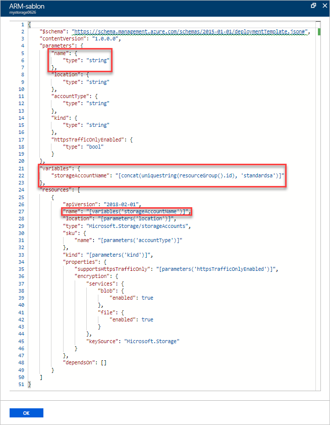
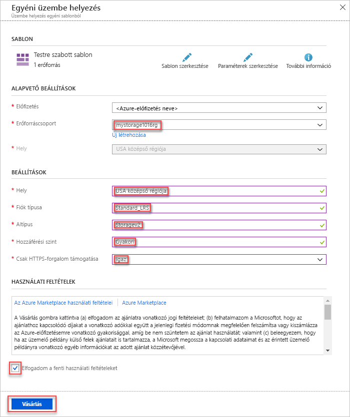
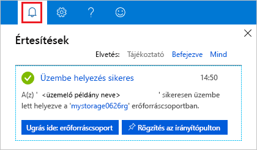
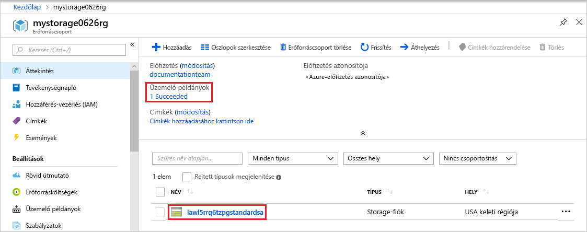

# <a name="quickstart-create-and-deploy-azure-resource-manager-templates-by-using-the-azure-portal"></a>Rövid útmutató: Azure Resource Manager-sablon létrehozása és üzembe helyezése az Azure Portalon

Ismerje meg, hogyan hozhatja létre első Azure Resource Manager-sablonját az Azure Portal használatával, és hogy hogyan szerkesztheti és helyezheti üzembe a Portalról.

A Resource Manager-sablonok JSON-fájlok, melyek az adott megoldáshoz telepítendő erőforrásokat határozzák meg. Sablon létrehozásához nem szükséges mindig az alapokról kezdeni a folyamatot. Ebből az oktatóanyagból megtudhatja, hogyan lehet sablont generálni az Azure Portalon. Ezt követően testre szabhatja, majd pedig üzembe is helyezheti a sablont.

A jelen oktatóanyag útmutatója alapján Azure Storage-fiókot fog létrehozni. Ugyanezzel a folyamattal más Azure-erőforrásokat is létre lehet hozni.

Ha nem rendelkezik Azure-előfizetéssel, [hozzon létre egy ingyenes fiókot](https://azure.microsoft.com/free/) a feladatok megkezdése előtt.

## <a name="generate-a-template-using-the-portal"></a>Sablon generálása az Azure Portal használatával

Ebben a szakaszban tárfiókot fog létrehozni az Azure Portal használatával. A tárfiók üzembe helyezése előtt lehetősége lesz ellenőrizni a sablont, amelyet a Portal az Ön konfigurációja alapján generált. A sablont későbbi használatra mentheti is.

1. Jelentkezzen be az [Azure Portalra](https://portal.azure.com).
2. Válassza az **Erőforrás létrehozása** > **Tárolás** > **Tárfiók - blob, fájl, tábla, üzenetsor** elemet.

    
3. Adja meg a következő információkat: Ügyeljen rá, hogy a következő lépésben a **Létrehozás** helyett az **Automatizálási lehetőségek** elemet válassza, így az üzembe helyezés előtt meg tudja nézni a sablont.

    - **Név**: adjon meg egy egyedi nevet a tárfióknak. A képernyőképen ez a név a *mystorage0626*.
    - **Erőforráscsoport**: hozzon létre egy új Azure-erőforráscsoportot egy Ön által választott névvel. A képernyőképen az erőforráscsoport neve *mystorage0626rg*.

    A többi tulajdonság esetén használhatja az alapértelmezett értékeket.

    

    > [!NOTE]
    > Üzembe helyezés előtt egyes exportált sablonokat szerkeszteni szükséges.

4. A képernyő alján válassza az **Automatizálási lehetőségek** elemet. A Portálon megjelenik a sablon a **Sablonok** lapon:

    

    A sablon a főoldalon látható. Ez egy JSON-fájl négy legfelső szintű elemmel. További információt az [Azure Resource Manager-sablonok struktúrája és szintaxisa](./resource-group-authoring-templates.md) című témakörben talál.

    A **Paraméter** elem alatt öt definiált paraméter látható. Az üzembe helyezés közben megadott értékeket a **Paraméterek** fül választásával nézheti meg.

    

    Ezek azok az értékek, amelyeket az előző szakaszban konfigurált. A sablon és a paraméterfájl együttes használatával létrehozható egy Azure-tárfiók.

5. A lapfülek fölött három menüelem látható:

    - **Letöltés**: A sablont és a paraméterfájlt letöltheti saját gépére.
    - **Hozzáadás dokumentumtárhoz**: A sablont későbbi felhasználáshoz hozzáadhatja a dokumentumtárhoz.
    - **Üzembe helyezés**: Az Azure-tárfiókot üzembe helyezheti az Azure-ban.

    Ebben az oktatóanyagban a **Hozzáadás a dokumentumtárhoz** lehetőséget használjuk.

6. Válassza a **Hozzáadás a dokumentumtárhoz** elemet.
7. Adjon meg **Nevet** és **Leírást**, majd válassza a **Mentés** lehetőséget.

> [!NOTE]
> A sablon-dokumentumtár funkció előzetes verzióban érhető el. A sablont a legtöbben saját számítógépükön, vagy egy nyilvános tárhelyen, például a GitHubon mentik.  

## <a name="edit-and-deploy-the-template"></a>Sablon szerkesztése és üzembe helyezése

Ebben a szakaszban a sablon-dokumentumtárból megnyitjuk a mentett sablont, a Portalon szerkesztjük, majd a módosított sablont üzembe is helyezzük. Ha összetettebb sablont szeretne szerkeszteni, érdemes a [Visual Studio Code](./resource-manager-quickstart-create-templates-use-visual-studio-code.md)-ot használni, amely kiterjedtebb szerkesztési funkciókat kínál.

Az Azure megköveteli, hogy minden Azure-szolgáltatás egyedi névvel rendelkezzen. Az üzembe helyezés meghiúsul, ha olyan tárfióknevet ad meg, amely már létezik. A hiba elkerülése érdekében a uniquestring() sablonfüggvényhívással egyedi tárfiókneveket hozhat létre.

1. Az Azure Portalon a bal oldali menüben válassza a **Minden szolgáltatás** elemet, a szűrő mezőbe írja be a **template** (sablon) szót, majd válassza a **Template (PREVIEW)** (Sablon - előzetes verzió) lehetőséget.

    
2. Válassza ki az előző szakaszban mentett sablont. A képernyőképen ez a név *mystorage0626*.
3. Válassza a **Szerkesztés**, majd a **Hozzáadott sablon** lehetőséget.

    

4. Adjon hozzá egy **változók** elemet, majd adjon hozzá egy változót, ahogy az alábbi képernyőképen látható:

    ```json
    "variables": {
        "storageAccountName": "[concat(uniquestring(resourceGroup().id), 'standardsa')]"
    },
    ```
    

    Itt két függvényt, a *concat()* és a *uniqueString()* függvényeket használjuk. A uniqueString() ahhoz használatos, hogy egyedi nevet hozzunk létre az erőforráshoz.

5. Távolítsa el az előző képernyőképen kiemelten megjelenő **name** (név) paramétert.
6. Frissítse a **Microsoft.Storage/storageAccounts** erőforrás név elemét, és a paraméter helyett használja az újonnan definiált változót:

    ```json
    "name": "[variables('storageAccountName')]",
    ```

    A végső sablon így fog kinézni:

    ```json
    {
        "$schema": "https://schema.management.azure.com/schemas/2015-01-01/deploymentTemplate.json#",
        "contentVersion": "1.0.0.0",
        "parameters": {
            "location": {
                "type": "string"
            },
            "accountType": {
                "type": "string"
            },
            "kind": {
                "type": "string"
            },
            "httpsTrafficOnlyEnabled": {
                "type": "bool"
            }
        },
        "variables": {
            "storageAccountName": "[concat(uniquestring(resourceGroup().id), 'standardsa')]"
        },
        "resources": [
            {
                "apiVersion": "2018-02-01",
                "name": "[variables('storageAccountName')]",
                "location": "[parameters('location')]",
                "type": "Microsoft.Storage/storageAccounts",
                "sku": {
                    "name": "[parameters('accountType')]"
                },
                "kind": "[parameters('kind')]",
                "properties": {
                    "supportsHttpsTrafficOnly": "[parameters('httpsTrafficOnlyEnabled')]",
                    "encryption": {
                        "services": {
                            "blob": {
                                "enabled": true
                            },
                            "file": {
                                "enabled": true
                            }
                        },
                        "keySource": "Microsoft.Storage"
                    }
                },
                "dependsOn": []
            }
        ]
    }
    ```
7. A változtatások mentéséhez válassza az **OK**, majd a **Mentés** lehetőséget.
8. Válassza az **Üzembe helyezés** lehetőséget.
9. Írja be a következő értékeket:

    - **Előfizetés**: válassza ki az Azure-előfizetést.
    - **Erőforráscsoport**: adjon egy egyedi nevet az erőforráscsoportnak.
    - **Hely**: válasszon egy helyet az erőforráscsoportnak.
    - **Hely**: válasszon egy helyet a tárfióknak.  Választhatja ugyanazt a helyet is, amelyet az erőforráscsoportnál megadott.
    - **Fiók típusa**: Ennél az útmutatónál adja meg a **Standard_LRS** nevet.
    - **Típus**: Ennél az útmutatónál a **Storage** (Tár) típust adja meg.
    - **Csak HTTPS-forgalom engedélyezett**.  Ehhez az útmutatóhoz válassza a **false** (hamis) értéket.
    - **Elfogadom a fenti feltételeket és kikötéseket**: (kiválasztás)

    Az alábbi képen egy minta üzembe helyezés látható:

    

10. Válassza a **Beszerzés** lehetőséget.
11. Az üzembe helyezés állapotát úgy nézheti meg, ha a képernyő felső részén kiválasztja a harang (értesítések) ikont.

    

12. Válassza az **Ugrás az erőforráscsoportra** lehetőséget az értesítési panelen. A következőhöz hasonló képernyő jelenik meg:

    

    Láthatja, hogy az üzembe helyezés állapota sikeres, és csak egyetlen tárfiók található az erőforráscsoportban. A tárfiók neve egy, a sablon által létrehozott egyedi sztring. Az Azure-tárfiókokkal kapcsolatos további információkért lásd: [Rövid útmutató: blobok feltöltése, letöltése és listázása az Azure Portal használatával](../storage/blobs/storage-quickstart-blobs-portal.md).

## <a name="clean-up-resources"></a>Az erőforrások eltávolítása

Ha már nincs szükség az Azure-erőforrásokra, törölje az üzembe helyezett erőforrásokat az erőforráscsoport törlésével.

1. Az Azure Portalon válassza az **Erőforráscsoportok** lehetőséget a bal menüben.
2. A **Szűrés név alapján** mezőben adja meg az erőforráscsoport nevét.
3. Válassza ki az erőforráscsoport nevét.  Az erőforráscsoportban megjelenik a tárfiók.
4. A felső menüben válassza az **Erőforráscsoport törlése** lehetőséget.

## <a name="next-steps"></a>További lépések

Ebben az oktatóanyagban megtanulta, hogyan generálható sablon az Azure Portalon, és hogyan helyezhető üzembe a sablon a Portal használatával. Ebben a rövid útmutatóban egy egyszerű sablont hoztunk létre, amelyben egyetlen Azure-erőforrás szerepel. Ha összetettebb sablonnal dolgozik, egyszerűbb a Visual Studio Code-ot vagy a Visual Studiót használni a sablon létrehozásához.

> [!div class="nextstepaction"]
> [Sablonok létrehozása a Visual Studio Code használatával](./resource-manager-quickstart-create-templates-use-visual-studio-code.md)
