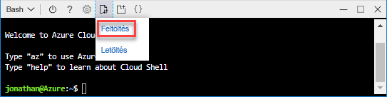
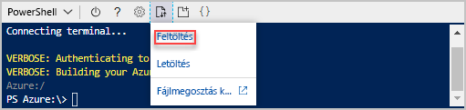

# <a name="quickstart-create-azure-resource-manager-templates-by-using-visual-studio-code"></a>Gyors útmutató: Az Azure Resource Manager-sablonok létrehozása a Visual Studio Code használatával

Útmutató Azure Resource Manager-sablonok létrehozásához és szerkesztéséhez a Visual Studio Code és az Azure Resource Manager Tools bővítmény használatával. Resource Manager-sablonokat a Visual Studio Code-ban a bővítmény nélkül is létrehozhat, a bővítmény azonban rendelkezik olyan automatikus kiegészítési szolgáltatásokkal, amelyek megkönnyítik a sablonok fejlesztését. Az Azure-megoldások telepítésével és kezelésével kapcsolatos fogalmak megismeréséhez lásd: [Az Azure Resource Manager áttekintése](resource-group-overview.md).

Ha nem rendelkezik Azure-előfizetéssel, [hozzon létre egy ingyenes fiókot](https://azure.microsoft.com/free/) a feladatok megkezdése előtt.

## <a name="prerequisites"></a>Előfeltételek

Az oktatóanyag elvégzéséhez az alábbiakra van szükség:

- [Visual Studio Code](https://code.visualstudio.com/).
- Resource Manager Tools bővítmény. A telepítéshez kövesse az alábbi lépéseket:

    1. Nyissa meg a Visual Studio Code-ot.
    2. A **CTRL+SHIFT+X** billentyűkombinációval nyissa meg a Bővítmények ablaktáblát
    3. Keresse meg az **Azure Resource Manager Tools** elemet, és válassza a **Telepítés** lehetőséget.
    4. A bővítmény telepítésének befejezéséhez válassza az **Újrabetöltés** lehetőséget.

## <a name="open-a-quickstart-template"></a>Gyorsindítási sablon megnyitása

Teljesen új sablon létrehozása helyett megnyithat egy sablont az [Azure gyorsindítási sablonok](https://azure.microsoft.com/resources/templates/) közül. Az Azure gyorsindítási sablonok a Resource Manager-sablonok tárházaként szolgálnak.

Az ebben a rövid útmutatóban használt sablon neve a következő: [Standard szintű tárfiók létrehozása](https://azure.microsoft.com/resources/templates/101-storage-account-create/). A sablon egy Azure Storage-fiókhoz tartozó erőforrást határoz meg.

1. A Visual Studio Code-ban válassza a **File** (Fájl) > **Open File** (Fájl megnyitása) elemet.
2. A **File name** (Fájlnév) mezőbe illessze be a következő URL-címet:

    ```url
    https://raw.githubusercontent.com/Azure/azure-quickstart-templates/master/101-storage-account-create/azuredeploy.json
    ```
3. Az **Open** (Megnyitás) kiválasztásával nyissa meg a fájlt.
4. A **File** (Fájl) > **Save as** (Mentés másként) lehetőség kiválasztásával mentheti a fájlt a helyi számítógépre, **azuredeploy.json** néven.

## <a name="edit-the-template"></a>A sablon szerkesztése

Működik az szerkesztése a Visual Studio Code egy sablont, hozzá kell adnia egy további elem be a `outputs` szakasz megjelenítéséhez a tároló URI azonosítója.

1. Egy további kimenet felvétele az exportált sablonba:

    ```json
    "storageUri": {
      "type": "string",
      "value": "[reference(variables('storageAccountName')).primaryEndpoints.blob]"
    }
    ```

    Ha elkészült, a kimeneti szakasz az alábbihoz hasonlóan néz ki:

    ```json
    "outputs": {
      "storageAccountName": {
        "type": "string",
        "value": "[variables('storageAccountName')]"
      },
      "storageUri": {
        "type": "string",
        "value": "[reference(variables('storageAccountName')).primaryEndpoints.blob]"
      }
    }
    ```

    Ha másolta és beillesztette a kódot a Visual Studio Code-ban, a **value** elem újbóli beírásával próbálhatja ki a Resource Manager Tools bővítmény IntelliSense képességét.

    

2. A fájl mentéséhez válassza a **Fájl**>**Mentés** lehetőséget.

## <a name="deploy-the-template"></a>A sablon üzembe helyezése

A sablonok üzembe helyezésének számos módszere létezik.  Ebben a rövid útmutatóban az Azure Portal Azure Cloud Shellt fogja használni. A Cloud shell egy webalkalmazás, amihez nincs szükség semmilyen konfigurációs. Támogatja az Azure parancssori felület és Azure PowerShell-lel.

1. Jelentkezzen be az [Azure Cloud Shellbe](https://shell.azure.com).

    
2. Válassza ki az Ön által preferált környezetben kiválasztásával vagy **PowerShell** vagy **Bash** a bal felső sarokban. A parancssori felület használatához Bash-munkamenetet kell megnyitnia. Azure PowerShell futtatásához, meg kell nyitnia egy PowerShell-munkamenetet. A Bash és a PowerShell közötti váltáshoz válassza a lefelé mutató nyilat. Lásd az előző képernyőképet. A váltáskor a felületet újra kell indítani.
3. Kattintson a **Fájlok feltöltése/letöltése**, majd a **Feltöltés** elemre.

    # <a name="clitabcli"></a>[Parancssori felület](#tab/CLI)

    
   
    # <a name="powershelltabpowershell"></a>[PowerShell](#tab/PowerShell)
    
    
    
    ---

    Válassza ki a korábbi szakaszban mentett fájlt. Alapértelmezés szerint a fájl neve a következő: **azuredeploy.json**. A sablonfájl a rendszerhéj elérhetőknek kell lenniük.

    Lehetősége van a **ls** parancsot, és a **cat** paranccsal ellenőrizheti, hogy a fájl feltöltése sikeresen befejeződött. 

    # <a name="clitabcli"></a>[Parancssori felület](#tab/CLI)

    
   
    # <a name="powershelltabpowershell"></a>[PowerShell](#tab/PowerShell)
    
    
    
    ---
4. Futtassa az alábbi parancsokat a Cloud Shellben. Válassza ki a megfelelő lapot a PowerShell-kód vagy a parancssori felület kód megjelenítéséhez.

    # <a name="clitabcli"></a>[Parancssori felület](#tab/CLI)
    ```azurecli
    echo "Enter the Resource Group name:" &&
    read resourceGroupName &&
    echo "Enter the name for this deployment:" &&
    read deploymentName &&
    echo "Enter the location (i.e. centralus):" &&
    read location &&
    az group create --name $resourceGroupName --location $location &&
    az group deployment create --name $deploymentName --resource-group $resourceGroupName --template-file "azuredeploy.json"
    ```
   
    # <a name="powershelltabpowershell"></a>[PowerShell](#tab/PowerShell)
    
    ```azurepowershell
    $resourceGroupName = Read-Host -Prompt "Enter the Resource Group name"
    $deploymentName = Read-Host -Prompt "Enter the name for this deployment"
    $location = Read-Host -Prompt "Enter the location (i.e. centralus)"
    
    New-AzureRmResourceGroup -Name $resourceGroupName -Location $location
    New-AzureRmResourceGroupDeployment -Name $deploymentName -ResourceGroupName $resourceGroupName -TemplateFile "azuredeploy.json"
    ```
    
    ---

    Ha a fájlt nem **azuredeploy.json** néven menti el, frissítse a sablonban a fájlnevet.

    A következő képernyőkép egy felületi üzembe helyezés mintáját mutatja be:

    # <a name="clitabcli"></a>[Parancssori felület](#tab/CLI)

    
   
    # <a name="powershelltabpowershell"></a>[PowerShell](#tab/PowerShell)
    
    
    
    ---

    A képernyőképen a tárfiók neve és a tár URL-címe ki van emelve a kimeneti szakaszban. A tárfiók nevére szükség lesz a következő lépésben.

5. Az alábbi parancssori felületi vagy PowerShell-parancs futtatásával megjelenítheti az újonnan létrehozott tárfiókot:

    # <a name="clitabcli"></a>[Parancssori felület](#tab/CLI)
    ```azurecli
    echo "Enter the Resource Group name:" &&
    read resourceGroupName &&
    echo "Enter the Storage Account name:" &&
    read storageAccountName &&
    az storage account show --resource-group $resourceGroupName --name $storageAccountName
    ```
   
    # <a name="powershelltabpowershell"></a>[PowerShell](#tab/PowerShell)
    
    ```azurepowershell
    $resourceGroupName = Read-Host -Prompt "Enter the Resource Group name"
    $storageAccountName = Read-Host -Prompt "Enter the Storage Account name"
    Get-AzureRmStorageAccount -ResourceGroupName $resourceGroupName -Name $storageAccountName
    ```
    
    ---

Az Azure storage-fiókok használatával kapcsolatos további tudnivalókért lásd: [a rövid útmutató: Blobok feltöltése, letöltése, és listát az Azure portal használatával](../storage/blobs/storage-quickstart-blobs-portal.md).

## <a name="clean-up-resources"></a>Az erőforrások eltávolítása

Ha már nincs szükség az Azure-erőforrásokra, törölje az üzembe helyezett erőforrásokat az erőforráscsoport törlésével.

1. Az Azure Portalon válassza az **Erőforráscsoport** lehetőséget a bal oldali menüben.
2. A **Szűrés név alapján** mezőben adja meg az erőforráscsoport nevét.
3. Válassza ki az erőforráscsoport nevét.  Összesen hat erőforrásnak kell lennie az erőforráscsoportban.
4. A felső menüben válassza az **Erőforráscsoport törlése** lehetőséget.

## <a name="next-steps"></a>További lépések

A rövid útmutató elsősorban az Azure-gyorssablonok közül egy meglévő sablon a Visual Studio Code-dal történő szerkesztését mutatja be. Azt is megtanulta, hogyan helyezheti üzembe a sablont az Azure Cloud shell a parancssori felület vagy a PowerShell használatával. Az Azure-gyorssablonok nem biztos, hogy minden tekintetben megfelelnek Önnek. A következő oktatóanyag azt mutatja be, hogyan keresheti meg a megfelelő információkat a sablonreferenciában titkosított Azure Storage-fiók létrehozásához.

> [!div class="nextstepaction"]
> [Titkosított tárfiók létrehozása](./resource-manager-tutorial-create-encrypted-storage-accounts.md)
