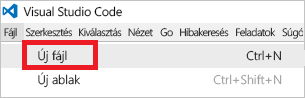
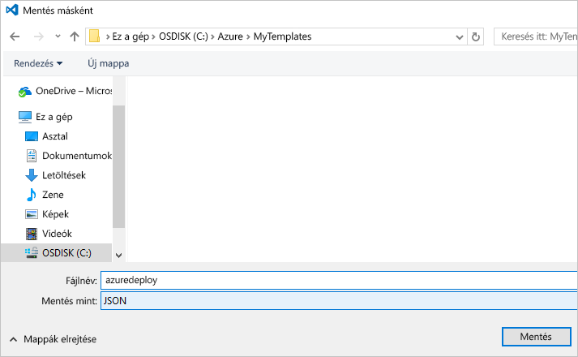

# <a name="use-visual-studio-code-extension-to-create-azure-resource-manager-template"></a>Azure Resource Manager-sablon létrehozása Visual Studio Code-bővítménnyel
Ez a cikk az Azure Resource Manager Tools-bővítmények telepítésének és használatának előnyeit mutatja be a Visual Studio Code-ban. Resource Manager-sablonokat a VS Code-ban a bővítmény nélkül is létrehozhat, a bővítmény azonban rendelkezik olyan automatikus kiegészítés szolgáltatásokkal, amelyek megkönnyítik a sablonok fejlesztését. A bővítmény a sablonban rendelkezésre álló sablonfüggvényekre, -paraméterekre és -változókra tesz javaslatot.

Az oktatóanyag elvégzéséhez szüksége lesz a [Visual Studio Code](https://code.visualstudio.com/) kódszerkesztőre.

Az Azure-megoldások telepítésével és kezelésével kapcsolatos fogalmak megismeréséhez lásd: [Az Azure Resource Manager áttekintése](resource-group-overview.md).

## <a name="create-the-template"></a>A sablon létrehozása

Ez a cikk [Az első Azure Resource Manager-sablon létrehozása ás üzembe helyezése](resource-manager-create-first-template.md) részben létrehozott sablont használja. Ha már rendelkezik ezzel a sablonnal, akkor kihagyhatja ezt a szakaszt.

1. Ha még létre kell hoznia ezt a sablont, akkor indítsa el a VS Code-ot. Válassza a **File** (Fájl) > **New File** (Új fájl) lehetőséget. 

   

2. Másolja és illessze be a következő JSON-szintaxist a létrehozott fájlba:

   ```json
   {
     "$schema": "http://schema.management.azure.com/schemas/2015-01-01/deploymentTemplate.json#",
     "contentVersion": "1.0.0.0",
     "parameters": {
       "storageSKU": {
         "type": "string",
         "allowedValues": [
           "Standard_LRS",
           "Standard_ZRS",
           "Standard_GRS",
           "Standard_RAGRS",
           "Premium_LRS"
         ],
         "defaultValue": "Standard_LRS",
         "metadata": {
           "description": "The type of replication to use for the storage account."
         }
       },   
       "storageNamePrefix": {
         "type": "string",
         "maxLength": 11,
         "defaultValue": "storage",
         "metadata": {
           "description": "The value to use for starting the storage account name. Use only lowercase letters and numbers."
         }
       }
     },
     "variables": {
       "storageName": "[concat(toLower(parameters('storageNamePrefix')), uniqueString(resourceGroup().id))]"
     },
     "resources": [
       {
         "name": "[variables('storageName')]",
         "type": "Microsoft.Storage/storageAccounts",
         "apiVersion": "2016-01-01",
         "sku": {
           "name": "[parameters('storageSKU')]"
         },
         "kind": "Storage",
         "location": "[resourceGroup().location]",
         "tags": {},
         "properties": {
           "encryption":{
             "services":{
               "blob":{
                 "enabled":true
               }
             },
             "keySource":"Microsoft.Storage"
           }
         }
       }
     ],
     "outputs": {  }
   }
   ```

3. Mentse ezt a fájlt **azuredeploy.json** néven egy helyi mappába.

   

## <a name="install-the-extension"></a>A bővítmény telepítése

1. A VS Code-ban válassza az **Extensions** (Bővítmények) lehetőséget.

   

2. Keresse meg az **Azure Resource Manager Tools** elemet, és válassza az **Install** (Telepítés) lehetőséget.

   

3. A bővítmény telepítésének befejezéséhez válassza a **Reload** (Újrabetöltés) lehetőséget.

## <a name="edit-the-template"></a>A sablon szerkesztése

1. Nyissa meg az azuredeploy.json fájlt.

2. A bővítmény lekéri az összes elérhető [sablonfüggvényt](resource-group-template-functions.md). Ezen kívül a bővítmény beolvassa a sablonban megadott paramétereket és változókat. A funkció működésének megtekintéséhez vegyen fel két értéket a kimeneti szakaszban. A sablon kimeneti szakaszának helyére illessze be a következőt:

   ```json
   "outputs": { 
       "groupLocation": {
         "type": "string",
         "value": ""
       },
       "storageUri": {
         "type": "string",
         "value": ""
       }
   }
   ```

3. Az érték megtekintéséhez vigye a kurzort a **groupLocation** idézőjeles szövegén belülre. Gépelje be a bal oldali zárójelet (`[`). Figyelje meg, hogy a bővítmény azonnal javaslatot tesz a rendelkezésre álló sablonfüggvényekre.

   

4. Kezdje el begépelni a következőt: **resourceGroup**. Ha megjelenik a(z) `resourceGroup()` függvény, nyomja le a Tab vagy az Enter billentyűt.

   

5. A bővítmény kitölti a függvény szintaxisát. A [resourceGroup](resource-group-template-functions-resource.md#resourcegroup) függvény nem fogad el paramétereket. Vegyen fel egy időtartamot a jobb oldali zárójelet követően. A bővítmény megadja a(z) `resourceGroup()` függvény által visszaadott objektum számára rendelkezésre álló tulajdonságokat. Válassza a(z) `location` lehetőséget.

   

6. A **hely** megadása után tegye ki a jobb oldali zárójelet.

   ```json
   "outputs": { 
       "groupLocation": {
         "type": "string",
         "value": "[resourceGroup().location]"
       },
       "storageUri": {
         "type": "string",
         "value": ""
       }
   }
   ```

7. Vigye a kurzort a **storageUri** idézőjeles szövegén belülre. Ismét gépelje be a bal oldali zárójelet. Kezdje el begépelni a következőt: **reference**. Ha kijelölte a kívánt függvényt, nyomja le a Tab vagy az Enter billentyűt.

   

8. A [reference](resource-group-template-functions-resource.md#reference) függvény az erőforrás-azonosító és az erőforrásnév paramétereket fogadja el. A tárfiók neve már megtalálható egy változóban. Gépelje be a **var** szöveget, majd nyomja le a Ctrl+Szóköz billentyűkombinációt. A bővítmény a variables függvény használatára tesz javaslatot.

   

   Nyomja le a Tab vagy az Enter billentyűt.

9. A [variables](resource-group-template-functions-deployment.md#variables) függvény használatához meg kell adni az adott változó nevét. A zárójeleken belül szimpla idézőjeleket használjon. A bővítmény megadja a sablonban meghatározott változók neveit.

    

10. Válassza ki a **storageName** változót. Tegye ki a jobb oldali zárójelet. Az alábbi példában a kimeneti szakasz szerepel:

   ```json
   "outputs": { 
       "groupLocation": {
         "type": "string",
         "value": "[resourceGroup().location]"
       },
       "storageUri": {
         "type": "string",
         "value": "[reference(concat('Microsoft.Storage/storageAccounts/',variables('storageName'))).primaryEndpoints.blob]"
       }
   }
   ```

A végső sablon a következő:

```json
{
  "$schema": "http://schema.management.azure.com/schemas/2015-01-01/deploymentTemplate.json#",
  "contentVersion": "1.0.0.0",
  "parameters": {
    "storageSKU": {
      "type": "string",
      "allowedValues": [
        "Standard_LRS",
        "Standard_ZRS",
        "Standard_GRS",
        "Standard_RAGRS",
        "Premium_LRS"
      ],
      "defaultValue": "Standard_LRS",
      "metadata": {
        "description": "The type of replication to use for the storage account."
      }
    },   
    "storageNamePrefix": {
      "type": "string",
      "maxLength": 11,
      "defaultValue": "storage",
      "metadata": {
        "description": "The value to use for starting the storage account name. Use only lowercase letters and numbers."
      }
    }
  },
  "variables": {
    "storageName": "[concat(toLower(parameters('storageNamePrefix')), uniqueString(resourceGroup().id))]"
  },
  "resources": [
    {
      "name": "[variables('storageName')]",
      "type": "Microsoft.Storage/storageAccounts",
      "apiVersion": "2016-01-01",
      "sku": {
        "name": "[parameters('storageSKU')]"
      },
      "kind": "Storage",
      "location": "[resourceGroup().location]",
      "tags": {},
      "properties": {
        "encryption":{
          "services":{
            "blob":{
              "enabled":true
            }
          },
          "keySource":"Microsoft.Storage"
        }
      }
    }
  ],
  "outputs": { 
    "groupLocation": {
      "type": "string",
      "value": "[resourceGroup().location]"
    },
    "storageUri": {
      "type": "string",
      "value": "[reference(concat('Microsoft.Storage/storageAccounts/',variables('storageName'))).primaryEndpoints.blob]"
    }
  }
}
```

## <a name="deploy-template"></a>Sablon üzembe helyezése

Készen áll a sablon üzembe helyezésére. A PowerShell vagy az Azure CLI használatával hozzon létre egy erőforráscsoportot. Ezután helyezze üzembe a tárfiókot az adott erőforráscsoporton.

* A PowerShell esetében használja az alábbi parancsokat a sablont tartalmazó könyvtárban:

   ```powershell
   Connect-AzureRmAccount
   
   New-AzureRmResourceGroup -Name examplegroup -Location "South Central US"
   New-AzureRmResourceGroupDeployment -ResourceGroupName examplegroup -TemplateFile azuredeploy.json
   ```

* Az Azure CLI helyi telepítése esetében használja az alábbi parancsokat a sablont tartalmazó könyvtárban:

   ```azurecli
   az login

   az group create --name examplegroup --location "South Central US"
   az group deployment create --resource-group examplegroup --template-file azuredeploy.json
   ```

Az üzembe helyezést követően a rendszer a kimeneti értékeket adja vissza.

## <a name="clean-up-resources"></a>Az erőforrások eltávolítása

Ha már nincs rájuk szükség, törölje az üzembe helyezett erőforrásokat az erőforráscsoport törlésével.

PowerShell esetén használja az alábbi parancsot:

```powershell
Remove-AzureRmResourceGroup -Name examplegroup
```

Azure CLI esetén használja az alábbi parancsot:

```azurecli
az group delete --name examplegroup
```

## <a name="next-steps"></a>További lépések
* A sablonok struktúrájával kapcsolatos további információk: [Azure Resource Manager-sablonok készítése](resource-group-authoring-templates.md).
* A tárfiókok tulajdonságaival kapcsolatos információkért lásd a [tárfióksablonok referenciáját](/azure/templates/microsoft.storage/storageaccounts).
* A különböző megoldástípusokhoz használható teljes sablonok megtekintéséhez lásd: [Azure gyorsindítási sablonok](https://azure.microsoft.com/documentation/templates/).
