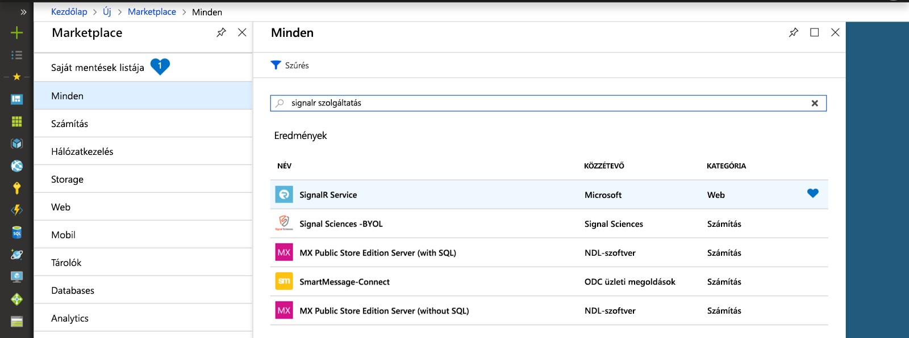
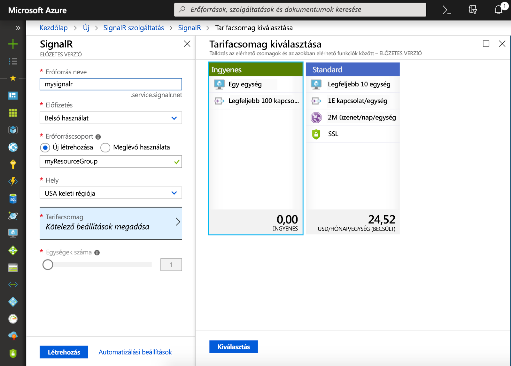

## Azure SignalR Service-példány létrehozása

Az alkalmazás egy SignalR Service-példányhoz fog csatlakozni az Azure-ban.

1. Kattintson az Azure Portal bal felső sarkában található Új gombra. Az Új képernyőn írja be a keresőmezőbe a *SignalR Service* kifejezést, majd nyomja le az Enter billentyűt.

    

1. A keresési eredmények között válassza ki a **SignalR Service** elemet, majd a **Létrehozás** lehetőséget.

1. Adja meg az alábbi beállításokat.

    | Beállítás      | Ajánlott érték  | Leírás                                        |
    | ------------ |  ------- | -------------------------------------------------- |
    | **Erőforrás neve** | Globálisan egyedi név | Az új SignalR Service-példányt azonosító név. Érvényes karakterek: `a-z`, `0-9` és `-`.  | 
    | **Előfizetés** | Az Ön előfizetése | Az új SignalR Service-példány létrehozásához használt előfizetés. | 
    | **[Erőforráscsoport](../../azure-resource-manager/management/overview.md)** |  myResourceGroup | Az új erőforráscsoport neve, amelyben létrehozza a SignalR Service-példányt. | 
    | **Hely** | USA nyugati régiója | Válasszon egy Önhöz közeli [régiót](https://azure.microsoft.com/regions/). |
    | **Tarifacsomag** | Ingyenes | Az Azure SignalR Service-t ingyenesen is kipróbálhatja. |
    | **Egységek száma** |  Nem alkalmazható | Az egységek száma azt határozza meg, hogy a SignalR Service-példány hány kapcsolatot tud elfogadni. Ez a beállítás csak a Standard szinten konfigurálható. |
    | **Szolgáltatási mód** |  Kiszolgáló nélküli | Azure Functions vagy REST API használatával. |

    

1. A SignalR Service-példány üzembe helyezésének megkezdéséhez kattintson a **Létrehozás** gombra.

1. A példány üzembe helyezése után nyissa meg a portálon, és keresse meg a beállítások lapot. A szolgáltatás mód beállítása csak *kiszolgáló* nélkülire módosítható, ha Azure functions kötés vagy REST API használatával használja az Azure signaler szolgáltatást. Hagyja meg *klasszikus* vagy *alapértelmezett* módon.