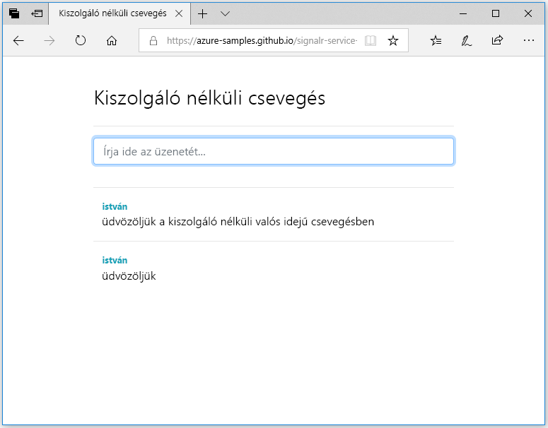

## A webalkalmazás futtatása

1. A folyamat megkönnyítése érdekében a GitHubon megtalálható egy egyoldalas, mintául szolgáló webalkalmazás. Nyissa meg a böngészőben a következő webhelyet: [https://azure-samples.github.io/signalr-service-quickstart-serverless-chat/demo/chat/](https://azure-samples.github.io/signalr-service-quickstart-serverless-chat/demo/chat/).

    > [!NOTE]
    > A HTML-fájl forrásának helye: [/docs/demo/chat/index.html](https://github.com/Azure-Samples/signalr-service-quickstart-serverless-chat/blob/master/docs/demo/chat/index.html).

1. Ha a rendszer felkéri a függvényalkalmazás kiindulási URL-címének megadására, írja be a következőt: *http://localhost:7071*.

1. Amikor a rendszer erre kéri, adja meg a felhasználónevet.

1. A webalkalmazás meghívja a *GetSignalRInfo* függvényt a függvényalkalmazásban az Azure SignalR Service-hez való kapcsolódáshoz szükséges kapcsolatadatok lekéréséhez. Ha a kapcsolat létrejött, megjelenik a csevegőüzenet beviteli mezője.

1. Írja be az üzenetet, és nyomja le az Enter billentyűt. Az alkalmazás elküldi az üzenetet a *SendMessage* függvénynek az Azure Functions-alkalmazásban, amely ezt követően SignalR kimeneti kötés használatával továbbítja az üzenetet az összes csatlakoztatott ügyfélnek. Ha minden megfelelően működik, akkor az üzenetnek meg kell jelennie az alkalmazásban.

    

1. Nyissa meg a webalkalmazás egy másik példányát egy másik böngészőablakban. Látni fogja, hogy az elküldött üzenet az alkalmazás összes példányában megjelenik.