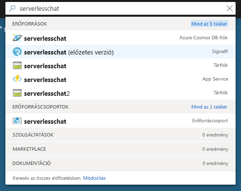
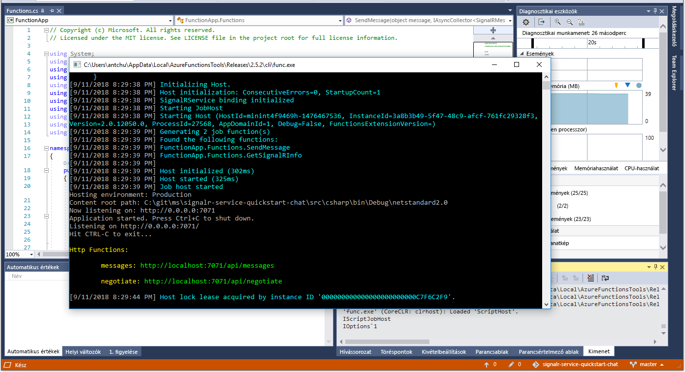

# <a name="quickstart-create-a-chat-room-with-azure-functions-and-signalr-service-using-c"></a>Gyors útmutató: Csevegőszoba létrehozása az Azure Functions és a SignalR szolgáltatáshoz C használatával\#

Az Azure SignalR szolgáltatás használatával egyszerűen adhat hozzá valós idejű funkciókat az alkalmazásához. Az Azure Functions egy kiszolgáló nélküli platform, amellyel infrastruktúra kezelése nélkül futtathat kódokat. Ennek a rövid útmutatónak a segítségével megtanulhatja, hogyan készíthet kiszolgáló nélküli, valós idejű csevegőalkalmazást a SignalR szolgáltatás és a Functions használatával.

## <a name="prerequisites"></a>Előfeltételek

Ha nincs telepítve a Visual Studio 2017, letöltheti és használhatja az **ingyenes** [Visual Studio 2017 Community Edition](https://www.visualstudio.com/downloads/)t. Ügyeljen arra, hogy engedélyezze az **Azure Development** használatát a Visual Studio telepítése során.

Ebben az oktatóanyagban futtathatja a parancssorból (macOS, Windows vagy Linux) használatával a [Azure Functions Core Tools (v2)](https://github.com/Azure/azure-functions-core-tools#installing), a [.NET Core SDK](https://dotnet.microsoft.com/download), és a kedvenc Kódszerkesztő.

[!INCLUDE [quickstarts-free-trial-note](../../includes/quickstarts-free-trial-note.md)]

## <a name="log-in-to-azure"></a>Jelentkezzen be az Azure-ba

Jelentkezzen be az Azure Portalra a <https://portal.azure.com/> webhelyen az Azure-fiókjával.

[!INCLUDE [Create instance](includes/signalr-quickstart-create-instance.md)]

[!INCLUDE [Clone application](includes/signalr-quickstart-clone-application.md)]

## <a name="configure-and-run-the-azure-function-app"></a>Az Azure-függvényalkalmazás konfigurálása és futtatása

1. Indítsa el a Visual Studio (vagy egy másik Kódszerkesztő), és nyissa meg a megoldás a *chat\src\csharp* a klónozott adattár mappát.

1. A böngészőben, amelyben meg van nyitva az Azure Portal, a portál tetején levő keresőmezőben a példány nevére való kereséssel ellenőrizze, hogy a korábban üzembe helyezett SignalR-szolgáltatáspéldány sikeresen létrejött-e. A megnyitáshoz válassza ki a példányt.

    

1. Válassza a **Kulcsok** elemet a SignalR-szolgáltatáspéldány kapcsolati sztringjeinek megtekintéséhez.

1. Válassza ki és másolja a vágólapra az elsődleges kapcsolati sztring értékét.

1. A Visual Studio Megoldáskezelőjében nevezze át a *local.settings.sample.json* fájlt a következőre: *local.settings.json*.

1. A **local.settings.json** fájlban illessze be a kapcsolati sztringet az **AzureSignalRConnectionString** beállítás értékéhez. Mentse a fájlt.

1. Nyissa meg a **Functions.cs** alkalmazást. Ebben a függvényalkalmazásban két HTTP által indított függvény található:

    - **GetSignalRInfo** – A *SignalRConnectionInfo* bemeneti kötést használja érvényes kapcsolatadatok létrehozásához és visszaadásához.
    - **SendMessage** – A kéréstörzsben fogadja a csevegés üzenetét, és a *SignalR* kimeneti kötés használatával továbbítja azt az összes csatlakoztatott ügyfélalkalmazás számára.

1. Helyileg az Azure-függvény alkalmazás indításához használja az alábbi lehetőségek közül.

    - **Visual Studio**: A *Hibakeresés* menüben válassza a *Hibakeresés indítása* elemet az alkalmazás futtatásához.

        

    - **Parancssor**: Hajtsa végre a következő parancsot a függvény gazdagép indítása.

        ```bash
        func start
        ```

[!INCLUDE [Run web application](includes/signalr-quickstart-run-web-application.md)]

[!INCLUDE [Cleanup](includes/signalr-quickstart-cleanup.md)]

## <a name="next-steps"></a>További lépések

Ebben a rövid útmutatóban létrehozott, és futtatta egy valós idejű kiszolgáló nélküli alkalmazást a Visual Studióban. A következő lépésként tudjon meg többet az Azure-függvények Visual Studióval való fejlesztéséről és üzembe helyezéséről.

> [!div class="nextstepaction"]
> [Azure-függvények fejlesztése a Visual Studióval](../azure-functions/functions-develop-vs.md)