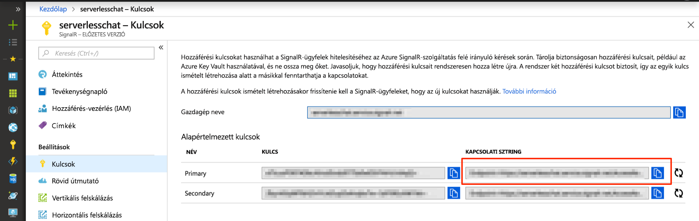

# <a name="quickstart-create-a-chat-room-with-azure-functions-and-signalr-service-using-javascript"></a>Rövid útmutató: Csevegőszoba létrehozása az Azure Functions és a SignalR szolgáltatás használatával JavaScript nyelven.

Az Azure SignalR szolgáltatás használatával egyszerűen adhat hozzá valós idejű funkciókat az alkalmazásához. Az Azure Functions egy kiszolgáló nélküli platform, amellyel infrastruktúra kezelése nélkül futtathat kódokat. Ennek a rövid útmutatónak a segítségével megtanulhatja, hogyan készíthet kiszolgáló nélküli, valós idejű csevegőalkalmazást a SignalR szolgáltatás és a Functions használatával.


## <a name="prerequisites"></a>Előfeltételek

Ez a rövid útmutató macOS, Windows vagy Linux rendszeren is futtatható.

Ellenőrizze, hogy van-e telepítve valamilyen kódszerkesztő, például a [Visual Studio Code](https://code.visualstudio.com/).

Telepítse az [Azure Functions Core Tools (v2)](https://github.com/Azure/azure-functions-core-tools#installing) eszközkészletet az Azure-függvényalkalmazások helyi futtatásához.

A bővítmények telepítéséhez az Azure Functions Core Tools jelenleg igényli, hogy a [.NET Core SDK](https://www.microsoft.com/net/download) telepítve legyen. A JavaScript-alapú Azure-függvényalkalmazások létrehozásához azonban nem szükséges a .NET ismerete.

[!INCLUDE [quickstarts-free-trial-note](../../includes/quickstarts-free-trial-note.md)]


## <a name="log-in-to-azure"></a>Jelentkezzen be az Azure-ba

Jelentkezzen be az Azure Portalra a <https://portal.azure.com/> webhelyen az Azure-fiókjával.


[!INCLUDE [Create instance](includes/signalr-quickstart-create-instance.md)]

[!INCLUDE [Clone application](includes/signalr-quickstart-clone-application.md)]


## <a name="configure-and-run-the-azure-function-app"></a>Az Azure-függvényalkalmazás konfigurálása és futtatása

1. A böngészőben, amelyben meg van nyitva az Azure Portal, a portál tetején levő keresőmezőben a példány nevére való kereséssel ellenőrizze, hogy a korábban üzembe helyezett SignalR-szolgáltatáspéldány sikeresen létrejött-e. A megnyitáshoz válassza ki a példányt.

    

1. Válassza a **Kulcsok** elemet a SignalR-szolgáltatáspéldány kapcsolati sztringjeinek megtekintéséhez.

1. Válassza ki és másolja a vágólapra az elsődleges kapcsolati sztring értékét.

    

1. A kódszerkesztőjében nyissa meg a klónozott adattár *chat/src/javascript* mappáját.

1. Nevezze át a *local.settings.sample.json* fájlt *local.settings.json* névre.

1. A **local.settings.json** fájlban illessze be a kapcsolati sztringet az **AzureSignalRConnectionString** beállítás értékéhez. Mentse a fájlt.

1. A JavaScript-függvények mappákba vannak rendezve. Minden mappában két fájl található: a *function.json* határozza meg a függvényben használt kötéseket, az *index.js* pedig a függvény törzse. Ebben a függvényalkalmazásban két HTTP által indított függvény található:

    - **negotiate** – A *SignalRConnectionInfo* bemeneti kötést használja érvényes kapcsolatadatok létrehozásához és visszaküldéséhez.
    - **messages** – A kéréstörzsben fogadja a csevegés üzenetét, és a *SignalR* kimeneti kötés használatával továbbítja azt az összes csatlakoztatott ügyfélalkalmazás számára.

1. A terminálon lépjen a *chat/src/javascript* mappába. Az Azure Functions Core Tools segítségével telepítse az alkalmazás futtatásához szükséges bővítményeket.

    ```bash
    func extensions install
    ```

1. Futtassa a függvényalkalmazást.

    ```bash
    func start
    ```

    


[!INCLUDE [Run web application](includes/signalr-quickstart-run-web-application.md)]


[!INCLUDE [Cleanup](includes/signalr-quickstart-cleanup.md)]

## <a name="next-steps"></a>További lépések

Ennek a rövid útmutatónak a segítségével egy valós idejű, kiszolgáló nélküli alkalmazást készített el és futtatott a Visual Studióban. A következő lépésként tudjon meg többet az Azure-függvények Visual Studióval való fejlesztéséről és üzembe helyezéséről.

> [!div class="nextstepaction"]
> [Azure-függvények fejlesztése a Visual Studióval](../azure-functions/functions-develop-vs.md)