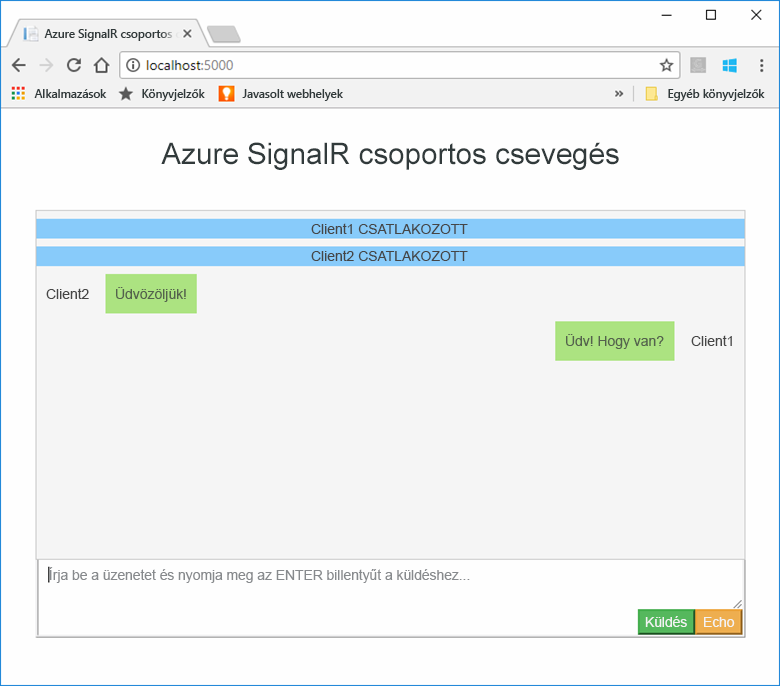
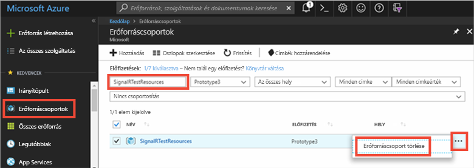

# <a name="quickstart-create-a-chat-room-with-signalr-service"></a>Rövid útmutató: Csevegőszoba létrehozása a SignalR szolgáltatással

A Microsoft Azure SignalR szolgáltatás jelenleg [Nyilvános előzetes verzióban](https://azure.microsoft.com/support/legal/preview-supplemental-terms/) van.

Az Azure SignalR szolgáltatás egy olyan Azure-szolgáltatás, amely segítségével a fejlesztők könnyen hozhatnak létre webalkalmazásokat valós idejű funkciókkal. Ez a szolgáltatás a [SignalR for ASP.NET Core 2.0](https://docs.microsoft.com/aspnet/core/signalr/introduction)-n alapul.

Ez a cikk segítséget nyújt az első lépések megtételében az Azure SignalR szolgáltatás használatakor. Ebben a rövid útmutatóban létrehoz egy csevegőalkalmazást egy ASP.NET Core MVC webalkalmazással. Az alkalmazás kapcsolatot létesít az Azure SignalR szolgáltatási erőforrással a valós idejű tartalomfrissítések engedélyezéséhez. A webalkalmazást helyben fogja üzemeltetni, és több böngészőügyfélhez csatlakozik. Minden ügyfél képes lesz tartalomfrissítéseket küldeni a többi ügyfélnek. 


A rövid útmutató lépései bármilyen szövegszerkesztővel elvégezhetők. A [Visual Studio Code](https://code.visualstudio.com/) például jó választás lehet, és Windows, macOS és Linux platformokon is használható.

Az oktatóanyag kódja letölthető az [AzureSignalR-minták GitHub-adattárjából](https://github.com/aspnet/AzureSignalR-samples/tree/master/samples/ChatRoom).  A rövid útmutatóban használt Azure-erőforrások a [SignalR szolgáltatást létrehozó szkripttel](scripts/signalr-cli-create-service.md) készíthetőek el.



[!INCLUDE [quickstarts-free-trial-note](../../includes/quickstarts-free-trial-note.md)]


## <a name="prerequisites"></a>Előfeltételek

* Telepítse a [.NET Core SDK-t](https://www.microsoft.com/net/download/windows).
* Töltse le vagy klónozza az [AzureSignalR-sample](https://github.com/aspnet/AzureSignalR-samples) GitHub-adattárat. 

## <a name="create-an-azure-signalr-resource"></a>Azure SignalR-erőforrás létrehozása

[!INCLUDE [azure-signalr-create](../../includes/signalr-create.md)]

## <a name="create-an-aspnet-core-web-app"></a>ASP.NET Core-webalkalmazás létrehozása

Ebben a szakaszban a [.NET Core parancssori felülete (CLI)](https://docs.microsoft.com/dotnet/core/tools/) segítségével egy új ASP.NET Core MVC webalkalmazás-projektet hoz létre. A .NET Core CLI előnye a Visual Studióval szemben az, hogy Windows, macOS és Linux platformokon is használható. 

1. Hozzon létre egy új mappát a projekthez. Ebben a rövid útmutatóban az *E:\Testing\chattest* mappát használjuk.

2. Az új mappában hozzon létre egy új ASP.NET Core MVC webalkalmazás-projektet a következő paranccsal:

        dotnet new mvc


## <a name="add-secret-manager-to-the-project"></a>A Secret Manager hozzáadása a projekthez

Ebben a szakaszban hozzáadja a [Secret Manager eszközt](https://docs.microsoft.com/aspnet/core/security/app-secrets) a projekthez. A Secret Manager eszköz tárolja a projektfán kívüli fejlesztési feladatokhoz tartozó bizalmas adatokat. Ez a módszer megakadályozza, hogy véletlenül megossza az alkalmazás forráskódbeli titkos kódjait.

1. Nyissa meg a *.csproj* fájlt. Adjon hozzá egy `DotNetCliToolReference` elemet a *Microsoft.Extensions.SecretManager.Tools* belefoglalásához. Adjon hozzá egy `UserSecretsId` elemet is az alábbiakban látható módon, és mentse a fájlt.

    *chattest.csproj:*

    ```xml
    <Project Sdk="Microsoft.NET.Sdk.Web">
    <PropertyGroup>
        <TargetFramework>netcoreapp2.0</TargetFramework>
        <UserSecretsId>SignalRChatRoomEx</UserSecretsId>
    </PropertyGroup>
    <ItemGroup>
        <PackageReference Include="Microsoft.AspNetCore.All" Version="2.0.0" />
    </ItemGroup>
    <ItemGroup>
        <DotNetCliToolReference Include="Microsoft.VisualStudio.Web.CodeGeneration.Tools" Version="2.0.0" />
        <DotNetCliToolReference Include="Microsoft.Extensions.SecretManager.Tools" Version="2.0.0" />
    </ItemGroup>
    </Project>    
    ```

## <a name="add-azure-signalr-to-the-web-app"></a>Az Azure SignalR hozzáadása a webalkalmazáshoz

1. Adjon hozzá egy, a `Microsoft.Azure.SignalR` NuGet-csomagra mutató hivatkozást a következő parancs futtatásával:

        dotnet add package Microsoft.Azure.SignalR -v 1.0.0-*

2. A projekt csomagjainak visszaállításához futtassa a következő parancsot.

        dotnet restore

3. Adjon hozzá egy *Azure:SignalR:ConnectionString* nevű titkos kódot a Secret Managerhez. 

    Ez a titkos kód tartalmazza a SignalR szolgáltatási erőforrás elérésére szolgáló kapcsolati sztringet. A SignalR alapértelmezés szerint az *Azure:SignalR:ConnectionString* konfigurációs kulcsot keresi a kapcsolat létrehozásához. Cserélje le az értéket az alábbi parancsban a SignalR szolgáltatási erőforráshoz tartozó kapcsolati sztringre.

    Ezt a parancsot abban a könyvtárban kell végrehajtani, ahol a *.csproj* fájl található.

    ```
    dotnet user-secrets set Azure:SignalR:ConnectionString "Endpoint=<Your endpoint>;AccessKey=<Your access key>;"    
    ```

    A Secret Managerre csak addig van szükség a webalkalmazás teszteléséhez, amíg azt helyben futtatja. Egy későbbi oktatóanyagban a webes csevegőalkalmazást üzembe fogja helyezni az Azure-ban. Amikor a webalkalmazást az Azure-ban üzemelteti, a kapcsolati sztring Secret Managerben való tárolása helyett egy alkalmazásbeállítást fog használni.

    A titkos kulcs a konfigurációs API-val érhető el. A konfigurációs API-val a konfigurációk nevében használható a kettőspont (:) az összes támogatott platformon. Lásd [az egyes környezetek konfigurációs lehetőségeit](https://docs.microsoft.com/aspnet/core/fundamentals/configuration/index?tabs=basicconfiguration&view=aspnetcore-2.0#configuration-by-environment) bemutató cikket. 


4. Nyissa meg a *Startup.cs* fájlt, és frissítse a `ConfigureServices` metódust úgy, hogy a `services.AddSignalR().AddAzureSignalR()` metódus meghívásával használja az Azure SignalR szolgáltatást:

    ```csharp
    public void ConfigureServices(IServiceCollection services)
    {
        services.AddMvc();
        services.AddSignalR().AddAzureSignalR();
    }
    ```

    Azáltal, hogy nem ad meg paramétert az `AddAzureSignalR()` metódushoz, ez a kód az alapértelmezett *Azure:SignalR:ConnectionString* konfigurációs kulcsot használja a SignalR szolgáltatási erőforrás kapcsolati sztringjeként.

5. Még a *Startup.cs* fájlban módosítsa a `Configure` metódust az `app.UseStaticFiles()` meghívása helyett az alábbi kódra, majd mentse a fájlt.

    ```csharp
    app.UseFileServer();
    app.UseAzureSignalR(routes =>
    {
        routes.MapHub<Chat>("/chat");
    });
    ```            

### <a name="add-a-hub-class"></a>Központosztály hozzáadása

A SignalRben a központ egy olyan alapvető összetevő, amely egy ügyfélről meghívható metódusokat tesz elérhetővé. Ebben a szakaszban meghatároz egy központosztályt két metódussal: 

* `Broadcast`: Ez a metódus üzenetet küld az összes ügyfélnek.
* `Echo`: Ez a metódus visszaküld egy üzenetet a hívónak.

Mindkét metódus az ASP.NET Core SignalR SDK által biztosított `Clients` csatolót használja. Ez a csatoló hozzáférést biztosít az összes csatlakozó ügyfélhez, így lehetősége van tartalmat leküldeni az ügyfeleknek.

1. A projektkönyvtárban adjon hozzá egy új, *Hub* nevű mappát. Az új mappához adjon hozzá egy új, *Chat.cs* nevű központkódfájlt.

2. Adja hozzá a következő kódot a *Chat.cs* fájlhoz a központosztály meghatározásához, és mentse a fájlt. 

    Ha nem a *chattest* projektnevet használta, frissítse az osztály névterét.

    ```csharp
    using Microsoft.AspNetCore.SignalR;

    namespace chattest
    {

        public class Chat : Hub
        {
            public void BroadcastMessage(string name, string message)
            {
                Clients.All.SendAsync("broadcastMessage", name, message);
            }

            public void Echo(string name, string message)
            {
                Clients.Client(Context.ConnectionId).SendAsync("echo", name, message + " (echo from server)");
            }
        }
    }
    ```

### <a name="add-the-web-app-client-interface"></a>A webalkalmazás ügyfélcsatolójának hozzáadása

A csevegőszoba-alkalmazás ügyféloldali felhasználói felülete HTML- és JavaScript-kódból fog állni az *index.html* fájlban, amely a *wwwroot* fájlban található.

Másolja az *index.html* fájlt, valamint a *css* és a *scripts* mappát a [mintaadattár](https://github.com/aspnet/AzureSignalR-samples/tree/master/samples/ChatRoom/wwwroot) *wwwroot* mappájából a projekt *wwwroot* mappájába.

Az *index.html* fő kódja: 

```javascript
var connection = new signalR.HubConnectionBuilder()
                            .withUrl('/chat')
                            .build();
bindConnectionMessage(connection);
connection.start()
    .then(function () {
        onConnected(connection);
    })
    .catch(function (error) {
        console.error(error.message);
    });
```    

Az *index.html* fájlban lévő kód a `HubConnectionBuilder.build()` meghívásával hoz létre HTTP-kapcsolatot az Azure SignalR-erőforrással.

Ha a kapcsolat sikeresen létrejött, át lesz adva a `bindConnectionMessage` számára, amely eseménykezelőket ad a bejövő tartalomhoz, amely le lesz küldve az ügyfélnek. 

A `HubConnection.start()` kommunikálni kezd a központtal. A kommunikáció elindítása után az `onConnected()` hozzáadja az eseménykezelőket. Ezek az eseménykezelők a kapcsolat segítségével engedélyezik, hogy ez az ügyfél tartalomfrissítéseket küldjön le az összes csatlakozott ügyfélnek.

## <a name="add-a-development-runtime-profile"></a>Fejlesztési futtatási profil hozzáadása

Ebben a szakaszban egy fejlesztési futtatási környezetet fog hozzáadni az ASP.NET Core-hoz. További információt az ASP.NET Core futtatási környezetével kapcsolatban [az ASP.NET Core különböző környezetekben való használatát](https://docs.microsoft.com/aspnet/core/fundamentals/environments) ismertető cikkben olvashat.

1. Hozzon létre egy új, *Properties* nevű mappát a projekthez.

2. Adjon hozzá egy új, *launchSettings.json* nevű fájlt a mappához az alábbi tartalommal, és mentse a fájlt.

    ```json
    {
        "profiles" : 
        {
            "ChatRoom": 
            {
                "commandName": "Project",
                "launchBrowser": true,
                "environmentVariables": 
                {
                    "ASPNETCORE_ENVIRONMENT": "Development"
                },
                "applicationUrl": "http://localhost:5000/"
            }
        }
    }
    ```


## <a name="build-and-run-the-app-locally"></a>Az alkalmazás létrehozása és futtatása helyben

1. Ha az alkalmazást a .NET Core CLI használatával szeretné létrehozni, futtassa a következő parancsot a parancsfelületen:

        dotnet build

2. Ha a létrehozás sikeresen befejeződött, hajtsa végre a következő parancsot a webalkalmazás helyben való futtatásához:

        dotnet run

    Az alkalmazást a rendszer helyben az 5000 számú porton üzemelteti, ahogyan az a fejlesztési futtatási profilban konfigurálva van:

        E:\Testing\chattest>dotnet run
        Hosting environment: Development
        Content root path: E:\Testing\chattest
        Now listening on: http://localhost:5000
        Application started. Press Ctrl+C to shut down.    

3. Nyisson meg két böngészőablakot, és mindkettőben lépjen a `http://localhost:5000` helyre. A rendszer fel fogja szólítani a neve megadására. Adjon meg egy ügyfélnevet mindkét ügyfélnek, és a **Küldés** gombbal tesztelje az üzenettartalom leküldését a két ügyfél között.

    


## <a name="clean-up-resources"></a>Az erőforrások eltávolítása

Ha azt tervezi, hogy a következő oktatóanyaggal folytatja, megtarthatja és a következő oktatóanyagban újból felhasználhatja az ebben a rövid útmutatóban létrehozott erőforrásokat.

Ha azonban befejezte az oktatóanyag mintaalkalmazásának használatát, a díjak elkerülése érdekében törölheti az ebben a rövid útmutatóban létrehozott Azure-erőforrásokat. 

> [!IMPORTANT]
> Az erőforráscsoport törlése nem vonható vissza; az erőforráscsoport és a benne foglalt erőforrások véglegesen törlődnek. Figyeljen arra, hogy ne töröljön véletlenül erőforráscsoportot vagy erőforrásokat. Ha a jelen minta üzemeltetését végző erőforrásokat egy meglévő, megtartani kívánt erőforrásokat tartalmazó erőforráscsoportban hozta létre, az erőforrásokat az erőforráscsoport törlése helyett külön-külön törölheti a megfelelő panelekről.
> 
> 

Jelentkezzen be az [Azure Portalra](https://portal.azure.com), és kattintson az **Erőforráscsoportok** elemre.

A **Szűrés név alapján...** mezőbe írja be az erőforráscsoport nevét. Ebben a rövid útmutatóban a *SignalRTestResources* nevű erőforráscsoportot használtuk. Az eredménylistában kattintson a **…** ikonra az erőforráscsoport mellett, majd kattintson az **Erőforráscsoport törlése** elemre.

   



A rendszer az erőforráscsoport törlésének megerősítését fogja kérni. A megerősítéshez írja be az erőforráscsoport nevét, és kattintson a **Törlés** gombra.
   
A rendszer néhány pillanaton belül törli az erőforráscsoportot és a benne foglalt erőforrásokat.


## <a name="next-steps"></a>További lépések

Ebben a rövid útmutatóban létrehozott egy új Azure SignalR szolgáltatási erőforrást, és egy ASP.NET Core webalkalmazással együtt használva valós idejű tartalomfrissítéseket küldött le több csatlakoztatott ügyfélnek. Az Azure SignalR szolgáltatásról a következő, hitelesítést bemutató oktatóanyagban tudhat meg többet.

> [!div class="nextstepaction"]
> [Azure SignalR szolgáltatás – hitelesítés](./signalr-authenticate-oauth.md)


