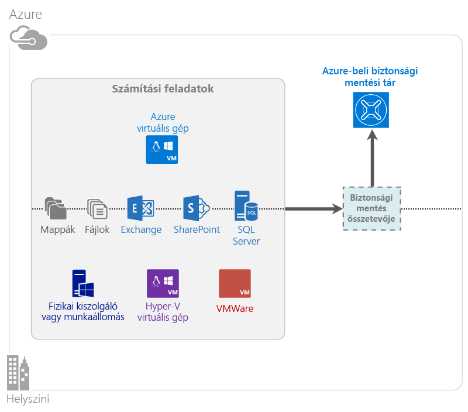

# Mi az az Azure Backup?
Az Azure Backup szolgáltatással biztonsági másolatot készíthet adatairól és visszaállíthatja azokat a Microsoft-felhőből. A szolgáltatás lecseréli a meglévő helyszíni vagy külső helyszínen lévő biztonsági mentési megoldást egy felhőalapú megoldásra, amely megbízható, biztonságos és költséghatékony. Emellett segít megvédeni a felhőben futó objektumokat. Az Azure Backup által nyújtott visszaállítási szolgáltatások világszínvonalú infrastruktúrára épülnek, amely méretezhető, tartós és magas rendelkezésre állású.

[Áttekintő videó megtekintése az Azure Backupról](https://azure.microsoft.com/documentation/videos/what-is-azure-backup/)

## Miért érdemes az Azure Backupot használni?
A hagyományos biztonsági mentési megoldások úgy fejlődtek, hogy a felhőt a lemezekhez és szalagokhoz hasonló végpontként kezeljék. Bár ez a megközelítés egyszerű, de korlátozott is. Nem használja ki teljesen az alapul szolgáló felhőplatformot, és nem elég hatékony, drága megoldás.
Ezzel ellentétben az Azure Backup az erőteljes és megfizethető felhőalapú biztonsági mentési megoldások összes előnyét biztosítja. Íme az Azure Backup néhány fontos előnye.

| Szolgáltatás | Előny |
| --- | --- |
| Automatikus tároláskezelés |Nincs szükség tőkebefektetésre helyszíni tárolóeszközökbe. Az Azure Backup automatikusan foglalja le és kezeli a Backup-tárolót, és használatalapú fizetési modellt használ. |
| Korlátlan méretezés |Használja ki a garantált magas rendelkezésre állást a karbantartás és a megfigyelés terhe nélkül. Az Azure Backup kihasználja az alapul szolgáló Azure felhő hatékonyságát és méretezhetőségét, a rendszer működését nem zavaró, automatikus méretezési képességeivel. |
| Többféle tárolási lehetőség |Igényei alapján válassza ki a Backup-tárolót:<li>A helyileg redundáns tárolási blokkblob ideális a költségtudatos ügyfelek számára, és segít megvédeni az adatokat a helyi hardverhibákkal szemben is. <li>A georeplikációs tárolási blokkblobok három további másolatot nyújtanak egy párosított adatközpontban. Ezek az extra másolatok biztosítják, hogy a biztonsági mentési adatok magas szintű rendelkezésre állásúak legyenek akkor is, ha Azure-helyszintű katasztrófa történik. |
| Korlátlan adatátvitel |A Backup-tárolóból végzett visszaállítási műveletek során minden kimenő adatátvitel díjmentes. Az Azure-ra érkező adatok is díjmentesek. Az importálási szolgáltatással működik, ahol elérhető. |
| Adattitkosítás |Az adattitkosítás az ügyféladatok biztonságos átvitelét és tárolását teszi lehetővé a nyilvános felhőben. A titkosítás jelszavának tárolása a forráson történik, és soha nem kerül az Azure-ba, illetve nincs ott tárolva. A titkosítási kulcsra az adatok visszaállításához van szükség, és csak az ügyfél rendelkezik teljes hozzáféréssel a szolgáltatásban lévő adatokhoz. |
| Alkalmazáskonzisztens biztonsági mentés |A Windowsban végzett alkalmazáskonzisztens biztonsági mentések segítenek biztosítani, hogy ne legyen szükség javításokra a visszaállításkor, ami csökkenti a helyreállítási időre vonatkozó célkitűzést. Ez lehetővé teszi, hogy az ügyfelek gyorsabban térjenek vissza futó állapotba. |
| Hosszú távú megőrzés |Ahelyett, hogy külső helyen tárolt szalagos biztonsági mentési megoldásokért fizetnének, az ügyfelek az Azure-ba készíthetnek biztonsági mentést, amely lenyűgöző, szalaghoz hasonló megoldást nyújt alacsony áron. |

## Az Azure Backup összetevői
Mivel a Backup hibrid biztonsági mentési megoldás, több olyan összetevőből áll, amelyek együttműködve lehetővé teszik a teljes körű biztonsági mentési és a visszaállítási munkafolyamatokat.

### Üzembe helyezési forgatókönyvek
| Összetevő | Üzembe helyezhető az Azure-ban? | Üzembe helyezhető a helyszínen? | A céltároló támogatott |
| --- | --- | --- | --- |
| Az Azure Backup ügynöke |
**Igen**
 
Az Azure Backup ügynöke az Azure-ban futó bármely Windows Server rendszerű virtuális gépre telepíthető.
 |
**Igen**
 
Az Azure Backup ügynöke bármely Windows Server rendszerű virtuális gépre vagy fizikai gépre telepíthető.
 |
Azure Backup-tároló
 |
| System Center Data Protection Manager (DPM) |
**Igen**

További információkat tudhat meg arról, [hogyan védheti meg a számítási feladatokat az Azure-ban a System Center DPM-mel](http://blogs.technet.com/b/dpm/archive/2014/09/02/azure-iaas-workload-protection-using-data-protection-manager.aspx).
 |
**Igen**
 
További információkat tudhat meg arról, [hogyan védheti meg a számítási feladatokat és a virtuális gépeket az adatközpontban](https://technet.microsoft.com/library/hh758173.aspx).
 |
Helyileg csatlakoztatott lemez,
 
Azure Backup-tároló,
 
szalag (csak helyszíni)
 |
| Azure Backup Server |
**Igen**

További információkat tudhat meg arról, [hogyan védheti meg a számítási feladatokat az Azure-ban az Azure Backup Serverrel](backup-azure-microsoft-azure-backup.md).
 |
**Igen**
 
További információkat tudhat meg arról, [hogyan védheti meg a számítási feladatokat az Azure-ban az Azure Backup Serverrel](backup-azure-microsoft-azure-backup.md).
 |
Helyileg csatlakoztatott lemez,
 
Azure Backup-tároló
 |
| Azure Backup (virtuálisgép-bővítmény) |
**Igen**

Az Azure-háló része

Az [Azure szolgáltatásként kínált infrastruktúra (IaaS) rendszerű virtuális gépek biztonsági mentéséhez](backup-azure-vms-introduction.md) készült.
 |
**Nem**
 
A System Center DPM-mel biztonsági mentést készíthet az adatközpontban lévő virtuális gépekről.
 |
Azure Backup-tároló
 |

### Összetevőszintű előnyök és korlátozások
| Összetevő | Előnyök | Korlátozások | Helyreállítás részletessége |
| --- | --- | --- | --- |
| Azure Backup (MARS) ügynöke |<li>Képes biztonsági másolatot készíteni a Windows rendszerű fizikai vagy virtuális gépek fájljairól és mappáiról (a virtuális gépek bárhol lehetnek: a helyszínen vagy az Azure-ban is)<li>Nincs szükség különálló biztonsági mentési kiszolgálóra<li>Az Azure Backup-tárolót használja |<li>Napi három biztonsági mentés/fájlszintű visszaállítás<li>Csak fájl-/mappa-/kötetszintű visszaállítás, nem alkalmazásfüggő<li>Nincs Linux-támogatás |fájlok/mappák/kötetek |
| System Center Data Protection Manager |<li>Alkalmazásfüggő pillanatképek (VSS)<li>Teljes rugalmasság a biztonsági mentés időpontjának kiválasztásakor<li>Helyreállítás részletessége (összes)<li>Képes használni az Azure Backup-tárolót<li>Linux-támogatás (ha Hyper-V-n fut) |<li>Heterogén támogatás hiánya (VMware VM biztonsági mentése, Oracle számítási feladat biztonsági mentése). |fájlok/mappák/kötetek /virtuális gépek/alkalmazások |
| Microsoft Azure Backup Server |<li>Alkalmazásfüggő pillanatképek (VSS)<li>Teljes rugalmasság a biztonsági mentés időpontjának kiválasztásakor<li>Helyreállítás részletessége (összes)<li>Képes használni az Azure Backup-tárolót<li>Linux-támogatás (ha Hyper-V-n fut)<li>Nincs szükség System Center-licencre |<li>Heterogén támogatás hiánya (VMware VM biztonsági mentése, Oracle számítási feladat biztonsági mentése).<li>Mindig élő Azure-előfizetést igényel<li>A szalagos biztonsági mentés nem támogatott |fájlok/mappák/kötetek /virtuális gépek/alkalmazások |
| Azure IaaS virtuális gép biztonsági mentése |<li>Natív biztonsági mentések Windowshoz/Linuxhoz<li>Nincs szükség speciális ügynök telepítésére<li>Hálószintű biztonsági mentés, nincs szükség biztonsági mentési infrastruktúrára |<li>Napi egyszeri biztonsági mentés/lemezszintű visszaállítás<li>Nem készíthető biztonsági mentés a helyszínen |Virtuális gépek Minden lemez (PowerShell használatával) |

## Melyik alkalmazásokról és számítási feladatokról készíthető biztonsági mentés?
| Számítási feladat | Forrásgép | Azure Backup-megoldás |
| --- | --- | --- |
| Fájlok és mappák |Windows Server |
[Az Azure Backup ügynöke](backup-configure-vault.md),
 
[System Center DPM](backup-azure-dpm-introduction.md) (+ az Azure Backup ügynöke),
 
[Azure Backup Server](backup-azure-microsoft-azure-backup.md) (tartalmazza az Azure Backup ügynökét)
 |
| Fájlok és mappák |Windows-ügyfél |
[Az Azure Backup ügynöke](backup-configure-vault.md),
 
[System Center DPM](backup-azure-dpm-introduction.md) (+ az Azure Backup ügynöke),
 
[Azure Backup Server](backup-azure-microsoft-azure-backup.md) (tartalmazza az Azure Backup ügynökét)
 |
| Hyper-V virtuális gép (Windows) |Windows Server |
[System Center DPM](backup-azure-backup-sql.md) (+ az Azure Backup ügynöke),
 
[Azure Backup Server](backup-azure-microsoft-azure-backup.md) (tartalmazza az Azure Backup ügynökét)
 |
| Hyper-V virtuális gép (Linux) |Windows Server |
[System Center DPM](backup-azure-backup-sql.md) (+ az Azure Backup ügynöke),
 
[Azure Backup Server](backup-azure-microsoft-azure-backup.md) (tartalmazza az Azure Backup ügynökét)
 |
| Microsoft SQL Server |Windows Server |
[System Center DPM](backup-azure-backup-sql.md) (+ az Azure Backup ügynöke),
 
[Azure Backup Server](backup-azure-microsoft-azure-backup.md) (tartalmazza az Azure Backup ügynökét)
 |
| Microsoft SharePoint |Windows Server |
[System Center DPM](backup-azure-backup-sql.md) (+ az Azure Backup ügynöke),
 
[Azure Backup Server](backup-azure-microsoft-azure-backup.md) (tartalmazza az Azure Backup ügynökét)
 |
| Microsoft Exchange |Windows Server |
[System Center DPM](backup-azure-backup-sql.md) (+ az Azure Backup ügynöke),
 
[Azure Backup Server](backup-azure-microsoft-azure-backup.md) (tartalmazza az Azure Backup ügynökét)
 |
| Azure IaaS virtuális gépek (Windows) |- |[Azure Backup (virtuálisgép-bővítmény)](backup-azure-vms-introduction.md) |
| Azure IaaS virtuális gépek (Linux) |- |[Azure Backup (virtuálisgép-bővítmény)](backup-azure-vms-introduction.md) |

## ARM- és Linux-támogatás
| Összetevő | ARM-támogatás | Linux (Azure által támogatott) támogatása |
| --- | --- | --- |
| Azure Backup (MARS) ügynöke |Igen |Nem (csak Windows-alapú ügynök) |
| System Center Data Protection Manager |Igen (ügynök a vendégben) |Csak Hyper-V (nem Azure VM) Csak fájlkonzisztens biztonsági mentésre van lehetőség |
| Azure Backup Server (MABS) |Igen (ügynök a vendégben) |Csak Hyper-V (nem Azure VM) Csak fájlkonzisztens biztonsági mentésre van lehetőség (ugyanaz, mint a DPM) |
| Azure IaaS virtuális gép biztonsági mentése |Igen |Igen |

[!INCLUDE [learn-about-deployment-models](../../includes/learn-about-deployment-models-include.md)]

## Premium Storage virtuális gépek biztonsági mentése és visszaállítása
Az Azure Backup szolgáltatás mostantól védi a Premium Storage virtuális gépeket.

### A Premium Storage virtuális gépek biztonsági mentése
Premium Storage virtuális gépek biztonsági mentésekor a Backup szolgáltatás átmeneti előkészítési helyet hoz létre a Premium Storage-fiókbn. Az „AzureBackup-” nevű előkészítési hely megegyezik a virtuális géphez csatolt prémium szintű lemezek teljes adatméretével.

> [!NOTE]
> Ne módosítsa vagy szerkessze az előkészítési helyet.
> 
> 

A biztonsági mentési feladat befejezése után a rendszer törli az előkészítési helyet. Az előkészítési helyhez használt tároló ára megfelel a [Premium Storage díjszabásnak](../storage/storage-premium-storage.md#pricing-and-billing).

### A Premium Storage virtuális gépek visszaállítása
A Premium Storage virtuális gépek Premium Storage tárolóba vagy normál tárolóba állíthatók vissza. A Premium Storage virtuális gép helyreállítási pontjának Premium Storage-ba való visszaállítása a visszaállítás tipikus folyamata. Azonban költséghatékony lehet a Premium Storage virtuális gépek helyreállítási pontjait Standard szintű tárolóba visszaállítani. Ez a visszaállítási típus használható, ha a fájlok egy részére van szüksége a virtuális gépről.

## Funkció
Ez az öt táblázat összegzi a biztonsági mentési funkció kezelésének módját az egyes összetevőkben.

### Tárolás
| Szolgáltatás | Az Azure Backup ügynöke | System Center DPM | Azure Backup Server | Azure Backup (virtuálisgép-bővítmény) |
| --- | --- | --- | --- | --- |
| Azure Backup-tároló |![Igen][green] |![Igen][green] |![Igen][green] |![Igen][green] |
| Lemezes tárolás | |![Igen][green] |![Igen][green] | |
| Szalagos tárolás | |![Igen][green] | | |
| Tömörítés (a Backup-tárolóban) |![Igen][green] |![Igen][green] |![Igen][green] | |
| Növekményes biztonsági mentés |![Igen][green] |![Igen][green] |![Igen][green] |![Igen][green] |
| Lemezdeduplikáció | |![Részlegesen][yellow] |![Részlegesen][yellow] | |

A Backup-tároló az előnyben részesített tárolási cél minden összetevőben. A System Center DPM és a Backup Server lehetőséget nyújt helyi lemezmásolat készítésére is. Azonban csak a System Center DPM nyújt lehetőséget az adatok szalagos tárolóeszközre írására.

#### Növekményes biztonsági mentés
Minden összetevő támogatja a növekményes biztonsági mentést a céltárolótól függetlenül (lemez, szalag, Backup-tároló). A növekményes biztonsági mentés biztosítja, hogy a biztonsági mentések hatékonyan használják a tárhelyet és az időt, mert csak az utolsó biztonsági mentés óta végzett módosításokat viszi át.

#### Tömörítés
A biztonsági másolatok a szükséges tárterület csökkentése érdekében tömörítve vannak. Csak a virtuálisgép-bővítmény összetevő nem használ tömörítést. A virtuálisgép-bővítménnyel minden biztonsági mentési adatot az ügyfél tárfiókjából az ugyanazon régióban lévő Backup-tárolóba másol a rendszer tömörítés nélkül. Bár a tömörítés elhagyása kissé növeli a használt tárterületet, az adatok tömörítés nélküli tárolása gyorsabb visszaállítást tesz lehetővé.

#### Deduplikáció
A deduplikáció a System Center DPM és a Backup Server esetében támogatott, amikor [Hyper-V virtuális gépen van üzembe helyezve](http://blogs.technet.com/b/dpm/archive/2015/01/06/deduplication-of-dpm-storage-reduce-dpm-storage-consumption.aspx). A deduplikáció a gazdagép szintjén történik Windows Server-deduplikációval a virtuális géphez Backup-tárolóként csatlakoztatott virtuális merevlemezeken (VHD-ken).

> [!WARNING]
> A deduplikáció nem érhető el az Azure-ban semmilyen Backup-összetevőhöz. Amikor System Center DPM és Backup Server van üzembe helyezve az Azure-ban, a virtuális géphez csatolt tárolólemezek nem deduplikálhatók.
> 
> 

### Biztonság
| Szolgáltatás | Az Azure Backup ügynöke | System Center DPM | Azure Backup Server | Azure Backup (virtuálisgép-bővítmény) |
| --- | --- | --- | --- | --- |
| Hálózati biztonság (Azure-ra) |![Igen][green] |![Igen][green] |![Igen][green] |![Részlegesen][yellow] |
| Adatbiztonság (Azure-ban) |![Igen][green] |![Igen][green] |![Igen][green] |![Részlegesen][yellow] |

A kiszolgálókról a Backup-tárolóba érkező minden biztonsági mentési adat az Advanced Encryption Standard 256-tal van titkosítva. Az adatokat a rendszer egy biztonságos HTTPS-kapcsolaton keresztül küldi el. Az adatok biztonsági másolata titkosított formában megtalálhatóak a Backup-tárolóban is. Csak az ügyfél rendelkezik az adatok zárolásának feloldására szolgáló jelszóval. A Microsoft soha nem tudja visszafejteni az adatok biztonsági másolatát.

> [!WARNING]
> Az adatok biztonsági másolatának titkosításához használt kulccsal csak az ügyfél rendelkezik. A Microsoft nem tárol másolatot az Azure-ban, és nem rendelkezik hozzáféréssel a kulcshoz. Ha az ügyfél elveszíti a kulcsot, a Microsoft nem tudja helyreállítani az adatok biztonsági másolatát.
> 
> 

Az Azure virtuális gépek biztonsági mentéséhez titkosítást kell beállítani a virtuális gépen *belül*. Használja a BitLockert Windows rendszerű virtuális gépeken és a **dm-crypt**-et Linux rendszerű virtuális gépeken. Az Azure Backup nem titkosítja automatikusan az ezen az elérési úton bejövő biztonsági mentési adatokat.

### Támogatott számítási feladatok
| Szolgáltatás | Az Azure Backup ügynöke | System Center DPM | Azure Backup Server | Azure Backup (virtuálisgép-bővítmény) |
| --- | --- | --- | --- | --- |
| Windows Server-gép – fájlok és mappák |![Igen][green] |![Igen][green] |![Igen][green] | |
| Windows-ügyfélgép – fájlok és mappák |![Igen][green] |![Igen][green] |![Igen][green] | |
| Hyper-V virtuális gép (Windows) | |![Igen][green] |![Igen][green] | |
| Hyper-V virtuális gép (Linux) | |![Igen][green] |![Igen][green] | |
| Microsoft SQL Server | |![Igen][green] |![Igen][green] | |
| Microsoft SharePoint | |![Igen][green] |![Igen][green] | |
| Microsoft Exchange | |![Igen][green] |![Igen][green] | |
| Azure virtuális gép (Windows) | | | |![Igen][green] |
| Azure virtuális gép (Linux) | | | |![Igen][green] |

### Network (Hálózat)
| Szolgáltatás | Az Azure Backup ügynöke | System Center DPM | Azure Backup Server | Azure Backup (virtuálisgép-bővítmény) |
| --- | --- | --- | --- | --- |
| Hálózati tömörítés (a biztonsági mentési kiszolgálóra) | |![Igen][green] |![Igen][green] | |
| Hálózati tömörítés (a Backup-tárolóra) |![Igen][green] |![Igen][green] |![Igen][green] | |
| Hálózati protokoll (a biztonsági mentési kiszolgálóra) | |TCP |TCP | |
| Hálózati protokoll (a Backup-tárolóra) |HTTPS |HTTPS |HTTPS |HTTPS |

Mivel a virtuálisgép-bővítmény közvetlenül az Azure Storage-fiókból olvassa be az adatokat a tárolóhálózaton keresztül, nem kell optimalizálni ezt a forgalmat. A forgalom az Azure-adatközpont helyi tárolóhálózatán halad át, így a sávszélesség miatt nincs szükség tömörítésre.

Ha biztonsági mentési kiszolgálóra (DPM-re vagy Backup Serverre) készít biztonsági mentést az adatokról, az elsődleges kiszolgáló felől a biztonsági mentési kiszolgálóra érkező adatforgalom a kisebb sávszélesség-használat érdekében tömöríthető.

#### A hálózati sávszélesség szabályozása
Az Azure Backup ügynöke sávszélesség-szabályozási képességet nyújt, amellyel vezérelheti a hálózati sávszélesség használatát az adatátvitel alatt. A szabályozás akkor lehet hasznos, ha adatokról kell biztonsági másolatot készítenie a munkaidő alatt, de nem szeretné, hogy a biztonsági mentési folyamat zavarja a többi internetes forgalmat. Az adatátvitel szabályozása a biztonsági mentési és a visszaállítást tevékenységekre vonatkozik.

### Biztonsági mentés és megőrzés
|  | Az Azure Backup ügynöke | System Center DPM | Azure Backup Server | Azure Backup (virtuálisgép-bővítmény) |
| --- | --- | --- | --- | --- |
| Biztonsági mentés gyakorisága (a Backup-tárolóba) |Napi három biztonsági mentés |Napi két biztonsági mentés |Napi két biztonsági mentés |Napi egy biztonsági mentés |
| Biztonsági mentés gyakorisága (lemezre) |Nem alkalmazható |
15 percenként az SQL Serverhez
 
Minden órában más számítási feladatokhoz
 |
15 percenként az SQL Serverhez
 
Minden órában más számítási feladatokhoz
 |Nem alkalmazható |
| Megőrzési beállítások |Napi, heti, havi, éves |Napi, heti, havi, éves |Napi, heti, havi, éves |Napi, heti, havi, éves |
| Megőrzési időszak |Legfeljebb 99 év |Legfeljebb 99 év |Legfeljebb 99 év |Legfeljebb 99 év |
| Helyreállítási pontok a Backup-tárolóban |Korlátlan |Korlátlan |Korlátlan |Korlátlan |
| Helyreállítási pontok a helyi lemezen |Nem alkalmazható |64 fájlkiszolgálókhoz,  448 alkalmazáskiszolgálókhoz |64 fájlkiszolgálókhoz,  448 alkalmazáskiszolgálókhoz |Nem alkalmazható |
| Helyreállítási pontok a szalagon |Nem alkalmazható |Korlátlan |Nem alkalmazható |Nem alkalmazható |

## Mi a tároló hitelesítőadat-fájlja?
A tároló hitelesítőadat-fájlja a portál által az egyes Backup-tárolókhoz létrehozott tanúsítvány. A portál ezután feltölti a nyilvános kulcsot az Access Control Service (ACS) szolgáltatásba. A titkos kulcsot a felhasználó akkor kapja meg, amikor letölti a hitelesítő adatokat, majd beírja azokat a gép regisztrációja során. A titkos kulcs feljogosítja a gépet, hogy biztonsági mentési adatokat küldjön egy azonosított tárolóba az Azure Backup szolgáltatásban.

A tároló hitelesítőadat-fájlja csak a regisztrációs munkafolyamat során használható. Az Ön felelőssége annak biztosítása, hogy a tároló hitelesítőadat-fájlja ne sérüljön. Ha rosszindulatú felhasználó kezébe kerül, a tároló hitelesítőadat-fájljával más gépek is regisztrálhatók ugyanabban a tárolóban. De mivel a biztonsági mentési adatok csak az ügyfélhez tartozó jelszóval vannak titkosítva, a meglévő biztonsági mentési adatok biztonsága nem sérülhet. Az ezzel kapcsolatos aggodalmak csökkentése érdekében a tároló hitelesítőadat-fájljai úgy vannak beállítva, hogy 48 óránként lejárjanak. Míg egy Backup-tároló hitelesítőadat-fájljait tetszőleges számú alkalommal letöltheti, csak a legújabb fájl érvényes a regisztrációs munkafolyamat során.

## Miben különbözik az Azure Backup az Azure Site Recoverytől?
Számos ügyfél összekeveri a biztonsági másolat helyreállítását a vészhelyreállítással. Mindkettő adatokat rögzít és visszaállítási szemantikát nyújt, de a fő értékajánlataik eltérőek.

Az Azure Backup a helyszínen és a felhőben biztonsági másolatot készít az adatokról. Az Azure Site Recovery koordinálja a virtuális gépek és a fizikai kiszolgálók replikálását, feladatátvételét és feladat-visszavételét. Mindkét szolgáltatás fontos, mert a vészhelyreállítási megoldásnak biztosítania kell az adatok védelmét és helyreállíthatóságát (Backup), *valamint* a számítási feladatok rendelkezésre állását (Site Recovery) leállások esetén.

A következő fogalmak segítenek a fontos döntések meghozatalában a biztonsági mentéssel és a vészhelyreállítással kapcsolatban.

| Fogalom | Részletek | Biztonsági mentés | Vészhelyreállítás (DR) |
| --- | --- | --- | --- |
| Helyreállítási időkorlát (RPO) |Az elfogadható adatveszteség mennyisége, ha helyreállítást kell végezni. |A biztonsági mentési megoldások elfogadható RPO-ja nagyon változó. Virtuális gépek biztonsági mentései esetén általában egy nap az RPO, míg adatbázisok biztonsági mentései esetén akár 15 perc is lehet. |A vészhelyreállítási megoldások alacsony RPO-kkal rendelkeznek. A DR másolat néhány másodperccel vagy néhány perccel késhet. |
| Helyreállítási időre vonatkozó célkitűzés (RTO) |A helyreállítás vagy visszaállítás elvégzéséhez szükséges idő. |A nagyobb RPO miatt a biztonsági mentési megoldások által feldolgozandó adatmennyiség általában sokkal nagyobb, ami hosszabb RTO-khoz vezet. Napokba telhet például az adatok szalagokról való visszaállítása attól függően, hogy mennyi ideig tart a szalag szállítása egy külső helyről. |A vészhelyreállítási megoldások RTO-i sokkal rövidebbek, mert jobban szinkronban vannak a forrással. Kevesebb módosítást kell feldolgozni. |
| Megőrzés |Az adatok tárolásának időtartama |A műveleti helyreállítást igénylő forgatókönyvekben (adatsérülés, véletlen fájltörlés, az operációs rendszer hibája) az adatok biztonsági másolatát általában legfeljebb 30 napig őrzi meg a rendszer. A megfelelőség miatt lehet, hogy hónapokig vagy akár évekig kell tárolni az adatokat. Az adatok biztonsági másolata ideális az ilyen esetekben végzett archiváláshoz. |A vészhelyreállításhoz csak műveleti helyreállítási adatokra van szükség, ami általában néhány órát vagy legfeljebb egy napot vesz igénybe. A DR (vészhelyreállítási) megoldásokban használt részletes adatrögzítés miatt a DR-adatok hosszú távú megőrzése nem javasolt. |

## Következő lépések
Próbáljon ki egy egyszerű Azure Backupot. Ehhez útmutatást ezen oktatóanyagokban találhat:

* [Az Azure Backup kipróbálása](backup-try-azure-backup-in-10-mins.md)
* [Az Azure VM Backup kipróbálása](backup-azure-vms-first-look.md)

Mivel ezek az oktatóanyagok a gyors biztonsági mentésben segítenek, az adatok biztonsági mentésének legegyszerűbb útvonalát mutatják be. A végezni kívánt biztonsági mentés típusával kapcsolatos további információért lásd:

* [Windows gép biztonsági mentése](backup-configure-vault.md)
* [Alkalmazás számítási feladatainak biztonsági mentése](backup-azure-microsoft-azure-backup.md)
* [Azure IaaS virtuális gépek biztonsági mentése](backup-azure-vms-prepare.md)

[zöld]: ./media/backup-introduction-to-azure-backup/green.png
[sárga]: ./media/backup-introduction-to-azure-backup/yellow.png
[vörös]: ./media/backup-introduction-to-azure-backup/red.png

<!--HONumber=Sep16_HO4-->

