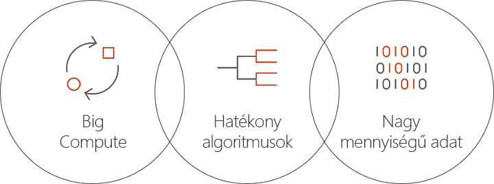

# Mi az a Batch AI az Azure-ban?
A Batch AI egy felügyelt szolgáltatás, amely lehetővé teszi az adatelemzők és AI-kutatók számára, hogy betanítsanak mesterséges intelligenciákat és egyéb gépi tanulási modelleket az Azure virtuális gépek fürtjein, beleértve a GPU-támogatással rendelkező virtuális gépeket. Csak adja meg a feladata követelményeit, valamint a bemeneti és kimeneti adatok tárolási helyét, a Batch AI pedig elvégzi a többit.  
 
## Milyen előnyöket kínál a Batch AI? 
A hatékony AI-algoritmusok fejlesztése egy nagy számítási igényű és iteratív folyamat. Az adatelemzők és AI-kutatók egyre növekvő adathalmazokkal dolgoznak. Egyre több réteggel rendelkező modelleket fejlesztenek, és egyre többet kísérleteznek a hálózati kialakításokkal és a hiperparaméteres finomhangolással. Ennek hatékony megvalósításához modellenként több processzor és GPU, a kísérletek párhuzamos futtatása, valamint a betanítási adatok, naplók és modellkimenetek megosztott tárolása szükséges.   
 

Az adatelemzők és AI-kutatók a területük szakértői, azonban a nagy léptékű infrastruktúra kezelése gondot okozhat számukra. A nagy léptékű AI-fejlesztéshez számos infrastrukturális feladatot kell elvégezni: virtuális gépek fürtjeinek üzembe helyezése, szoftverek és tárolók telepítése, üzenetsor-kezelés, feladatok prioritásának beállítása és ütemezése, hibák kezelése, adatok terjesztése, eredmények megosztása, erőforrások skálázása a költségek kezelése érdekében és integrálás az eszközökkel és munkafolyamatokkal. A Batch AI elvégzi mindezen feladatokat. 
 
## Mi az a Batch AI? 

A Batch AI erőforrás-kezelési és feladatütemezési szolgáltatásokat nyújt az AI-betanításhoz és teszteléshez. Főbb képességek: 

* Hosszan futó kötegelt feladatok futtatása, iteratív kísérletezés és interaktív betanítás 
* A GPU-kat vagy processzorokat használó VM-fürtök automatikus vagy manuális skálázása 
* SSH-kommunikáció konfigurálása a VM-ek között és a táveléréshez 
* Mély tanulási és machine learning-keretrendszerek támogatása az olyan népszerű eszközökre optimalizált konfigurációkkal, mint a [Microsoft Cognitive Toolkit](https://github.com/Microsoft/CNTK) (CNTK), a [TensorFlow](https://www.tensorflow.org/) és a [Chainer](https://chainer.org/). 
* Prioritásalapú feladat-várólistázás a fürtök megosztásához, illetve az alacsony prioritású virtuális gépek és fenntartott példányok kiaknázásához  
* Rugalmas tárolási lehetőségek, köztük az Azure Files és egy felügyelt NFS-kiszolgáló használata 
* Távoli fájlmegosztások csatolása a VM-hez és a választható tárolóhoz 
* Feladatok állapotának biztosítása és újraindítás VM-hibák esetén 
* Hozzáférés a kimeneti naplókhoz, az stdout és stderr kimenetekhez, valamint modellekhez, beleértve az Azure Storage-ból való streamelést 
* Azure [parancssori felület](/cli/azure) (CLI), SDK-k a [Pythonhoz](https://github.com/Azure/azure-sdk-for-python), [C#](https://www.nuget.org/packages/Microsoft.Azure.Management.BatchAI/1.0.0-preview)-hoz és Javához, monitorozás az Azure Portalon és integráció a Microsoft AI-eszközeivel 

A Batch AI SDK támogatja a parancsfájlok vagy alkalmazások írását a betanítási folyamatok kezeléséhez és az eszközök integrálásához. Az SDK jelenleg Python, C#, Java és REST API-kat biztosít.  
 

A Batch AI az Azure Resource Managert használja a vezérlősík műveleteihez (létrehozás, listázás, lekérés, törlés). A hitelesítés és a szerepköralapú hozzáférés-vezérlés az Azure Active Directoryt használatával történik.  
 
## A Batch AI használata 

A Batch AI használatához *fürtöket* és *feladatokat* kell létrehozni és kezelni. 

 
A **fürtök** írják le a számítási követelményeket: 
* A futtatás helyéül szolgáló Azure-régió 
* A használandó virtuális gép termékcsaládja és mérete – például egy NC24 VM, amely 4 NVIDIA K80 GPU-t tartalmaz 
* A virtuális gépek száma, illetve a VM-ek minimális és maximális száma az automatikus skálázáshoz 
* A virtuálisgép-lemezkép – például Ubuntu 16.04 LTS vagy [Microsoft Deep Learning virtuális gép](https://azuremarketplace.microsoft.com/marketplace/apps/microsoft-ads.dsvm-deep-learning)
* Csatlakoztatandó távoli fájlmegosztási kötetek – például az Azure Filesból vagy egy Batch AI által felügyelt NFS-kiszolgálóról 
* A VM-eken konfigurálandó felhasználónév és SSH-kulcs vagy jelszó az interaktív bejelentkezés lehetővé tételéhez hibakeresés céljából  
 

A **feladatok** a következőket írják le: 
* A használandó fürt és régió 
* A feladathoz szükséges virtuális gépek száma 
* A feladatnak az indításkor átadandó bemeneti és kimeneti könyvtárak. Ez általában a fürt beállításakor csatlakoztatott megosztott fájlrendszert használja 
* Egy opcionális tároló a szoftver vagy a telepítési parancsfájl futtatásához 
* Az AI-keretrendszerre vonatkozó konfiguráció, vagy a feladat indításához szükséges parancssor és paraméterek 
 

Bevezetés a Batch AI az [Azure CLI](/cli/azure)-vel, illetve a fürtök és feladatok konfigurációs fájljaival való használatába. Ezzel a módszerrel szükség szerint gyorsan létrehozhatja a fürtöt, továbbá feladatokat futtathat a hálózati kialakítással vagy hiperparaméterekkel való kísérletezéshez.  
 

A Batch AI segítségével egyszerűen dolgozhat párhuzamosan több GPU-val is. Ha a feladatokat több GPU-ra kell méretezni, a Batch AI beállítja a virtuális gépek közötti biztonságos hálózati kapcsolatot. Az InfiniBand használata esetén a Batch AI konfigurálja az illesztőprogramokat, és elindítja az MPI-t egy feladat csomópontjain.  

## Adatkezelés
A Batch AI rugalmas lehetőségeket nyújt a betanítási szkriptekhez, adatokhoz és kimenetekhez:
  
* Használja a **helyi lemez** lehetőséget a korai kísérletezéshez és a kisebb adathalmazokhoz. Ehhez a forgatókönyvhöz érdemes lehet SSH-n keresztül csatlakozni a virtuális géphez a szkriptek szerkesztése és a naplók olvasása céljából. 

* Használja az **Azure Files**-t a betanítási adatok megosztásához több feladat között, és a kimeneti naplók és modellek egyetlen helyen való tárolásához 

* Állítson be egy **NFS-kiszolgálót**, amely lehetővé teszi nagyobb mennyiségű adat és több virtuális gép használatát a betanításhoz. A Batch AI képes beállítani egy NFS-kiszolgálót egy speciális fürttípusként, amelynek lemezeit az Azure Storage tárolja. 
 
* A **párhuzamos fájlrendszer** biztosítja az adatok további méretezhetőségét és a párhuzamos betanítást. Bár a Batch AI nem kezeli a párhuzamos fájlrendszereket, elérhetők üzembehelyezési sablonok a Lustre, Gluster és BeeGFS rendszerekhez.  

## További lépések

* Az első Batch AI betanítási feladat létrehozása az [Azure CLI](quickstart-cli.md) vagy a [Python](quickstart-python.md) használatával.
* A különböző keretrendszerekhez való [betanítási módszerek](https://github.com/Azure/BatchAI) mintáinak megtekintése.

