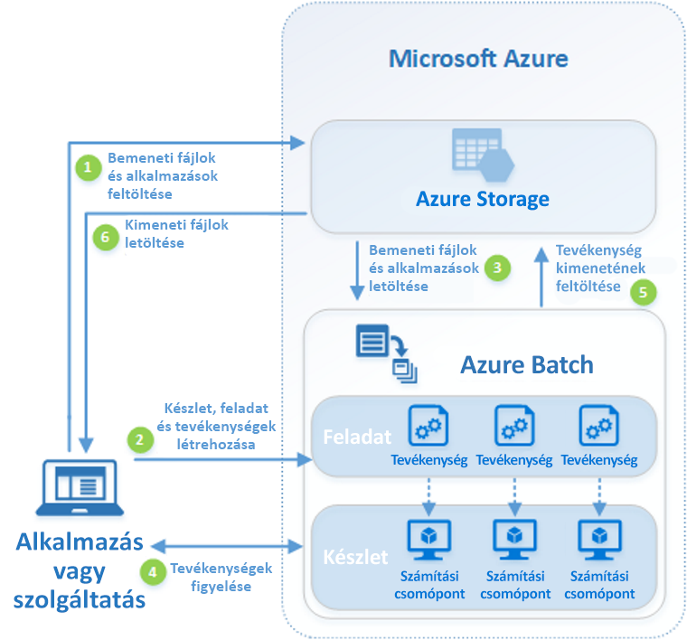

# Mi az Azure Batch?

Az Azure Batch használatával hatékonyan futtathat nagy méretű párhuzamos és nagy teljesítményű feldolgozási (high-performance computing, HPC) Batch-feladatokat az Azure-ban. Az Azure Batch egy számítási csomópontokból (virtuális gépekből) álló készletet hoz létre és felügyel, telepíti a futtatni kívánt alkalmazásokat, és ütemezi a feladatok csomópontokon való futtatását. A telepítéshez, kezeléséhez és méretezéséhez nincs szükség fürtökre vagy feladatütemező szoftverre. Ehelyett [Batch API-k és -eszközök](batch-apis-tools.md), parancssori szkriptek vagy az Azure Portal használatával konfigurálhatók, kezelhetők és monitorozhatók a feladatok. 

A fejlesztők a Batch platformszolgáltatásként való használatával olyan SaaS-alkalmazásokat vagy ügyfélalkalmazásokat készíthetnek, amelyek esetében nagy mennyiségű végrehajtás szükséges. A Batch segítségével létrehozhat például egy Monte Carlo-kockázatszimulációt egy pénzügyi szolgáltató vállalat számára, vagy egy képeket nagy mennyiségben feldolgozó szolgáltatást is.

A Batch felár nélkül használható. Csak a mögöttes erőforrások, például a virtuális gépek, a tárolók és a hálózatkezelés használatáért kell fizetnie.

Az Azure által biztosított Batch szolgáltatás és az egyéb HPC-megoldások összehasonlítását lásd: [HPC, Batch és Big Compute-megoldások](../virtual-machines/linux/high-performance-computing.md).

## Párhuzamos számítási feladatok futtatása
A Batch nagyszerűen működik a belsőleg párhuzamos (más néven „zavaróan párhuzamos”) számítási feladatokkal. A belsőleg párhuzamos számítási feladatok azok, amelyek esetében az alkalmazások egymástól függetlenül futtathatóak, és mindegyik példány a munka egy részét végzi el. Az alkalmazások végrehajtásakor a példányok hozzáférhetnek bizonyos közös adatokhoz, de egymás között nem kommunikálnak. A belsőleg párhuzamos számítási feladatok ezért nagy méretben futtathatók, amit csupán az alkalmazások egyidejű futtatásához rendelkezésre álló számítási erőforrások mennyisége határoz meg.

Néhány példa a Batchbe bevonható belsőleg párhuzamos számítási feladatokra:

* Pénzügyi kockázatmodellezés Monte Carlo-szimuláció használatával
* VFX és 3D képek renderelése
* Képelemzés és -feldolgozás
* Médiakonvertálás
* génszekvenciák elemzése,
* Optikai karakterfelismerés (OCR)
* Adatbetöltés, -feldolgozás és ETL-műveletek
* Szoftvertesztek végrehajtása

A Batch használatával [szorosan összekapcsolt számítási feladatokat is futtathat](batch-mpi.md) – ezek olyan számítási feladatok, amelyek során az alkalmazásoknak kommunikálniuk kell egymással, és nem csupán egymástól függetlenül futnak. A szorosan összekapcsolt alkalmazások általában a Message Passing Interface (MPI) API-t használják. A szorosan összekapcsolt számítási feladatokat a Batchben a [Microsoft MPI](https://msdn.microsoft.com/library/bb524831(v=vs.85).aspx) vagy az Intel MPI használatával futtathatja. Az alkalmazások teljesítményét specializált [HPC](../virtual-machines/linux/sizes-hpc.md) és [GPU-optimalizált](../virtual-machines/linux/sizes-gpu.md) virtuálisgép-méretek használatával javíthatja.

Néhány példa szorosan összekapcsolt számítási feladatokra:
* Végeselem-elemzés
* Folyadékdinamika
* Több csomópontos MI-betanítás

Számos szorosan összekapcsolt feladat futtatható párhuzamosan a Batch használatával. Például egyszerre több szimulációt is létrehozhat egy adott folyadék egy csőben való áramlására változó csőátmérővel.

## A Batch további képességei

Magasabb szintű, számításifeladat-specifikus képességek is elérhetők az Azure Batchhez:
* A Batch támogatja a nagy méretű [renderelési számítási feladatokat](batch-rendering-service.md) az Autodesk Maya, a 3ds Max, az Arnold, a V-Ray és az egyéb renderelő eszközök használatával. 
* Az R-felhasználók a [doAzureParallel R-csomag](https://github.com/Azure/doAzureParallel) telepítésével könnyen felskálázhatják horizontálisan az R-algoritmusok végrehajtását a Batch-készleteken.

A Batch feladatokat nagyobb, adatok átalakítását végző Azure-munkafolyamatok részeként is futtathatja az [Azure Data Factory](../data-factory/v1/data-factory-data-processing-using-batch.md) vagy hasonló eszközök felügyelete alatt.

## Működés
Egy általános Batch-forgatókönyv a belsőleg párhuzamos munkák (például egy 3D jelenet képeinek renderelése) horizontális felskálázása a számítási csomópontok készletén. A számítási csomópontoknak ez a készlete „renderelési farmként” szolgálhat, amely több tíz, több száz vagy akár több ezer magot biztosít a renderelési feladathoz.

Az alábbi diagram egy általános Batch-munkafolyamat lépéseit mutatja be, ahol az ügyfélalkalmazás vagy az üzemeltetett szolgáltatás Batch szolgáltatással futtat egy párhuzamos számítási feladatot.

|Lépés  |Leírás  |
|---------|---------|
|1.  Töltse fel a **bemeneti fájlokat** és az azokat feldolgozó **alkalmazásokat** az Azure Storage-fiókba.     |A bemeneti fájlok az alkalmazás által feldolgozható bármilyen adatok lehetnek, például pénzügyi modellezési adatok vagy átkódolni kívánt videofájlok. Az alkalmazásfájlok az adatokat feldolgozó szkriptek vagy alkalmazások lehetnek, például adathordozó-átkódolók.|
|2.  Hozzon létre egy számítási csomópontokból álló Batch-**készletet** a Batch-fiókjában, egy **feladatot** a számítási feladat futtatásához a készleten, valamint a feladat alá tartozó **tevékenységeket**.     | A készlet csomópontjai a feladatokat végrehajtó virtuális gépek. Adja meg a tulajdonságokat, például a csomópontok számát és méretét, egy Windows- vagy Linux-alapú virtuálisgép-rendszerképet, valamint a csomópontok a készletre való csatlakozásakor telepíteni kívánt alkalmazást. A készlet költségeit és méretét [alacsony prioritású virtuális gépek](batch-low-pri-vms.md) használatával vagy a csomópontok a számítási feladat változását követő [automatikus méretezésével](batch-automatic-scaling.md) szabályozhatja.   Amikor tevékenységeket ad hozzá egy munkához, a Batch szolgáltatás automatikusan ütemezi a tevékenységeket a készletben lévő számítási csomópontokon. Mindegyik tevékenység a bemeneti fájlok feldolgozásához feltöltött alkalmazást használja. |
|3.  A **bemeneti fájlok** és az **alkalmazások** letöltése a Batchbe     |Az egyes tevékenységek a végrehajtásuk előtt letölthetik a feldolgozandó bemeneti adatokat a hozzárendelt számítási csomópontra. Ha az alkalmazás még nincs telepítve a készlet csomópontjain, helyette ide tölthető le. Amikor az Azure Storage-ból való letöltés befejeződött, a tevékenység lefut a hozzá rendelt csomóponton.|
|4.  **Tevékenységek végrehajtásának** figyelése     |A tevékenységek futtatásakor lekérdezheti a Batch szolgáltatást a feladat és a tevékenységei állapotának figyeléséhez. Az Ön által készített ügyfélalkalmazások vagy szolgáltatások HTTPS használatával kommunikálhatnak a Batch szolgáltatással. Mivel előfordulhat, hogy számítási csomópontok ezrein futó több ezer tevékenységet kell figyelnie, gondoskodjon arról, hogy [hatékonyan kérdezi le a Batch szolgáltatást](batch-efficient-list-queries.md).|
|5.  **Tevékenység kimenetének** feltöltése     |A tevékenységek befejeződésekor a tevékenységek feltöltik eredményadataikat az Azure Storage-ba. Közvetlenül a számítási csomóponton lévő fájlrendszerből is lekérhet fájlokat.|
|6.  **Kimeneti fájlok** letöltése     |Amikor a megfigyelés észleli, hogy a feladat tevékenységei befejeződtek, az ügyfélalkalmazás vagy szolgáltatás letöltheti a kimeneti adatokat további feldolgozás céljából.|

Vegye figyelembe, hogy ez a Batch használatának csak egyik módja, és ez a forgatókönyv a szolgáltatás mindössze néhány funkcióját ismerteti. Futtathat például [párhuzamosan több tevékenységet](batch-parallel-node-tasks.md) mindegyik számítási csomóponton, a [feladat-előkészítési és befejezési tevékenységekkel](batch-job-prep-release.md) pedig előkészítheti a csomópontokat a feladatokhoz, majd tisztítást végezhet. 

A [Batch szolgáltatásait ismertető, fejlesztőknek szóló áttekintés](batch-api-basics.md) a készletek, csomópontok, feladatok, tevékenységek és a Batch-alkalmazások kiépítésekor használható rengeteg API-funkció részletesebb információit tartalmazza. Lásd továbbá a [Batch szolgáltatás legújabb frissítéseit](https://azure.microsoft.com/updates/?product=batch).

## További lépések

Ismerkedjen az Azure Batch használatának első lépéseivel az alábbi rövid útmutatókkal:
* [Az első Batch-feladat futtatása az Azure CLI használatával](quick-create-cli.md)
* [Az első Batch-feladat futtatása az Azure Portal használatával](quick-create-portal.md)
* [Az első Azure Batch-feladat futtatása a .NET API használatával](quick-run-dotnet.md)
* [Az első Azure Batch-feladat futtatása a Python API használatával](quick-run-python.md)

