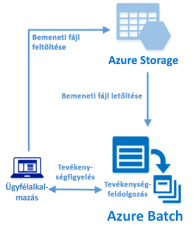

# <a name="quickstart-run-your-first-azure-batch-job-with-the-net-api"></a>Rövid útmutató: Az első Azure Batch-feladat futtatása a .NET API használatával

Ez a rövid útmutató egy Azure Batch-feladatot futtat egy, az Azure Batch .NET API-ra épülő C#-alkalmazásból. Az alkalmazás feltölt több bemeneti adatfájlt az Azure Storage-ba, majd létrehoz egy Batch számítási csomópontokból (virtuális gépekből) álló *készletet*. Ezután létrehoz egy minta*feladatot*, amely *tevékenységek* futtatásával és egy alapvető parancs használatával minden egyes bemeneti fájlt feldolgoz a készleten. A rövid útmutatóból megismerheti a Batch szolgáltatás fő fogalmait, és készen áll majd a Batch szolgáltatás használatára realisztikusabb számítási feladatokkal, nagyobb léptékben.



[!INCLUDE [quickstarts-free-trial-note.md](../../includes/quickstarts-free-trial-note.md)]

## <a name="prerequisites"></a>Előfeltételek

* [Visual Studio 2017](https://www.visualstudio.com/vs) vagy [.NET Core 2.1](https://www.microsoft.com/net/download/dotnet-core/2.1) Linuxhoz, macOS-hez vagy Windowshoz. 

* Egy Batch-fiók és egy társított Azure Storage-fiók. A fiókok létrehozásához tekintse meg a Batch az [Azure Portallal](quick-create-portal.md) vagy az [Azure CLI-vel](quick-create-cli.md) történő használatát ismertető rövid útmutatókat. 

## <a name="sign-in-to-azure"></a>Bejelentkezés az Azure-ba

Jelentkezzen be az Azure Portalra a [https://portal.azure.com](https://portal.azure.com) webhelyen.

[!INCLUDE [batch-common-credentials](../../includes/batch-common-credentials.md)]

## <a name="download-the-sample"></a>A minta letöltése

[Töltse le vagy klónozza a mintaalkalmazást](https://github.com/Azure-Samples/batch-dotnet-quickstart) a GitHubról. A mintaalkalmazás adattárának Git-ügyféllel történő klónozásához használja az alábbi parancsot:

```
git clone https://github.com/Azure-Samples/batch-dotnet-quickstart.git
```

Váltson a Visual Studio `BatchDotNetQuickstart.sln` nevű megoldásfájlját tartalmazó könyvtárra.

Nyissa meg a megoldásfájlt a Visual Studióban, és frissítse a `program.cs` hitelesítő adatait a fiókokhoz beszerzett értékekkel. Például:

```csharp
// Batch account credentials
private const string BatchAccountName = "mybatchaccount";
private const string BatchAccountKey  = "xxxxxxxxxxxxxxxxE+yXrRvJAqT9BlXwwo1CwF+SwAYOxxxxxxxxxxxxxxxx43pXi/gdiATkvbpLRl3x14pcEQ==";
private const string BatchAccountUrl  = "https://mybatchaccount.mybatchregion.batch.azure.com";

// Storage account credentials
private const string StorageAccountName = "mystorageaccount";
private const string StorageAccountKey  = "xxxxxxxxxxxxxxxxy4/xxxxxxxxxxxxxxxxfwpbIC5aAWA8wDu+AFXZB827Mt9lybZB1nUcQbQiUrkPtilK5BQ==";
```

[!INCLUDE [batch-credentials-include](../../includes/batch-credentials-include.md)]

## <a name="build-and-run-the-app"></a>Az alkalmazás létrehozása és futtatása

A Batch-munkafolyamat működésének megtekintéséhez hozza létre és futtassa az alkalmazást a Visual Studióban, vagy a parancssorból a `dotnet build` és `dotnet run` parancsokat. Az alkalmazás futtatása után tekintse át a kódot annak megismerése érdekében, hogy mit csinálnak az alkalmazás egyes részei. Ha például a Visual Studióban:

* Kattintson a jobb gombbal a megoldásra a Solution Explorerben (Megoldáskezelő), és kattintson a **Build Solution** (Megoldás fordítása) elemre. 

* Erősítse meg a NuGet-csomagok visszaállítását, ha a rendszer erre kéri. Ha hiányzó csomagokat kell letöltenie, győződjön meg arról, hogy a [NuGet-csomagkezelő](https://docs.nuget.org/consume/installing-nuget) telepítve van.

Ezután futtassa azt. A mintaalkalmazás futtatásakor a konzol kimenete az alábbihoz hasonló lesz. A futtatás során szünet jelentkezhet a következőnél a készlet számítási csomópontjainak indításakor: `Monitoring all tasks for 'Completed' state, timeout in 00:30:00...`. A rendszer azonnal a futtatási várólistára helyezi a tevékenységeket, amint az első számítási csomópont fut. A készlet, a számítási csomópontok, a feladat és a tevékenységek monitorozásához lépjen az [Azure Portalon](https://portal.azure.com) a Batch-fiókjába.

```
Sample start: 12/4/2017 4:02:54 PM

Container [input] created.
Uploading file taskdata0.txt to container [input]...
Uploading file taskdata1.txt to container [input]...
Uploading file taskdata2.txt to container [input]...
Creating pool [DotNetQuickstartPool]...
Creating job [DotNetQuickstartJob]...
Adding 3 tasks to job [DotNetQuickstartJob]...
Monitoring all tasks for 'Completed' state, timeout in 00:30:00...
```

A tevékenységek befejezése után a következőhöz hasonló lesz a kimenet minden egyes tevékenység esetében:

```
Printing task output.
Task: Task0
Node: tvm-2850684224_3-20171205t000401z
Standard out:
Batch processing began with mainframe computers and punch cards. Today it still plays a central role in business, engineering, science, and other pursuits that require running lots of automated tasks....
stderr:
...
```

A jellemző végrehajtási idő körülbelül 5 perc, ha az alapértelmezett konfigurációban futtatja az alkalmazást. A készlet kezdeti beállítása veszi igénybe a legtöbb időt. A feladat újbóli futtatásához törölje az előző futtatásból származó feladatot, de őrizze meg a készletet. Egy előre konfigurált készleten a feladat néhány másodperc alatt befejeződik.


## <a name="review-the-code"></a>A kód áttekintése

A jelen rövid útmutatóban található .NET alkalmazás a következőket hajtja végre:

* Feltölt három kisméretű szövegfájlt az Azure Storage-fiókban lévő blobtárolóba. Ezek a fájlok bemenetek a Batch általi feldolgozáshoz.
* Létrehoz egy Windows Servert futtató számítási csomópontokból álló készletet.
* Létrehoz egy feladatot és három tevékenységet, amelyek a csomópontokon futnak. Minden tevékenység feldolgoz egy bemeneti fájlt egy Windows-parancssor használatával. 
* Megjeleníti a tevékenységek által visszaadott fájlokat.

További részletekért tekintse meg a `Program.cs` fájlt és a következő szakaszokat. 

### <a name="preliminaries"></a>Előfeltételek

A Storage-fiókkal való kommunikációhoz az alkalmazás a .NET-hez készült Azure Storage ügyféloldali kódtárat használja. Ez létrehoz egy, a fiókra mutató hivatkozást a [CloudStorageAccount](/dotnet/api/microsoft.windowsazure.storage.cloudstorageaccount) fiókkal, és ebből létrehoz egy [CloudBlobClient](/dotnet/api/microsoft.windowsazure.storage.blob.cloudblobclient) hivatkozást.

```csharp
CloudBlobClient blobClient = storageAccount.CreateCloudBlobClient();
```

Az alkalmazás a `blobClient` hivatkozás használatával létrehoz egy tárolót a Storage-fiókon, és feltölti az adatfájlokat a tárolóba. A tárolóban lévő fájlokat a rendszer a Batch által később a számítási csomópontra letölthető Batch [ResourceFile](/dotnet/api/microsoft.azure.batch.resourcefile)-objektumként határozza meg.

```csharp
List<string> inputFilePaths = new List<string>
{
    "taskdata0.txt",
    "taskdata1.txt",
    "taskdata2.txt"
};

List<ResourceFile> inputFiles = new List<ResourceFile>();

foreach (string filePath in inputFilePaths)
{
    inputFiles.Add(UploadFileToContainer(blobClient, inputContainerName, filePath));
}
```

Az alkalmazás létrehoz egy [BatchClient](/dotnet/api/microsoft.azure.batch.batchclient) objektumot a Batch szolgáltatásban lévő készletek, feladatok és tevékenységek létrehozásához és kezeléséhez. A példákban szereplő Batch-ügyfél megosztott kulcsos hitelesítést használ. (A Batch az Azure Active Directory-hitelesítés használatát is támogatja.)

```csharp
BatchSharedKeyCredentials cred = new BatchSharedKeyCredentials(BatchAccountUrl, BatchAccountName, BatchAccountKey);

using (BatchClient batchClient = BatchClient.Open(cred))
...    
```

### <a name="create-a-pool-of-compute-nodes"></a>Számításicsomópont-készlet létrehozása

Batch-készlet létrehozásához az alkalmazás a [BatchClient.PoolOperations.CreatePool](/dotnet/api/microsoft.azure.batch.pooloperations.createpool) metódussal adja meg a csomópontok számát, a virtuális gép méretét és a készletkonfigurációt. Itt egy [VirtualMachineConfiguration](/dotnet/api/microsoft.azure.batch.virtualmachineconfiguration) objektum megad egy [ImageReference](/dotnet/api/microsoft.azure.batch.imagereference) objektumot egy, az Azure Marketplace-en közzétett Windows Server-rendszerképhez. A Batch az Azure Marketplace Linux- és Windows Server-rendszerképeinek széles választékát támogatja, de egyéni rendszerképeket is használhat.

A csomópontok száma (`PoolNodeCount`) és a virtuális gépek mérete (`PoolVMSize`) meghatározott állandókkal van megadva. A példa alapértelmezés szerint egy 2 *Standard_A1_v2* méretű csomópontot tartalmazó készletet hoz létre. A javasolt méret jó teljesítmény/költség arányt kínál a jelen rövid példában. 

A [Commit](/dotnet/api/microsoft.azure.batch.cloudpool.commit) metódus elküldi a készletet a Batch szolgáltatásnak.

```csharp
ImageReference imageReference = new ImageReference(
    publisher: "MicrosoftWindowsServer",
    offer: "WindowsServer",
    sku: "2012-R2-Datacenter-smalldisk",
    version: "latest");

VirtualMachineConfiguration virtualMachineConfiguration =
new VirtualMachineConfiguration(
   imageReference: imageReference,
   nodeAgentSkuId: "batch.node.windows amd64");

try
{
    CloudPool pool = batchClient.PoolOperations.CreatePool(
    poolId: PoolId,
    targetDedicatedComputeNodes: PoolNodeCount,
    virtualMachineSize: PoolVMSize,
    virtualMachineConfiguration: virtualMachineConfiguration);

    pool.Commit();
}
...

```
### <a name="create-a-batch-job"></a>Batch-feladat létrehozása

A Batch-feladat egy vagy több tevékenység logikai csoportosítása. Egy Batch-feladat magában foglalja a tevékenységek közös beállításait, mint a prioritást, illetve a készletet, amelyeken a tevékenységeket futtatni szeretné. Az alkalmazás a [BatchClient.JobOperations.CreateJob](/dotnet/api/microsoft.azure.batch.joboperations.createjob) metódussal létrehoz egy feladatot a készleten. 

A [Commit](/dotnet/api/microsoft.azure.batch.cloudjob.commit) metódus elküldi a feladatot a Batch szolgáltatásnak. A feladat kezdetben nem tartalmaz tevékenységeket.

```csharp
try
{
    CloudJob job = batchClient.JobOperations.CreateJob();
    job.Id = JobId;
    job.PoolInformation = new PoolInformation { PoolId = PoolId };

    job.Commit(); 
}
...
```

### <a name="create-tasks"></a>Tevékenységek létrehozása
Az alkalmazás létrehoz egy listát a [CloudTask](/dotnet/api/microsoft.azure.batch.cloudtask) objektumokról. Minden tevékenység feldolgoz egy bemeneti `ResourceFile` objektumot egy [CommandLine](/dotnet/api/microsoft.azure.batch.cloudtask.commandline) tulajdonság segítségével. A mintában a parancssor a Windows `type` parancsát futtatja a bemeneti fájl megjelenítéséhez. Ez a parancs egy bemutató célú, egyszerű példa. Batch használata esetén a parancssorban adhatja meg az alkalmazást vagy szkriptet. A Batch számos módszert kínál az alkalmazások és szkriptek számítási csomópontokon történő üzembe helyezésére.

Ezt követően az alkalmazás tevékenységeket ad a feladathoz az [AddTask](/dotnet/api/microsoft.azure.batch.joboperations.addtask) metódussal, amely várólistára helyezi azokat a számítási csomópontokon való futtatáshoz. 

```csharp
for (int i = 0; i < inputFiles.Count; i++)
{
    string taskId = String.Format("Task{0}", i);
    string inputFilename = inputFiles[i].FilePath;
    string taskCommandLine = String.Format("cmd /c type {0}", inputFilename);

    CloudTask task = new CloudTask(taskId, taskCommandLine);
    task.ResourceFiles = new List<ResourceFile> { inputFiles[i] };
    tasks.Add(task);
}

batchClient.JobOperations.AddTask(JobId, tasks);
```
 
### <a name="view-task-output"></a>A tevékenység kimenetének megtekintése

Az alkalmazás létrehoz egy [TaskStateMonitor](/dotnet/api/microsoft.azure.batch.taskstatemonitor) objektumot a tevékenységek monitorozására, illetve annak biztosítására, hogy azok sikeresen befejeződjenek. Ezután az alkalmazás a [CloudTask.ComputeNodeInformation](/dotnet/api/microsoft.azure.batch.cloudtask.computenodeinformation) tulajdonság használatával megjeleníti az egyes befejezett tevékenységek által létrehozott `stdout.txt` fájlt. A tevékenység sikeres futtatása esetén a tevékenység parancsának kimenete a `stdout.txt` fájlba lesz írva:

```csharp
foreach (CloudTask task in completedtasks)
{
    string nodeId = String.Format(task.ComputeNodeInformation.ComputeNodeId);
    Console.WriteLine("Task: {0}", task.Id);
    Console.WriteLine("Node: {0}", nodeId);
    Console.WriteLine("Standard out:");
    Console.WriteLine(task.GetNodeFile(Constants.StandardOutFileName).ReadAsString());
}
```

## <a name="clean-up-resources"></a>Az erőforrások eltávolítása

Az alkalmazás automatikusan törli a létrehozott Storage-tárolót, és felkínálja a Batch-készlet és -feladat törlésének lehetőségét. A készletért díjat számítunk fel, amíg a csomópontok futnak, még akkor is, ha nincsenek feladatok ütemezve. Ha már nincs szüksége a készletre, törölje azt. A készlet törlésekor a rendszer a csomópont összes tevékenységének kimenetét is törli.

Ha már nincs rájuk szükség, törölje az erőforráscsoportot, a Batch-fiókot és a Storage-fiókot. Ehhez az Azure Portalon válassza ki a Batch-fiókhoz tartozó erőforráscsoportot, és kattintson az **Erőforráscsoport törlése** elemre.

## <a name="next-steps"></a>További lépések

Ebben a rövid útmutatóban egy, a Batch .NET API-val létrehozott kisméretű alkalmazást futtatott egy Batch-készlet és egy Batch-feladat létrehozásához. A feladat mintatevékenységeket futtatott, és letöltötte a csomópontokon létrehozott kimeneteket. Most, hogy megismerkedett a Batch szolgáltatás fő fogalmaival, készen áll a Batch szolgáltatás realisztikusabb számítási feladatokkal, nagyobb léptékben történő kipróbálására. Ha többet szeretne megtudni az Azure Batch szolgáltatásról, és végig szeretne nézni egy párhuzamos számítási feladatot egy valós alkalmazással, folytassa a Batch .NET oktatóanyaggal.


> [!div class="nextstepaction"]
> [Párhuzamos számítási feladat feldolgozása .NET segítségével](tutorial-parallel-dotnet.md)
