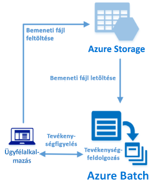

# <a name="quickstart-run-your-first-batch-job-with-the-python-api"></a>Gyors útmutató: Az első Batch-feladat futtatása a Python API használatával

Ez a rövid útmutató egy Azure Batch-feladatot futtat egy, az Azure Batch Python API-ra épülő alkalmazásból. Az alkalmazás feltölt több bemeneti adatfájlt az Azure Storage-ba, majd létrehoz egy Batch számítási csomópontokból (virtuális gépekből) álló *készletet*. Ezután létrehoz egy minta*feladatot*, amely *tevékenységek* futtatásával és egy alapvető parancs használatával minden egyes bemeneti fájlt feldolgoz a készleten. A rövid útmutatóból megismerheti a Batch szolgáltatás fő fogalmait, és készen áll majd a Batch szolgáltatás használatára realisztikusabb számítási feladatokkal, nagyobb léptékben.
 


[!INCLUDE [quickstarts-free-trial-note.md](../../includes/quickstarts-free-trial-note.md)]

## <a name="prerequisites"></a>Előfeltételek

* [A Python 2.7-es, 3.3-as vagy újabb verziója](https://www.python.org/downloads/)

* [pip](https://pip.pypa.io/en/stable/installing/) csomagkezelő

* Egy Azure Batch-fiók és egy társított Azure Storage-fiók. A fiókok létrehozásához tekintse meg a Batch az [Azure Portallal](quick-create-portal.md) vagy az [Azure CLI-vel](quick-create-cli.md) történő használatát ismertető rövid útmutatókat. 

## <a name="sign-in-to-azure"></a>Bejelentkezés az Azure-ba

Jelentkezzen be az Azure Portalra a [https://portal.azure.com](https://portal.azure.com) webhelyen.

[!INCLUDE [batch-common-credentials](../../includes/batch-common-credentials.md)]

## <a name="download-the-sample"></a>A minta letöltése

[Töltse le vagy klónozza a mintaalkalmazást](https://github.com/Azure-Samples/batch-python-quickstart) a GitHubról. A mintaalkalmazás adattárának Git-ügyféllel történő klónozásához használja az alábbi parancsot:

```
git clone https://github.com/Azure-Samples/batch-python-quickstart.git
```

Lépjen a `python_quickstart_client.py` Python-szkriptet tartalmazó könyvtárra.

A Python fejlesztési környezetében telepítse a szükséges csomagokat a `pip` segítségével.

```bash
pip install -r requirements.txt
```

Nyissa meg a `config.py` fájlt. Frissítse a Batch- és Storage-fiók hitelesítési sztringjét a fiókokhoz beszerzett értékekkel. Példa:

```Python
_BATCH_ACCOUNT_NAME = 'mybatchaccount'
_BATCH_ACCOUNT_KEY = 'xxxxxxxxxxxxxxxxE+yXrRvJAqT9BlXwwo1CwF+SwAYOxxxxxxxxxxxxxxxx43pXi/gdiATkvbpLRl3x14pcEQ=='
_BATCH_ACCOUNT_URL = 'https://mybatchaccount.mybatchregion.batch.azure.com'
_STORAGE_ACCOUNT_NAME = 'mystorageaccount'
_STORAGE_ACCOUNT_KEY = 'xxxxxxxxxxxxxxxxy4/xxxxxxxxxxxxxxxxfwpbIC5aAWA8wDu+AFXZB827Mt9lybZB1nUcQbQiUrkPtilK5BQ=='
```

## <a name="run-the-app"></a>Az alkalmazás futtatása

A Batch-munkafolyamat működésének megtekintéséhez futtassa a következő szkriptet:

```
python python_quickstart_client.py
```

A szkript futtatása után tekintse át a kódot annak megismerése érdekében, hogy mit csinálnak az alkalmazás egyes részei. 

A mintaalkalmazás futtatásakor a konzol kimenete az alábbihoz hasonló lesz. A futtatás során szünet jelentkezhet a következőnél a készlet számítási csomópontjainak indításakor: `Monitoring all tasks for 'Completed' state, timeout in 00:30:00...`. A rendszer azonnal a futtatási várólistára helyezi a tevékenységeket, amint az első számítási csomópont fut. A Batch-fiókban található készlet, számítási csomópontok, feladat és tevékenységek monitorozásához lépjen az [Azure Portalon](https://portal.azure.com) a Batch-fiókjába.

```
Sample start: 11/26/2018 4:02:54 PM

Container [input] created.
Uploading file taskdata0.txt to container [input]...
Uploading file taskdata1.txt to container [input]...
Uploading file taskdata2.txt to container [input]...
Creating pool [PythonQuickstartPool]...
Creating job [PythonQuickstartJob]...
Adding 3 tasks to job [PythonQuickstartJob]...
Monitoring all tasks for 'Completed' state, timeout in 00:30:00...
```

A tevékenységek befejezése után a következőhöz hasonló lesz a kimenet minden egyes tevékenység esetében:

```
Printing task output...
Task: Task0
Node: tvm-2850684224_3-20171205t000401z
Standard out:
Batch processing began with mainframe computers and punch cards. Today it still plays a central role in business, engineering, science, and other pursuits that require running lots of automated tasks....
...
```

A jellemző végrehajtási idő körülbelül 3 perc, ha az alapértelmezett konfigurációban futtatja az alkalmazást. A készlet kezdeti beállítása veszi igénybe a legtöbb időt.

## <a name="review-the-code"></a>A kód áttekintése

A jelen rövid útmutatóban található Python-alkalmazás a következőket hajtja végre:

* Feltölt három kisméretű szövegfájlt az Azure Storage-fiókban lévő blobtárolóba. Ezek a fájlok bemenetek a Batch-tevékenységek általi feldolgozáshoz.
* A két, Ubuntu 18.04 LTS rendszert futtató számítási csomópontokból álló készletet hoz létre.
* Létrehoz egy feladatot és három tevékenységet, amelyek a csomópontokon futnak. Minden tevékenység feldolgoz egy bemeneti fájlt egy Bash felületi parancssor használatával.
* Megjeleníti a tevékenységek által visszaadott fájlokat.

További részletekért tekintse meg a `python_quickstart_client.py` fájlt és a következő szakaszokat.

### <a name="preliminaries"></a>Előfeltételek

Az alkalmazás az [azure-storage-blob](https://pypi.python.org/pypi/azure-storage-blob) csomag használatával létrehozott [BlockBlobService](/python/api/azure.storage.blob.blockblobservice.blockblobservice) objektum segítségével kommunikál a Storage-fiókkal.

```python
blob_client = azureblob.BlockBlobService(
    account_name=config._STORAGE_ACCOUNT_NAME,
    account_key=config._STORAGE_ACCOUNT_KEY)
```

Az alkalmazás a `blob_client` hivatkozás használatával létrehoz egy tárolót a Storage-fiókon, és feltölti az adatfájlokat a tárolóba. A tárolóban lévő fájlokat a rendszer a Batch által később a számítási csomópontra letölthető Batch [ResourceFile](/python/api/azure.batch.models.resourcefile)-objektumként határozza meg.

```python
input_file_paths =  [os.path.join(sys.path[0], 'taskdata0.txt'),
                     os.path.join(sys.path[0], 'taskdata1.txt'),
                     os.path.join(sys.path[0], 'taskdata2.txt')]

input_files = [
    upload_file_to_container(blob_client, input_container_name, file_path)
    for file_path in input_file_paths]
```

Az alkalmazás létrehoz egy [BatchServiceClient](/python/api/azure.batch.batchserviceclient) objektumot a Batch szolgáltatásban lévő készletek, feladatok és tevékenységek létrehozásához és kezeléséhez. A példákban szereplő Batch-ügyfél megosztott kulcsos hitelesítést használ. A Batch az Azure Active Directory-hitelesítés használatát is támogatja.

```python
credentials = batch_auth.SharedKeyCredentials(config._BATCH_ACCOUNT_NAME,
    config._BATCH_ACCOUNT_KEY)

batch_client = batch.BatchServiceClient(
    credentials,
    base_url=config._BATCH_ACCOUNT_URL)
```

### <a name="create-a-pool-of-compute-nodes"></a>Számításicsomópont-készlet létrehozása

Batch-készlet létrehozásához az alkalmazás a [PoolAddParameter](/python/api/azure.batch.models.pooladdparameter) osztály használatával adja meg a csomópontok számát, a virtuális gép méretét és a készletkonfigurációt. Itt egy [VirtualMachineConfiguration](/python/api/azure.batch.models.virtualmachineconfiguration) objektum adja meg egy [ImageReference](/python/api/azure.batch.models.imagereference) az Azure Marketplace-en közzétett Ubuntu Server 18.04 LTS lemezképre. A Batch az Azure Marketplace Linux- és Windows Server-rendszerképeinek széles választékát támogatja, de egyéni rendszerképeket is használhat.

A csomópontok száma (`_POOL_NODE_COUNT`) és a virtuális gépek mérete (`_POOL_VM_SIZE`) meghatározott állandókkal van megadva. A példa alapértelmezés szerint egy 2 *Standard_A1_v2* méretű csomópontot tartalmazó készletet hoz létre. A javasolt méret jó teljesítmény/költség arányt kínál a jelen rövid példában.

A [pool.add](/python/api/azure.batch.operations.pooloperations#azure_batch_operations_PoolOperations_add) metódus elküldi a készletet a Batch szolgáltatásnak.

```python
new_pool = batch.models.PoolAddParameter(
    id=pool_id,
    virtual_machine_configuration=batchmodels.VirtualMachineConfiguration(
        image_reference=batchmodels.ImageReference(
            publisher="Canonical",
            offer="UbuntuServer",
            sku="18.04-LTS",
            version="latest"
            ),
        node_agent_sku_id="batch.node.ubuntu 18.04"),
    vm_size=config._POOL_VM_SIZE,
    target_dedicated_nodes=config._POOL_NODE_COUNT
)
batch_service_client.pool.add(new_pool)
```

### <a name="create-a-batch-job"></a>Batch-feladat létrehozása

A Batch-feladat egy vagy több tevékenység logikai csoportosítása. Egy Batch-feladat magában foglalja a tevékenységek közös beállításait, mint a prioritást, illetve a készletet, amelyeken a tevékenységeket futtatni szeretné. Az alkalmazás a [JobAddParameter](/python/api/azure.batch.models.jobaddparameter) osztály használatával létrehoz egy feladatot a készleten. A [job.add](/python/api/azure.batch.operations.joboperations#azure_batch_operations_JobOperations_add) metódus elküldi a készletet a Batch szolgáltatásnak. A feladat kezdetben nem tartalmaz tevékenységeket.

```python
job = batch.models.JobAddParameter(
    id=job_id,
    pool_info=batch.models.PoolInformation(pool_id=pool_id))
batch_service_client.job.add(job)
```

### <a name="create-tasks"></a>Tevékenységek létrehozása

Az alkalmazás létrehoz egy listát a tevékenységobjektumokról a [TaskAddParameter](/python/api/azure.batch.models.taskaddparameter) osztály segítségével. Minden tevékenység feldolgoz egy bemeneti `resource_files` objektumot egy `command_line` tulajdonság segítségével. A mintában a parancssor a `cat` Bash felületi parancsot futtatja a szövegfájl megjelenítéséhez. Ez a parancs egy bemutató célú, egyszerű példa. Batch használata esetén a parancssorban adhatja meg az alkalmazást vagy szkriptet. A Batch számos módszert kínál az alkalmazások és szkriptek számítási csomópontokon történő üzembe helyezésére.

Ezt követően az alkalmazás tevékenységeket ad a feladathoz a [task.add_colection](/python/api/azure.batch.operations.taskoperations#azure_batch_operations_TaskOperations_add_collection) metódussal, amely várólistára helyezi azokat a számítási csomópontokon való futtatáshoz. 

```python
tasks = list()

for idx, input_file in enumerate(input_files): 
    command = "/bin/bash -c \"cat {}\"".format(input_file.file_path)
    tasks.append(batch.models.TaskAddParameter(
        id='Task{}'.format(idx),
        command_line=command,
        resource_files=[input_file]
    )
)
batch_service_client.task.add_collection(job_id, tasks)
```

### <a name="view-task-output"></a>A tevékenység kimenetének megtekintése

Az alkalmazás monitorozza a tevékenységek állapotát, hogy a tevékenységek sikeresen befejeződjenek. Ezután az alkalmazás megjeleníti az egyes befejezett tevékenységek által létrehozott `stdout.txt` fájlt. A tevékenység sikeres futtatása esetén a tevékenység parancsának kimenete a `stdout.txt` fájlba lesz írva:

```python
tasks = batch_service_client.task.list(job_id)

for task in tasks:
    
    node_id = batch_service_client.task.get(job_id, task.id).node_info.node_id
    print("Task: {}".format(task.id))
    print("Node: {}".format(node_id))

    stream = batch_service_client.file.get_from_task(job_id, task.id, config._STANDARD_OUT_FILE_NAME)

    file_text = _read_stream_as_string(
        stream,
        encoding)
    print("Standard output:")
    print(file_text)
```

## <a name="clean-up-resources"></a>Az erőforrások eltávolítása

Az alkalmazás automatikusan törli a létrehozott Storage-tárolót, és felkínálja a Batch-készlet és -feladat törlésének lehetőségét. A készletért díjat számítunk fel, amíg a csomópontok futnak, még akkor is, ha nincsenek feladatok ütemezve. Ha már nincs szüksége a készletre, törölje azt. A készlet törlésekor a rendszer a csomópont összes tevékenységének kimenetét is törli. 

Ha már nincs rájuk szükség, törölje az erőforráscsoportot, a Batch-fiókot és a Storage-fiókot. Ehhez az Azure Portalon válassza ki a Batch-fiókhoz tartozó erőforráscsoportot, és kattintson az **Erőforráscsoport törlése** elemre.

## <a name="next-steps"></a>További lépések

Ebben a rövid útmutatóban egy, a Batch Python API-val létrehozott kisméretű alkalmazást futtatott, és létrehozott vele egy Batch-készletet és egy Batch-feladatot. A feladat mintatevékenységeket futtatott, és letöltötte a csomópontokon létrehozott kimeneteket. Most, hogy megismerkedett a Batch szolgáltatás fő fogalmaival, készen áll a Batch szolgáltatás realisztikusabb számítási feladatokkal, nagyobb léptékben történő kipróbálására. Ha többet szeretne megtudni az Azure Batchről, és végig szeretne nézni egy párhuzamos számítási feladatot egy valós alkalmazással, folytassa a Batch Python oktatóanyaggal.

> [!div class="nextstepaction"]
> [Párhuzamos számítási feladat feldolgozása Python segítségével](tutorial-parallel-python.md)
