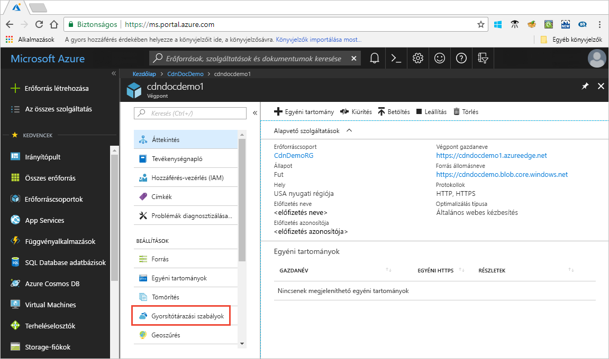

# Oktatóanyag: Azure CDN-gyorsítótárazási szabályok beállítása

> [!NOTE] 
> Az Azure CDN gyorsítótárazási szabályok csak a **Verizon Azure CDN Standard** és az **Akamai Azure CDN Standard** szolgáltatásához érhetők el. A **Verizon Azure CDN Premium** szolgáltatásához használja az [Azure CDN-szabálymotort](cdn-rules-engine.md) a **Felügyelet** portálon, amely hasonló funkciókat kínál.
 

Ez az oktatóanyag leírja, hogyan használhatók az Azure Content Delivery Network (CDN) gyorsítótárazási szabályai az alapértelmezett gyorsítótár-lejárati viselkedés globális vagy egyéni feltételek megadásával, például URL-elérési úttal vagy fájlkiterjesztéssel történő módosítására. Az Azure CDN két gyorsítótárazási szabálytípust biztosít:
- Globális gyorsítótárazási szabályok: Beállíthat egy globális gyorsítótárazási szabályt mindegyik végponthoz a profiljában, amely a végpontra küldött összes kérelmet érinti. A globális gyorsítótárazási szabály felülbírálja az összes HTTP-gyorsítótárazási irányelv fejlécét, ha be van állítva.

- Egyéni gyorsítótárazási szabályok: Beállíthat egy vagy több globális gyorsítótárazási szabályt minden egyes végponthoz a profiljában. Az egyéni gyorsítótárazási szabályok meghatározott elérési utaknak és fájlkiterjesztéseknek felelnek meg, a feldolgozásuk sorrendben történik, és felülbírálják a globális gyorsítótárazási szabályt, ha az be van állítva. 

Eben az oktatóanyagban az alábbiakkal fog megismerkedni:
> [!div class="checklist"]
> - A gyorsítótárazási szabályok lap megnyitása.
> - Globális gyorsítótárazási szabály létrehozása.
> - Egyéni gyorsítótárazási szabály létrehozása.

[!INCLUDE [quickstarts-free-trial-note](../../includes/quickstarts-free-trial-note.md)]

## Előfeltételek

Mielőtt elvégezhetné a jelen oktatóanyag lépéseit, először létre kell hoznia egy CDN-profilt, és legalább egy CDN-végpontot. További információk: [Gyors útmutató: Azure CDN-profil és -végpont létrehozása](cdn-create-new-endpoint.md)

## Az Azure CDN-gyorsítótárazási szabályok lap megnyitása

1. Az [Azure Portalon](https://portal.azure.com) válasszon egy CDN-profilt, majd egy végpontot.

2. A bal oldali ablaktáblán, a Beállítások alatt válassza a **Gyorsítótárszabályok** lehetőséget.

   

   Megjelenik a **Gyorsítótárszabályok** lap.

   

## Globális gyorsítótárszabályok beállítása

Hozzon létre egy globális gyorsítótárszabályt a következők szerint:

1. A **Globális gyorsítótárszabályok** alatt a **Lekérdezési sztringek gyorsítótárazása** beállításaként adja meg a **Lekérdezési sztringek kihagyása** értéket.

2. Adja meg a **Gyorsítótárazás működése** beállításaként a **Beállítás hiányzó érték esetén** lehetőséget.
       
3. A **Gyorsítótár elévülési ideje** értékeként adja meg a 10 értéket a **Napok** mezőben.

    A globális gyorsítótárszabály érinti a végpontra küldött összes kérelmet. Ez a szabály eleget tesz az forrás szerinti gyorsítótárirányelv-fejléceknek, ha vannak (`Cache-Control` vagy `Expires`); egyébként, ha nincsenek meghatározva, a gyorsítótárhoz 10 napot állít be. 

    

## Egyéni gyorsítótárszabályok beállítása

Hozzon létre egy egyéni gyorsítótárszabályt a következők szerint:

1. Az **Egyéni gyorsítótárszabályok** területen adja meg az **Egyeztetési feltétel** beállításaként az **Elérési út** az **Egyeztetési érték** beállításaként pedig a `/images/*.jpg` lehetőséget.
    
2. Adja meg a **Gyorsítótárazás működése** beállításaként a **Felülbírálás** lehetőséget, és írja be, hogy 30 a **Napok** mezőbe.
       
    Ezzel az egyéni szabállyal 30 napos gyorsítótár-élettartamot állít be a végpont `/images` mappájának bármely `.jpg` képfájljához. Ezzel felülbírálja a forráskiszolgáló által küldött bármely `Cache-Control` vagy `Expires` HTTP-fejlécet.

    

    
## Az erőforrások eltávolítása

Az előző lépésekben gyorsítótárazási szabályokat hozott létre. Ha már nem szeretné használni ezeket a gyorsítótárazási szabályokat, a következő lépések követésével távolíthatja el őket:
 
1. Válassza ki a CDN-profilt, majd azt a végpontot, amely tartalmazza az eltávolítani kívánt gyorsítótárszabályokat.

2. A bal oldali ablaktáblán, a Beállítások alatt válassza a **Gyorsítótárszabályok** lehetőséget.

3. A **Globális gyorsítótárszabályok** területen adja meg a **Gyorsítótárazás működése** beállításaként a **Nincs beállítva** lehetőséget.
 
4. Az **Egyéni gyorsítótárszabályok** alatt jelölje be a törölni kívánt szabály melletti jelölőnégyzetet.

5. Válassza a **Törlés** elemet.

6. Válassza a lap tetején a **Mentés** lehetőséget.

## További lépések

Ez az oktatóanyag bemutatta, hogyan végezheti el az alábbi műveleteket:

> [!div class="checklist"]
> - A gyorsítótárazási szabályok lap megnyitása.
> - Globális gyorsítótárazási szabály létrehozása.
> - Egyéni gyorsítótárazási szabály létrehozása.

Lépjen tovább a következő cikkre, ahol további gyorsítótárszabályok beállítását sajátíthatja el.

> [!div class="nextstepaction"]
> [Az Azure CDN gyorsítótárazási viselkedésének vezérlése gyorsítótárszabályokkal](cdn-caching-rules.md)

