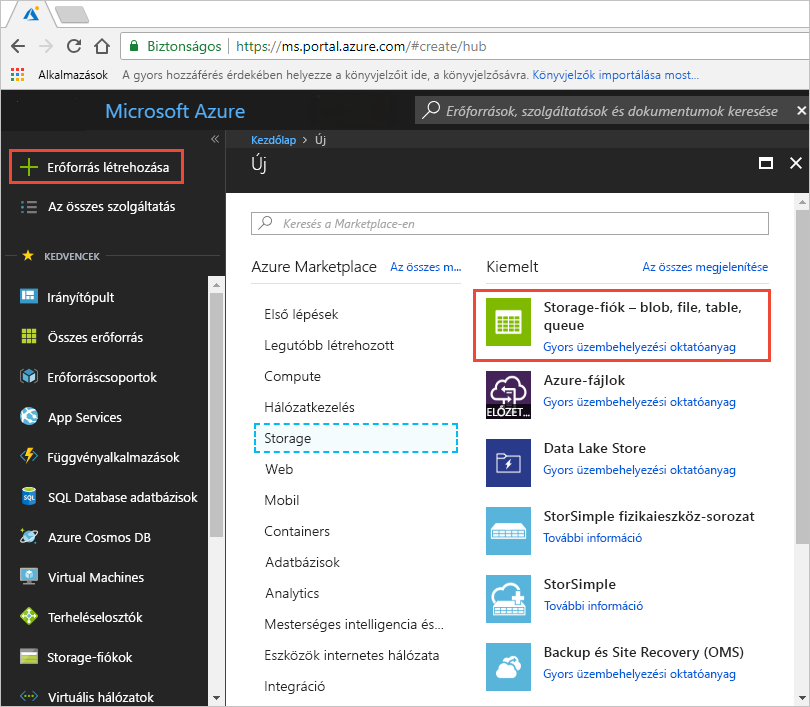
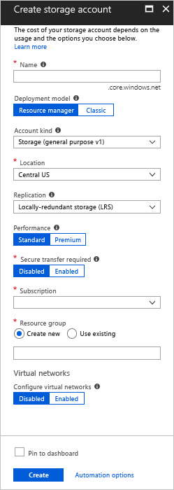
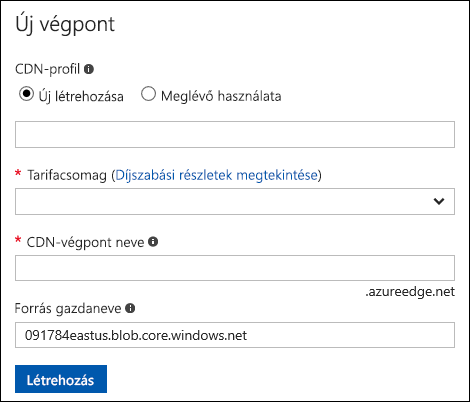
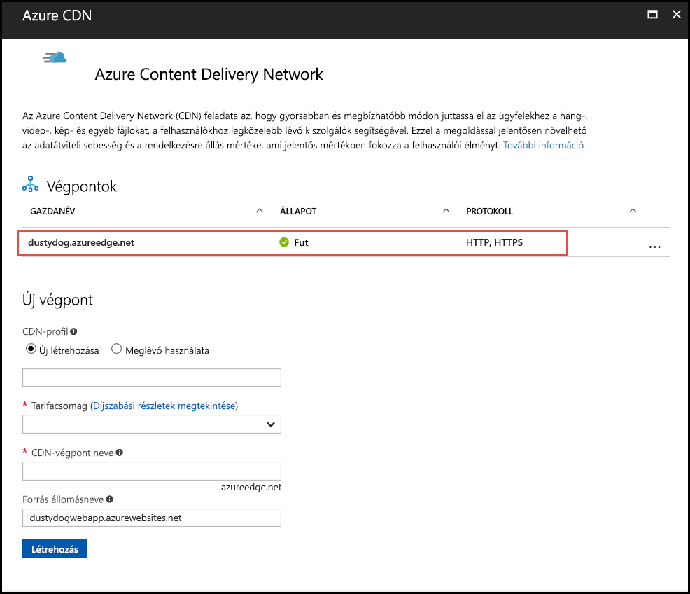
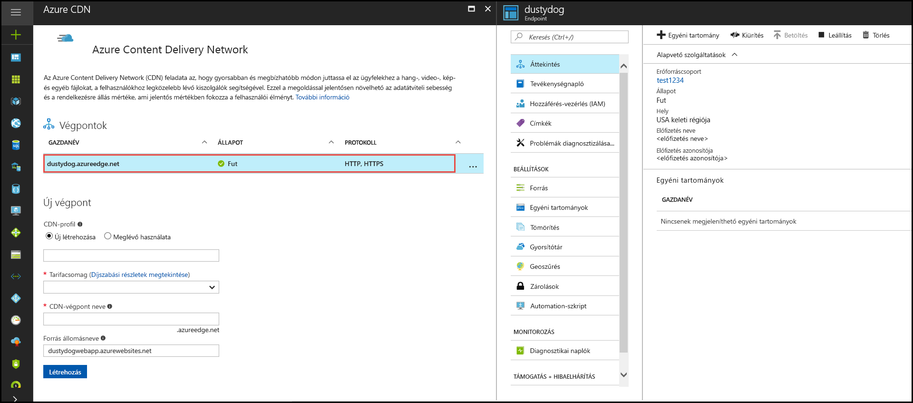

# Rövid útmutató: Azure Storage-fiók integrálása az Azure CDN-nel
Ebben a rövid útmutatóban engedélyezni fogja az [Azure Content Delivery Network (CDN)](cdn-overview.md) számára az Azure Storage-ből származó tartalmak gyorsítótárazását. Az Azure CDN egy globális megoldást kínál a fejlesztők számára a tartalmak nagy sávszélességű kézbesítéséhez. Képes arra, hogy fizikai csomópontokon gyorsítótárazza a blobokat és a számítási példányok statikus tartalmát az Amerikai Egyesült Államok, Európa, Ázsia, Ausztrália és Dél-Amerika területén.

[!INCLUDE [quickstarts-free-trial-note](../../includes/quickstarts-free-trial-note.md)]

## Bejelentkezés az Azure Portalra
Jelentkezzen be az [Azure Portalra](https://portal.azure.com) az Azure-fiókjával.

## Create a storage account
Az alábbi módon hozhat létre Azure-előfizetéshez tartozó új tárfiókot. A tárfiókok hozzáférést biztosítanak az Azure Storage szolgáltatásaihoz, és ők képviselik az Azure Storage szolgáltatási összetevőihez – Azure Blob, Queue és Table Storage – való hozzáférés legmagasabb szintű névterét. További információkért lásd: [A Microsoft Azure Storage bemutatása](../storage/common/storage-introduction.md).

Tárfiók létrehozásához a társított előfizetés szolgáltatás-rendszergazdájának vagy társadminisztrátorának kell lennie.

Többféle módon is létrehozhat tárfiókot, többek között az Azure Portal vagy a PowerShell használatával. A rövid útmutató az Azure Portal ezen célra történő használatát mutatja be.   

**Tárfiók létrehozása egy Azure-előfizetéshez**

1. Válassza az Azure Portal bal felső sarkában az **Erőforrás létrehozása** lehetőséget. 

    Ekkor megnyílik az **Új** panel.

2. Válassza a **Storage** elemet, majd a **Tárfiók – blob, fájl, tábla, üzenetsor** lehetőséget.
    
    

    Megjelenik a **Tárfiók létrehozása** panel.   

    

3. A **Név** mezőben adjon meg egy altartománynevet. A bejegyzés 3-24 karakterből állhat, és csak kisbetűket és számokat tartalmazhat.
   
    Ez az érték lesz a gazdagépnév az URI-n belül, amellyel a rendszer az előfizetés blob-, üzenetsor- vagy táblaerőforrásainak címzéséhez használ. A Blob Storage-ban lévő tároló-erőforrások címzéséhez egy következő formátumú URI-t használjon:
   
    http://*&lt;StorageAcountLabel&gt;*.blob.core.windows.net/*&lt;mycontainer&gt;*

    ahol a *&lt;StorageAccountLabel&gt;* a **Név** mezőben megadott értéken alapul.
   
    > [!IMPORTANT]    
    > Az URL-címke alkotja a tárfiók URI-jának altartományát, és az összes Azure-beli üzemeltetett szolgáltatás között egyedinek kell lennie.
   
    A rendszer ugyanezt az értéket használja a tárfiók portálon belüli neveként, illetve amikor Ön egy programon keresztül fér hozzá a fiókhoz.
    
4. A többi beállításhoz használja a következő táblázatban megadott értékeket:

    | Beállítás  | Érték |
    | -------- | ----- |
    | **Üzemi modell** | Használja az alapértelmezett értéket. |
    | **Fióktípus** | Használja az alapértelmezett értéket. |
    | **Hely**    | Válassza az **USA középső régiója** értéket a legördülő listából. |
    | **Replikáció** | Használja az alapértelmezett értéket. |
    | **Teljesítmény** | Használja az alapértelmezett értéket. |
    | **Biztonságos átvitelre van szükség** | Használja az alapértelmezett értéket. |
    | **Előfizetés** | Válasszon egy Azure-előfizetést a legördülő listából. |
    | **Erőforráscsoport** | Válassza az **Új létrehozása** lehetőséget, és írja be a *my-resource-group-123* értéket az erőforráscsoport neveként. A névnek globálisan egyedinek kell lennie. Ha már használatban van, megadhat egy másik nevet, vagy válassza ki a **Meglévő használata** lehetőséget, majd a **my-resource-group-123** elemet a legördülő listából.  Az erőforráscsoportokra vonatkozó információval kapcsolatban lásd [az Azure Resource Manager áttekintését](../azure-resource-manager/resource-group-overview.md#resource-groups).| 
    | **Virtuális hálózatok konfigurálása** | Használja az alapértelmezett értéket. |  
    
5. Válassza a **Rögzítés az irányítópulton** lehetőséget, ha a tárfiókot a létrehozása után az irányítópultra szeretné rögzíteni.
    
6. Kattintson a **Létrehozás** gombra. A tárfiók létrehozása több percig is eltarthat.

## Az Azure CDN engedélyezése a tárfiókhoz

Az Azure CDN-t a tárfiókhoz közvetlenül a tárfiókból is engedélyezheti. Ha szeretne speciális konfigurációkat beállítani a CDN-végponthoz (például az optimalizálás típusát), az [Azure CDN bővítményt](cdn-create-new-endpoint.md) is használhatja CDN-profil vagy -végpont létrehozásához.

1. Válasszon ki egy tárfiókot az irányítópulton, majd válassza az **Azure CDN** lehetőséget a bal oldali panelen. Ha az **Azure CDN** gomb nem jelenik meg azonnal, beírhatja a CDN kifejezést a bal oldali panel **Keresés** mezőjébe.
    
    Megjelenik az **Azure CDN** oldal.

    
    
2. Új végpontot a következő táblázatban ismertetett információk megadásával hozhat létre:

    | Beállítás  | Érték |
    | -------- | ----- |
    | **CDN-profil** | Válassza ki az **Új létrehozása** lehetőséget, majd írja be a *my-cdn-profile-123* értéket a profil neveként. Ennek a névnek globálisan egyedinek kell lennie. Ha már használatban van, megadhat egy másik nevet.  |
    | **Tarifacsomag** | Válassza a **Standard – Verizon** értéket a legördülő listából. |
    | **CDN-végpont neve** | Adja meg a *my-endpoint-123* nevet végpontja gazdaneveként. Ennek a névnek globálisan egyedinek kell lennie. Ha már használatban van, megadhat egy másik nevet. A rendszer ezt a nevet használja a gyorsítótárazott erőforrások eléréséhez a _&lt;végpont neve&gt;_.azureedge.net tartományban. Alapértelmezés szerint egy új CDN-végpont a tárfiók eszköznevét használja forráskiszolgálóként.|

3. Kattintson a **Létrehozás** gombra. A létrejött végpont megjelenik a végpontok listájában.

    

## További CDN-szolgáltatások engedélyezése
A tárfiók **Azure CDN** oldalán válassza ki a CDN-végpontot, hogy megnyissa annak konfigurációs lapját. Ezen a lapon engedélyezhet további CDN-szolgáltatásokat a kézbesítéshez, például a [tömörítést](cdn-improve-performance.md), [a lekérdezési sztringek gyorsítótárazását](cdn-query-string.md) és a [geoszűrést](cdn-restrict-access-by-country.md). 
    

## Hozzáférés a CDN tartalmához
A CDN-en lévő gyorsítótárazott tartalmakhoz való hozzáféréshez használja a CDN portálon megadott URL-címét. A gyorsítótárazott blobok címének formátuma a következő:

http://<*VégpontNeve*\>.azureedge.net/<*sajátNyilvánosTároló*\>/<*BlobNeve*\>

> [!NOTE]
> Miután engedélyezte a tárfiókhoz való hozzáférést az Azure CDN számára, az összes nyilvánosan elérhető objektum jogosult a CDN POP gyorsítótárazásra. Ha módosítja a CDN egyik gyorsítótárazott objektumát, az új tartalom nem lesz elérhető az Azure CDN-en keresztül, amíg az Azure CDN nem frissíti a tartalmát a gyorsítótárazott tartalom élettartamának lejártát követően.

## Tartalmak eltávolítása az Azure CDN-ről
Ha egy objektumot nem szeretne a továbbiakban gyorsítótárazni az Azure CDN-ben, hajtsa végre a következő műveletek valamelyikét:

* Állítsa a tárolót privátra (nyilvános helyett). További információkért lás a [tárolók és blobok névtelen olvasási hozzáférésének kezelésével](../storage/blobs/storage-manage-access-to-resources.md) foglalkozó témakört.
* Tiltsa le vagy törölje a CDN-végpontot az Azure Portalon.
* Módosítsa az üzemeltetett szolgáltatást, hogy ne válaszoljon az objektumra vonatkozó kérelmekre.

Egy, az Azure CDN-ben már gyorsítótárazott objektum mindaddig gyorsítótárazva marad, amíg az adott objektum élettartama le nem jár, vagy amíg a végpontot [véglegesen nem törli](cdn-purge-endpoint.md). Amikor az élettartam lejár, az Azure CDN megállapítja, hogy a CDN-végpont továbbra is érvényes, az objektum pedig névtelenül továbbra is elérhető-e. Ha nem, az objektum a továbbiakban nem lesz gyorsítótárazva.

## Az erőforrások eltávolítása
A korábbi lépésekben létrehozott egy CDN-profilt és egy végpontot egy erőforráscsoportban. Mentse ezeket az erőforrásokat, ha a [Következő lépésekre](#next-steps) szeretne lépni, és meg szeretné tudni, hogyan adhat egyéni tartományt a végpontjához. Ugyanakkor ha a jövőben nem várható ezen erőforrások használata, törölheti őket az erőforráscsoport törlésével, így elkerülheti a további díjakat:

1. Az Azure Portal bal oldali menüjében válassza az **Erőforráscsoportok**, majd a **my-resource-group-123** elemet.

2. Az **Erőforráscsoport** oldalon válassza az **Erőforráscsoport törlése** parancsot, adja meg a *my-resource-group-123* nevet a mezőben, majd válassza a **Törlés** elemet.

    Ezzel törli a gyors útmutatóban létrehozott erőforráscsoportot, profilt és a végpontot.

3. A törlendő tárfiókot jelölje ki az irányítópulton, majd válassza ki a **Törlés** lehetőséget a felső menüben.

## További lépések
Az alábbi útmutatóból megtudhatja, hogyan adhat hozzá egyéni tartományt CDN-végpontjához:

> [!div class="nextstepaction"]
> [Oktatóanyag: Egyéni tartomány hozzáadása az Azure CDN-végponthoz](cdn-map-content-to-custom-domain.md)

