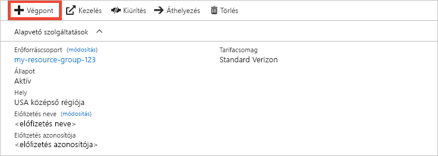
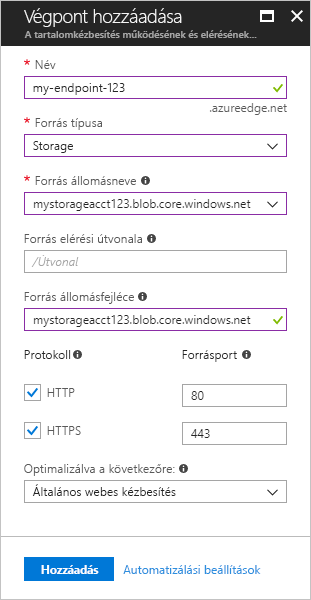
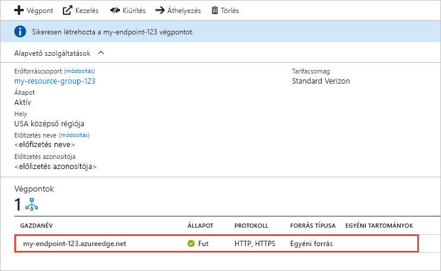

# Gyors útmutató: Azure CDN-profil és -végpont létrehozása
Ebben a gyors útmutatóban egy új CDN-profil és -végpont létrehozásán keresztül engedélyezi az Azure Content Delivery Network (CDN) aktiválását. Miután létrehozott egy profilt és egy végpontot, elindíthatja a tartalomszolgáltatást az ügyfelek felé.

[!INCLUDE [quickstarts-free-trial-note](../../includes/quickstarts-free-trial-note.md)]

## Előfeltételek
Ehhez a gyors útmutatóhoz rendelkeznie kell egy már létrehozott *mystorageacct123* nevű tárfiókkal, amelyet a forrásgazdanévként használ. További információért lásd az [Azure Storage-fiók és az Azure CDN integrálásával](cdn-create-a-storage-account-with-cdn.md) foglalkozó cikket.

## Bejelentkezés az Azure Portalra
Jelentkezzen be az [Azure Portalra](https://portal.azure.com) az Azure-fiókjával.

[!INCLUDE [cdn-create-profile](../../includes/cdn-create-profile.md)]

## Új CDN-végpont létrehozása

A CDN-profil létrehozását követően használhatja azt egy végpont létrehozására.

1. Az Azure Portalon válassza ki a létrehozott CDN-profilt az irányítópulton. Ha nem találja, válassza a **Minden szolgáltatás**, majd a **CDN-profilok** elemet. A **CDN-profilok** oldalon válassza ki a használni kívánt profilt. 
   
    Megjelenik a CDN-profiloldal.

2. Válassza ki a **Végpont** beállítását.
   
    
   
    Megjelenik a **Végpont hozzáadása** panel.

3. A végpont beállításaihoz a következő táblázatban megadott értékeket használja:

    | Beállítás | Érték |
    | ------- | ----- |
    | **Név** | Adja meg a *my-endpoint-123* nevet végpontja gazdaneveként. Ennek a névnek globálisan egyedinek kell lennie. Ha már használatban van, megadhat egy másik nevet. A rendszer ezt a nevet használja a gyorsítótárazott erőforrások eléréséhez a _&lt;végpont neve&gt;_.azureedge.net tartományban.|
    | **Forrás típusa** | Válassza a **Storage** lehetőséget. | 
    | **Forrás gazdaneve** | Adja meg a *mystorageacct123.blob.core.windows.net* nevet gazdanévként. Ennek a névnek globálisan egyedinek kell lennie. Ha már használatban van, megadhat egy másik nevet. |
    | **Forrás elérési útvonala** | Hagyja üresen. |
    | **Forrás állomásfejléce** | Hagyja meg az alapértelmezetten létrehozott értéket. |  
    | **Protokoll** | Hagyja bejelölve az alapértelmezett **HTTP-** és **HTTPS-** beállításokat. |
    | **Forrásport** | Hagyja meg az alapértelmezett portértéket. | 
    | **Optimalizálva a következőre:** | Hagyja meg az alapértelmezett kijelölést, az **Általános webes kézbesítést**. |

    

3. Új végpont létrehozásához kattintson a **Hozzáadás** gombra.
   
   A végpont a létrehozás után megjelenik a profil végpontjainak listájában.
    
   
    
   Mivel némi időre van szükség a regisztráció propagálásához, a végpont nem vehető használatba azonnal: 
   - A **Microsoft Azure CDN Standard** típusú profilok propagálása általában 10 perc alatt fejeződik be. 
   - Az **Akamai Azure CDN Standard** típusú profilok propagálása általában egy percen belül befejeződik. 
   - A **Verizon Azure CDN Standard** és a **Verizon Azure CDN Premium** típusú profilok propagálása általában 90 percen belül fejeződik be. 

## Az erőforrások eltávolítása
A korábbi lépésekben létrehozott egy CDN-profilt és egy végpontot egy erőforráscsoportban. Mentse ezeket az erőforrásokat, ha a [Következő lépésekre](#next-steps) szeretne lépni, és meg szeretné tudni, hogyan adhat egyéni tartományt a végpontjához. Ugyanakkor ha a jövőben nem várható ezen erőforrások használata, törölheti őket az erőforráscsoport törlésével, így elkerülheti a további díjakat:

1. Az Azure Portal bal oldali menüjében válassza az **Erőforráscsoportok**, majd a **my-resource-group-123** elemet.

2. Az **Erőforráscsoport** oldalon válassza az **Erőforráscsoport törlése** parancsot, adja meg a *my-resource-group-123* nevet a mezőben, majd válassza a **Törlés** elemet.

    Ezzel törli a gyors útmutatóban létrehozott erőforráscsoportot, profilt és a végpontot.

## További lépések
Az alábbi útmutatóból megtudhatja, hogyan adhat hozzá egyéni tartományt CDN-végpontjához:

> [!div class="nextstepaction"]
> [Oktatóanyag: Egyéni tartomány hozzáadása az Azure CDN-végponthoz](cdn-map-content-to-custom-domain.md)

