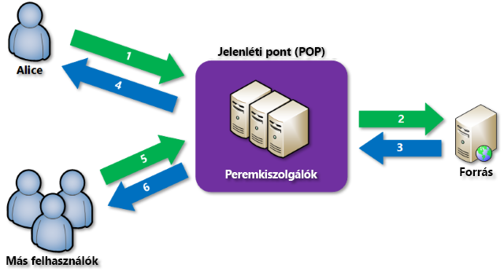

# Az Azure Content Delivery Network (CDN) áttekintése
> [!NOTE]
> Ez a dokumentum bemutatja, hogy mi is az az Azure Content Delivery Network (CDN), ismerteti a rendszer működését, valamint az egyes Azure CDN-termékek funkcióit.  Ha ki szeretné hagyni ezeket az információkat, és rögtön a CDN-végpontok létrehozásáról szóló oktatóanyaggal szeretné kezdeni, akkor tekintse meg [Az Azure CDN szolgáltatás használata](cdn-create-new-endpoint.md) című cikket.  Ha meg szeretné tekinteni a jelenlegi CDN-csomópontok helyének listáját, olvassa el az [Azure CDN POP-helyek](cdn-pop-locations.md) című cikket.
> 
> 

Az Azure Content Delivery Network (CDN) a statikus webtartalmakat stratégiailag kiválasztott helyeken gyorsítótárazza, így maximális átviteli sebességgel tudja kézbesíteni a tartalmakat a felhasználók számára.  A CDN a tartalmakat világszerte fizikai csomópontokon gyorsítótárazva globális megoldást kínál a fejlesztők számára a tartalmak nagy sávszélességű kézbesítéséhez. 

A webhelyek objektumainak CDN használatával történő gyorsítótárazása a következő előnyökkel jár:

* Jobb teljesítmény és felhasználói élmény a végfelhasználók számára – különösen az alkalmazások használata esetén, amikor a tartalom betöltéséhez a kiszolgálóval végzett több adatváltásra is szükség van.
* A teljesítmény könnyedén méretezhető az azonnali nagy terheléshez, például a termékbevezetési események kezdetén fellépő magas igényekhez.
* A felhasználói kérelmek elosztásával és a tartalom peremhálózati kiszolgálókról történő szolgáltatásával csökken a forrásra jutó forgalom.

## Működés

1. A felhasználó (Anna) fájlt (más néven objektumot) kérelmez egy speciális tartománynevet (pl. `<endpointname>.azureedge.net`) tartalmazó URL-cím használatával.  A DNS a kérelmet a legjobb teljesítményt nyújtó jelenléti pontra (POP) irányítja.  Általában ez a felhasználóhoz földrajzilag legközelebb elhelyezkedő jelenléti pont.
2. Ha a jelenléti pont peremhálózati kiszolgálóinak gyorsítótárában nem található meg a fájl, akkor a peremhálózati kiszolgáló lekéri a fájlt a forrásból.  A forrás lehet az Azure Web Apps, az Azure Cloud Service, Azure Storage-fiók vagy bármilyen nyilvánosan elérhető webkiszolgáló.
3. A forrás visszaküldi a fájlt a peremhálózati kiszolgálóra, belefoglalva a fájl élettartamát (TTL) leíró nem kötelező HTTP-fejléceket is.
4. A peremhálózati kiszolgáló gyorsítótárazza a fájlt, és visszaadja az eredeti kérelmezőnek (Anna).  A fájl gyorsítótárazva marad a peremhálózati kiszolgálón, amíg a TTL le nem jár.  Ha a forrás nem adott meg TTL-t, akkor az alapértelmezett TTL hét nap.
5. További felhasználók is lekérhetik ugyanazt a fájlt ugyanazzal az URL-címmel, és a rendszer őket is ugyanarra a jelenléti pontra irányíthatja.
6. Amennyiben a fájl élettartama még nem járt le, a peremhálózati kiszolgáló a fájlt a gyorsítótárból adja vissza.  Az eredmény nagyobb sebesség, dinamikusabb működés, vagyis összességében jobb felhasználói élmény.

## Az Azure CDN szolgáltatásai
Három Azure CDN termék áll rendelkezésre: az **Akamai Azure CDN Standard**, a **Verizon Azure CDN Standard** és a **Verizon Azure CDN Premium**.  A következő táblázat felsorolja az egyes termékek szolgáltatásait.

|  | Akamai Standard | Verizon Standard | Verizon Premium |
| --- | --- | --- | --- |
| Egyszerű integráció az Azure-szolgáltatásokkal – például a [Storage](cdn-create-a-storage-account-with-cdn.md), a [Cloud Services](cdn-cloud-service-with-cdn.md), a [Web Apps](../app-service-web/cdn-websites-with-cdn.md) és a [Media Services](../media-services/media-services-manage-origins.md#enable-cdn) szolgáltatással. |**&#x2713;** |**&#x2713;** |**&#x2713;** |
| Felügyelet [REST API](https://msdn.microsoft.com/library/mt634456.aspx), [.NET](cdn-app-dev-net.md), [Node.js](cdn-app-dev-node.md) vagy [PowerShell](cdn-manage-powershell.md) használatával. |**&#x2713;** |**&#x2713;** |**&#x2713;** |
| HTTPS-támogatás |**&#x2713;** |**&#x2713;** |**&#x2713;** |
| Terheléselosztás |**&#x2713;** |**&#x2713;** |**&#x2713;** |
| Védelem [DDOS](https://www.us-cert.gov/ncas/tips/ST04-015)-támadások ellen |**&#x2713;** |**&#x2713;** |**&#x2713;** |
| Kettős verem (IPv4/IPv6) |**&#x2713;** |**&#x2713;** |**&#x2713;** |
| [Egyéni tartománynevek támogatása](cdn-map-content-to-custom-domain.md) |**&#x2713;** |**&#x2713;** |**&#x2713;** |
| [Lekérdezési karakterláncok gyorsítótárazása](cdn-query-string.md) |**&#x2713;** |**&#x2713;** |**&#x2713;** |
| [Ország szerinti szűrés](cdn-restrict-access-by-country.md) | |**&#x2713;** |**&#x2713;** |
| [Gyors végleges törlés](cdn-purge-endpoint.md) |**&#x2713;** |**&#x2713;** |**&#x2713;** |
| [Objektumok előzetes betöltése](cdn-preload-endpoint.md) | |**&#x2713;** |**&#x2713;** |
| [Egyszerűsített analitika](cdn-analyze-usage-patterns.md) | |**&#x2713;** |**&#x2713;** |
| [HTTP/2-támogatás](https://msdn.microsoft.com/library/mt762901.aspx) |**&#x2713;** | | |
| [Speciális HTTP-jelentések](cdn-advanced-http-reports.md) | | |**&#x2713;** |
| [Valós idejű statisztikák](cdn-real-time-stats.md) | | |**&#x2713;** |
| [Valós idejű riasztások](cdn-real-time-alerts.md) | | |**&#x2713;** |
| [Testreszabható, szabályalapú tartalomkézbesítési motor](cdn-rules-engine.md) | | |**&#x2713;** |
| Gyorsítótár-/fejlécbeállítások (a [szabálymotorral](cdn-rules-engine.md)) | | |**&#x2713;** |
| URL-átirányítás/átírás (a [szabálymotorral](cdn-rules-engine.md)) | | |**&#x2713;** |
| Mobileszközökre vonatkozó szabályok (a [szabálymotorral](cdn-rules-engine.md)) | | |**&#x2713;** |

> [!TIP]
> Van olyan szolgáltatás, amelyet szívesen látna az Azure CDN rendszerben?  [Küldjön visszajelzést!](https://feedback.azure.com/forums/169397-cdn) 
> 
> 

## Következő lépések
A CDN használatbavételének első lépéseiért tekintse meg [Az Azure CDN szolgáltatás használata](cdn-create-new-endpoint.md) című cikket.

Ha Ön már meglévő CDN-ügyfél, a CDN-végpontjait már a [Microsoft Azure Portal](https://portal.azure.com) vagy a [PowerShell](cdn-manage-powershell.md) használatával is kezelheti.

Ha működés közben szeretné látni a CDN-t, tekintse meg a [Build 2016 konferencián elhangzott előadásunk videófelvételét](https://azure.microsoft.com/documentation/videos/build-2016-leveraging-the-new-azure-cdn-apis-to-build-wicked-fast-applications/).

Ismerje meg, hogyan automatizálhatja az Azure CDN-t a [.NET](cdn-app-dev-net.md) vagy a [Node.js](cdn-app-dev-node.md) segítségével.

Díjszabási információkért tekintse meg [A tartalomkézbesítési hálózat (CDN) díjszabása](https://azure.microsoft.com/pricing/details/cdn/) című cikket.

<!--HONumber=Oct16_HO1-->

