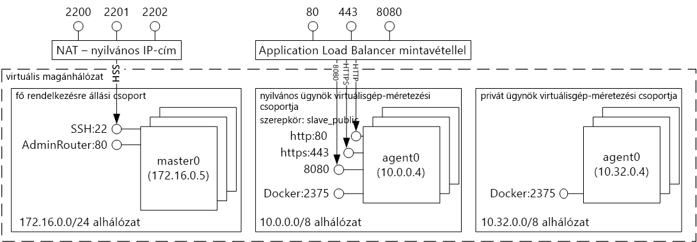
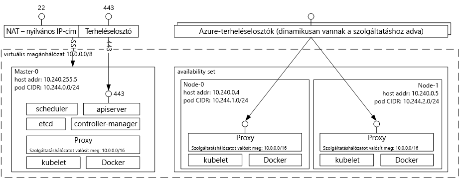

# (ELAVULT) Docker tárolóüzemeltetési megoldás az Azure Container Service bemutatása 

[!INCLUDE [ACS deprecation](../../../includes/container-service-deprecation.md)]

Az Azure Container Service elősegíti azt, hogy egyszerűbben lehessen létrehozni, konfigurálni és kezelni a virtuális gépeknek egy olyan fürtjét, amely tárolóalapú alkalmazások futtatására lett konfigurálva. Ezt nyílt forráskódú ütemezési és vezénylési eszközök optimalizált konfigurációját igénybe véve teszi lehetővé. Így lehetővé válik, hogy a meglévő ismereteit használja, vagy egy nagy és egyre növekvő közösségi szakértelmet vegyen igénybe a tárolóalapú alkalmazások Microsoft Azure-on történő üzembe helyezéséhez és kezeléséhez.

Az Azure Container Service a Docker tárolóformátumot használja, így biztosítva az alkalmazástárolók hordozhatóságát. Ezenkívül támogatja a Marathon, a DC/OS, a Docker Swarm és a Kubernetes használatát, így tárolók ezreire vagy akár tízezreire is méretezheti ezeket az alkalmazásokat.

Az Azure Container Service használatával igénybe veheti az Azure nagyvállalati szintű funkcióit, miközben továbbra is fenntartja az alkalmazás-hordozhatóságot, beleértve a vezénylési rétegek hordozhatóságát is.

## Az Azure Container Service használata
Célunk az Azure Container Service keretében az, hogy a manapság az ügyfelek körében népszerű nyílt forráskódú eszközök és technológiák használatával nyújtsunk tárolóüzemeltetési környezetet. E célból a választott vezénylő (DC/OS, Docker Swarm vagy Kubernetes) számára elérhetővé tesszük a standard API-végpontokat. E végpontokkal bármely olyan szoftvert használhat, amely képes a végpontokkal folytatott kommunikációra. Például a Docker Swarm-végpont esetében választhatja a Docker parancssori felületének használatát. DC/OS esetében dönthet a DCOS parancssori felület, a Kubernetes esetében pedig a `kubectl` használata mellett.

## Egy Docker-fürt létrehozása az Azure Container Service használatával
Az Azure Container Service használatához üzembe kell helyeznie egy Azure Container Service-fürtöt a portálon keresztül (keressen a piactéren az **Azure Container Service** kifejezésre), illetve egy Azure Resource Manager-sablon ([Docker Swarm](https://github.com/Azure/azure-quickstart-templates/tree/master/101-acs-swarm), [DC/OS](https://github.com/Azure/azure-quickstart-templates/tree/master/101-acs-dcos) vagy [Kubernetes](https://github.com/Azure/azure-quickstart-templates/tree/master/101-acs-kubernetes) esetén) vagy az [Azure CLI](container-service-create-acs-cluster-cli.md) segítségével. A megadott gyorsindítási sablonok módosíthatók további vagy speciális Azure-konfigurációk belefoglalásával. Több információ: [Azure tárolószolgáltatás-fürt üzembe helyezése](container-service-deployment.md).

## Alkalmazás üzembe helyezése
Az Azure Container Service lehetővé teszi annak eldöntését, hogy Docker Swarmot, DC/OS-t vagy Kubernetest szeretne-e használni a vezényléshez. A kiválasztott vezénylőtől függ, hogyan helyezi üzembe az alkalmazást.

### A DC/OS használata
A DC/OS egy olyan elosztott operációs rendszer, amely az Apache Mesos elosztott rendszer kernelén alapszik. Az Apache Mesos az Apache Software Foundation részeként érhető el, és felhasználói és közreműködői között megtalálhatók [az informatikai piac legnagyobb nevei](http://mesos.apache.org/documentation/latest/powered-by-mesos/) is.

A DC/OS és az Apache Mesos lenyűgöző szolgáltatáskészletet tesz elérhetővé:

* Bizonyított méretezhetőség
* Apache Zookeepert használó, nagy hibatűrésű replikált főkiszolgáló és alkiszolgálók
* Docker formátumú tárolók támogatása
* Feladatok közötti natív elkülönítés Linux-tárolókkal
* Többforrású ütemezés (memória, processzor, lemez és portok)
* Java, Python és C++ API-k új párhuzamos alkalmazások fejlesztéséhez
* Webes felhasználói felület a fürtállapot áttekintésére

Alapértelmezés szerint az Azure Container Service-en futó DC/OS tartalmazza az ütemezési feladatokhoz szükséges Marathon vezénylési platformot. Az ACS DC/OS rendszerű környezetét részét képező Mesosphere Universe azonban olyan szolgáltatásokat tartalmaz, amelyeket hozzáadhat saját szolgáltatásához. A Universe szolgáltatásai közé tartozik a Spark, a Hadoop, a Cassandra és számos egyéb eszköz.

#### A Marathon használata
A Marathon egy egész fürtre kiterjedő inicializáló és vezérlő rendszer cgroupokban található szolgáltatások vagy – az Azure Container Service esetében – Docker formátumú tárolók számára. A Marathon egy olyan webes felhasználói felületet biztosít, ahonnan telepítheti az alkalmazásokat. Ezt a felületet egy, a következőhöz hasonló URL-címmel érheti el: `http://DNS_PREFIX.REGION.cloudapp.azure.com`,
ahol mind a DNS\_PREFIX, mind a REGION az üzembe helyezéskor van meghatározva. Természetesen megadhatja a saját DNS-nevét is. A Marathon webes felhasználói felülete segítségével futtatott tárolóhoz kapcsolódó további információért lásd a [Tárolókezelés a webes felhasználói felületen](container-service-mesos-marathon-ui.md) című cikket.

REST API-kat is használhat a Marathonnal folytatott kommunikációhoz. Számos ügyfélkódtár létezik, amelyek elérhetők minden egyes eszköz számára. Számos nyelvet támogatnak, és persze a HTTP protokollt is használhatja bármilyen nyelven. Továbbá sok népszerű DevOps-eszköz is támogatja a Marathont. Ez maximális rugalmasságot biztosít a műveleti csapatnak, amikor egy Azure Container Service-fürttel dolgozik. A Marathon REST API-k segítségével futtatott tárolóhoz kapcsolódó további információért lásd a [Tárolókezelés a REST API használatával](container-service-mesos-marathon-rest.md) című cikket.

### A Docker Swarm használata
A Docker Swarm natív fürtszolgáltatást biztosít a Docker számára. Mivel a Docker Swarm a standard Docker API-t szolgálja ki, minden más eszköz, amely már kommunikál a Docker-démonnal használhatja a Swarmot ahhoz, hogy több gazdagépre transzparens módon végezzen átméretezést az Azure Container Service-ben.

[!INCLUDE [container-service-swarm-mode-note](../../../includes/container-service-swarm-mode-note.md)]

A Swarm-fürtön való tárolókezeléseket támogató eszközök közé tartoznak többek között az alábbiak:

* Dokku
* Docker parancssori felület (CLI) és Docker Compose
* Krane
* Jenkins

### A Kubernetes használata
A Kubernetes egy népszerű, nyílt forráskódú, termelési szintű tárolóvezénylő eszköz. A Kubernetes automatizálja a tárolóalapú alkalmazások üzembe helyezését, méretezését és felügyeletét. Mivel ez egy nyílt forráskódú megoldás, amelyet a felhasználói közösség fejleszt, problémamentesen fut az Azure Container Service-en, és használható tárolók méretezhető való üzembe helyezésére az Azure Container Service-ben.

Többek között a következő funkciókat tartalmazza:
* Vízszintes méretezés
* Szolgáltatásészlelés és terheléselosztás
* Titkos kódok és konfigurációk kezelése
* API-alapú automatizált kibocsátások és visszaállítások
* Önjavítás

## Videók
Bevezetés az Azure Container Service használatába (101):  

> [!VIDEO https://channel9.msdn.com/Shows/Azure-Friday/Azure-Container-Service-101/player]
>
>

Alkalmazások létrehozása az Azure Container Service (2016-os build) használatával

> [!VIDEO https://channel9.msdn.com/Events/Build/2016/B822/player]
>
>

## További lépések

Container Service-fürt üzembe helyezése a [portál](container-service-deployment.md) vagy az [Azure CLI](container-service-create-acs-cluster-cli.md) segítségével.
