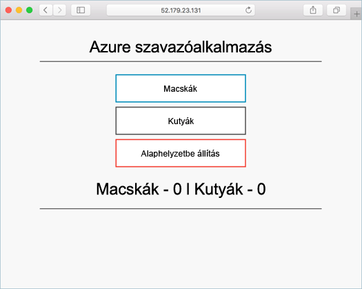

# <a name="deploy-docker-ce-cluster"></a>Docker CE-fürt üzembe helyezése

Ebben a rövid útmutatóban egy Docker CE-fürtöt helyezünk üzembe az Azure CLI-vel. Ezután egy webes előtérrendszert és egy Redis-példányt magában foglaló többtárolós alkalmazást helyezünk üzembe és futtatunk a fürtön. Miután végeztünk ezzel, az alkalmazás elérhető lesz az interneten.

A Docker CE az Azure Container Service-ben előzetes verzióban érhető el, és **éles számítási feladatokra nem használható**.

Ha nem rendelkezik Azure-előfizetéssel, mindössze néhány perc alatt létrehozhat egy [ingyenes fiókot](https://azure.microsoft.com/free/?WT.mc_id=A261C142F) a virtuális gép létrehozásának megkezdése előtt.

Ha a CLI helyi telepítését és használatát választja, akkor ehhez a gyorsútmutatóhoz az Azure CLI 2.0.4-es vagy újabb verziójára lesz szükség. A verzió azonosításához futtassa a következőt: `az --version`. Ha telepíteni vagy frissíteni szeretne: [Az Azure CLI 2.0 telepítése]( /cli/azure/install-azure-cli).

## <a name="create-a-resource-group"></a>Hozzon létre egy erőforráscsoportot

Hozzon létre egy erőforráscsoportot az [az group create](/cli/azure/group#az_group_create) paranccsal. Az Azure-erőforráscsoport olyan logikai csoport, amelyben az Azure-erőforrások üzembe helyezése és kezelése zajlik.

A következő példában létrehozunk egy erőforráscsoportot, nevű *myResourceGroup* a a *westus2* helyét.

```azurecli-interactive
az group create --name myResourceGroup --location westus2
```

Kimenet:

```json
{
  "id": "/subscriptions/00000000-0000-0000-0000-000000000000/resourceGroups/myResourceGroup",
  "location": "westus2",
  "managedBy": null,
  "name": "myResourceGroup",
  "properties": {
    "provisioningState": "Succeeded"
  },
  "tags": null
}
```

## <a name="create-docker-swarm-cluster"></a>Docker Swarm-fürt létrehozása

Az Azure Container Service-ben az [az acs create](/cli/azure/acs#az_acs_create) paranccsal hozhat létre Docker CE-fürtöt. A Docker CE-régió availaiblity információkért lásd: [Docker CE az ACS-régiók](https://github.com/Azure/ACS/blob/master/announcements/2017-08-04_additional_regions.md)

A következő példa egy *mySwarmCluster* nevű fürtöt hoz létre egy Linux-főcsomóponttal és három Linux-ügyfélcsomóponttal.

```azurecli-interactive
az acs create --name mySwarmCluster --orchestrator-type dockerce --resource-group myResourceGroup --generate-ssh-keys
```

Egyes esetekben – például korlátozott próbaverziónál – az Azure-előfizetés korlátozott hozzáféréssel rendelkezik az Azure-erőforrásokhoz. Ha az üzembe helyezés az elérhető magok korlátozott száma miatt hiúsul meg, csökkentse az alapértelmezett ügynökök számát az `--agent-count 1` az [az acs create](/cli/azure/acs#az_acs_create) parancshoz történő hozzáadásával. 

Néhány perc múlva befejeződik a parancs végrehajtása, és visszaadja a fürttel kapcsolatos adatokat JSON formátumban.

## <a name="connect-to-the-cluster"></a>Csatlakozás a fürthöz

A rövid útmutató során szükség lesz a Docker Swarm-főkiszolgáló és a Docker-ügynökkészlet teljes tartománynevére. Futtassa az alábbi parancsot a fő és az ügynök FQDN-ek lekéréséhez.


```bash
az acs list --resource-group myResourceGroup --query '[*].{Master:masterProfile.fqdn,Agent:agentPoolProfiles[0].fqdn}' -o table
```

Kimenet:

```bash
Master                                                               Agent
-------------------------------------------------------------------  --------------------------------------------------------------------
myswarmcluster-myresourcegroup-d5b9d4mgmt.ukwest.cloudapp.azure.com  myswarmcluster-myresourcegroup-d5b9d4agent.ukwest.cloudapp.azure.com
```

Hozzon létre egy SSH-alagutat a Swarm-főkiszolgáló felé. Az `MasterFQDN` elemet cserélje le a Swarm-főkiszolgáló FQDN címére.

```bash
ssh -p 2200 -fNL localhost:2374:/var/run/docker.sock azureuser@MasterFQDN
```

Adja meg a `DOCKER_HOST` környezeti változót. Ez lehetővé teszi a Docker Swarmra irányuló Docker-parancsok futtatását anélkül, hogy meg kellene adni a gazdagép nevét.

```bash
export DOCKER_HOST=localhost:2374
```

Most már készen áll a Docker-szolgáltatások futtatására a Docker Swarmon.


## <a name="run-the-application"></a>Az alkalmazás futtatása

Hozzon létre egy `azure-vote.yaml` nevű fájlt, és másolja az alábbi tartalmat a fájlba.


```yaml
version: '3'
services:
  azure-vote-back:
    image: redis
    ports:
        - "6379:6379"

  azure-vote-front:
    image: microsoft/azure-vote-front:v1
    environment:
      REDIS: azure-vote-back
    ports:
        - "80:80"
```

Futtassa a [docker stack deploy](https://docs.docker.com/engine/reference/commandline/stack_deploy/) parancsot az Azure Vote-szolgáltatás létrehozásához.

```bash
docker stack deploy azure-vote --compose-file azure-vote.yaml
```

Kimenet:

```bash
Creating network azure-vote_default
Creating service azure-vote_azure-vote-back
Creating service azure-vote_azure-vote-front
```

Használja a [docker stack ps](https://docs.docker.com/engine/reference/commandline/stack_ps/) parancsot, hogy visszatérjen az alkalmazás üzembe helyezési állapotához.

```bash
docker stack ps azure-vote
```

Az alkalmazás akkor áll készen, ha az egyes szolgáltatások `CURRENT STATE` állapota `Running`.

```bash
ID                  NAME                            IMAGE                                 NODE                               DESIRED STATE       CURRENT STATE                ERROR               PORTS
tnklkv3ogu3i        azure-vote_azure-vote-front.1   microsoft/azure-vote-front:v1   swarmm-agentpool0-66066781000004   Running             Running 5 seconds ago                            
lg99i4hy68r9        azure-vote_azure-vote-back.1    redis:latest                          swarmm-agentpool0-66066781000002   Running             Running about a minute ago
```

## <a name="test-the-application"></a>Az alkalmazás tesztelése

Lépjen a Swarm-ügynökkészlet teljes tartománynevére az Azure Vote-alkalmazás teszteléséhez.



## <a name="delete-cluster"></a>A fürt törlése
Ha a fürtre már nincs szükség, az [az group delete](/cli/azure/group#az_group_delete) paranccsal törölheti az erőforráscsoportot, a tárolószolgáltatást és az összes kapcsolódó erőforrást.

```azurecli-interactive
az group delete --name myResourceGroup --yes --no-wait
```

## <a name="get-the-code"></a>A kód letöltése

Ebben a rövid útmutatóban előre létrehozott tárolórendszerképekkel hoztunk létre egy Docker-szolgáltatást. A kapcsolódó alkalmazáskód, Docker-fájl és Compose-fájl a GitHubon érhető el.

[https://github.com/Azure-Samples/azure-voting-app-redis](https://github.com/Azure-Samples/azure-voting-app-redis.git)

## <a name="next-steps"></a>További lépések

Ebben a rövid útmutatóban egy Docker Swarm-fürtöt és azon egy többtárolós alkalmazást helyezett üzembe.

A Docker Swarm és a Visual Studio Team Services integrálásával kapcsolatos információk megtekintéséhez olvassa el a CI/CD, a Docker Swarm és a VSTS használatával foglalkozó cikket.

> [!div class="nextstepaction"]
> [CI/CD – Docker Swarm és VSTS](./container-service-docker-swarm-setup-ci-cd.md)
