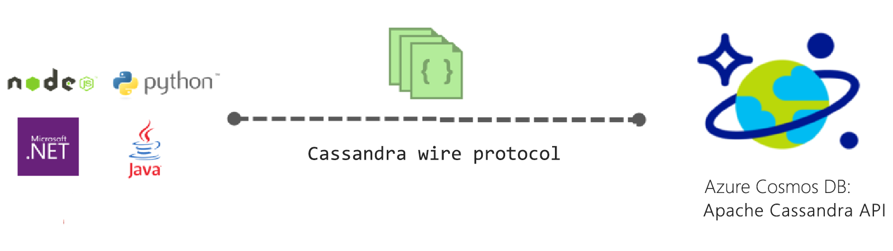
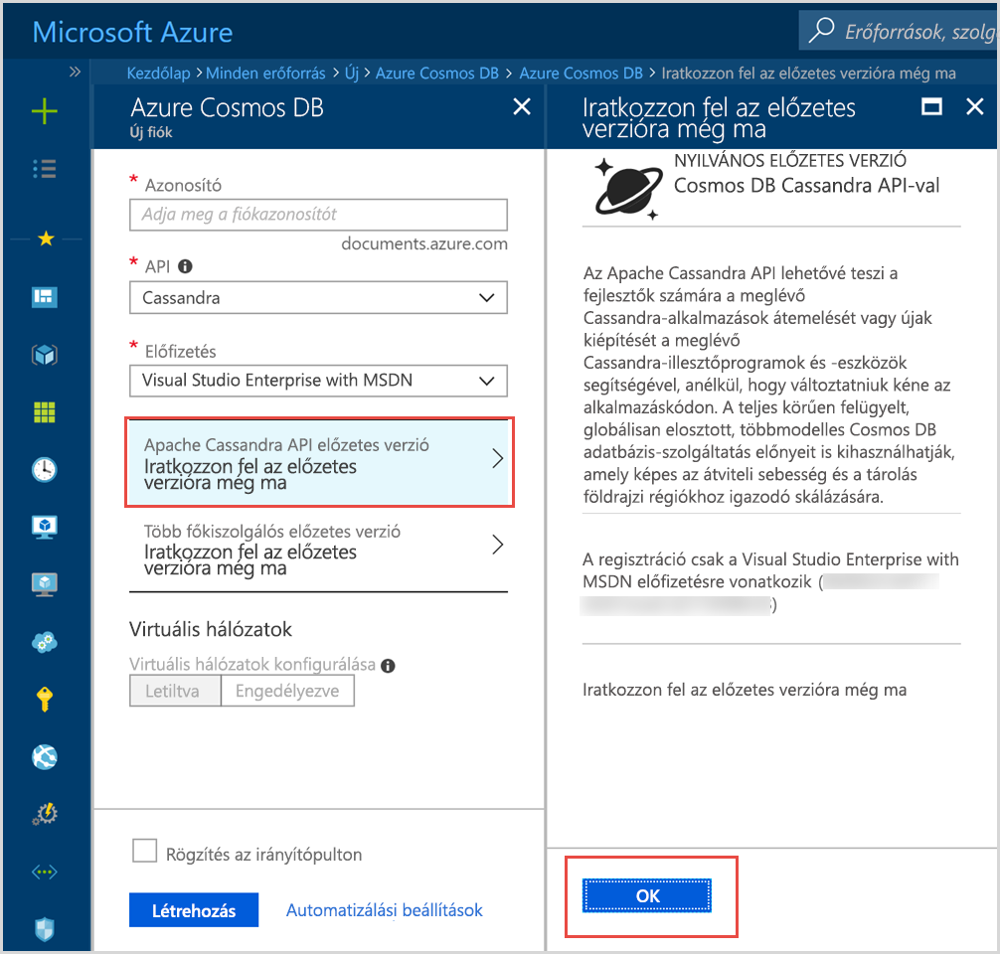

# Bevezetés az Azure Cosmos DB: Apache Cassandra API

Azure Cosmos DB biztosít írt alkalmazások az Apache Cassandra, hogy kell prémium képességei, például a Cassandra API (előzetes verzió):

* [Méretezhető tárolás méretét és az átvitel](partition-data.md).
* [Kulcsrakész globális terjesztési](distribute-data-globally.md)
* Az esetek 99%-ában egyszámjegyű ezredmásodperces késés.
* [Öt jól meghatározott konzisztenciaszintek](consistency-levels.md)
* [Az adatok automatikus indexeléshez](http://www.vldb.org/pvldb/vol8/p1668-shukla.pdf) anélkül, hogy a séma- és index felügyeleti foglalkozik. 
* Magas rendelkezésre állás érdekében minden biztonsági mentés által garantált [iparágvezető SLA-k](https://azure.microsoft.com/support/legal/sla/cosmos-db/)

## Mi az az Azure Cosmos DB Apache Cassandra API-t?

Azure Cosmos-adatbázis is használható adattárként írt [Apache Cassandra](https://cassandra.apache.org/), az Apache Cassandra API használatával. Ez azt jelenti, hogy a meglévő [Apache licencelt CQLv4 kompatibilis illesztőprogramok](https://cassandra.apache.org/doc/latest/getting_started/drivers.html?highlight=driver), az írt Cassandra most már képes kommunikálni az Azure Cosmos DB Cassandra API alkalmazás. Sok esetben megváltoztathatja az Apache Cassandra segítségével Azure Cosmos DB Apache Cassandra API használatával egyszerűen módosítja a kapcsolati karakterláncot. Ezzel a funkcióval könnyedén építhet és futtatási Cassandra API adatbázis-alkalmazások az Azure felhőalapú Azure Cosmos DB globális eloszláshoz és [átfogó iparágvezető SLA](https://azure.microsoft.com/support/legal/sla/cosmos-db), miközben továbbra is használja a megszokott ismeretei és eszközei Cassandra API-hoz.

A Cassandra API lehetővé teszi a Azure Cosmos DB Cassandra Query Language-alapú eszközök (például CQLSH) segítségével tárolt adatok kezeléséhez, és Cassandra ügyfél illesztőprogramok ismeri már. További információ a Microsoft Mechanics videó az egyszerű mérnöki Manager Kirill Gavrylyuk.

> [!VIDEO https://www.youtube.com/embed/1Sf4McGN1AQ]
>

## Mi az az előnye, hogy az Azure Cosmos DB Apache Cassandra API használatával?

**Nincs az operations management**: igaz értékű teljes körűen felügyelt szolgáltatás, mivel Azure Cosmos DB biztosítja, hogy Cassandra API-rendszergazdák nem kezelése és az operációs rendszer, a JVM-et és a yam fájlokat és azok együttműködés átívelő figyelésére is alkalmas a tárfiókokhoz beállítások foglalkoznia. Az Azure Cosmos DB átviteli, késés, tárolási és rendelkezésre állását és konfigurálható riasztások figyelést biztosít. 

**Teljesítménykezelés**: Azure Cosmos DB SLA biztonsági kis késleltetésű olvasások biztosít, és beírja a 99th PERCENTILIS visszaadása. Felhasználók nem kell foglalkoznia a működési munkaterhelés adja meg a helyes olvasási és írási SLA-k számos. Ezek rendszerint ütemezés tömörítés, törlendő elemek, a virágzó szűrők beállítását, és a replika késedelmes jelentések kezelése. Az Azure Cosmos DB vesz számítógépnél kezelését ezek aggódjon állít ki, és lehetővé teszi, hogy az alkalmazás termékek összpontosítanak.

**Az automatikus indexeléshez**: Azure Cosmos DB automatikusan elvégzi a Cassandra API-adatbázis táblája az összes oszlopot. Azure Cosmos-adatbázis nem kell lekérdezéseket felgyorsítása érdekében másodlagos indexek létrehozását. Ez biztosítja a kis késleltetésű olvasási és írási állást konzisztens indexelő ennek során. 

**Használhatja a meglévő kódot és az eszközök**: Azure Cosmos DB szolgáltatás átviteli protokoll szintű kompatibilis a meglévő SDK-k és eszközök. Ez a kompatibilitási biztosítja, használhatja a meglévő kódbázisra és Cassandra API az Azure Cosmos DB trivial módosításokkal.

**Átviteli sebesség és tárterület a rugalmasság**: Azure Cosmos platform garantált átviteli rugalmassága lehetővé teszi az egyszerű portálon PowerShell, régiók vagy a CLI műveletek. Rugalmasan méretezhető Azure Cosmos DB táblák és a kiszámítható teljesítmény zökkenőmentesen pedig az alkalmazás forgalmához igazítható. Azure Cosmos DB Cassandra API-táblázatot, amely méretezhető, gyakorlatilag korlátlan tárterület mérete támogatja. 

**Globális terjesztési és rendelkezésre állás**: Azure Cosmos DB lehetővé teszi a teljes Azure-régiók jogosultak egy kis késleltetésű nyújthassunk során a rendelkezésre állási adatok terjesztése. Azure Cosmos-adatbázis rendelkezésre állás 99,99 % régión belül biztosít, és 99.999 % olvassa el a rendelkezésre állási nem műveletek terhelést a régiók között. Az Azure Cosmos DB érhető el a 30 + [Azure-régiókat](https://azure.microsoft.com/regions/services/). További információ: [adatok globálisan terjesztése](distribute-data-globally.md). 

**Konzisztencia választott**: Azure Cosmos DB biztosít a választott öt jól meghatározott konzisztenciaszintek konzisztencia és a teljesítmény közötti optimális kompromisszum elérése érdekében. Ezek konzisztenciaszintek erős, kötött elavulás, munkamenet, egységes előtag, és végleges. Ezek részletes, jól meghatározott konzisztenciaszintek lehetővé teszik a fejlesztői, hogy ésszerű kompromisszumot konzisztencia, a rendelkezésre állás és a késleltetés között. További információk: [A rendelkezésre állás és a teljesítmény maximalizálása a konzisztenciaszintek használatával](consistency-levels.md). 

**Enterprise osztályú**: biztonságosságának és alapértelmezetten – DB biztosít az Azure cosmos [megfelelőségi minősítései közül](https://www.microsoft.com/trustcenter) annak érdekében, hogy a felhasználók használhatják a platform anélkül, hogy megfelelőségi problémákat. Azure Cosmos-adatbázis is biztosít a titkosítás aktívan és a mozgási, IP-tűzfal és tartozó vezérlőelem vezérlősík tevékenységeit naplókat.  

## Regisztráljon most 

Ha már rendelkezik Azure-előfizetéssel, regisztrálhat a Cassandra API (előzetes verzió) program csatlakozni a [Azure-portálon](https://aka.ms/cosmosdb-cassandra-signup).  Ha most ismerkedik az Azure-ba, regisztráljon egy [ingyenes próbaverzió](https://azure.microsoft.com/free) hol szerezheti Azure Cosmos DB szabad hozzáférési 12 hónapig. Kövesse az alábbi lépéseket, hogy hozzáférést igényelhessen a Cassandra API (előzetes verzió) program.

1. Az a [Azure-portálon](https://portal.azure.com), kattintson a **hozzon létre egy erőforrást** > **adatbázisok** > **Azure Cosmos DB**. 

2. Válassza ki az új fiók lap **Cassandra** a API mezőbe. 

3. Az a **előfizetés** jelölje ki az ehhez a fiókhoz használni kívánt Azure-előfizetéshez.

4. Kattintson a **regisztráljon az előzetes verzióra még ma**.

    

3. A regisztrációs a kattintva megtekintheti a ma ablaktábla **OK**. 

    Miután a kérelmet, az állapota **jóváhagyásra váró** az új fiók panelen. 

A kérelem elküldése után várja meg, hogy a kérelem jóváhagyását e-mailben értesítést. A nagy mennyiségű kérést, mert egy héten belül értesítést kell kapnia. Nem kell a kérés teljesítéséhez el egy támogatási jegy létrehozását. Kérelem érkezett volt sorrendben felül kell vizsgálni. 

## Első lépések
Egyszer csatlakozott a programot, hajtsa végre a Cassandra API quickstarts hozhat létre egy alkalmazást a Cassandra API használatával:

* [Gyors üzembe helyezés: Build a Cassandra a Node.js és Azure Cosmos DB webalkalmazás](create-cassandra-nodejs.md)
* [Gyors üzembe helyezés: Build a Cassandra Java és Azure Cosmos DB webalkalmazás](create-cassandra-java.md)
* [Gyors üzembe helyezés: Build a Cassandra .NET és Azure Cosmos DB webalkalmazás](create-cassandra-dotnet.md)
* [Gyors üzembe helyezés: Build a Cassandra Azure Cosmos DB és Python webalkalmazás](create-cassandra-python.md)

## További lépések

Az Azure Cosmos DB Cassandra API információ integrálva van a teljes Azure Cosmos DB dokumentációt, de az alábbiakban néhány mutatók az első lépésekhez:

* Kövesse a [Quickstarts](create-cassandra-nodejs.md) Git minta segítségével egy fiókot és egy új alkalmazás létrehozásához
* Kövesse a [oktatóanyag](tutorial-develop-cassandra-java.md) programozott módon létrehozhat egy új alkalmazást.
* Kövesse a [importálása Cassandra adatok oktatóanyag](cassandra-import-data.md) a meglévő adatok importálása az Azure Cosmos DB.
* Olvassa el a [gyakran ismételt kérdések](faq.md#cassandra).
