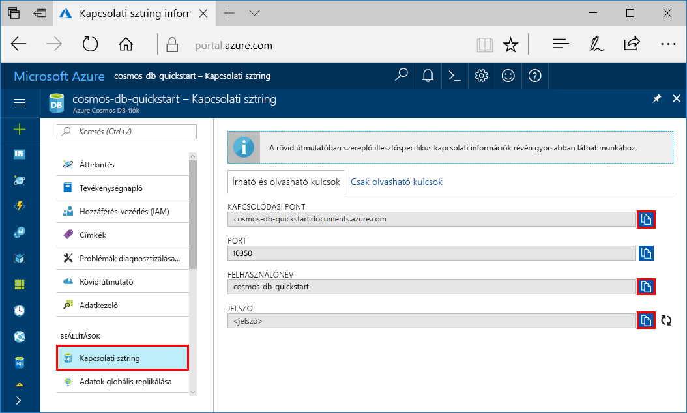
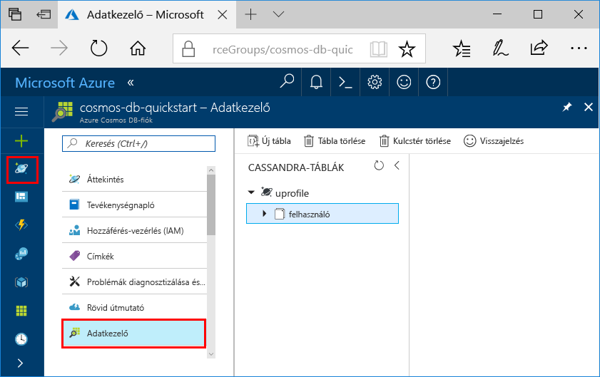

# <a name="quickstart-build-a-cassandra-app-with-net-and-azure-cosmos-db"></a>Rövid útmutató: Cassandra alkalmazás felépítése a .NET és az Azure Cosmos DB használatával

Ez a rövid útmutató azt ismerteti, hogy hogyan használható a .NET és az Azure Cosmos DB [Cassandra API](cassandra-introduction.md) egy profilalkalmazás létrehozására egy GitHubról származó példa klónozásával. A rövid útmutató emellett azt is bemutatja, hogyan hozható létre egy Azure Cosmos DB-fiók a webes alapú Azure Portal használatával.   

Az Azure Cosmos DB a Microsoft globálisan elosztott többmodelles adatbázis-szolgáltatása. Segítségével gyorsan létrehozhat és lekérdezhet dokumentum, tábla, kulcs-érték és gráf típusú adatbázisokat, amelyek mindegyike felhasználja az Azure Cosmos DB középpontjában álló globális elosztási és horizontális skálázhatósági képességeket. 

## <a name="prerequisites"></a>Előfeltételek

[!INCLUDE [quickstarts-free-trial-note](../../includes/quickstarts-free-trial-note.md)] Alternatív lehetőségként [kipróbálhatja ingyenesen az Azure Cosmos DB-t](https://azure.microsoft.com/try/cosmosdb/) Azure-előfizetés, díjfizetés és elköteleződés nélkül.

Csatlakozzon az Azure Cosmos DB Cassandra API előzetes programjához. Ha még nem igényelt hozzáférést, [regisztráljon most](cassandra-introduction.md#sign-up-now).

Továbbá: 
* Ha nincs telepítve a Visual Studio 2017, letöltheti és használhatja az **ingyenes** [Visual Studio 2017 Community Edition](https://www.visualstudio.com/downloads/)t. Ügyeljen arra, hogy engedélyezze az **Azure Development** használatát a Visual Studio telepítése során.
* Telepítse a [Git szoftvert](https://www.git-scm.com/) a példa klónozásához.

<a id="create-account"></a>
## <a name="create-a-database-account"></a>Adatbázisfiók létrehozása

[!INCLUDE [cosmos-db-create-dbaccount-cassandra](../../includes/cosmos-db-create-dbaccount-cassandra.md)]


## <a name="clone-the-sample-application"></a>A mintaalkalmazás klónozása

Most pedig váltsunk át kódok használatára. A következő lépésekben elvégezheti a Cassandra API-alkalmazás klónozását a GitHubról, beállíthatja a kapcsolati karakterláncot, és futtathatja az alkalmazást. Látni fogja, milyen egyszerű az adatokkal programozott módon dolgozni. 

1. Nyisson meg egy parancssort, hozzon létre egy git-samples nevű új mappát, majd zárja be a parancssort.

    ```bash
    md "C:\git-samples"
    ```

2. Nyisson meg egy git terminálablakot, például a git bash eszközt, és a `cd` parancs használatával váltson az új mappára, ahol telepíteni szeretné a mintaalkalmazást.

    ```bash
    cd "C:\git-samples"
    ```

3. Futtassa a következő parancsot a minta tárház klónozásához. Ez a parancs másolatot hoz létre a mintaalkalmazásról az Ön számítógépén.

    ```bash
    git clone https://github.com/Azure-Samples/azure-cosmos-db-cassandra-dotnet-getting-started.git
    ```

3. Ezután nyissa meg a CassandraQuickStartSample megoldásfájlt a Visual Studióban. 

## <a name="review-the-code"></a>A kód áttekintése

Ez a lépés nem kötelező. Ha meg szeretné ismerni, hogyan jönnek létre az adatbázis erőforrásai a kódban, tekintse át a következő kódrészleteket. A kódrészletek mind a C:\git-samples\azure-cosmos-db-cassandra-dotnet-getting-started\CassandraQuickStartSample mappába telepített Program.cs fájlból származnak. Egyéb esetben áttérhet [A kapcsolati karakterlánc frissítése](#update-your-connection-string) szakaszra.

* Egy Cassandra fürtvégponthoz való csatlakozással inicializálja a munkamenetet. Az Azure Cosmos DB-n lévő Cassandra API csak a TLS 1.2-es verziót támogatja. 

  ```csharp
   var options = new Cassandra.SSLOptions(SslProtocols.Tls12, true, ValidateServerCertificate);
   options.SetHostNameResolver((ipAddress) => CassandraContactPoint);
   Cluster cluster = Cluster.Builder().WithCredentials(UserName, Password).WithPort(CassandraPort).AddContactPoint(CassandraContactPoint).WithSSL(options).Build();
   ISession session = cluster.Connect();
   ```

* Új kulcsterület létrehozása.

    ```csharp
    session.Execute("CREATE KEYSPACE uprofile WITH REPLICATION = { 'class' : 'NetworkTopologyStrategy', 'datacenter1' : 1 };"); 
    ```

* Új tábla létrehozása.

   ```csharp
  session.Execute("CREATE TABLE IF NOT EXISTS uprofile.user (user_id int PRIMARY KEY, user_name text, user_bcity text)");
   ```

* Felhasználói entitások beszúrása az IMapper objektum használatával a uprofile kulcsterülethez csatlakozó új munkamenettel.

    ```csharp
    mapper.Insert<User>(new User(1, "LyubovK", "Dubai"));
    ```
    
* Összes felhasználói adat lekérdezése.

    ```csharp
   foreach (User user in mapper.Fetch<User>("Select * from user"))
   {
      Console.WriteLine(user);
   }
    ```
    
* Egyetlen felhasználó adatainak lekérdezése.

    ```csharp
    mapper.FirstOrDefault<User>("Select * from user where user_id = ?", 3);
    ```

## <a name="update-your-connection-string"></a>A kapcsolati karakterlánc frissítése

Lépjen vissza az Azure Portalra a kapcsolati karakterlánc adataiért, majd másolja be azokat az alkalmazásba. A kapcsolati karakterlánc adatai lehetővé teszik az alkalmazás számára, hogy kommunikáljon az üzemeltetett adatbázissal.

1. Az [Azure Portalon](http://portal.azure.com/) kattintson a **Kapcsolati karakterlánc** elemre. 

    Válassza a  a USERNAME érték másolásához.

    

2. Nyissa meg a Program.cs fájlt a Visual Studio 2017 alkalmazásban. 

3. Illessze be a USERNAME értéket a Portalból a `<FILLME>` helyére a 13. sorban.

    A Program.cs 13. sorának ekkor a következőhöz hasonlónak kell kinéznie: 

    `private const string UserName = "cosmos-db-quickstart";`

3. Lépjen vissza a Portalba, és másolja a PASSWORD értéket. Illessze be a PASSWORD értéket a Portalból a 14. sorban található `<FILLME>` érték helyére.

    A Program.cs 14. sorának ekkor a következőhöz hasonlóan kell kinéznie: 

    `private const string Password = "2Ggkr662ifxz2Mg...==";`

4. Lépjen vissza a Portalba, és másolja a CONTACT POINT értéket. Illessze be a CONTACT POINT értéket a Portalból a 15. sorban található `<FILLME>` érték helyére.

    A Program.cs 15. sorának ekkor a következőhöz hasonlóan kell kinéznie: 

    `private const string CassandraContactPoint = "cosmos-db-quickstarts.cassandra.cosmosdb.azure.com"; //  DnsName`

5. Mentse a Program.cs fájlt.
    
## <a name="run-the-app"></a>Az alkalmazás futtatása

1. A Visual Studióban kattintson a **Tools** (Eszközök)  > **NuGet Package Manager** (NuGet-csomagkezelő) > **Package Manager Console** (Csomagkezelő konzol) elemre.

2. A parancssorban a következő paranccsal telepítse a .NET illesztő NuGet-csomagját. 

    ```cmd
    Install-Package CassandraCSharpDriver
    ```
3. Az alkalmazás futtatásához nyomja le a CTRL + F5 billentyűkombinációt. Az alkalmazás megjelenik a konzolablakban. 

    

    Nyomja le a CTRL + C billentyűkombinációt a program futásának megszakításához, és zárja be a konzolablakot. 
    
    Most megnyithatja az Adatkezelőt az Azure Portalon, ahol lekérdezheti és módosíthatja az új adatokat, valamint dolgozhat azokkal. 

    

## <a name="review-slas-in-the-azure-portal"></a>Az SLA-k áttekintése az Azure Portalon

[!INCLUDE [cosmosdb-tutorial-review-slas](../../includes/cosmos-db-tutorial-review-slas.md)]

## <a name="clean-up-resources"></a>Az erőforrások eltávolítása

[!INCLUDE [cosmosdb-delete-resource-group](../../includes/cosmos-db-delete-resource-group.md)]

## <a name="next-steps"></a>További lépések

Ebben a rövid útmutatóban megtudtuk, hogyan lehet Azure Cosmos DB-fiókot létrehozni, hogyan lehet az Adatkezelő segítségével gyűjteményt készíteni, és hogyan lehet futtatni a webalkalmazást. Így már további adatokat importálhat a Cosmos DB-fiókba. 

> [!div class="nextstepaction"]
> [Cassandra-adatok importálása az Azure Cosmos DB-be](cassandra-import-data.md)
