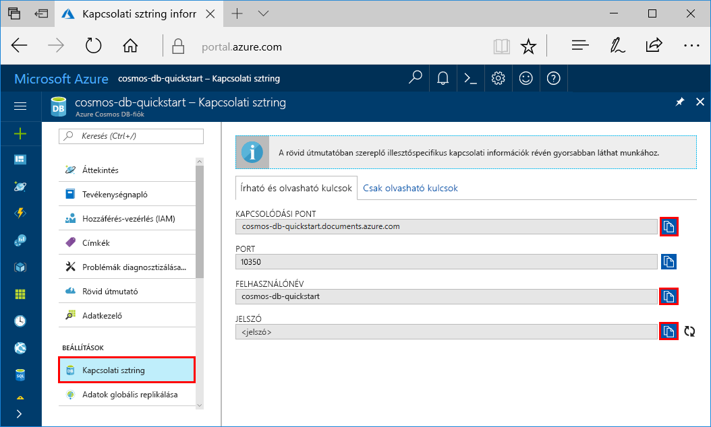

# <a name="quickstart-build-a-cassandra-app-with-java-and-azure-cosmos-db"></a>Rövid útmutató: Cassandra alkalmazás felépítése a Java és az Azure Cosmos DB használatával

Ez a rövid útmutató azt ismerteti, hogy hogyan használható a Java és az Azure Cosmos DB [Cassandra API](cassandra-introduction.md) egy profilalkalmazás létrehozására egy GitHubról származó példa klónozásával. A rövid útmutató emellett azt is bemutatja, hogyan hozható létre egy Azure Cosmos DB-fiók a webes alapú Azure Portal használatával.

Az Azure Cosmos DB a Microsoft globálisan elosztott többmodelles adatbázis-szolgáltatása. Segítségével gyorsan létrehozhat és lekérdezhet dokumentum, tábla, kulcs-érték és gráf típusú adatbázisokat, amelyek mindegyike felhasználja az Azure Cosmos DB középpontjában álló globális elosztási és horizontális skálázhatósági képességeket. 

## <a name="prerequisites"></a>Előfeltételek

[!INCLUDE [quickstarts-free-trial-note](../../includes/quickstarts-free-trial-note.md)] Alternatív lehetőségként [kipróbálhatja ingyenesen az Azure Cosmos DB-t](https://azure.microsoft.com/try/cosmosdb/) Azure-előfizetés, díjfizetés és elköteleződés nélkül.

Csatlakozzon az Azure Cosmos DB Cassandra API előzetes programjához. Ha még nem igényelt hozzáférést, [regisztráljon most](cassandra-introduction.md#sign-up-now).

Továbbá: 

* [Java fejlesztői készlet (JDK) 1.7+](http://www.oracle.com/technetwork/java/javase/downloads/jdk8-downloads-2133151.html)
    * Ubuntu rendszeren futtassa az `apt-get install default-jdk` parancsot a JDK telepítéséhez.
    * Ügyeljen arra, hogy a JAVA_HOME környezeti változó arra a mappára mutasson, ahová a JDK telepítve lett.
* [Maven](http://maven.apache.org/download.cgi) bináris archívum [letöltése](http://maven.apache.org/install.html) és [telepítése](http://maven.apache.org/)
    * Ubuntu rendszeren futtathatja az `apt-get install maven` parancsot a Maven telepítéséhez.
* [Git](https://www.git-scm.com/)
    * Ubuntu rendszeren futtathatja a `sudo apt-get install git` parancsot a Git telepítéséhez.


## <a name="create-a-database-account"></a>Adatbázisfiók létrehozása

A dokumentum-adatbázis létrehozásához először létre kell hoznia egy Cassandra-fiókot az Azure Cosmos DB segítségével.

[!INCLUDE [cosmos-db-create-dbaccount-cassandra](../../includes/cosmos-db-create-dbaccount-cassandra.md)]

## <a name="clone-the-sample-application"></a>A mintaalkalmazás klónozása

Most pedig váltsunk át kódok használatára. A következő lépésekben elvégezheti a Cassandra-alkalmazás klónozását a GitHubról, beállíthatja a kapcsolati sztringet, és futtathatja az alkalmazást. Látni fogja, milyen egyszerű az adatokkal programozott módon dolgozni. 

1. Nyisson meg egy parancssort, hozzon létre egy git-samples nevű új mappát, majd zárja be a parancssort.

    ```bash
    md "C:\git-samples"
    ```

2. Nyisson meg egy git terminálablakot, például a git bash eszközt, és a `cd` parancs használatával váltson az új mappára, ahol telepíteni szeretné a mintaalkalmazást.

    ```bash
    cd "C:\git-samples"
    ```

3. Futtassa a következő parancsot a minta tárház klónozásához. Ez a parancs másolatot hoz létre a mintaalkalmazásról az Ön számítógépén.

    ```bash
    git clone https://github.com/Azure-Samples/azure-cosmos-db-cassandra-java-getting-started.git
    ```

## <a name="review-the-code"></a>A kód áttekintése

Ez a lépés nem kötelező. Ha meg szeretné ismerni, hogyan jönnek létre az adatbázis erőforrásai a kódban, tekintse át a következő kódrészleteket. Egyéb esetben ugorhat [A kapcsolati sztring frissítése](#update-your-connection-string) szakaszra. Ezek a kódrészletek az src/main/java/com/azure/cosmosdb/cassandra/util/CassandraUtils.java fájlból származnak.  

* A Cassandra gazdagép-, port-, felhasználónév-, jelszó- és SSL-beállításai meg vannak adva. A kapcsolati sztring adatai az Azure Portal kapcsolati sztring oldaláról származnak.

   ```java
   cluster = Cluster.builder().addContactPoint(cassandraHost).withPort(cassandraPort).withCredentials(cassandraUsername, cassandraPassword).withSSL(sslOptions).build();
   ```

* A `cluster` csatlakozik az Azure Cosmos DB Cassandra API-hoz, és hozzáférésre visszaad egy munkamenetet.

    ```java
    return cluster.connect();
    ```

A következő kódrészletek a src/main/java/com/azure/cosmosdb/cassandra/repository/UserRepository.java fájlból származnak.

* Új kulcsterület létrehozása.

    ```java
    public void createKeyspace() {
        final String query = "CREATE KEYSPACE IF NOT EXISTS uprofile WITH replication = {'class': 'SimpleStrategy', 'replication_factor': '3' } ";
        session.execute(query);
        LOGGER.info("Created keyspace 'uprofile'");
    }
    ```

* Új tábla létrehozása.

   ```java
   public void createTable() {
        final String query = "CREATE TABLE IF NOT EXISTS uprofile.user (user_id int PRIMARY KEY, user_name text, user_bcity text)";
        session.execute(query);
        LOGGER.info("Created table 'user'");
   }
   ```

* Felhasználói entitások beszúrása előkészített utasításobjektum használatával.

    ```java
    public PreparedStatement prepareInsertStatement() {
        final String insertStatement = "INSERT INTO  uprofile.user (user_id, user_name , user_bcity) VALUES (?,?,?)";
        return session.prepare(insertStatement);
    }

    public void insertUser(PreparedStatement statement, int id, String name, String city) {
        BoundStatement boundStatement = new BoundStatement(statement);
        session.execute(boundStatement.bind(id, name, city));
    }
    ```

* Összes felhasználói adat lekérdezése.

    ```java
   public void selectAllUsers() {
        final String query = "SELECT * FROM uprofile.user";
        List<Row> rows = session.execute(query).all();

        for (Row row : rows) {
            LOGGER.info("Obtained row: {} | {} | {} ", row.getInt("user_id"), row.getString("user_name"), row.getString("user_bcity"));
        }
    }
    ```

* Egyetlen felhasználó adatainak lekérdezése.

    ```java
    public void selectUser(int id) {
        final String query = "SELECT * FROM uprofile.user where user_id = 3";
        Row row = session.execute(query).one();

        LOGGER.info("Obtained row: {} | {} | {} ", row.getInt("user_id"), row.getString("user_name"), row.getString("user_bcity"));
    }
    ```

## <a name="update-your-connection-string"></a>A kapcsolati sztring frissítése

Lépjen vissza az Azure Portalra a kapcsolati sztring adataiért, majd másolja be azokat az alkalmazásba. Ez lehetővé teszi az alkalmazás számára, hogy kommunikáljon az üzemeltetett adatbázissal.

1. Az [Azure Portalon](http://portal.azure.com/) kattintson a **Kapcsolati sztring** elemre. 

    

2. Válassza a  a CONTACT POINT érték másolásához.

3. Nyissa meg a `config.properties` fájlt a C:\git-samples\azure-cosmosdb-cassandra-java-getting-started\java-examples\src\main\resources mappából. 

3. Illessze be a CONTACT POINT értéket a Portalból a `<Cassandra endpoint host>` helyére a 2. sorban.

    A config.properties 2. sorának ekkor a következőhöz hasonlóan kell kinéznie: 

    `cassandra_host=cosmos-db-quickstarts.cassandra.cosmosdb.azure.com`

3. Lépjen vissza a Portalba, és másolja a USERNAME értéket. Illessze be a USERNAME értéket a Portalból a 4. sorban található `<cassandra endpoint username>` érték helyére.

    A config.properties 4. sorának a következőhöz hasonlóan kell kinéznie: 

    `cassandra_username=cosmos-db-quickstart`

4. Lépjen vissza a Portalba, és másolja a PASSWORD értéket. Illessze be a PASSWORD értéket a Portalból az 5. sorban található `<cassandra endpoint password>` érték helyére.

    A config.properties 5. sorának a következőhöz hasonlóan kell kinéznie: 

    `cassandra_password=2Ggkr662ifxz2Mg...==`

5. A 6. sorban, ha egy adott SSL-tanúsítványt kíván használni, cserélje le az `<SSL key store file location>` karakterláncot a SSL-tanúsítvány elérési útvonalára. Ha nem ad meg semmilyen értéket, a rendszer a <JAVA_HOME>/jre/lib/security/cacerts helyen telepített JDK-tanúsítványt használja. 

6. Ha a 6. sort egy adott SSL-tanúsítvány használatára módosította, frissítse a 7. sort a tanúsítvány jelszavával. 

7. Mentse a config.properties fájlt.

## <a name="run-the-app"></a>Az alkalmazás futtatása

1. A git terminálablakában a `cd` paranccsal lépjen az azure-cosmosdb-cassandra-java-getting-started\java-examples mappába.

    ```git
    cd "C:\git-samples\azure-cosmosdb-cassandra-java-getting-started\java-examples"
    ```

2. A git terminálablakban használja a következő parancsot a cosmosdb-cassandra-examples.jar fájl létrehozásához.

    ```git
    mvn clean install
    ```

3. A git terminálablakban futtassa a következő parancsot a Java-alkalmazás indításához.

    ```git
    java -cp target/cosmosdb-cassandra-examples.jar com.azure.cosmosdb.cassandra.examples.UserProfile
    ```

    A terminálablak értesítéseket jelenít meg a kulcstér és a tábla létrehozásáról. Ezt követően kiválasztja és visszaadja a táblában található összes felhasználót, és megjeleníti a kimenetet, majd azonosító alapján kiválaszt egy sort, és megjeleníti az értéket.  

    Nyomja le a CTRL + C billentyűkombinációt a program futásának megszakításához, és zárja be a konzolablakot. 
    
    Most megnyithatja az Adatkezelőt az Azure Portalon, ahol lekérdezheti és módosíthatja az új adatokat, valamint dolgozhat azokkal. 

    

## <a name="review-slas-in-the-azure-portal"></a>Az SLA-k áttekintése az Azure Portalon

[!INCLUDE [cosmosdb-tutorial-review-slas](../../includes/cosmos-db-tutorial-review-slas.md)]

## <a name="clean-up-resources"></a>Az erőforrások eltávolítása

[!INCLUDE [cosmosdb-delete-resource-group](../../includes/cosmos-db-delete-resource-group.md)]

## <a name="next-steps"></a>További lépések

Ebben a rövid útmutatóban bemutattuk, hogyan hozhat létre Azure Cosmos DB-fiókot, Cassandra-adatbázist és tárolót az Adatkezelő segítségével, valamint hogyan futtathat egy alkalmazást, amely programozottan hajtja végre ugyanezt. Most már további adatokat importálhat az Azure Cosmos DB-tárolóba. 

> [!div class="nextstepaction"]
> [Cassandra-adatok importálása az Azure Cosmos DB-be](cassandra-import-data.md)
