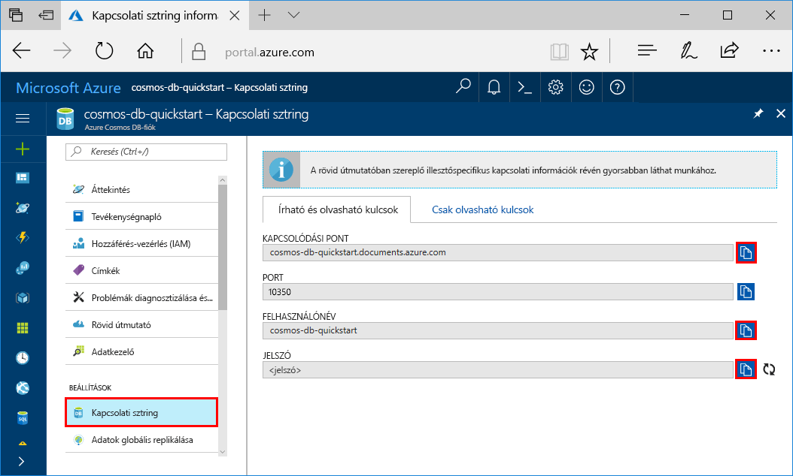
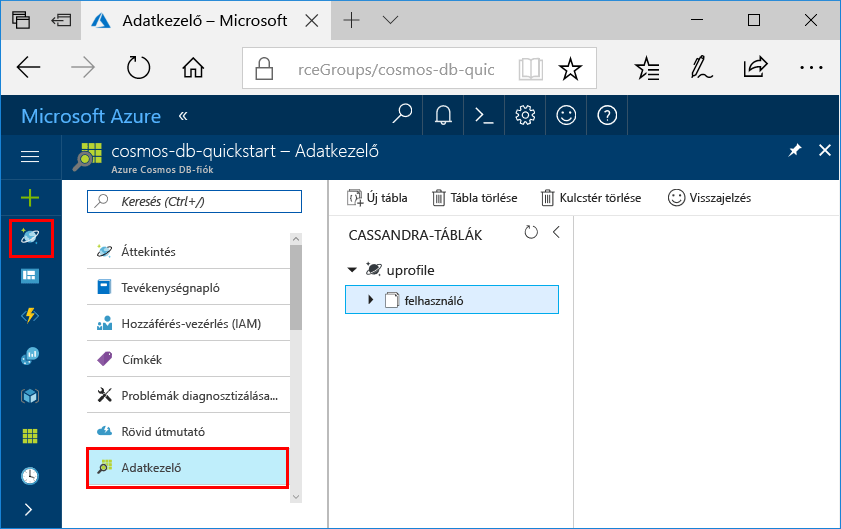

# <a name="quickstart-build-a-cassandra-app-with-nodejs-and-azure-cosmos-db"></a>Gyors üzembe helyezés: A Node.js és az Azure Cosmos DB Cassandra-alkalmazás létrehozása

A gyors üzembe helyezés bemutatja, hogyan használja a Node.js és az Azure Cosmos DB [Cassandra API](cassandra-introduction.md) egy példa a Githubról klónozásával egy profil alkalmazás elkészítésére. A gyors üzembe helyezés is bemutatja, hogyan egy Cosmos-DB Azure-fiók létrehozása a web-alapú Azure portál használatával.

Azure Cosmos-adatbázis egy Microsoft globálisan elosztott több modellre adatbázis szolgáltatás. Gyorsan hozzon létre, és a dokumentum, a tábla, a kulcs-érték és a graph adatbázisok, amelyek kihasználhassa a globális terjesztési és a horizontális skálázhatóságot képességeket Azure Cosmos DB középpontjában lekérdezése. 

## <a name="prerequisites"></a>Előfeltételek

[!INCLUDE [quickstarts-free-trial-note](../../includes/quickstarts-free-trial-note.md)]Alternatív megoldásként, [Azure Cosmos DB szabad próbálja](https://azure.microsoft.com/try/cosmosdb/) díjmentesen és kötelezettségvállalás ingyenes Azure-előfizetéssel, nélkül.

Az Azure Cosmos DB Cassandra API programot: a hozzáférést. Ha még nem telepítette a hozzáférés még, [feliratkozás most](cassandra-introduction.md#sign-up-now).

Továbbá:
* [Node.js](https://nodejs.org/en/)-verzió: 0.10.29-es vagy újabb
* [Git](http://git-scm.com/)

## <a name="create-a-database-account"></a>Adatbázisfiók létrehozása

A dokumentum-adatbázis létrehozása előtt kell Cassandra-fiók létrehozása az Azure Cosmos DB.

[!INCLUDE [cosmos-db-create-dbaccount-cassandra](../../includes/cosmos-db-create-dbaccount-cassandra.md)]

## <a name="clone-the-sample-application"></a>A mintaalkalmazás klónozása

Most tegyük Klónozás egy Cassandra API app a githubból, állítsa be a kapcsolati karakterláncot, és futtassa azt. Ilyen egyszerű az adatokkal programozott módon dolgozni. 

1. Nyisson meg egy git terminálablakot, például a git bash eszközt, és használja a `cd` parancs futtatásával módosíthatja a mintaalkalmazás telepítése mappába. 

    ```bash
    cd "C:\git-samples"
    ```

2. Futtassa a következő parancsot a minta tárház klónozásához. Ezzel a paranccsal létrejön egy mintaalkalmazás példányát a számítógépen.

    ```bash
    git clone https://github.com/Azure-Samples/azure-cosmos-db-cassandra-nodejs-getting-started.git
    ```

## <a name="review-the-code"></a>A kód áttekintése

Ez a lépés nem kötelező megadni. Ha most szeretné ismerni az a kód létrehozását az adatbázis-erőforrások, az alábbi kódtöredékek tekintheti meg. Kódtöredékek a rendszer az összes átveszi a `uprofile.js` a C:\git-samples\azure-cosmos-db-cassandra-nodejs-getting-started mappában. Egyéb esetben ugorjon előre [frissítse a kapcsolati karakterlánc](#update-your-connection-string). 

* Felhasználónév és jelszó van beállítva a kapcsolati karakterlánc oldal használatával az Azure portálon. A "path\to\cert" kapcsolatot biztosít egy X509 a tanúsítványt. 

   ```nodejs
   var ssl_option = {
        cert : fs.readFileSync("path\to\cert"),
        rejectUnauthorized : true,
        secureProtocol: 'TLSv1_2_method'
        };
   const authProviderLocalCassandra = new cassandra.auth.PlainTextAuthProvider(config.username, config.password);
   ```

* A `client` contactPoint adatokkal inicializálva van. A contactPoint veszi át az Azure-portálon.

    ```nodejs
    const client = new cassandra.Client({contactPoints: [config.contactPoint], authProvider: authProviderLocalCassandra, sslOptions:ssl_option});
    ```

* A `client` az Azure Cosmos DB Cassandra API csatlakozik.

    ```nodejs
    client.connect(next);
    ```

* Egy új kulcstérértesítések használatával jön létre.

    ```nodejs
    function createKeyspace(next) {
        var query = "CREATE KEYSPACE IF NOT EXISTS uprofile WITH replication = {\'class\': \'NetworkTopologyStrategy\', \'datacenter1\' : \'1\' }";
        client.execute(query, next);
        console.log("created keyspace");    
  }
    ```

* Létre lett hozva egy új táblázat.

   ```nodejs
   function createTable(next) {
    var query = "CREATE TABLE IF NOT EXISTS uprofile.user (user_id int PRIMARY KEY, user_name text, user_bcity text)";
        client.execute(query, next);
        console.log("created table");
   },
   ```

* Kulcs/érték entitások szúrja be.

    ```nodejs
    ...
       {
          query: 'INSERT INTO  uprofile.user  (user_id, user_name , user_bcity) VALUES (?,?,?)',
          params: [5, 'IvanaV', 'Belgaum', '2017-10-3136']
        }
    ];
    client.batch(queries, { prepare: true}, next);
    ```

* A beolvasandó minden kulcsérték beolvasása.

    ```nodejs
   var query = 'SELECT * FROM uprofile.user';
    client.execute(query, { prepare: true}, function (err, result) {
      if (err) return next(err);
      result.rows.forEach(function(row) {
        console.log('Obtained row: %d | %s | %s ',row.user_id, row.user_name, row.user_bcity);
      }, this);
      next();
    });
    ```  
    
* A lekérdezés egy kulcs-érték beolvasásához.

    ```nodejs
    function selectById(next) {
        console.log("\Getting by id");
        var query = 'SELECT * FROM uprofile.user where user_id=1';
        client.execute(query, { prepare: true}, function (err, result) {
        if (err) return next(err);
            result.rows.forEach(function(row) {
            console.log('Obtained row: %d | %s | %s ',row.user_id, row.user_name, row.user_bcity);
        }, this);
        next();
        });
    }
    ```  

## <a name="update-your-connection-string"></a>A kapcsolati karakterlánc frissítése

Lépjen vissza az Azure Portalra a kapcsolati karakterlánc adataiért, majd másolja be azokat az alkalmazásba. Ez lehetővé teszi az alkalmazás a szolgáltatott adatbázissal való kommunikációhoz.

1. Az a [Azure-portálon](http://portal.azure.com/), kattintson a **kapcsolati karakterlánc**. 

    Használja a  a felső értéket, az ügyfél pontra másol a képernyő jobb szélén gombjára.

    

2. Nyissa meg az `config.js` fájlt. 

3. Illessze be az ügyfél értéket a portálon keresztül `<FillMEIN>` sor 4.

    Sor 4 most hasonlóan kell kinéznie 

    `config.contactPoint = "cosmos-db-quickstarts.documents.azure.com:10350"`

4. Másolja a felhasználónév a portálon, és illessze be azt a keresztül `<FillMEIN>` sor 2.

    2. sor most hasonlóan kell kinéznie 

    `config.username = 'cosmos-db-quickstart';`
    
5. A jelszó értéket másol a portálról, és illessze be azt a keresztül `<FillMEIN>` sor 3.

    Sor 3 most hasonlóan kell kinéznie

    `config.password = '2Ggkr662ifxz2Mg==';`

6. Mentse a config.js fájlt.
    
## <a name="use-the-x509-certificate"></a>Tanúsítvány használata a X509 

1. Adja hozzá a Baltimore CyberTrust Root van szüksége, ha rendelkezik sorozatszám 02:00:00:b9 és SHA1 ujjlenyomat d4🇩🇪20:d0:5e:66:fc:53:fe:1a:50:88:2 c: 78:db:28:52:ca:e4:74. Is letölthetők https://cacert.omniroot.com/bc2025.crt, a bővítmény .cer egy helyi fájlba menti. 

2. Nyissa meg a uprofile.js, és módosítsa a "path\to\cert" úgy, hogy az új tanúsítvány mutasson. 

3. Uprofile.js mentéséhez. 

## <a name="run-the-app"></a>Az alkalmazás futtatása

1. A git-terminál ablakban futtassa `npm install` telepíteni a szükséges npm modult.

2. Futtatás `node uprofile.js` a csomópont alkalmazás indításához.

3. Ellenőrizze az eredményeket a parancssorból várt módon.

    

    Nyomja le a CTRL + C exection a program és a konzol ablak bezárásához. 

    Ezután megnyithatja adatkezelő lekérdezés, módosíthatja, és ezekkel az új adatokkal az Azure portálon. 

     

## <a name="review-slas-in-the-azure-portal"></a>Az SLA-k áttekintése az Azure Portalon

[!INCLUDE [cosmosdb-tutorial-review-slas](../../includes/cosmos-db-tutorial-review-slas.md)]

## <a name="clean-up-resources"></a>Az erőforrások eltávolítása

[!INCLUDE [cosmosdb-delete-resource-group](../../includes/cosmos-db-delete-resource-group.md)]

## <a name="next-steps"></a>Következő lépések

Ebben a rövid útmutatóban bemutattuk, hogyan lehet Azure Cosmos DB-fiókot létrehozni, hogyan lehet az Adatkezelő segítségével gyűjteményt készíteni, és hogyan lehet futtatni az alkalmazást. Most további adatokat importálhat a Cosmos DB-fiókba. 

> [!div class="nextstepaction"]
> [Azure Cosmos DB Cassandra adatok importálása](cassandra-import-data.md)


