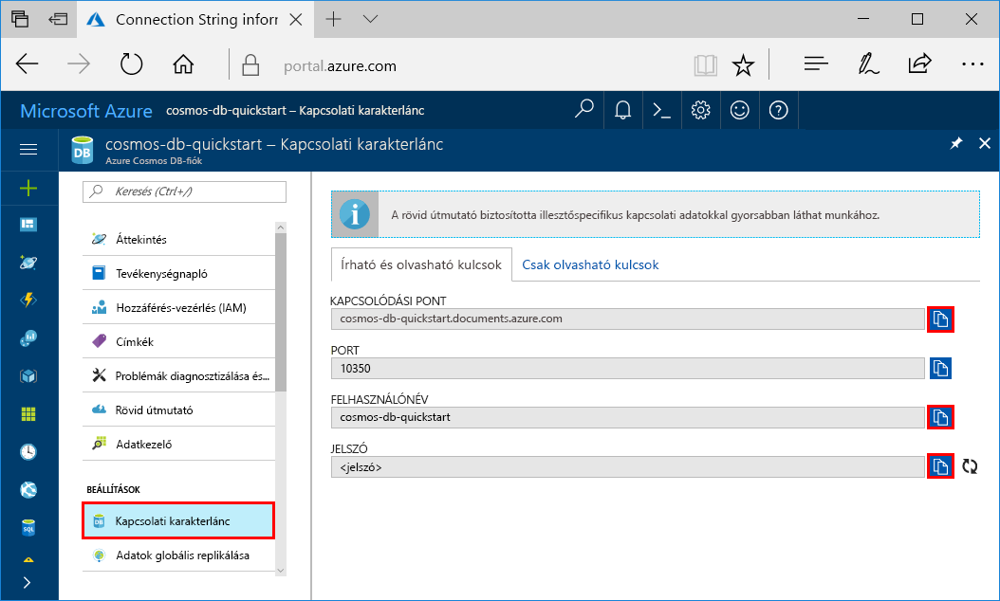
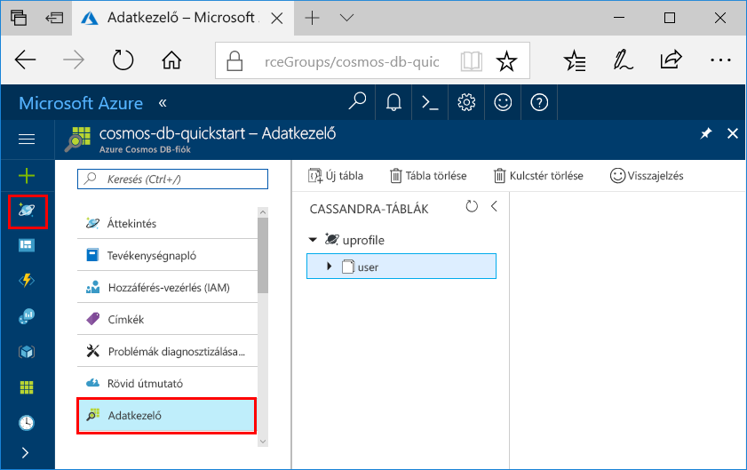

# <a name="quickstart-build-a-cassandra-app-with-python-and-azure-cosmos-db"></a>Gyors útmutató: Cassandra alkalmazás felépítése a Python és az Azure Cosmos DB használatával

Ez a gyors útmutató azt ismerteti, hogy hogyan használható a Python és az Azure Cosmos DB [Cassandra API](cassandra-introduction.md) egy profilalkalmazás létrehozására egy GitHubról származó példa klónozásával. Az útmutató emellett azt is bemutatja, hogyan hozható létre egy Azure Cosmos DB-fiók a webes alapú Azure Portal használatával.

Az Azure Cosmos DB a Microsoft globálisan elosztott többmodelles adatbázis-szolgáltatása. Segítségével gyorsan létrehozhat és lekérdezhet dokumentum, tábla, kulcs-érték és gráf típusú adatbázisokat, amelyek mindegyike felhasználja az Azure Cosmos DB középpontjában álló globális elosztási és horizontális skálázhatósági képességeket.   

## <a name="prerequisites"></a>Előfeltételek

[!INCLUDE [quickstarts-free-trial-note](../../includes/quickstarts-free-trial-note.md)] Alternatív lehetőségként [kipróbálhatja ingyenesen az Azure Cosmos DB-t](https://azure.microsoft.com/try/cosmosdb/) Azure-előfizetés, díjfizetés és elköteleződés nélkül.

Csatlakozzon az Azure Cosmos DB Cassandra API előzetes programjához. Ha még nem igényelt hozzáférést, [regisztráljon most](cassandra-introduction.md#sign-up-now).

Továbbá:
* [Python](https://www.python.org/downloads/) 2.7.14-es verziója
* [Git](http://git-scm.com/)
* [Python illesztő az Apache Cassandra felülethez](https://github.com/datastax/python-driver)

## <a name="create-a-database-account"></a>Adatbázisfiók létrehozása

A dokumentum-adatbázis létrehozásához először létre kell hoznia egy Cassandra-fiókot az Azure Cosmos DB segítségével.

[!INCLUDE [cosmos-db-create-dbaccount-cassandra](../../includes/cosmos-db-create-dbaccount-cassandra.md)]

## <a name="clone-the-sample-application"></a>A mintaalkalmazás klónozása

Most pedig klónozunk egy Cassandra API-alkalmazást a GitHubról, beállítjuk a kapcsolati karakterláncot, majd futtatni fogjuk az alkalmazást. Ilyen egyszerű az adatokkal programozott módon dolgozni. 

1. Nyisson meg egy parancssort, hozzon létre egy git-samples nevű új mappát, majd zárja be a parancssort.

    ```bash
    md "C:\git-samples"
    ```

2. Nyisson meg egy git terminálablakot, például a git bash eszközt, és a `cd` parancs használatával váltson az új mappára, ahol telepíteni szeretné a mintaalkalmazást.

    ```bash
    cd "C:\git-samples"
    ```

3. Futtassa a következő parancsot a minta tárház klónozásához. Ez a parancs másolatot hoz létre a mintaalkalmazásról az Ön számítógépén.

    ```bash
    git clone https://github.com/Azure-Samples/azure-cosmos-db-cassandra-python-getting-started.git
    ```

## <a name="review-the-code"></a>A kód áttekintése

Ez a lépés nem kötelező. Ha meg szeretné ismerni, hogyan jönnek létre az adatbázis erőforrásai a kódban, tekintse át a következő kódrészleteket. A kódrészletek mind a pyquickstart.py fájlból származnak. Egyéb esetben áttérhet [A kapcsolati karakterlánc frissítése](#update-your-connection-string) szakaszra. 

* A felhasználónév és a jelszó a kapcsolati karakterlánc oldalán állítható be az Azure Portalon. Cserélje le a path\to\cert paraméter értékét az X509-tanúsítvány elérési útjára.

   ```python
    ssl_opts = {
            'ca_certs': 'path\to\cert',
            'ssl_version': ssl.PROTOCOL_TLSv1_2
            }
    auth_provider = PlainTextAuthProvider( username=cfg.config['username'], password=cfg.config['password'])
    cluster = Cluster([cfg.config['contactPoint']], port = cfg.config['port'], auth_provider=auth_provider, ssl_options=ssl_opts)
    session = cluster.connect()
   
   ```

* A `cluster` inicializálása contactPoint adataival történik. A contactPoint az Azure Portalról kérhető le.

    ```python
   cluster = Cluster([cfg.config['contactPoint']], port = cfg.config['port'], auth_provider=auth_provider)
    ```

* A `cluster` csatlakozik az Azure Cosmos DB Cassandra API-hoz.

    ```python
    session = cluster.connect()
    ```

* A rendszer létrehoz egy új kulcsteret.

    ```python
   session.execute('CREATE KEYSPACE IF NOT EXISTS uprofile WITH replication = {\'class\': \'NetworkTopologyStrategy\', \'datacenter1\' : \'1\' }')
    ```

* Létrejön egy új tábla.

   ```
   session.execute('CREATE TABLE IF NOT EXISTS uprofile.user (user_id int PRIMARY KEY, user_name text, user_bcity text)');
   ```

* A rendszer beszúrja a kulcs/érték entitásokat.

    ```Python
    insert_data = session.prepare("INSERT INTO  uprofile.user  (user_id, user_name , user_bcity) VALUES (?,?,?)")
    batch = BatchStatement()
    batch.add(insert_data, (1, 'LyubovK', 'Dubai'))
    batch.add(insert_data, (2, 'JiriK', 'Toronto'))
    batch.add(insert_data, (3, 'IvanH', 'Mumbai'))
    batch.add(insert_data, (4, 'YuliaT', 'Seattle'))
    ....
    session.execute(batch)
    ```

* Lekérdezés az összes kulcsérték lekéréséhez.

    ```Python
    rows = session.execute('SELECT * FROM uprofile.user')
    ```  
    
* Lekérdezés a kulcs-érték lekéréséhez.

    ```Python
    
    rows = session.execute('SELECT * FROM uprofile.user where user_id=1')
    ```  

## <a name="update-your-connection-string"></a>A kapcsolati karakterlánc frissítése

Lépjen vissza az Azure Portalra a kapcsolati karakterlánc adataiért, majd másolja be azokat az alkalmazásba. Ez lehetővé teszi az alkalmazás számára, hogy kommunikáljon az üzemeltetett adatbázissal.

1. Az [Azure Portalon](http://portal.azure.com/) kattintson a **Kapcsolati karakterlánc** elemre. 

    Válassza a  használatával (a képernyő jobb oldalán) másolja a vágólapra a felső, CONTACT POINT (Kapcsolódási pont) értéket.

    

2. Nyissa meg az `config.py` fájlt. 

3. Illessze be a CONTACT POINT értéket a portálról a `<FILLME>` helyére a 10. sorban.

    A 10. sornak ekkor a következőképp kell kinéznie: 

    `'contactPoint': 'cosmos-db-quickstarts.cassandra.cosmosdb.azure.com:10350'`

4. Másolja a USERNAME értéket a portálról, és illessze be a `<FILLME>` helyére a 6. sorban.

    A 6. sornak ekkor a következőképp kell kinéznie: 

    `'username': 'cosmos-db-quickstart',`
    
5. Másolja a PASSWORD értéket a portálról, és illessze be a `<FILLME>` helyére a 8. sorban.

    A 8. sornak ekkor a következőképp kell kinéznie:

    `'password' = '2Ggkr662ifxz2Mg==`';`

6. Mentse a config.py fájlt.
    
## <a name="use-the-x509-certificate"></a>Az X509-tanúsítvány használata

1. Ha hozzá kell adnia a Baltimore CyberTrust legfelső szintű tanúsítványát, a sorozatszáma 02:00:00:b9 és a SHA1 ujjlenyomata d4🇩🇪20:d0:5e:66:fc:53:fe:1a:50:88:2c:78:db:28:52:ca:e4:74. Letölthető a https://cacert.omniroot.com/bc2025.crt címről, és .cer kiterjesztéssel helyi fájlba menthető.

2. Nyissa meg a pyquickstart.py fájlt, és változtassa meg a 'path\to\cert' paramétert úgy, hogy az új tanúsítványára mutasson.

3. Mentse a pyquickstart.py fájlt.

## <a name="run-the-app"></a>Az alkalmazás futtatása

1. A cd paranccsal a git terminálon váltson az azure-cosmos-db-cassandra-python-getting-started mappára. 

2. Futtassa az alábbi parancsokat a szükséges modulok telepítéséhez:

    ```python
    python -m pip install cassandra-driver
    python -m pip install prettytable
    python -m pip install requests
    python -m pip install pyopenssl
    ```

2. Futtassa a következő parancsot a node-alkalmazás elindításához:

    ```
    python pyquickstart.py
    ```

3. Ellenőrizze az eredményt a parancssorban.

    Nyomja le a CTRL + C billentyűkombinációt a program futásának megszakításához, és zárja be a konzolablakot. 

    
    
    Most megnyithatja az Adatkezelőt az Azure Portalon, ahol lekérdezheti és módosíthatja az új adatokat, valamint dolgozhat azokkal. 

    

## <a name="review-slas-in-the-azure-portal"></a>Az SLA-k áttekintése az Azure Portalon

[!INCLUDE [cosmosdb-tutorial-review-slas](../../includes/cosmos-db-tutorial-review-slas.md)]

## <a name="clean-up-resources"></a>Az erőforrások eltávolítása

[!INCLUDE [cosmosdb-delete-resource-group](../../includes/cosmos-db-delete-resource-group.md)]

## <a name="next-steps"></a>További lépések

Ebben a rövid útmutatóban bemutattuk, hogyan lehet Azure Cosmos DB-fiókot létrehozni, hogyan lehet az Adatkezelő segítségével gyűjteményt készíteni, és hogyan lehet futtatni az alkalmazást. Így már további adatokat importálhat a Cosmos DB-fiókba. 

> [!div class="nextstepaction"]
> [Cassandra-adatok importálása az Azure Cosmos DB-be](cassandra-import-data.md)

