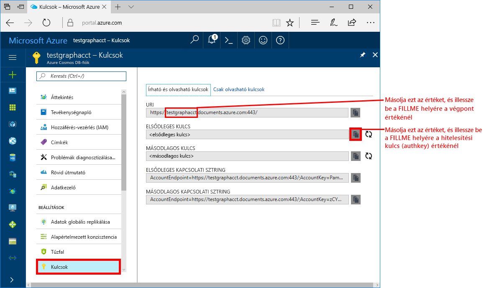
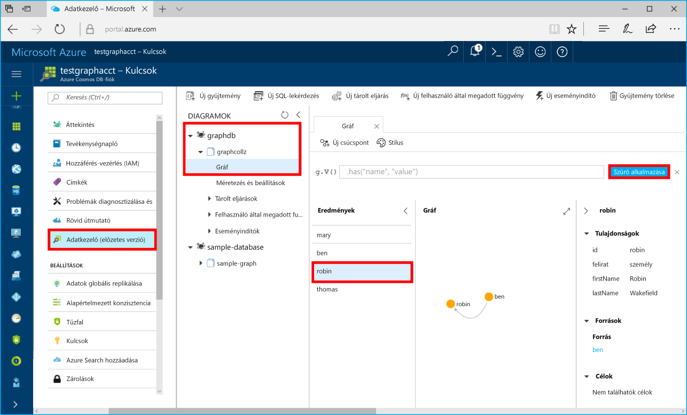

# <a name="azure-cosmos-db-build-a-net-framework-or-core-application-using-the-graph-api"></a>Azure Cosmos DB: .NET-keretrendszer vagy Core-alkalmazás létrehozása a Graph API használatával

Az Azure Cosmos DB a Microsoft globálisan elosztott, többmodelles adatbázis-szolgáltatása. Segítségével gyorsan létrehozhat és lekérdezhet dokumentum, kulcs/érték és gráf típusú adatbázisokat, amelyek mindegyike felhasználja az Azure Cosmos DB középpontjában álló globális elosztási és horizontális skálázhatósági képességeket. 

Ez a rövid útmutató bemutatja, hogyan hozhat létre az Azure Portal segítségével Azure Cosmos DB [Graph API](graph-introduction.md)-fiókot, adatbázist és gráfot (tárolót). Ezután a nyílt forráskódú [Gremlin Net](http://tinkerpop.apache.org/docs/3.2.7/reference/#gremlin-DotNet)-illesztőprogram segítségével létrehozhat és futtathat egy konzolalkalmazást.  

## <a name="prerequisites"></a>Előfeltételek

Ha nincs telepítve a Visual Studio 2017, letöltheti és használhatja az **ingyenes** [Visual Studio 2017 Community Edition](https://www.visualstudio.com/downloads/)t. Ügyeljen arra, hogy engedélyezze az **Azure Development** használatát a Visual Studio telepítése során.

Ha a Visual Studio 2017 már telepítve van, győződjön meg arról, hogy minden frissítés telepítve van a [Visual Studio 2017 Update 3](https://www.visualstudio.com/en-us/news/releasenotes/vs2017-relnotes)-ig bezárólag.

[!INCLUDE [quickstarts-free-trial-note](../../includes/quickstarts-free-trial-note.md)]

## <a name="create-a-database-account"></a>Adatbázisfiók létrehozása

[!INCLUDE [cosmos-db-create-dbaccount-graph](../../includes/cosmos-db-create-dbaccount-graph.md)]

## <a name="add-a-graph"></a>Gráf hozzáadása

[!INCLUDE [cosmos-db-create-graph](../../includes/cosmos-db-create-graph.md)]

## <a name="clone-the-sample-application"></a>A mintaalkalmazás klónozása

A következő lépésekben elvégezheti a Graph API-alkalmazás klónozását a GitHubról, beállíthatja a kapcsolati sztringet, és futtathatja az alkalmazást. Látni fogja, milyen egyszerű az adatokkal programozott módon dolgozni. 

1. Nyisson meg egy git-terminálablakot, például a git basht, és a `cd` paranccsal lépjen a munkakönyvtárba.  

2. Futtassa a következő parancsot a minta tárház klónozásához. 

    ```bash
    git clone https://github.com/Azure-Samples/azure-cosmos-db-graph-gremlindotnet-getting-started.git
    ```

3. Ezután nyissa meg a Visual Studiót, majd a megoldásfájlt.

4. Állítsa vissza a projektben lévő NuGet-csomagokat. Ennek tartalmaznia kell a Gremlin.Net-illesztőprogramot, valamint a Newtonsoft.Json-csomagot.

5. A Gremlin.Net-illesztőprogram 3.2.7-es verzióját kézzel is telepítheti a Nuget csomagkezelővel vagy a [nuget parancssori segédprogrammal](https://docs.microsoft.com/en-us/nuget/install-nuget-client-tools): 

    ```bash
    nuget install Gremlin.Net -Version 3.2.7
    ```

## <a name="review-the-code"></a>A kód áttekintése

Tekintsük át, hogy mi történik az alkalmazásban. Nyissa meg a Program.cs fájlt: az itt található kódsorok hozzák létre az Azure Cosmos DB erőforrásokat. 

* Állítsa be a kapcsolat paramétereit a fent létrehozott fiók alapján (19. sor): 

    ```csharp
    private static string hostname = "your-endpoint.gremlin.cosmosdb.azure.com";
    private static int port = 443;
    private static string authKey = "your-authentication-key";
    private static string database = "your-database";
    private static string collection = "your-collection-or-graph";
    ```

* A végrehajtandó Gremlin-parancsok egy szótárban szerepelnek (26. sor):

    ```csharp
    private static Dictionary<string, string> gremlinQueries = new Dictionary<string, string>
    {
        { "Cleanup",        "g.V().drop()" },
        { "AddVertex 1",    "g.addV('person').property('id', 'thomas').property('firstName', 'Thomas').property('age', 44)" },
        { "AddVertex 2",    "g.addV('person').property('id', 'mary').property('firstName', 'Mary').property('lastName', 'Andersen').property('age', 39)" },
        { "AddVertex 3",    "g.addV('person').property('id', 'ben').property('firstName', 'Ben').property('lastName', 'Miller')" },
        { "AddVertex 4",    "g.addV('person').property('id', 'robin').property('firstName', 'Robin').property('lastName', 'Wakefield')" },
        { "AddEdge 1",      "g.V('thomas').addE('knows').to(g.V('mary'))" },
        { "AddEdge 2",      "g.V('thomas').addE('knows').to(g.V('ben'))" },
        { "AddEdge 3",      "g.V('ben').addE('knows').to(g.V('robin'))" },
        { "UpdateVertex",   "g.V('thomas').property('age', 44)" },
        { "CountVertices",  "g.V().count()" },
        { "Filter Range",   "g.V().hasLabel('person').has('age', gt(40))" },
        { "Project",        "g.V().hasLabel('person').values('firstName')" },
        { "Sort",           "g.V().hasLabel('person').order().by('firstName', decr)" },
        { "Traverse",       "g.V('thomas').out('knows').hasLabel('person')" },
        { "Traverse 2x",    "g.V('thomas').out('knows').hasLabel('person').out('knows').hasLabel('person')" },
        { "Loop",           "g.V('thomas').repeat(out()).until(has('id', 'robin')).path()" },
        { "DropEdge",       "g.V('thomas').outE('knows').where(inV().has('id', 'mary')).drop()" },
        { "CountEdges",     "g.E().count()" },
        { "DropVertex",     "g.V('thomas').drop()" },
    };
    ```


* Hozzon létre egy `GremlinServer` kapcsolati objektumot a fent megadott paraméterekkel (52. sor):

    ```csharp
    var gremlinServer = new GremlinServer(hostname, port, enableSsl: true, 
                                                    username: "/dbs/" + database + "/colls/" + collection, 
                                                    password: authKey);
    ```

* Hozzon létre egy új `GremlinClient` objektumot (56. sor):

    ```csharp
    var gremlinClient = new GremlinClient(gremlinServer);
    ```

* Hajtsa végre az egyes Gremlin-lekérdezéseket a `GremlinClient` objektummal egy aszinkron feladatban (63. sor). Ez a fent meghatározott szótárból (26. sor) olvassa be a Gremlin-lekérdezéseket:

    ```csharp
    var task = gremlinClient.SubmitAsync<dynamic>(query.Value);
    task.Wait();
    ```

* Kérje le az eredményt, és olvassa be a szótárként formázott értékeket, a Newtonsoft.Json `JsonSerializer` osztályával:

    ```csharp
    foreach (var result in task.Result)
    {
        // The vertex results are formed as dictionaries with a nested dictionary for their properties
        string output = JsonConvert.SerializeObject(result);
        Console.WriteLine(String.Format("\tResult:\n\t{0}", output));
    }
    ```

## <a name="update-your-connection-string"></a>A kapcsolati karakterlánc frissítése

Lépjen vissza az Azure Portalra a kapcsolati karakterlánc adataiért, majd másolja be azokat az alkalmazásba.

1. Az [Azure Portalon](http://portal.azure.com/) kattintson a **Kulcsok** lehetőségre. 

    Másolja az URI érték első részét.

    

2. A Program.cs fájlban illessze be az értéket a `your-endpoint` helyett a 19. sorban lévő `hostname` változóban. 

    `"private static string hostname = "your-endpoint.gremlin.cosmosdb.azure.com";`

    A végpontértéknek most így kell kinéznie:

    `"private static string hostname = "testgraphacct.gremlin.cosmosdb.azure.com";`

3. Másolja a portálról az **ELSŐDLEGES KULCS** értékét, és illessze be azt az `authkey` változóba, lecserélve a `"your-authentication-key"` helyőrzőt a 21. sorban. 

    `private static string authKey = "your-authentication-key";`

4. A fent létrehozott adatbázis adatait használva illessze be az adatbázis nevét a 22. sorban lévő `database` változóba. 

    `private static string database = "your-database";`

5. A fentiekben létrehozott gyűjtemény információival illessze be a gyűjteményt (amely a gráf neve is) a 23. sorban található `collection` változóba. 

    `private static string collection = "your-collection-or-graph";`

6. Mentse a Program.cs fájlt. 

Az alkalmazás frissítve lett minden olyan információval, amely az Azure Cosmos DB-vel való kommunikációhoz szükséges. 

## <a name="run-the-console-app"></a>A konzolalkalmazás futtatása

Az alkalmazás futtatásához nyomja le a CTRL + F5 billentyűkombinációt. Az alkalmazás megjeleníti a Gremlin lekérdezési parancsait és a konzolon lévő eredményeket is.

   A konzolablakban megjelennek a gráfhoz hozzáadandó csúcspontok és élek. Miután a szkript futása befejeződött, nyomja le az ENTER billentyűt a konzolablak bezárásához.

## <a name="browse-using-the-data-explorer"></a>Tallózás az Adatkezelővel

Ezután visszaléphet az Adatkezelőbe az Azure Portalon, ahol tallózhatja és lekérdezheti az új gráfadatokat.

1. Az Adatkezelőben az új adatbázis a Gráfok ablaktáblán jelenik meg. Bontsa ki az adatbázis és a gyűjtemény csomópontjait, és kattintson a **Gráf** elemre.

2. Kattintson a **Szűrő alkalmazása** gombra a gráf összes csúcspontjának az alapértelmezett lekérdezéssel történő megtekintéséhez. A mintaalkalmazás által létrehozott adatokat a Gráfok ablaktáblán találja.

    Szabadon nagyíthatja és kicsinyítheti a gráfot, kibonthatja a gráf megjelenítési területét, további csúcspontokat vehet fel, illetve áthelyezheti a csúcspontokat a megjelenítési felületen.

    

## <a name="review-slas-in-the-azure-portal"></a>Az SLA-k áttekintése az Azure Portalon

[!INCLUDE [cosmosdb-tutorial-review-slas](../../includes/cosmos-db-tutorial-review-slas.md)]

## <a name="clean-up-resources"></a>Az erőforrások eltávolítása

Ha az alkalmazást már nem használja, akkor a következő lépésekkel a mintaalkalmazás által létrehozott összes erőforrást törölheti az Azure Portalon: 

1. Az Azure Portal bal oldali menüjében kattintson az **Erőforráscsoportok** lehetőségre, majd kattintson a létrehozott erőforrás nevére. 
2. Az erőforráscsoport lapján kattintson a **Törlés** elemre, írja be a törölni kívánt erőforrás nevét a szövegmezőbe, majd kattintson a **Törlés** gombra.

## <a name="next-steps"></a>További lépések

Ebben a rövid útmutatóban bemutattuk, hogyan lehet Azure Cosmos DB-fiókot létrehozni, hogyan lehet az Adatkezelő segítségével gráfot készíteni, és hogyan lehet futtatni az alkalmazást. Most már készen áll arra, hogy a Gremlin használatával összetettebb lekérdezéseket hozzon létre és hatékony gráfbejárási logikákat implementáljon. 

> [!div class="nextstepaction"]
> [Lekérdezés a Gremlin használatával](tutorial-query-graph.md)

