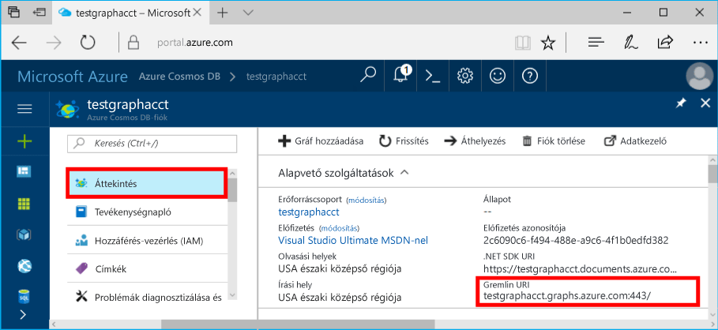

# <a name="azure-cosmos-db-build-a-java-application-using-the-graph-api"></a>Azure Cosmos DB: Java-alkalmazás létrehozása a Graph API-val

Az Azure Cosmos DB a Microsoft globálisan elosztott többmodelles adatbázis-szolgáltatása. Segítségével gyorsan létrehozhat és lekérdezhet dokumentum, kulcs/érték és gráf típusú adatbázisokat, amelyek mindegyike felhasználja az Azure Cosmos DB középpontjában álló globális elosztási és horizontális skálázhatósági képességeket. 

Ez a rövid útmutató bemutatja, hogyan hozhat létre az Azure Portal segítségével egy Graph API (előzetes verzió) alkalmazást használó Azure Cosmos DB-fiókot, dokumentum-adatbázist és gyűjteményt. Majd megtudhatja, hogyan hozhat létre és futtathat konzolalkalmazásokat az OSS [Gremlin Java](https://mvnrepository.com/artifact/org.apache.tinkerpop/gremlin-driver)-illesztőprogram használatával.  

## <a name="prerequisites"></a>Előfeltételek

* Mielőtt futtathatná ezt a mintát, rendelkeznie kell a következő előfeltételekkel:
   * JDK 1.7+ (futtassa az `apt-get install default-jdk` parancsot, ha nem rendelkezik a JDK-val), és állítsa be a környezeti változókat, például a `JAVA_HOME` változót
   * Maven (ha nem rendelkezik Maven-nel, futtassa az `apt-get install maven` parancsot)

[!INCLUDE [quickstarts-free-trial-note](../../includes/quickstarts-free-trial-note.md)]

## <a name="create-a-database-account"></a>Adatbázisfiók létrehozása

[!INCLUDE [cosmos-db-create-dbaccount-graph](../../includes/cosmos-db-create-dbaccount-graph.md)]

## <a name="add-a-graph"></a>Gráf hozzáadása

[!INCLUDE [cosmos-db-create-graph](../../includes/cosmos-db-create-graph.md)]

## <a name="clone-the-sample-application"></a>A mintaalkalmazás klónozása

Klónozzunk egy Graph API (előzetes verzió) alkalmazást a GitHub-ról, állítsuk be a kapcsolati karakterláncot, és futtassuk. Ilyen egyszerű az adatokkal programozott módon dolgozni. 

1. Nyisson meg egy git terminálablakot, például a git bash eszközt, és a `cd` paranccsal lépjen egy munkakönyvtárba.  

2. Futtassa a következő parancsot a minta tárház klónozásához. 

    ```bash
    git clone https://github.com/Azure-Samples/azure-cosmos-db-graph-java-getting-started.git
    ```

## <a name="review-the-code"></a>A kód áttekintése

Tekintsük át, hogy mi történik az alkalmazásban. Nyissa meg a `Program.java` fájlt és tekintse meg a kódsorokat. 

* A rendszer a Gremlin `Client` alkalmazást az `src/remote.yaml` fájlban megadott konfiguráció szerint inicializálja.

    ```java
    Cluster cluster = Cluster.build(new File("src/remote.yaml")).create();
    
    Client client = cluster.connect();
    ```

* A `client.submit` metódus használatával a program Gremlinnel kapcsolatos lépések sorozatát hajtja végre.

    ```java
    ResultSet results = client.submit("g.V()");

    CompletableFuture<List<Result>> completableFutureResults = results.all();
    List<Result> resultList = completableFutureResults.get();

    for (Result result : resultList) {
        System.out.println(result.toString());
    }
    ```
## <a name="update-your-connection-string"></a>A kapcsolati karakterlánc frissítése

1. Nyissa meg az src/remote.yaml fájlt. 

3. Adja meg a *host* (gazdagép), *port*, *username* (felhasználónév), *password* (jelszó), *connectionPool* (kapcsolatkészlet) és *serializer* (szerializáló) beállításokat az src/remote.yaml fájlban:

    Beállítás|Ajánlott érték|Leírás
    ---|---|---
    Hosts|[***.graphs.azure.com]|Lásd az alábbi képernyőképet. Ez a Gremlin URI értéke szögletes zárójelben az Azure Portal Áttekintés oldalán a :443 / végződés nélkül.<br><br>Ez az érték a Kulcsok lapról is lekérhető az URI értékkel a https:// eltávolításával, a dokumentumok gráfokká alakításával és a :443/ végződés eltávolításával.
    Port|443|Állítsa 443 értékre.
    Felhasználónév|*Az Ön felhasználóneve*|A `/dbs/<db>/colls/<coll>` űrlap erőforrása, ahol a `<db>` az adatbázis neve és a `<coll>` a gyűjtemény neve.
    Jelszó|*Az Ön elsődleges főkulcsa*|Lásd az alábbiakban a második képernyőképet. Ez az Ön elsődleges kulcsa, amelyet az Azure Portal Kulcsok oldalának Elsődleges Kulcs mezőjéből kérdezhet le. Az érték másolásához használja a mező bal oldalán lévő Másolás gombot.
    ConnectionPool|{enableSsl: true}|A kapcsolatkészletre vonatkozó beállítás az SSL-hez.
    Serializer|{ className: org.apache.tinkerpop.gremlin.<br>driver.ser.GraphSONMessageSerializerV1d0,<br> config: { serializeResultToString: true }}|Állítsa be ezt az értéket, és törölje a `\n` sortöréseket az érték beillesztésekor.

    A gazdagépek értékéhez másolja a **Gremlin URI** értéket az **Áttekintés** lapról: 

    A jelszó értékéhez másolja az **Elsődleges kulcs** értékét a **Kulcsok** lapról: 

## <a name="run-the-console-app"></a>A konzolalkalmazás futtatása

1. Futtassa az `mvn package` parancsot egy terminálban a szükséges Java-csomagok telepítéséhez.

2. Futtassa a `mvn exec:java -D exec.mainClass=GetStarted.Program` parancsot egy terminálban a Java-alkalmazás elindításához.

Lépjen vissza az Adatkezelőbe, ahol lekérdezheti és módosíthatja az új adatokat, valamint dolgozhat azokkal. 

## <a name="browse-using-the-data-explorer"></a>Tallózás az Adatkezelővel

Ezután visszaléphet az Adatkezelőbe az Azure Portalon, ahol tallózhatja és lekérdezheti az új gráfadatokat.

* Az új adatbázis az Adatkezelőben a Gyűjtemények ablaktáblán jelenik meg. Bontsa ki a **graphdb**, **graphcoll** pontokat, és kattintson a **Gráf** lehetőségre.

    A mintaalkalmazás által létrehozott adatokat a Gráfok ablaktáblán találja.

## <a name="review-slas-in-the-azure-portal"></a>Az SLA-k áttekintése az Azure Portalon

[!INCLUDE [cosmosdb-tutorial-review-slas](../../includes/cosmos-db-tutorial-review-slas.md)]

## <a name="clean-up-resources"></a>Az erőforrások eltávolítása

Ha az alkalmazást már nem használja, akkor a következő lépésekkel a mintaalkalmazás által létrehozott összes erőforrást törölheti az Azure Portalon: 

1. Az Azure Portal bal oldali menüjében kattintson az **Erőforráscsoportok** lehetőségre, majd kattintson a létrehozott erőforrás nevére. 
2. Az erőforráscsoport lapján kattintson a **Törlés** elemre, írja be a törölni kívánt erőforrás nevét a szövegmezőbe, majd kattintson a **Törlés** gombra.

## <a name="next-steps"></a>Következő lépések

Ebben a rövid útmutatóban bemutattuk, hogyan lehet Azure Cosmos DB-fiókot létrehozni, hogyan lehet az Adatkezelő segítségével gráfot készíteni, és hogyan lehet futtatni az alkalmazást. Most már készen áll arra, hogy a Gremlin használatával összetettebb lekérdezéseket hozzon létre és hatékony gráfbejárási logikákat implementáljon. 

> [!div class="nextstepaction"]
> [Lekérdezés a Gremlin használatával](tutorial-query-graph.md)


