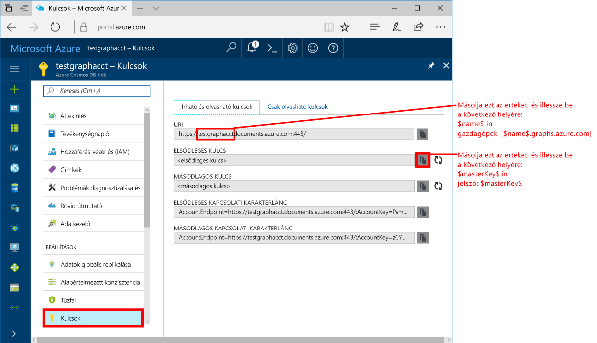
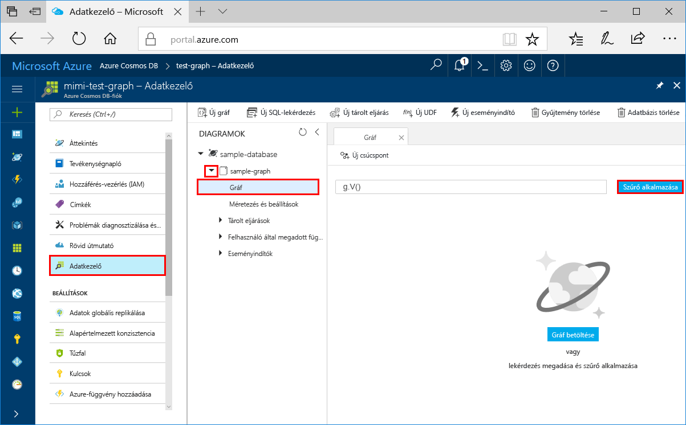
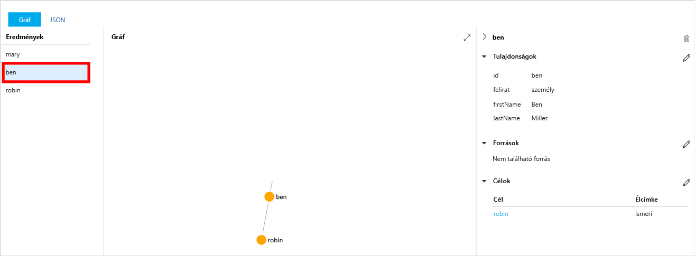
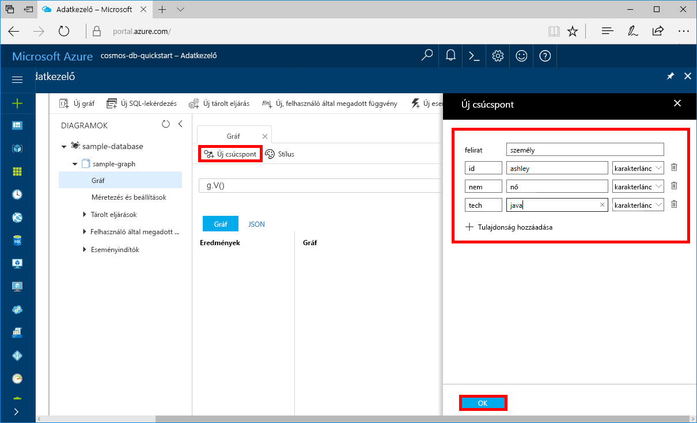
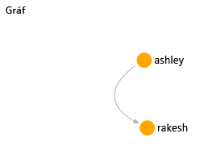

# <a name="azure-cosmos-db-create-a-graph-database-using-java-and-the-azure-portal"></a>Azure Cosmos DB: Gráfadatbázis létrehozása a Java és az Azure Portal használatával

Az Azure Cosmos DB a Microsoft globálisan elosztott, többmodelles adatbázis-szolgáltatása. Az Azure Cosmos DB segítségével gyorsan létrehozhat és lekérdezhet felügyelt dokumentum, tábla, kulcs-érték és gráf típusú adatbázisokat. 

Ez a rövid útmutató létrehoz egy egyszerű gráfadatbázist az Azure Cosmos DB-hez készült Azure Portal-eszközök használatával. A rövid útmutató emellett bemutatja, hogyan hozhat létre gyorsan egy Java-konzolalkalmazást az OSS [Apache TinkerPop](http://tinkerpop.apache.org/)-illesztőt használó [Graph API](graph-introduction.md)-adatbázissal. A rövid útmutatóban lévő utasítások bármilyen, Java-programok futtatására alkalmas operációs rendszeren végrehajthatók. Ez a rövid útmutató ismerteti a gráfok létrehozását és módosítását a felhasználói felületen vagy programozás útján. 

## <a name="prerequisites"></a>Előfeltételek
[!INCLUDE [quickstarts-free-trial-note](../../includes/quickstarts-free-trial-note.md)]

Továbbá:

* [Java fejlesztői készlet (JDK) 1.7+](http://www.oracle.com/technetwork/java/javase/downloads/jdk8-downloads-2133151.html)
    * Ubuntu rendszeren futtassa az `apt-get install default-jdk` parancsot a JDK telepítéséhez.
    * Ügyeljen arra, hogy a JAVA_HOME környezeti változó arra a mappára mutasson, ahová a JDK telepítve lett.
* [Maven](http://maven.apache.org/download.cgi) bináris archívum [letöltése](http://maven.apache.org/install.html) és [telepítése](http://maven.apache.org/)
    * Ubuntu rendszeren futtathatja az `apt-get install maven` parancsot a Maven telepítéséhez.
* [Git](https://www.git-scm.com/)
    * Ubuntu rendszeren futtathatja a `sudo apt-get install git` parancsot a Git telepítéséhez.

## <a name="create-a-database-account"></a>Adatbázisfiók létrehozása

A gráfadatbázis létrehozásához először létre kell hoznia egy Gremlin- (Graph-) adatbázisfiókot az Azure Cosmos DB segítségével.

[!INCLUDE [cosmos-db-create-dbaccount-graph](../../includes/cosmos-db-create-dbaccount-graph.md)]

## <a name="add-a-graph"></a>Gráf hozzáadása

[!INCLUDE [cosmos-db-create-graph](../../includes/cosmos-db-create-graph.md)]

## <a name="clone-the-sample-application"></a>A mintaalkalmazás klónozása

Most pedig váltsunk át kódok használatára. A következő lépésekben elvégezheti a Graph API-alkalmazás klónozását a GitHubról, beállíthatja a kapcsolati sztringet, és futtathatja az alkalmazást. Látni fogja, milyen egyszerű az adatokkal programozott módon dolgozni.  

1. Nyisson meg egy parancssort, hozzon létre egy git-samples nevű új mappát, majd zárja be a parancssort.

    ```bash
    md "C:\git-samples"
    ```

2. Nyisson meg egy git terminálablakot, például a git bash eszközt, és a `cd` parancs használatával váltson a mappára, ahol telepíteni szeretné a mintaalkalmazást.  

    ```bash
    cd "C:\git-samples"
    ```

3. Futtassa a következő parancsot a minta tárház klónozásához. Ez a parancs másolatot hoz létre a mintaalkalmazásról az Ön számítógépén. 

    ```bash
    git clone https://github.com/Azure-Samples/azure-cosmos-db-graph-java-getting-started.git
    ```

## <a name="review-the-code"></a>A kód áttekintése

Ez a lépés nem kötelező. Ha meg szeretné ismerni, hogyan jönnek létre az adatbázis erőforrásai a kódban, tekintse át a következő kódrészleteket. Egyéb esetben ugorhat [A kapcsolati sztring frissítése](#update-your-connection-information) szakaszra.

A következő kódrészletek mind a C:\git-samples\azure-cosmos-db-graph-java-getting-started\src\GetStarted\Program.java fájlból származnak.

* A rendszer a Gremlin `Client` alkalmazást a C:\git-samples\azure-cosmos-db-graph-java-getting-started\src\remote.yaml fájlban megadott konfiguráció szerint inicializálja.

    ```java
    cluster = Cluster.build(new File("src/remote.yaml")).create();
    ...
    client = cluster.connect();
    ```

* A Gremlinnel kapcsolatos lépések sorozatát a program a `client.submit` metódus használatával hajtja végre.

    ```java
    ResultSet results = client.submit(gremlin);

    CompletableFuture<List<Result>> completableFutureResults = results.all();
    List<Result> resultList = completableFutureResults.get();

    for (Result result : resultList) {
        System.out.println(result.toString());
    }
    ```

## <a name="update-your-connection-information"></a>A kapcsolatadatok frissítése

Lépjen vissza az Azure Portalra a kapcsolati adatokért, majd másolja be azokat az alkalmazásba. Ezek a beállítások lehetővé teszik az alkalmazás számára, hogy kommunikáljon az üzemeltetett adatbázissal.

1. Az [Azure Portalon](http://portal.azure.com/) kattintson a **Kulcsok** lehetőségre. 

    Másolja az URI érték első részét.

    
2. Nyissa meg az src/remote.yaml fájlt, és illessze be az egyedi azonosító értéket a `$name$` helyére a következőben: `hosts: [$name$.graphs.azure.com]`.

    A remote.yaml első sorának ekkor a következőhöz hasonlóan kell kinéznie: 

    `hosts: [test-graph.graphs.azure.com]`

3. Az `endpoint` értékben módosítsa a `graphs` karakterláncot a következőre: `gremlin.cosmosdb`. (Ha a gráfadatbázis-fiókot 2017. december 20. előtt hozta létre, ne módosítsa a végpont értékét, és folytassa a következő lépéssel.)

    A végpontértéknek most így kell kinéznie:

    `"endpoint": "https://testgraphacct.gremlin.cosmosdb.azure.com:443/"`

4. Az Azure Portalon használja a másolás gombot az ELSŐDLEGES KULCS másolásához, és illessze be a `$masterKey$` helyére a következőben: `password: $masterKey$`.

    A remote.yaml negyedik sorának ekkor a következőhöz hasonlóan kell kinéznie: 

    `password: 2Ggkr662ifxz2Mg==`

5. Módosítsa a remote.yaml harmadik sorát a következőről:

    `username: /dbs/$database$/colls/$collection$`

    erre: 

    `username: /dbs/sample-database/colls/sample-graph`

    Ha egy egyedi nevet adott a mintaadatbázisának vagy -gráfjának, szükség szerint módosítsa az értékeket.

6. Mentse a remote.yaml fájlt.

## <a name="run-the-console-app"></a>A konzolalkalmazás futtatása

1. A git terminálablakában a `cd` paranccsal lépjen az azure-cosmos-db-graph-java-getting-started mappába.

    ```git
    cd "C:\git-samples\azure-cosmos-db-graph-java-getting-started"
    ```

2. A git terminálablakában futtassa a következő parancsot a szükséges Java-csomagok telepítéséhez.

   ```
   mvn package
   ```

3. A git terminálablakában futtassa a következő parancsot a Java-alkalmazás elindításához.
    
    ```
    mvn exec:java -D exec.mainClass=GetStarted.Program
    ```

    A terminálablakban megjelennek a gráfhoz hozzáadandó csúcspontok. 
    
    Ha időtúllépési hibákat észlel, ellenőrizze, hogy megfelelően frissítette-e a kapcsolati adatokat [A kapcsolati adatok frissítése](#update-your-connection-information) szakaszban, és próbálja meg újból futtatni az utolsó parancsot. 
    
    Amikor a program leáll, nyomja le az Enter billentyűt, és lépjen vissza az Azure Portalra a webböngészőben. 

<a id="add-sample-data"></a>
## <a name="review-and-add-sample-data"></a>Áttekintés és mintaadatok hozzáadása

Ezután visszaléphet az Adatkezelőbe, és megtekintheti a gráfhoz hozzáadott csúcspontokat, valamint további adatpontokat is hozzáadhat.

1. Kattintson az **Adatkezelőre**, bontsa ki a **sample-graph** csomópontot, és kattintson a **Gráf**, majd a **Szűrő alkalmazása** lehetőségre. 

   

2. A **Találatok** listában megjelennek a gráfhoz hozzáadott új felhasználók. Ha kiválasztja a **ben** elemet, láthatja, hogy a felhasználó kapcsolódik a robin elemhez. A csúcspontokat szabadon mozgathatja húzással, nagyíthat és kicsinyíthet az egérgörgő görgetésével, illetve megnövelheti a gráf méretét a duplaszárú nyíllal. 

   

3. Adjunk hozzá néhány új felhasználót. Adatok a gráfhoz való hozzáadásához kattintson az **Új csúcspont** gombra.

   

4. A címke mezőbe írja be a *személy* kifejezést.

5. Kattintson a **Tulajdonság hozzáadása** lehetőségre a következő tulajdonságok hozzáadásához. Egyedi tulajdonságokat hozhat létre a gráfban található minden egyes személy számára. Csak az id kulcsot kötelező megadni.

    kulcs|érték|Megjegyzések
    ----|----|----
    id|ashley|A csúcspont egyedi azonosítója. Ha nem ad meg azonosítót, a rendszer létrehoz egyet.
    gender|female| 
    tech | java | 

    > [!NOTE]
    > Ebben a rövid útmutatóban egy nem particionált gyűjteményt fog létrehozni. Ha azonban a gyűjtemény létrehozásakor megad egy partíciókulcsot és particionált gyűjteményt hoz létre, minden új csúcspontban meg kell adnia kulcsként a partíciókulcsot. 

6. Kattintson az **OK** gombra. Előfordulhat, hogy ki kell terjesztenie a képernyőt a képernyő alján lévő **OK** gomb megjelenítéséhez.

7. Kattintson ismét az **Új csúcspont** lehetőségre, és adjon hozzá még egy új felhasználót. 

8. Adja meg a *person* címkét.

9. Kattintson a **Tulajdonság hozzáadása** lehetőségre a következő tulajdonságok hozzáadásához:

    kulcs|érték|Megjegyzések
    ----|----|----
    id|rakesh|A csúcspont egyedi azonosítója. Ha nem ad meg azonosítót, a rendszer létrehoz egyet.
    gender|male| 
    school|MIT| 

10. Kattintson az **OK** gombra. 

11. Kattintson a **Szűrő alkalmazása** gombra a gráf összes értékének megtekintéséhez az alapértelmezett `g.V()` szűrővel. Most már az összes felhasználó megjelenik a **Találatok** listában. 

    Ha további adatokat ad meg, szűrőkkel csökkentheti a találatok számát. Az Adatkezelő alapértelmezés szerint a `g.V()` lekérdezést használja a gráf összes csúcspontjának lekéréséhez. Ezt más [gráflekérdezésre](tutorial-query-graph.md) is módosíthatja, például a `g.V().count()` lekérdezésre, ha azt szeretné, hogy a rendszer JSON formátumban adja vissza a gráf csúcspontjainak számát. Ha módosította a szűrőt, állítsa vissza a szűrőt a `g.V()` lekérdezésre, majd kattintson a **Szűrő alkalmazása** lehetőségre az eredmények újbóli megjelenítéséhez.

12. Most már összekapcsolhatja a rakesh és az ashley elemet. Győződjön meg arról, hogy az **ashley** elem van kijelölve a **Találatok** listában, majd kattintson a jobb alsó sarokban a **Célok** elem mellett lévő  gombra. Előfordulhat, hogy szélesebbre kell állítania az ablakot a gomb megjelenítéséhez.

   

13. A **Cél** mezőbe írja be a *rakesh* nevet, az **Élcímke** mezőbe pedig a *knows* sztringet, majd jelölje be a jelölőnégyzetet.

   

14. Ezután válassza ki a **rakesh** elemet a találatok listájából. Láthatja, hogy az ashley és a rakesh elem össze van kapcsolva. 

   

   Ezzel befejezte az oktatóanyag erőforrások létrehozásra vonatkozó részét. A gráfhoz továbbra is hozzáadhat csúcspontokat, módosíthatja a meglévő csúcspontokat, és megváltoztathatja a lekérdezéseket. Most pedig tekintsük át az Azure Cosmos DB által biztosított mérőszámokat, majd távolítsuk el az erőforrásokat. 

## <a name="review-slas-in-the-azure-portal"></a>Az SLA-k áttekintése az Azure Portalon

[!INCLUDE [cosmosdb-tutorial-review-slas](../../includes/cosmos-db-tutorial-review-slas.md)]

## <a name="clean-up-resources"></a>Az erőforrások eltávolítása

[!INCLUDE [cosmosdb-delete-resource-group](../../includes/cosmos-db-delete-resource-group.md)]

## <a name="next-steps"></a>További lépések

Ebben a rövid útmutatóban bemutattuk, hogyan lehet Azure Cosmos DB-fiókot létrehozni, hogyan lehet az Adatkezelő segítségével gráfot készíteni, és hogyan lehet futtatni az alkalmazást. Most már készen áll arra, hogy a Gremlin használatával összetettebb lekérdezéseket hozzon létre és hatékony gráfbejárási logikákat implementáljon. 

> [!div class="nextstepaction"]
> [Lekérdezés a Gremlin használatával](tutorial-query-graph.md)

